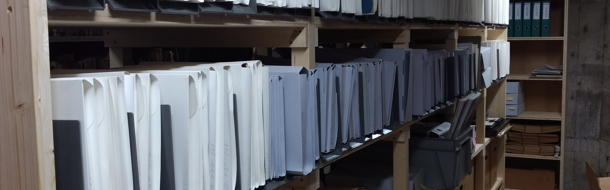
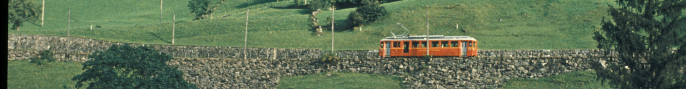
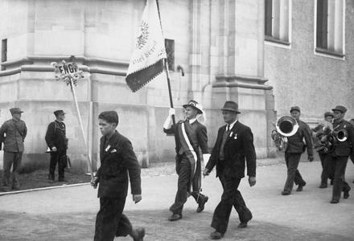
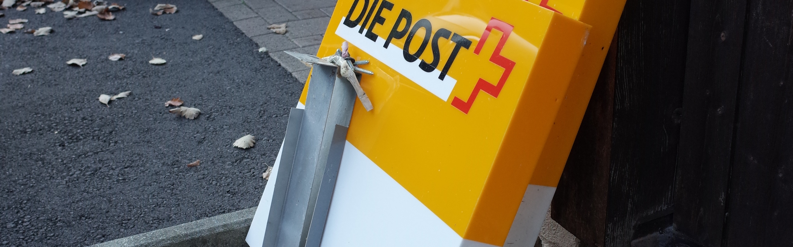
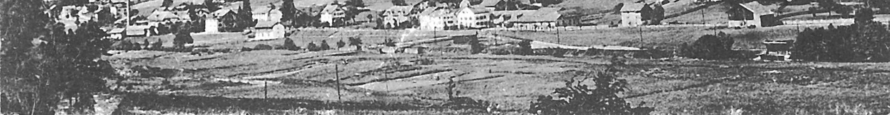

## Ziele

Wir erforschen die Geschichte von Engi und Umgebung und dokumentieren sie im
Internet, in Publikationen, Vorträgen und Ausstellungen.



## Mitgliedschaft



Unsere Tätigkeit ist mit Kosten verbunden. Wir sind deshalb auf Ihre Unterstützung angewiesen. Werden Sie bei uns Mitglied.

Mitgliederbeiträge:
* Einzelmitglied 25.—
* Ehepaar 40.—
* Kollektivmitglied 75.— pro Jahr

[Newsletter abonnieren](/news/2018-08-18-newsletter) oder gleich  



## Impressum

### Kontakt

```
Ortsgeschichtsverein Engi
Leni Takihara
Allmeindstrasse 33
8765 Engi
```



### Vorstand

- Rolf Stöckli (Präsident)
- Didi Bäbler
- Julia Dällenbach (Kassierin)
- Leni Takihara
- Jakob Schneider
- Sara Zimmermann (Aktuarin)



## Vereinsgeschichte

Unser Verein besteht seit 1995. Er wurde ursprünglich gegründet, um die
Publikation des ortsgeschichtlichen Dokumentationsbandes Engi – Ein
historischer Spaziergang zu unterstützen. Seither wurden viele weitere
Projekte erfolgreich durchgeführt. Die jeweils im ersten Halbjahr
stattfindenden Hauptversammlungen werden gerne auch von Heimweh-Engelern
besucht. Der Ortsgeschichtsverein hat zurzeit ungefähr 230 Mitglieder.


## Organisation

### Statuten

#### Artikel 1

Unter dem Namen „Verein zur Erforschung und Dokumentation der Ortsgeschichte
von Engi“ (im folgenden Ortsgeschichtsverein) wurde am 30. Juni 1993 eine
Organisation gegründet, die im Sinne von Art. 60 ff. ZGB einen Verein bildet
mit Sitz in Engi.

#### Artikel 2

Der Zweck des Vereins ist die Erforschung und Dokumentation der Ortsgeschichte
von Engi und die Bereitstellung der dafür benötigten Mittel. Ausserdem kann der
Verein jede Tätigkeit ausüben oder unterstützen, die der Erreichung dieses
Zwecks dient.

#### Artikel 3

Die Mitgliedschaft steht jeder Person offen, die gewillt ist, dem Vereinszweck
zu dienen. Sie wird mit der schriftlichen Beitrittserklärung rechtskräftig und
erlischt mit der schriftlichen Mitteilung an den Vorstand. Der Jahresbeitrag
beträgt für ein Einzelmitglied maximal Fr. 50.-, für Ehepaare maximal Fr. 80.-
und für Kollektivmitglieder maximal Fr. 150.-. Die persönliche Haftbarkeit der
Mitglieder ist ausgeschlossen. Für die Verbindlichkeiten des Vereins haftet
ausschliesslich das Vereinsvermögen.

#### Artikel 4

Vereinsorgane sind:

1. Hauptversammlung
2. Vorstand, bestehend aus drei bis sieben Mitgliedern (mindestens PräsidentIn,
   KassierIn, AktuarIn)
3. Rechnungsrevisoren

#### Artikel 5

Das Vereinsjahr sowie das Rechnungsjahr entsprechen dem Kalenderjahr. Die
jährliche Hauptversammlung ist das oberste Organ des Ortsgeschichtsvereins. Sie
findet jeweils in der ersten Jahreshälfte statt und behandelt die folgenden
statutarischen Geschäfte:

1. Jahresbericht
2. Jahresrechnung
3. Wahl des Vorstands und der Rechnungsrevisoren (im 4-Jahreszyklus)
4. Festsetzung des Jahresbeitrags
5. Verschiedenes

Eine Statutenrevision muss ausdrücklich traktandiert sein und bedarf einer
Zweidrittels-Mehrheit aller an der Hauptversammlung anwesenden Mitglieder.

Ausserordentliche Hauptversammlungen können jederzeit einberufen werden, wenn
es der Vorstand oder ein Fünftel der Vereinsmitglieder verlangen.

Die Ausgabenkompetenz des Vorstands für Projekte und Anschaffungen darf pro
Rechnungsjahr den Gesamtbetrag von 10'000 Franken nicht übersteigen.

#### Artikel 7

Das Vereinsvermögen bestand im Zeitpunkt der Vereinsgründung aus einem Legat
von Frau Hedwig Meyer-Streiff sel. Es muss für die Ziele des
Ortsgeschichtsvereins eingesetzt werden. Einnahmen- oder Ausgabenüberschüsse
werden dem Vermögen gutgeschrieben bzw. belastet. Im Falle einer Auflösung des
Vereins fällt das gesamte Vermögen gemäss Beschluss des Vorstands an kulturelle
Institutionen der Gemeinde Engi.

#### Artikel 8

Die rechtsverbindliche Unterschrift ist dem Präsidenten / der Präsidentin des
Vereins zusammen mit einem Mitglied des Vorstands vorbehalten.

Diese Statuten ersetzen die Statuten vom 16. Dezember 1993 und diejenigen vom
20. März 2004.  Sie wurden an der heutigen ordentlichen Hauptversammlung
genehmigt und treten sofort in Kraft.

Engi, 17. März 2007
