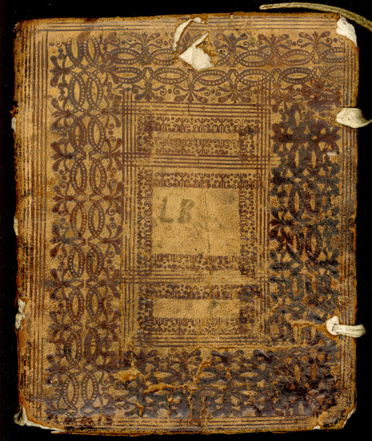
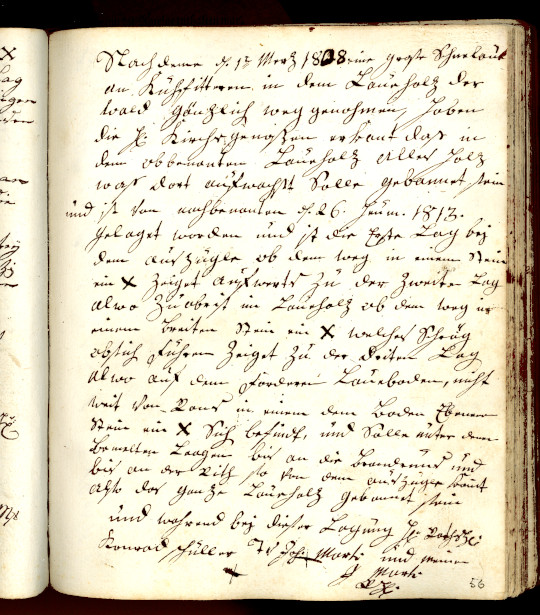
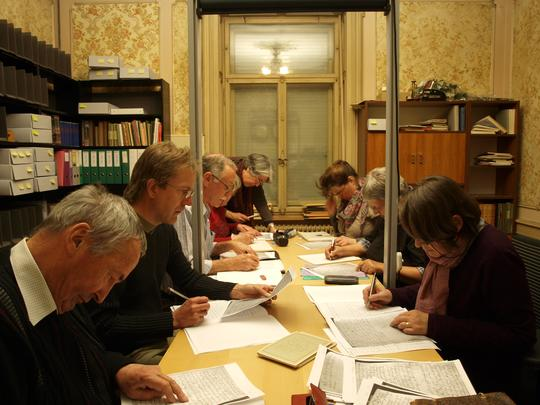



## Der Zufallsfund

«LB» steht auf dem ledernen Buchdeckel des von Fridolin Marti, Präsident der
Kirchgemeinde Matt-Engi per Zufall beim Abbruch eines Hauses gefundenen Buches.

Dieses enthält rund zweihundert protokollartige Aktennotizen aus dem 18. und
19. Jahrhundert, festgehalten vom jeweiligen Schreiber oder Schriftführer der
damaligen Kirchgemeinde.

Es sind handgeschriebene Niederschriften über Grenzbereinigungen zwischen der
Kirchgemeinde, welche viele Wälder im Tal besass, und Privatgrundbesitzern.
Gemeinsam mit diesen legten Amtsträger der Kirchgemeinde im umstrittenen Gebiet
Grenzmarkierungen neu fest. Diese mit einem Kreuz in einem Baum oder Stein
versehenen Markierungen heissen *Lagen/Laagen*. «LB» heisst somit «Lagenbuch».

## Lach, Looge, Lage

Doch was genau sind Lagen?

Das mittelhochdeutsche Wörterbuch und das schweizerische Idiotikon helfen
weiter. Eine *Lach* (das a wird lang gesprochen) ist ein Einschnitt, eine
Kerbe. Ein *Lachboum* ist ein mit Zeichen versehener Grenzbaum, eine *Lachung*
ist die Markierung einer Grenze mit in Bäumen eingehauenen Zeichen. Im
Zürichdeutschen Wörterbuch findet man noch *Looge* = Scharte (z.B. in einem
Messer).

Das Lagenbuch (*Lage* nun mit g geschrieben) ist eine Sammlung von
Lagen-Protokollen aus dem Zeitraum von 1729 bis 1844. Die Protokolle wurden in
ein anfänglich leeres Buch mit Seiten aus festem weissem Papier eingetragen.
Leere Seiten hinter einem Eintrag zeigen, dass man Platz lassen wollte für
einen späteren Eintrag zu einer Erneuerung dieser Lagung. Solche Erneuerungen
wurden oft nach zwanzig bis dreissig Jahren vorgenommen, protokolliert und
eingetragen, gut erkennbar an einer anderen Schrift und an andersfarbiger
Tinte. Es gibt Jahre ohne Einträge, dann aber solche mit mehreren Einträgen pro
Jahr.  Die *Lagkreuze*, also Grenzkreuze wurden in Steine, Köpfe oder Bäume
eingehauen, meistens in Rottannen oder Buchen, aber auch in Weisstannen, Ahorn,
Erlen und Ulmen, oft auch in Tschupen, also in kleingewachsene Bäumchen.
Markante Markierungen wurden näher benannt als *Lagtanne*, *Lagbuche*,
*Lagechopf* oder *Lagehore*. Es gibt *Mäderlagen* und *Reutlagen*, die
abgrenzen wo gemäht oder gerodet werden darf, und wo nicht. Der Abstand von
Kreuz zu Kreuz wird manchmal mit dem Längenmass *Klafter* angegeben, 1 Klafter
ist 6 Fuss à 30cm, also um die 180 cm. Dies entspricht etwa der Spannweite von
ausgestreckten Armen.

Die in Steinen eingehauenen Kreuze kann man heute noch finden, soweit sie nicht
vom Moos überwachsen sind. Viele wurden später mit roter Farbe  besser sichtbar
gemacht, einige dienen auch heute als Grenzmarkierung. Die in Bäume
eingehauenen Kreuze sind naturgemäss verschwunden.

## Gründe für Lagungen

Was waren die Beweggründe, die zu einer Lagung geführt haben?

* Am häufigsten geht es um Waldstücke, die gebannt werden sollen, um darunter
  liegende Güter und Wege vor Steinschlag und Lawinen zu schützen. 
* Es sind die Grundeigentümer welche die Kirchgenossen, das sind alle
  männlichen Angehörigen der Kirchgemeinde, um ein Stück Schadenbann angehen.
* Streitigkeiten zwischen Liegenschaftsbesitzern wegen Unsicherheiten und
  Missverständnissen bei den Grenzen oder wegen unrechtsmässigem «Reuten und
  Brennen» des einen werden beigelegt.
* Eingegangenen Klagen von Anstössern, dass gefrevelt werde mit Mähen und
  Reuten im gebannten Wald wird nachgegangen.
* Alte, nicht mehr lesbare oder auffindbare Lagen werden auf Begehren eines
  Grundbesitzers erneuert.

Die Lagungen wurden im Auftrag oder mit Einverständnis der Kirchgenossen an Ort
und Stelle vorgenommen, in der Regel im Sommerhalbjahr. Amtsträger der
Kirchgemeinde sind hingegangen und haben, im Beisein des Antragsstellers oder
Klägers, im oft steilen unwegsamen Gelände die Grenzmarkierungen angebracht.

Es fällt auf, dass den Antragstellern meistens entsprochen wird und die
Angelegenheiten gütlich geregelt werden.

## Die Amtsträger

Folgende Amtsträger werden im Buch erwähnt:

* **Bannleiter, Bannwart**: entspricht ungefähr dem heutigen Förster 
* **Fähnrich**: Politischer Würdenträger, Mitglied der Kantonsregierung
* **Kirchmeier**: Kirchgemeindepräsident, -verwalter
* **Obmänner, Vorgesetzte**: für einen bestimmten Anlass eingesetzte Personen
* **Ratsherr, Räte**: Mitglied der kantonalen Regierung
* **Säckelmeister**: Finanzverwalter
* **Sänger, Vorsänger**: das Singen in der Kirche leitende Person
* **Schützenmeister**: Obmann der Schützengesellschaft
* **Schreiber**	: Sekretär, Ratsschreiber
* **Spännmeister, -vogt**: Verwalter der kirchlichen Almosen
* **Steuervogt**: Steuerverwalter
* **Tagwenvogt**: Vorsteher des Tagwen, der Bürgergemeinde
* **Verordnete**: Ausschuss, Kommissionsbeauftragte
* **Wachtmeister**: eine Art Dorfpolizist

## Transkription aus Kurrentschrift

Die handgeschriebenen Lagen-Aktennotizen sind in deutscher Kurrentschrift
abgefasst. Sie sind von den Vorstandsmitgliedern des Ortsgeschichtsvereins Engi
(OGV) transkribiert und in unsere Schrift übertragen worden, was nicht immer
einfach war, da je nach Schreiber die Schrift oft nur mühsam zu entziffern war.

Die transkribierten Texte sind anschliessend zur besseren Verständlichkeit ins
heutige Deutsch übertragen worden, wobei sich die Übersetzung nah an den
Originaltext hält. So wurden die Zeilenumbrüche beibehalten, auch die
unterschiedlichen Schreibweisen der Personennamen. Die Flurnamen jedoch sind
gemäss der Mundart-Schreibweise wie im Flurnamenbuch von Engi notiert. Zur
besseren Lesbarkeit sind viele Kommas gesetzt worden und schwer verständliche
oder veraltete Begriffe werden erklärt.

Die Lagenbuchseiten sind nun also dreifach vorhanden. Die Originaltexte stehen
neben den Transkriptionen und deren Übertragungen ins heutige Deutsch. Die
Texte geben einen Einblick über gut hundert Jahre Lebensumstände im Raum
Matt-Engi, über das Leben mit Naturgefahren, über die Nutzung der Wälder und
deren Schutzfunktion.

An der Transkription und Überarbeitung der Lagenbuchseiten haben mitgearbeitet:
Didi Bäbler-Marti, Sandra Fässler-Wyss, Fridolin Marti-Hefti, Karin
Marti-Weissenbach, Schaag Schneider-Dällenbach, Rolf Stöckli,  Leni
Takihara-Aebli und Sara Zimmermann.
