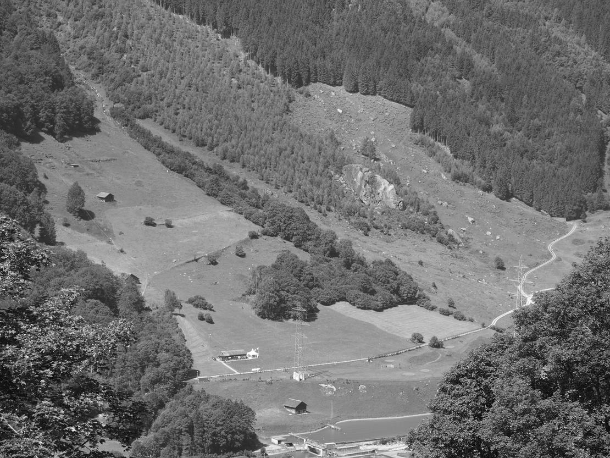



Der Name des Dorfes Engi ist entweder von einer Liegenschaft *Ängi* am linken
Ufer des *Särft* auf das ganze Gemeinwesen übertragen worden, oder die
Talverengung  unterhalb der *Ängibrugg* hat dem Gemeinwesen den Namen gegeben.
Engi, Ängi (von mhd. «enge») kann eine enge Stelle, eine Schlucht bezeichnen
oder ein schmales, eingeengtes Stück Land.

Nun heissen die Liegenschaften dort, wo sich das Tal verengt, am rechten
Flussufer *Höfliegg* und *Höfli*, am linken Ufer hiess gemäss Grundbuch ein
ausgedehntes Gebiet *Brugghöfli*. Eine Weide am rechten Särftufer heisst
*Höflitobel* und weiter flussabwärts gab es über das *Wartstaldetobel* immer
wieder einen *Tobelsteg*; der letzte wurde Ende der 1990er-Jahre vom Hochwasser
mitgerissen und noch nicht wieder ersetzt. Die Talverengung heisst hier also
Tobel, von Lateinisch tubulus = Röhre.

Sind vielleicht im *Höfli* im Mittelalter die Zinsen «usser serniftal» fürs
Kloster Säckingen gesammelt worden und war das *Höfli* demnach eine
Aussenstelle des säckingischen Meierhofs?

Das Gebiet *Ängi* liegt etwa 500 Meter weiter flussaufwärts über dem linken
Särftufer. Es ist ein von der *Ängiruus* und der *Mettleruus* begrenztes,
ansteigendes und gegen oben spitz zulaufendes Stück Weideland. Den unteren
Abschluss bildet der *Särft*.

Man sagt «i dr Ängi», «ich gu id Ängi gu schiifare». Das Gebiet ist heute
unterteilt in *Underängi* und *Oberängi*, der oberste, spitz zulaufende Teil
ist der *Ängizingge*. In der *Underängi* wird heute Golf gespielt – von Enge
also keine Spur!

Neben der Ängi liegt *ds Mettle* und nordwestlich daran grenzt *ds Elmeli* (von
elm = Ulme). *Ds Mettle* (von althochdeutsch mettil = mittlerer Teil)
bezeichnet das Mittelstück des durch Runsen unterteilten Gebietes. Der Name
lässt auf eine frühe Nutzung schliessen, das Gebiet würde sonst mittil/
mittlist heissen.

1408 kauften die Tagwenleute von Engi die über dem Mettle liegende *Gandalp*
den «gemeinen lantlüten ze glaris» ab und schlugen die tiefer gelegenen Teile
davon der *Allmeind* zu. Waren die Gebiete Ängi, Mettlen und Elmeli vorher
vielleicht Sommerweiden für Vieh aus dem Linthtal?

Die erste schriftliche Erwähnung des Namens *Ängi* findet man im Säckinger
Urbar (um 1350): «Ab enen furen ze Engi» und «von engi ab Boezis hofstat».
Schon dort ist aber wahrscheinlich das Dorf, nicht der Gebietsteil, gemeint.


