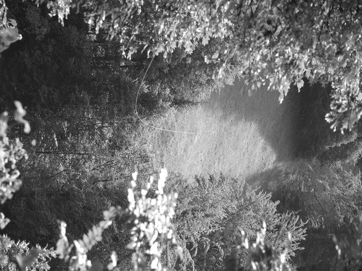



## Birli, im Birli



Der Flurname *Birli* lässt an Birnen denken, an einen Platz, wo einst Birnbäume
standen. Das passende Dialektwort wäre dann aber «es Bireli», eine kleine
Birne. Die Sammlung Walch kennt im ganzen Kanton keinen einzigen Flurnamen, der
sich auf Birnen oder Birnbäume bezieht. Einzig der Name des bei der Schlacht
bei Näfels gefallenen «Rüdi under dem Birboum» weist auf einen solchen hin.

Mit Birnen hat der Flurname *Birli* wohl nicht zu tun. Das Idiotikon hilft
weiter: Ein Birli ist ein Haufen aufgeschichteten, halbdürren Heus, eine
Tschoche also. Mittelhochdeutsch birling meint einen Heuhaufen, birligen heisst
Haufen machen. *Im Birli*, einer Wiese oberhalb des Grund, wurde also früher
das Heu zum Trocknen zu Tschochen aufgeschichtet. Im Wort steckt das
mittelhochdeutsche Verb bern = tragen. Getragen oder zusammengetragen wird eben
das Heu; gemeint ist ursprünglich die Menge Heu, die ein Mann tragen kann.

Auch im Flurnamen *i de Rune*, der ein Waldstück auf 1680 Metern im
*Üblisserwald* bezeichnet, steckt eine Mengenangabe. Eine Rune, von mhd. rune =
umgefallener, abgegangener Baum, ist eine Ladung Heu oder Holz, welche auf
Ästen zu Tal geschleift wurde. Man sagt z.T. heute noch «e Runete Holz», «e
Runete Escht», d.h. so viel, wie einer schleifen kann. *I de Rune* wurden
vermutlich die Holz- oder Heu-’Portionen’ für den Transport ins Tal
bereitgestellt.

Heuet-Flurnamen in Engi, die man heute noch versteht, sind u.a.: *Heubüel,
Heueggli, Heuplangge, Heustogg, Wildheugäde* und *im Maad* von
Mittelhochdeutsch mad = Gebiet, wo das Gras gemäht wird (Heuwiese im Schlatt).

Heustöcke, die man als Futtervorrat stehen lässt, heissen Tristen, von
Althochdeutsch dreskan = dreschen – ursprünglich waren das also aufgeschichtete
Garbenbündel. Auf dem *Tristelbode* auf Mülibach Oberstafel hat man wohl das
Wildheu so gelagert.

## Blänggli



*Ds Blänggli* liegt unterhalb der *mittlere Chämm* auf der Mülibachalp in
steilem, rutschigem Gelände, es heisst deshalb auch *im böse Blänggli*.

Der Name Plänggli/Plangge ist in den Alpen häufig anzutreffen.

Er bedeutet steile Grashalde, Steilhang, von Lateinisch planca = Brett. Auf dem
Gemeindegebiet von Engi findet man u.a. die *Erleblangge, Fugblangge,
Heublangge, Hübeliblangge* und *ds Hüenderblänggli*.

## Brand



*Brand* bezeichnet ehemals durch Brandrodung gewonnenes Land. Die Heuwiese
Brand liegt auf 1100 Metern, über der *Gfellplangge*. Sie wird heute noch
gemäht, die Heubündel werden an einem Heuseil über die *Altstafelruus* zur
*Herrenegg* transportiert. Mit Brand bezeichnete Stellen findet man an steilen,
schlecht zugänglichen Orten (*Gfell* = Gefälle, steiler Abhang), wo andere
Rodungsarten zu aufwändig gewesen wären. In Matt, am Eingang ins *Chrauchtal*,
liegt eine Rodungsinsel *Brandegg* auf 1114 Meter.

Weitere Rodungsnamen in Engi sind *Rüti*, *Schwamm* und *Stöggeberg*. Eine Rüti
ist gerodetes, gereutetes Land. Hier wurden die Bäume gefällt und die
Wurzelstöcke entfernt. Man findet Rütenen in unmittelbarer Nähe einer Siedlung.
So liegen in Engi die *Rüti, Rütiweid, Oberrüti, Oberrüteli* genannten Fluren
auf etwa 800 bis 900 Metern. Auch die *Grütchöpf* oberhalb des *Blattebergs*
und das *Grütsch* oberhalb des *Büel* auf 830 Metern gehören wahrscheinlich
dazu.

In der Nähe von Alpen, ab über 1300 Metern bis hinauf zur Waldgrenze, findet
man gerodete Flächen mit der Bezeichnung *Schwamm*. Ein Schwamm (von schwämmen,
schwenden = zum Verschwinden bringen) ist ein abgestorbener Baumstamm, dem die
Rinde unten abgeschält wurde. Die Älpler benutzten diese Rodungsform, um nach
und nach die Weideflächen zu vergrössern. Das Holz werden sie zum Zäunen
gebraucht oder in der Hütte verfeuert haben.

Der Alpbrief von 1416 (Mülibach) regelt eine Schwendpflicht. Im 19. Jahrhundert
wurde dann zum Schutz des Waldes das Schwenden verboten. In Engi haben die
Alpen *Chräuel, Gams* und *Fittere* ihren Schwamm oder ein *Schwämmli*.

Die gleiche Rodungsform führte andernorts zu Flurnamen wie *Schwanden,
Schwendi, Schwändeli*. Bei den Schwammnamen vermuten Sprachkundler romanischen
Einfluss: In romanischem Munde wurde –nd- zu –mm- verschmolzen.

Die *Stöggeberg* sind heute mehrere Bergliegenschaften über dem *Schlatt*
(Schlatt = Abhang) auf etwa 1200 Metern. Das Gebiet *Wyde* hiess früher *in den
Wydenstöcken*. *Stögg* sind die stehen gebliebenen Baumstrünke, aber auch die
gerodeten Stellen selbst.


