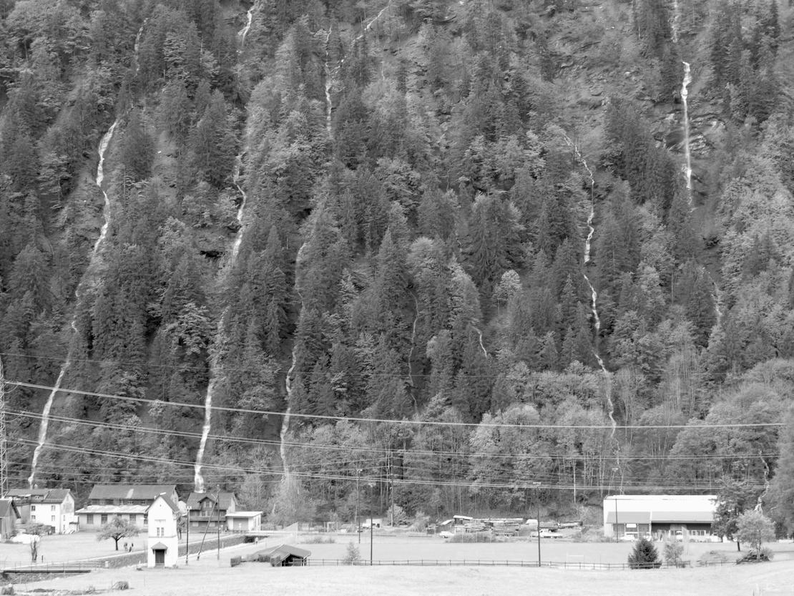



## Chräuel



*Dr Chräuel* ist eine Alp auf der linken Talseite mit den üblichen drei
Stafeln. Der untere Stafel, auf einer Terrasse auf 1290 Metern gelegen, war
zeitweise, so Ende des 19. und Anfang des 20. Jahrhunderts, ganzjährig bewohnt
und heisst deshalb auf der 25’000er-Karte *Chräuelberg*; nördlich davon liegt
der *Eggeberg*. Die Alp zieht sich steil hinauf bis in die *Chräuelchämm* auf
über 2000 Metern; sie ist auch heute nur zu Fuss erreichbar.  Woher hat die Alp
ihren Namen? Mittelhochdeutsch *kröuwel* bedeutet Kralle, Tatze. Wir kennen das
Wort noch als Bezeichnung für eine Gartenhacke. Der Abhang unterhalb des
unteren Stafels mit seinen vielen Wasserläufen hat die Form einer grossen Tatze
mit vielen Krallen, was besonders gut erkennbar ist, wenn die Runsen nach viel
Regen Wasser führen oder wenn die Wasserläufe gefroren sind. Der Hang sieht
dann aus wie eine grosse Pfote mit gläsernen Krallen. So scheint der
tatzenförmige Hang der darüber liegenden Alp den Namen gegeben zu haben.

Auf der gleichen Talseite liegt die Nachbaralp *Laueli*, die Verkleinerungsform
von Laui = Lawine. Der Unterstafel liegt mitten in einem Lawinenzug; die fast
jährlich niedergehende Lawine fliesst im *Mettle* Richtung *Särft* und heisst
deshalb *Mettlelaui*.

Auf der gegenüberliegenden Talseite liegt die *Alp Fittere* mit dem
Mittelstafel *Bärebode* auf 1777 Metern. Die Herkunft des Namens ist unsicher,
falls Fittere mit *Fritere* (ein Berghangs an der Klausenstrasse)
gleichzusetzen ist, würde es Rutschung, Abbruch bedeuten, von Lateinisch
fractura, Romanisch fritjiras.

Das grösste Alpgebiet der Gemeinde liegt im *Mülibachtal*. Die *Alp Mülibach*
wird schon in einem Alpbrief von 1416 erwähnt. Heute dient das Gebiet vier
Sennten als Sommerweide. Vom über dem *Üblital* gelegenen Unterstafel
*Schlössli* hat man einen Ausblick wie von einem Schloss, der Name des
Oberstafels *im Lüser* deutet auf das Vorkommen von Sauerampfern oder auf einen
in der Nähe gelegenen kammartigen Grat hin (Lüser = Lauskraut oder Lauskamm).
Auch zuhinterst im *Chrauchtal* in Matt gibt es einen Lüser. Weitere Alpen
liegen auf der rechten Talseite des Mülibachtals. 

In einem Seitental liegt die Rinderalp im *Widersteiner Loch*. Durch dieses Tal
führt der Fussweg über die *Widersteiner Furggle* zu den Murgseen (St. Gallen).
Eine Furggle ist ein Passübergang, ein Bergsattel, von Romanisch furca =
(zweizinkige) Gabel.

Hoch über dem Üblital liegt die bis in die 1990er-Jahre von Schafen beweidete,
jetzt aber nicht mehr bestossene *Gufelialp*, versteckt hinter dem *Chilchli*,
einem kirchturmspitzartigen 2018 Meter hohen Nebengipfel des *Hatzgestogg*.

## Chugelris



Ein *Chugelris* ist anderswo ein *Chegelris*, also ein Kegelspiel oder ein
Kegelspielplatz. Im Chugelris wurde also einmal mit Kugeln gespielt oder
gekegelt. Bezeichnenderweise liegt das Chugelris in der flachen Talebene, auf
780 Metern bei der Einmündung des *Mülibach* in den *Särft*.  Ältere Leute
benutzen das Wort Ris noch für einen Satz Spielfiguren oder Spielkarten, «es
Ris Jasscharte». Ursprünglich ist mit Ris oder Riss das angezeichnete,
angerissene Spielfeld gemeint.

Einen *Chegelbode* findet man auf 1700 Metern auf der *Ochsefitterealp*. Ob auf
dieser fast ebenen Weide einmal gekegelt wurde oder ob Chegel = Trämmel,
Baumstämme, dem Boden den Namen gegeben haben, lässt sich nicht mehr
feststellen. Wenn man aber bedenkt, dass es im *Chüetal* in Matt auf über 1900
Metern einen *Tanzboden* und auf Camperdun in Elm auf 1900 Metern einen
*Spielboden* gibt, kann es gut sein, dass auch der Chegelbode ein ehemaliger
Spielplatz ist. Mit Spielplätzen in abgelegenen Gebieten wurden nämlich früher
behördliche Spielverbote umgangen, z.B. im 17. Jahrhundert.

## Diggewald



Im Namen *Diggewald* steckt das althochdeutsche dicco, mhd. dicke = dick, dicht
(vgl. Dickicht = dichtes Gebüsch), oder dicco/dicke = häufig (im Elmer Dialekt
bedeutet diggemal «häufig vorkommend»). So oder so ist ein dicht bewachsenes
Waldstück gemeint. Es finden sich weitere Namen in der Zusammensetzung mit der
Endung -wald. Oft sind sie nach einem Besitzer benannt, so der *Leglerwald* und
der *Mitlödner Wald*, oder nach ihrer Lage wie der *Blattebergwald* oder der
*Oberrüteliwald*. Namen mit Holz bezeichnen Waldstücke, in welchen geholzt
wurde: *Im Holz*, *Holzegg* oder sogar *Holzwald*.

*I de alte Baateili* jedoch durften keine Bäume mehr geschlagen werden, weil
der Wald «gebannt», also geschützt war (Baa = Bann, ein Förster hiess früher
Baawart). Die Baateili (Teili sind Waldabschnitte) liegen auf 1740 Metern in
steilem Gelände unterhalb des *Gheistschwämmli*.


