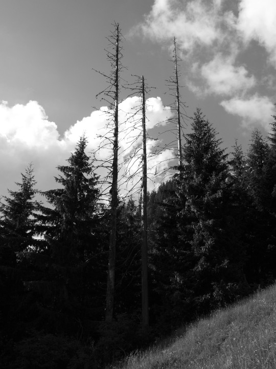



## Erlewüschi



Nach dem Alpabzug kann man sich im Tal am Geläute der Kuhglocken erfreuen. Nun
ist aber seit ein paar Jahren im Herbst ein neues, weniger angenehmes Geräusch
zu vernehmen: Das Heulen der Laubbläser. Strassenarbeiter blasen mit ihnen das
Laub von den Strassen, Landwirte sammeln damit Laub zusammen und transportieren
es mit dem Ladewagen zum Stall, wo es wie früher als kostenlose Einstreue
benutzt wird.

Nur musste man früher das Laub von Hand zusammenrechen oder eben – «wüschen»;
man füllte damit auch die als Matratzen dienenden Laubsäcke. Die Flurnamen
*Fuhrwüschi*, *Chleigädeliwüschi* und *Erlewüschi* deuten auf diese Tätigkeit
hin und auf den Ort, wo sie ausgeübt wurde. Auch im *Streuiloch* wurde Laub für
die Einstreue gesammelt und im *Gschtrupfte Zug* rechte man Laub und
Farnkräuter mit einem speziellen Schtrupfrechen, welcher runde, geschlossene
Metallzähne hatte, herunter.

Auch andere Arbeitsplätze im Gelände finden sich in Flurnamen wieder: Am
*Brännerstutz* wurde Harz gebrannt (d.h. aus dem Holz herausgesotten), in der
*Cholgruebe* und auf dem *Cholbödeli* standen Kohlenmeiler, und im *Chalchofe*
wurde Kalk gebrannt. Am *Gipsgrat* wurde Gips gegraben, im *Chriideloch*
(Stollen im Blatteberg) Schiefer gebrochen, aus dem man «Kreiden», also
Griffel, herstellte, und im *Schaberhüsli* wurden Schieferstücke zu solchen
geschabt und geschliffen. Auf dem *Tüchelbödeli* hat man wohl Tüchel
(ausgebohrte Baumstämme, Wasserröhren aus Holz) oder zum Ausbohren geeignete
Stämme gelagert, beim *Dröschtenn* Korn gedroschen und auf dem
*Netzrichtibödeli* die Heunetze ausgelegt.

## Figebaumbödeli, Figebaumwäldli



Es gibt und gab keine Feigenbäume in Engi! In einem alten Alpvertrag steht «bei
den veigen Bäumen». Das mittelhochdeutsche Wort veige ist ein Adjektiv und
bedeutet «todgeweiht». Die Bäume waren also krank oder zum Fällen bestimmt.
Das *Figebaumbödeli* und das *Figebaumwäldli* liegen auf 1415 Metern zwischen
*Altstafel-* und *Speicheruus*. Gut möglich, dass die Lage zwischen zwei
Lawinenzügen - die unterhalb liegende Weide heisst ja *Lauibode* - für das
Wachstum der Bäume nicht optimal war und ist.

Viele Flurnamen weisen auf Bäume hin, die gerodet worden sind oder die an
dieser Stelle häufig vorkommen. *Buechwald*, *Chriesbaumblangge*, *Erlebode*,
*Lindeberg* und *Wydebüchel* sind Namen, die man auch heute noch gut versteht;
erklären muss man vielleicht *Birchechopf* (Birke), *Elmeli* (Ulme),
*Salestutz* (Salweide) und *Wieleschegg* (Eberesche, Vogelbeerbaum).

## Im Fürte



Wohl jedes deutschsprachige Land hat eine Stadt oder einen Ort, der mit «Furt»
gebildet ist: Frankfurt, Klagenfurt, Stettfurt. In England heissen solche Orte
z.B. Herford, Oxford.  Auch Engi hat seinen Furt-Namen. *Im Fürte* heisst
eine Stelle an der *Speicheruus* auf 1090 Metern, oberhalb des *Färebode*. Hier
benutzte man, bevor die Schlattstrasse mit den Brücken gebaut wurde, den
natürlichen Übergang über die Runse. Althochdeutsch furt (Englisch: ford) meint
eine durchfahrbare Stelle eines Gewässers, einen natürlichen Übergang.

Künstlich erstellte Übergänge heissen –brugg oder –steg: *Ängibrugg*,
*Erlebrugg*, *Üblibrugg*; *Geisssteg*, *Lutzisteg*, *Tobelsteg*.

Oberhalb des Fürte, auch an der Speicheruus, liegt auf 1180 Metern der
*Wageplatz*. Er hat seinen Namen vom schweizerdeutschen Wag = Wasserwirbel,
eine Stelle, wo in einem Bach das Wasser gegen Steine prallt, wie es das an
dieser Stelle in der Speicheruus auch tut. Der Name wurde später umgedeutet in
Wage = Wagen, in einen Platz, wo die Heuwagen, heute die Autos abgestellt
werden.


