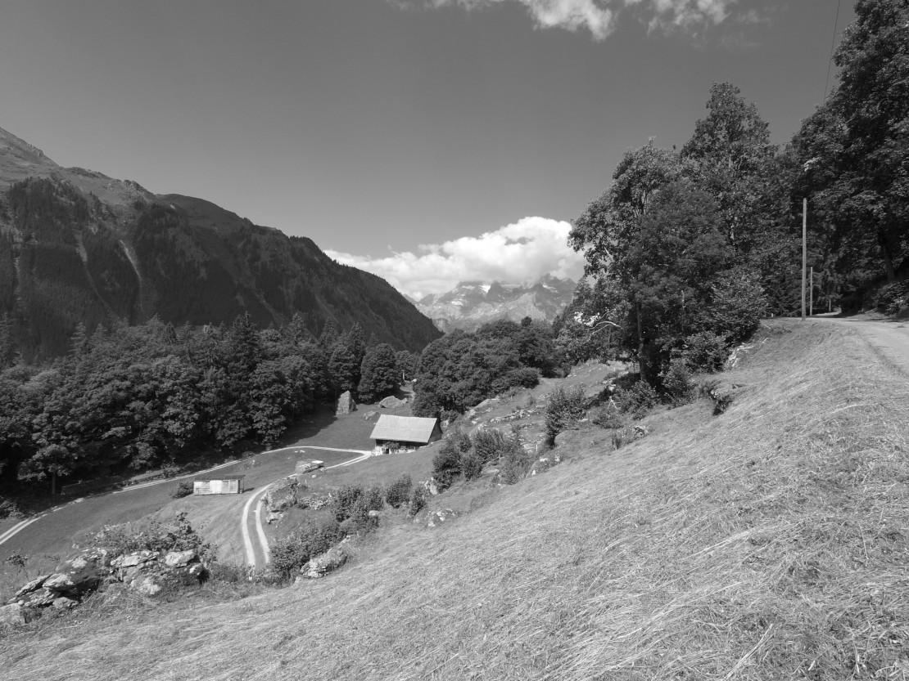



## Fuhr



*Fuhr* ist einer der Flurnamen von Engi, die schon im Säckinger Urbar (um 1350)
erwähnt werden: «Ab enen furen ze engi I Schaf». In diesem Urbar sind die
Abgaben aufgelistet, welche die säckingischen Güter im Glarnerland dem
süddeutschen Benediktinerinnenkloster am Rhein zu entrichten hatten.

*Fuhr* bedeutet Furche, aber auch Abhang, Rand. Die heutige *Fuhr*, «uf der
Fuhr», liegt über dem im Gelände noch gut erkennbaren ehemaligen «Bord» des
*Mülibach*. 

Von den rund sechzig im Urbar erwähnten Gütern «usser Serniftal» sind einige
mit ziemlicher Sicherheit Engi zuzuordnen: Von übelen öwe (*Üblital*), ab
Sunnenberge (*Sunneberg*), ab der underen egge 	(*Unteregg*), von Loeffelingen
(*Löffligeberg*), usser einem bifange (*Bifang*), usser einem büele (*Büel*),
von Malis Hofstatt (*Malisand*), von Mattebrunne (*Mattbrunne*).

Auch die Namen *Chloschtermur* und *Chloschterruus* könnten möglicherweise aus
säckingischer Zeit stammen. Die *Chloschtermur* ist eine ehemalige Mauer auf
1330m am *Gufelstogg*, welche wahrscheinlich den Heubezirk vom Alpbereich
trennte. Die *Chloschterruus* fliesst vom *Altmäberg* Richtung *Mattsite*. Hier
soll der Sage nach ein «Chlöschterli» gestanden haben. Am *Gufelstogg* sowie im
Gebiet *Mattsite* lagen säckingische Güter.

## Fuhr



Steine gibt es im Sernftal noch und noch. Die grösseren dienten der
Orientierung, als Ausgucke oder als Raststellen und haben deshalb einen Namen
erhalten. Der *Girestei* ist ein markanter Stein im Gebiet *Bifang*, auf 900
Metern. Vielleicht hatte hier einmal ein Geier («gir» bedeutet Geier) seinen
Nist- oder Landeplatz.

Man kann sich bei den meisten Steinnamen gut vorstellen, was zur Benennung
geführt hat: *Aterestei* («Atere» von Ottern, Nattern), *Bärestei, Beeristei,
Fürstei, Gigerstei, Hasestei, Kaffistei, Malerstei, Rinderstei, Rittstei,
Schäferstei, Schafstei, Sunnestei, Wasserstei, Zabedstei, bi ds Annelis Stei,
bi de ängge Steine, ds Eggthese Wildheustei*.

Steine für den Strassenbau wurden im alte und im nüe *Steibruch* über dem
*Cholbödeli* gebrochen, der *Steibruch* oberhalb des *Buechwald* hingegen ist
ein natürlicher Abbruch, von dem immer wieder *Steine* zum Särft hinunter
rollen und hüpfen. Die unterhalb liegende Wiese heisst denn auch *Im
Steischlag*.

Ein wichtiger Erwerbszweig für viele Einheimische war jahrzehntelang der
Abbruch von Schiefer im *Blatteberg* im Hinterdorf, wo zuerst im Tagbau, später
im Stollenbau Schiefer gebrochen wurde. Heute befindet sich dort ein
Schaubergwerk; viele Namen deuten noch auf das ehemalige Bergwerk hin:
*Blattebergrisi, Blattebergruus, Blattebergwald*.

## Hübel



Hügel heissen im Sernftal normalerweise Büel oder Büchel: In Engi ist *Im Büel*
ein leicht ansteigendes Gebiet auf 770 Metern unterhalb des *Grütsch*; der
*Berglibüchel* liegt auf 1824 Metern über der *Bergliwand*, *d Büchle* sind
mehrere kleine Erhöhungen zwischen *Innerbergli* und *Glattmatt* auf 1950
Metern.

Der Name *Hübel* ist wohl einer der wenigen Walser Flurnamen in Engi. Der
Wanderweg von den *Wisseberg* hinüber nach Engi führt «über d Hübel», eine
kleine Rodungsinsel in hügeligem Gebiet auf 1440 bis 1500 Metern. Nicht weit
davon, auf den *Wisseberg* (Matt) deutet der Name der Liegenschaft *Waldibach*
(1485 Meter) auf Walsereinfluss hin: Ein *Waldi* ist walserdeutsch ein kleines
Waldstück. Der Bach selber heisst dort *Waldibachruus*.

Auch der Name des *Chummeberg*, einer Bergliegenschaft auf 1100 Metern am
Gufelstogg, könnte von Walser Zuwanderern stammen: Die Bezeichnung «chumme»
(von Lateinisch cumba = Mulde) muss von deutschsprachigen Besiedlern
mitgebracht worden sein, weil zur Zeit der Lautverschiebung von «g» zu «ch» um
800 n.Chr. noch romanisch Sprechende hier lebten und der Flurname somit wie
anderswo *Gume* heissen würde. *Chumme* ist ein verbreiteter Flurname in den
Walsergebieten Deutschbündens. Weiter unten am *Gufelstogg*, auf 970 Metern,
liegt die Liegenschaft *Chleigädeli* (kleiner Stall) – ein walserdeutsches
«chlei» in einer Gegend, wo man sonst «chlii» sagt?


