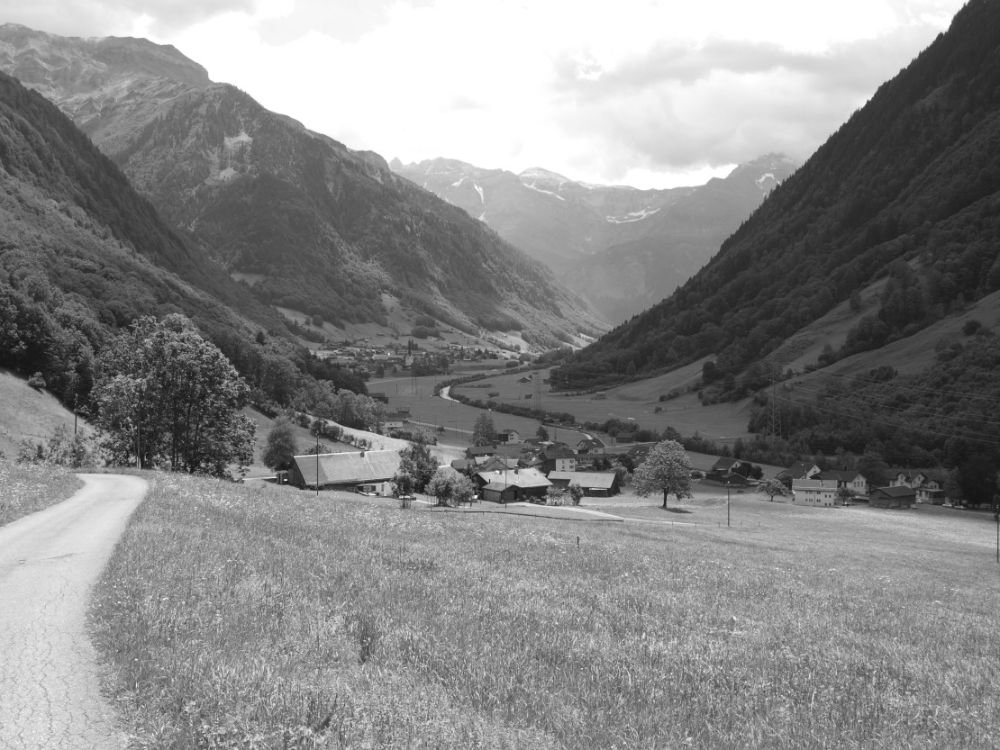



## I de Iiseträt



«Iisetrat» ist ein alter Pflanzenname für den Vogelknöterich, eine
Kriechpflanze mit drahtartigen Wurzeln. Das Gebiet *I dä Iiseträt*
liegt im Mülibachtal, auf der rechten Talseite auf 1300 bis 1450
Metern oberhalb des *Tschache*. Ein Tschache, mittelhochdeutsch
*schache*, ist im Glarnerland ein flaches, mit Sträuchern bewachsenes
Ufergelände, anderswo auch eine Landzunge, ein Berg- oder
Waldvorsprung.

Weitere Engeler Flurnamen, die sich von Pflanzennamen herleiten, sind:
*Beeriloch* (Heidelbeeren), *Bulschtere* (Pestwurz), *Choräbrand*
(Korn = Getreide), *Fäner* und *Farlä* (Farn), *Glisseler*
(Hahnenfuss), *Lauchgarte* (Bärlauch oder wilder Schnittlauch),
*Müsle* (Moos), *Nesslechopf* (Brennnesseln), *Roggerüti* (Roggen),
*Stränzeplänggli* (Meisterwurz), *Speltegg* (Dinkel), *Trosbode*
(Alpenerle).

## Löffligeberg



Der Flurname *Löffligeberg* gehört zu den im Glarner Hinterland häufig
vorkommenden, germanischen «–ingen»-Namen. Er bedeutet ursprünglich
«bei der Sippe, bei den Leuten des Löffel». Namen mit Endung «-ingen»
und «-ige» sind Siedlungsnamen; sie bezeichnen ursprünglich die
Bewohner von Einzelhöfen und Weilern, später dann diese selbst. Im
ersten Namensteil ist bei den ursprünglichen Bildungen ein Eigenname,
bei späteren manchmal auch eine Flurbezeichnung enthalten.

In Engi finden sich folgende «-ingen» und «-ige»-Namen:
*Chlebigehoschet* zum Namen Chläwi = Niklaus oder zu Chleb (cliff) =
Abhang; *Chnolligen* zum Namen Chnollo oder zu Chnolle = Erdscholle;
*Löffligeberg* zum Namen Löffler; *Höftigen* zum Namen Höfti oder
Hefti; *Wintrige* zum Namen Winter.

Heute nicht mehr gebräuchliche, aber urkundlich belegte Namen sind:
*Kolbigen* zum Namen Kolbo, *Malingen* zum Namen Malo, *Möschigen* mit
unsicherer Herkunft.

Die Endung «-ige» wurde später nur noch als Bezeichnung eines
Kollektivs gebraucht (sogenannte unechte ing-Bildungen). In Engi
gehören wohl die Flurbezeichnungen *Wärtligen* und *Lutzemädige* zu
dieser Gruppe.

## Melchböde



Die *Melchböde* sind ein Gebiet auf Gams, wo man die Kühe molk. Auch
Namen mit -stelli, z.B. *Stellichopf*, weisen auf Plätze hin, wo man
die Kühe zum Melken hinstellte. Nach dem Abendmelken wurden die Kühe
auf die *Abedweid* getrieben. Dort, wo es *Leger* oder *im Leger*
heisst, befanden sich Lagerplätze für das Vieh.

Wo Käse hergestellt wird, brauchte und braucht es den *Chäsgade*. Dort
wird der Käse bis zur Alpabfahrt gelagert. Mit der *Sirte* (oder
Molke) füttert man die Alpschweine, diese werde in einem *Chrumme* =
Verschlag gehalten.  Die Alpzeit verbringt man auf den verschieden
hoch gelegenen *Stafeln*, von lateinisch *stabulum* = Platz bei der
Alphütte oder Weidestufe einer Alp. *Am Stafel* heisst es noch auf
*Übelis*, im *Stäfeli*, auf dem Mittelstafel der *Ochsefitterenalp*,
steht heute eine Skihütte. Der Name *Altstafel* deutet auf ein nicht
mehr bestehendes Alpgebäude hin. Dass er ein Gebiet im *Hinderdorf*
von Engi bezeichnet, könnte bedeuten, dass dieses einst als
Sommerweide für Vieh von auswärts diente.


