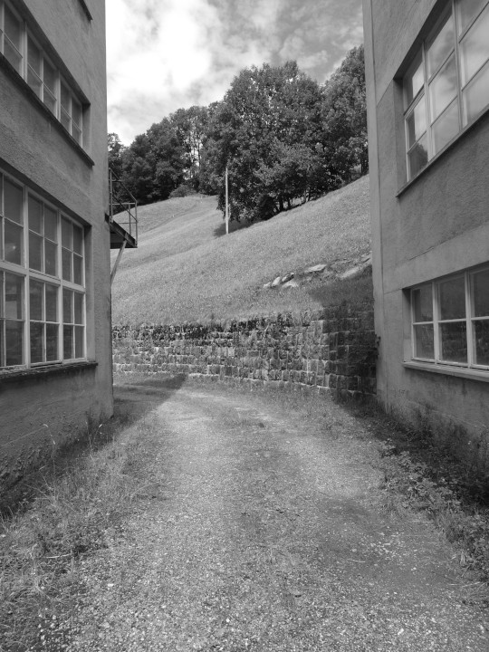



## Neue Namen



Das Namensgut war und ist einem ständigen Wandel unterworfen: Alte
Namen verschwinden, neue entstehen. Vor allem dort, wo ein Gebiet
nicht mehr genutzt oder begangen wird, werden Flurnamen vergessen und
gehen verloren, ausser sie sind auf einer Landkarte oder auf
Katasterplänen verzeichnet und bleiben so erhalten. Neue Namen
entstehen dort, wo der Mensch in die Natur verändernd eingreift. Sie
beschreiben meistens nicht die Flur, sondern ein Bauwerk oder ein
Gebäude.

Der Name *Badchopf* erinnert an das von etwa 1660 bis 1760 unter
diesem Chopf gelegene *Mattlauibad*. *Ds Brämeloch* ist nicht ein
natürliches Loch, sondern eine ehemalige Schiefer-Abbaustelle, die
einem Bräm gehörte. Mit *Dammstrass*, auch *Wuerstrass*, ist die
Strasse am linken Mühlebachufer gemeint; der Bachlauf wurde nach dem
Unwetter von 1910 korrigiert und eingedämmt. Man sagt aber «em Bach na
abe». *Dr Ferieheimwald* liegt beim 1907 erstellten Ferienheim am
*Gufelstogg*. *Dr Maschinerai* liegt hinter der Weberei Vorderdorf,
mit «Maschine» ist die Fabrik gemeint. Im *Blattemagazin* wurden einst
Schieferplatten gelagert, noch früher war es das *Sprützehuus* der
Feuerwehr; heute ist darin eine Zimmerei eingerichtet. *Dr Sageplatz*,
umgangssprachlich «uf dr Sage», erinnert an das zur Weberei gehörende
Sägewerk, das dort bis 1974 stand. Heute befindet sich dort die
Bushaltestelle. *D Suppechuchi* ist ein Hausteil an der Allmeind, in
dem vermutlich in den Hungerjahren um 1845 Bedürftige verköstigt
wurden. *D Siidewindi* ist ein heute fast vergessener Name für das
Gebiet im Nordwesten der Busstation Engi-Vorderdorf. Dort betrieb die
Seidenzwirnerei Trümpy Jgr. & Co., Glarus zwischen 1857 und 1875 eine
Seidenwinderei.

Auch *Vorderdorf* und *Hinderdorf* sind neueren Datums: Sie
bezeichneten seit der Eröffnung der Sernftalbahn 1904 die Stationen
und ersetzten bald die früheren Gebietsbezeichnungen *Hinderbach* und
*Vorderbach*, die «hinten» und «vorne» noch genau umgekehrt, aus der
Sicht der Siedlung wiedergaben: «Hinter dem Bach», d.h. hinter dem
Mülibach, lagen damals die Gebiete, die heute zum *Vorderdorf*
gehören.

## Oberrütiacher



Für die alemannischen Zuwanderer war neben der Viehhaltung auch der
Getreideanbau eine wichtige Nahrungsgrundlage. Ackerflächen mussten
zuerst gerodet werden, so auch der auf der *Höfliegg* gelegene
*Oberrütiacher*, die *Roggerüti* im *Linde*, wo Roggen angesät wurde,
und das Gebiet *Chorebrand* im *Wartstalde*. Ackernamen findet man vor
allem in Siedlungsnähe, so den *Bergenacher* im *Berge*, *Annelis
Acher* im *Höfli*, die *Ächerli* am *Gufel*. Die «Äcker» wurden aber
nicht konsequent zum Getreideanbau, sondern auch als Hanf- oder
Gemüsesaaten genutzt. Weiter oben, im *Cholgruebewald*, findet man den
*Aleanzacher*; möglicherweise ein gemeinsam, in Allianz genutzter
Acker. Am Weg zum *Chräuelberg* und vielleicht von dort aus
bewirtschaftet heisst es *I de alte Ächer.*

Im *Spicher*, auf 1120 Metern am *Gufelstogg*, könnte ein Kornspeicher
gestanden haben, die Höhenlage und der nach Süden gerichtete Hang
garantierten eine lange Sonneneinstrahlung. Der untere *Altmäberg* auf
1360 Metern auf den *Wisseberge* heisst auch *Dröschtennberg*; hier
wurde also Korn gedroschen und in einer Tenne gelagert. Angebaut
wurden der Lage entsprechend Roggen, Dinkel (Spelt) und Gerste. Einen
*Gerstbode* findet man in Elm. Wurde auf der *Speltegg* auf 1400
Metern Dinkel angebaut? Dinkel, eine bei den Alemannen beliebte
Getreidesorte, gedeiht bis auf 1400 Meter. Oder wurde hier Unkraut,
umgangssprachlich auch Spelt, gemäht und als Streue benutzt? Die
späteren Kartoffeläcker und Pflanzplätze heissen auch *Saaten* oder
*Rüti*.
