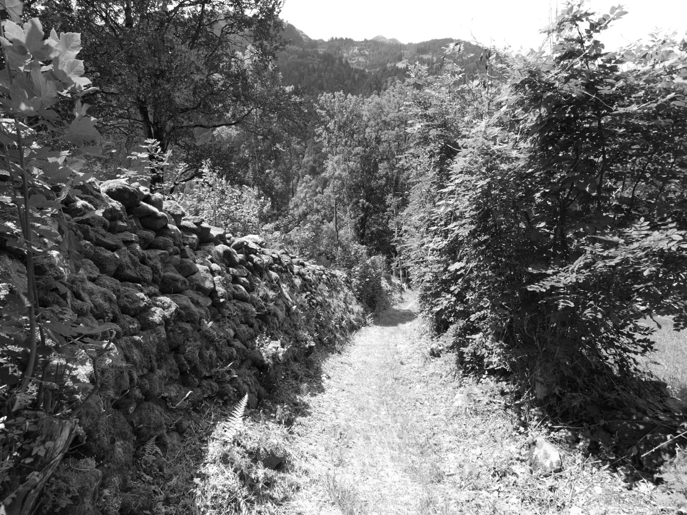



## Rigi und Rigigasse



Der offizielle Name lautet heute *Rigigasse*, früher hiess der Weg
*Augass*.

Die *Rigigasse* führt von der Kantonsstrasse in der Au steil hinauf
zur Dorfstrasse, so steil, wie die Rigibahn hinauf zum Gipfel der Rigi
führt. Fälschlicherweise bringt man deshalb die beiden Namen
miteinander in Verbindung; der Engeler Name Rigi wäre demnach eine Art
Über- oder Spottname in Anlehnung an den steilen Berg im Kanton
Schwyz.

Man sagt aber «dur d Rigi ufe», «i dr Rigi». Im alltäglichen
Sprachgebrauch fehlt der Zusatz «-gass». Das mittelhochdeutsche
«ric/rihe/rige» bedeutet nämlich für sich schon «schmaler Weg, enger
Durchgang». Der Name *Rigi* meint also einfach «Gasse». Es ist eine
ehemalige Geissgasse, auf der die Ziegen hinauf und hinunter getrieben
wurden. Ihre Fortsetzung führte wohl übers *Hüreli* hinauf zum
*Färebode*.  Der Name *Rigigass* ist ein Pleonasmus, der wohl in
neuerer Zeit gebildet wurde, weil man den ursprünglichen Namen Rigi
nicht mehr verstand.

Der Name des Berges im Kanton Schwyz hat übrigens den gleichen
Ursprung. Das mittelhochdeutsche «rige» bedeutet auch «eine Linie,
eine Reihe»: Die von Arth Goldau aus gut sichtbaren Schichtungen, die
Felsbänder haben dem Berg den Namen gegeben.

Auf die frühere Ziegenhaltung weisen auch andere Gassennamen
(*Fitteregass*, *Grundgass*) und verschiedene Geissen- und Gitzinamen
hin (*Geissberg*, *Geissegg*, *Geissgäde*, *Geisslaui*, *Gitzichöpf*,
*Gitzifad*, *Gitziplatz*). Im Namen *Geisserbueche* hingegen steckt
der «Wildgeisser», der Waldkauz, der wohl in dieser Buche zu Hause
war.

Namen mit den Wortteilen Chalber-, Chue-, Ochse-, Rinder-, Schwii- und
Ross- weisen auf spätere und heutige Grossviehhaltung hin. So unter
anderem die Namen *Chalberbode* (Weidegebiet *Mülibach* Oberstafel),
*Chüebändli* (Grasband im *Gufeli*), *Ochsebüel* (Teil der *Alp
Fittere*), *Rinderzug* (Holzritt im *Wartstaldewald*), *Rossweid* (in
der *Oberängi* gelegen). Mit der bei der Käseherstellung anfallenden
Molke werden auf der Alp heute noch Schweine aufgezogen. Davon hat der
*Schwibode* über dem *Üblisser Wald* seinen Namen.

## Ringge



«Ringge» ist ein alemannisches Wort für eine ringförmige
Gürtelschnalle. Es wird heute noch von Sernftaler Bauern für die
Schellenschnalle bei Glockenriemen gebraucht. Die Liegenschaft
*Ringge* oberhalb der *Waldhoschet* hat wirklich die Form einer
Gurtschnalle: Eine halbrunde Wiesenfläche, in der ein schmales
Waldstück entlang des *Ringgerüslis* den Dorn bildet.

Auch andere Flurnamen in der Gemeinde Engi sind von Formen von
Gegenständen hergeleitet: *Ds Brusttuech* (der Latz bei der
Frauentracht, hier ein Waldstück unterhalb des *Gheistschwämmli*); d
Gibelegg (Dachgiebelförmiges Waldstück, der Fussweg führt auf dem
Giebel, der Krete, hinauf Richtung *Chuefittere*); *dr Huet*
(Hutförmige Erhebung auf dem Grenzgrat zum sankt-galler Murgtal); *ds
Saggbödeli* (eine sackförmige Ausbuchtung der Weide unter dem
*Cholgruebeloch*); *ds Tor* (ein kleiner Sattel unterhalb des
Mageräu); *dr Triangel* (eine spitz zulaufende, dreieckige Waldfläche
unterhalb der *Gufeli Risene*); *dr Tritt* (ein stufenförmiges
Wegstück unterhalb des *Tänzer*); *dr Trog* (eine trogartige
Geländevertiefung am *Schlattberg*); *dr Ture* (ein schmales, steiles
Wegstück mit vielen Serpentinen, ähnlich der Treppe in einem Turm,
zwischen dem undere und dem mittlere *Chräuel*); *ds Wiegli* (eine
wiegenförmige Geländeeinbuchtung an einem Grat unterhalb des
*Heustogg*).

## Rollhaferuus



Mit dem schweizerdeutschen «Rollhafe», anderswo auch «Hellhafe», ist
der innerste Kreis der Hölle gemeint, der Hafen (Topf), in dem die
Seelen gerollt werden. Der Name entstand wohl, weil man die üblen
Eigenschaften eines Ortes zum Ausdruck bringen wollte, hier wohl die
abgelegene Lage im Steilhang des *Bulsterewald*.

Auch die benachbarten Runsen weisen auf die ungünstige Lage hin: Die
*Leidbergruus* führt durch «leides», also schlechtes, lockeres Gestein
und die *Teufruus* tief eingeschnitten ins Gelände steil hinunter in
den *Chessel* des *Mülibach*.

Runsen gibt es in den steilen Abhängen des *Särfttal* unzählige. Sie
bringen Wasser und Steine und Schnee ins Tal und verwüsten bei
Unwettern Weideland, Strassen und Gebäude. Alle haben einen Namen, der
sich entweder auf die Lage bezieht (*Badchopfruus*, *Bödeliruus*,
*Erleruus*, *Hochwandruus*) oder eine Besonderheit ausdrückt
(*Gelbrüsli*, *Nasstrittruus*, *Trocheruus*, *Wasserruus*).
