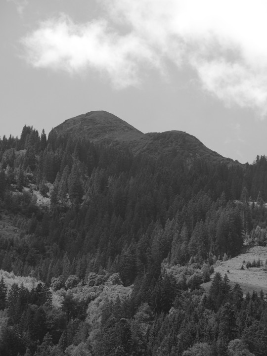



## Schräje



Ein *Schräje* (mittelhochdeutsch «schraejen» = spritzen, sprühen) ist
ein *Stüber*, und ein Stüber ist ein Wasserfall. In Linthal gibt es
den *Berglistüber*, und es gab dort vor dem Bau des Limmernstausees
den *Schräjebachfall*. Der Pleonasmus im Namen entstand wohl, weil die
ursprüngliche Bedeutung des Wortes «Schräje» verloren gegangen
war. Der *Schräje* in Engi ist ein Ort neben dem *Mettlebach*, welcher
dort bei viel Wasser einen Wasserfall bildet. In Matt fällt von der
Liegenschaft *Schräje* ein Wasserfall über die *Schräjewand* hinunter
in den *Chrauchbach*, in Elm fällt ein Schräje in mehreren Stufen auf
den Talboden der *Weid*.

Auch im Namen *Hatzgetschol* ist ein Wasserfall versteckt. Ein
*Tschol* ist ein Schwall Wasser, dieser spritzte über einen grossen
Stein im *Mühlibach* im Gebiet *Hatzge*. Die Unwetter von 2005 haben
den Stein verschoben; deshalb, aber auch weil seit 2009 das Wasser
gefasst ist, strömt es jetzt spärlicher über den Stein.

Auch Wortzusammensetzungen mit «brunne» (ein «brunne» ist eine
Quelle), «see», «bach» und natürlich mit «wasser» weisen auf
wasserreiche bzw. Wasser führende Stellen im Gelände hin: *Brunnegade,
Brunneloch, Chaltebrünne, Mattbrunne, Seebach, Seeloch, Wasserböde,
Wasserloch*. Auch *Schaft* oder *i dr Schaft*, ein Weidegebiet auf
*Übelis*, ist eine solche Bezeichnung. *Schaft* oder *Wasserschaft*
bezeichnet eine Stelle, an welcher Wasser geschöpft werden konnte.

Der Name des Heualpgebietes *Bützi* auf 2000 Metern kommt vom
mittelhochdeutschen «bütze» = Pfütze, Brunnen. Er bezeichnet
wasserreiche Wiesen oder eine Trinkstelle für das Vieh, was hier am
ehesten zutrifft. Nicht verwechseln mit Bützi darf man die *Bitzi* in
Matt. Mit dieser ist eine eingezäunte Liegenschaft gemeint,
mittelhochdeutsch «biziune», ähnlich dem *Bifang* («gefangenes»
Gebiet) in Engi beim *Holderbergli*.

Dagegen weist der Name *Güntlechamm*, auf 2300 Metern über dem
Oberstafel der *Gufelialp* gelegen, auf Wasserstellen hin; «güntle»
sind Gunten oder Pfützen. *Im Aatel* heisst es am Eingang ins
Mülibachtal, von «Aa» = Bach und Tal. Der *Mülibach* wurde also auch
einfach «Aa» genannt.
 
Der Name des Talflusses *Särft* wird in Urkunden 1411 erstmals als
Flussname allein erwähnt, schon 1240 aber in der Zusammensetzung
«Serniftal». Der Name ist wahrscheinlich keltisch, die idg. Vorsilbe
«ser (-nava)» kann strömen bedeuten oder aber rot, rötlich. Beides
würde passen: Der *Särft* ist ein rasch fliessendes Gewässer, sein
Bachbett scheint im Unterlauf wegen der vielen Sernifitsteine oft
rötlich.

## Siwelle



Vom *Schlatt* aus erblickt man auf der gegenüberliegenden Talseite den
Abhang des *Chräuel*. Den Horizont bildet die wellenartige Bergkette
mit den *Siwellen*. Althochdeutsch «sinwelbe», mittelhochdeutsch
«sinwel» bedeutet schön rund, gewölbt. *Dr Siwelle*, auch *Matter
Siwelle* mit 1994 Meter Höhe ist eine rundliche Erhebung, desgleichen
*dr Chli Siwelle* (1984 Meter). Der höchste Punkt der Kette ist der
*Hohberg* (2244 Meter), der zwar nicht die Höhe der dahinter liegenden
Stöcke (*Charrenstock* 2421 Meter und *Gandstock* 2315 Meter)
erreicht, sich aber deutlich gegen den Horizont abhebt. Weiter
nördlich schliesst sich *dr Gross Siwelle* (2099 Meter) an, eine
einzeln stehende, runde Erhebung zwischen dem oberen Chräuel und dem
oberen Laueli.

Oft sind Berge nach einer tiefer gelegenen Örtlichkeit benannt, so der
*Bützistogg* (er liegt über der Heualp *Bützi*), der *Fug* oder
*Fuggstogg* (über dem Fuggtäli), der *Gandstogg* (über *Gandberg* und
*Gandtüüfi*), der *Gufelstogg* (über der Bergliegenschaft
*Gufel*). Der zweite Wortteil «-stogg» bezeichnet die Form, die einem
Baumstrunk ähnlich sieht.

Das Aussehen hat vielen Bergen zu ihren Namen verholfen: *Breitchamm,
Chamm, Magerreu, Rotstogg, Sunnehöreli*. Das 2347 Meter hohe
*Ruchsitestöggli* im Grenzgrat zum Murgtal SG heisst auch
*Goggeie*. In diesem Wort steckt das mittelhochdeutsche «kock» und das
schweizerdeutsche «Gogge» = Heuhaufen, Haufen oder das Verb «guggeie»
= kauern, in geduckter Stellung sitzen.

Namen mit dem Wortbestandteil «berg» und «bergli» bezeichnen jedoch
keine Berggipfel, sondern hoch gelegene Weideplätze oder
Bergliegenschaften, welche ganzjährig oder nur im Sommer bewohnt
wurden und werden. Viele dieser Berg-Namen geben ihren einstigen
Besitzer bekannt, so *dr Altmeberg, dr Gigerberg, ds Josebergli* oder
enthalten eine Angabe der Lage wie *dr Chräuelberg* oder *dr
Chummeberg*.
