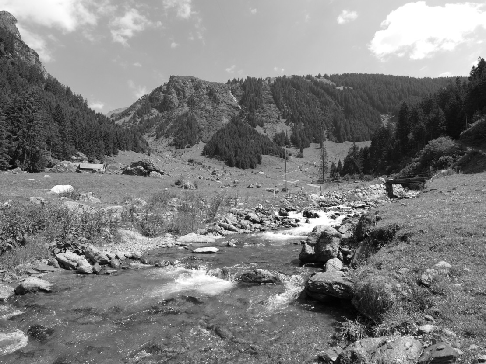



## Tagwesblänggli



«Tagwen» ist der glarnerische Name für Bürgergemeinde. Ein Tagwen
umfasste die im Gebiet der Ortgemeinde wohnhaften Tagwensbürger, also
Bürger mit Heimatrecht an diesem Ort. Das *Tagwesblänggli*, ein
Wiesenband auf 810 Metern über dem linken Ufer des *Särft*, muss also
in Tagwensbesitz gewesen sein. Tagwen (von Tagwerk) werden schon im
Säckinger Urbar erwähnt, so z.B. «der tagwan der lüte ze Swanden». In
Engi wurde der Tagwen 1995 mit der Ortgemeinde vereinigt und diese
am 1. Januar 2011 in die neue Gemeinde Glarus Süd überführt.

Auch der Name «Allmeind», umgangssprachlich «Allmei», weist auf
früheren gemeinsamen Besitz hin. Eine Allmeind ist ungeteiltes
Gemeindeland, also Allgemeinbesitz. Drei Gebiete tragen in Engi diesen
Namen und sind z.T. heute noch im Besitz der Gemeinde: Die *Allmei*
zwischen *Mülibach* und *Allmeistrass*, die Allmeind am rechten
Sernfufer in der *Au* und die im *Mettle* gelegene Allmeind, welche
1408 von der Gandalp abgetrennt wurde.

Einstige Besitztümer der Kirche Matt sind der *Chilchewald* und das
*Chilcheweidli* im Gebiet *Mattbrunne*. Vom *Lagechopf* auf 1180
Metern am *Gufelstogg* aus konnten, weil man dort einen guten
Überblick hatte, Bodenbesitzverhältnisse geklärt werden (siehe [Lach,
Looge, Lage](../../artikel/ein-kreuz/#lach-looge-lage)). So ist das
Gebiet *Zueteil* zwischen *Linde* und *Oberbergli* ursprünglich ein
jemandem zum Holzen zugeteiltes Stück Wald. Die *Wechselblangge*, ein
Grashang auf 2360 Metern am *Gufelstogg* wurde abwechslungsweise von
zwei benachbarten Sennten bestossen.

Auf frühere Durchlässe in Weidezäunen weisen die Flurnamen *Türli* und
*Türliallmeind* im Gebiet *Hugeten* hin. Die *Gamstürliruus*, über dem
*Gamser Chessel* gelegen, weist auf einen Durchlass zwischen den
Weiden des *Üblital* und denen von *Gams* hin, noch heute gibt es dort
ein Gatter.  Auch der Name *Mürli* im Gebiet Bode zeigt, dass Weiden
abgegrenzt wurden. Von einer Gebietsgrenze erzählt der Name des
*Chrüzblattezug*, eines Lawinenzugs, welcher die Grenze zur Gemeinde
Schwanden bildet. Der Name geht auf eine frühere Grenzmarkierung, ein
Kreuz auf einer Steinplatte, zurück.

## Üblital



Romanisch «ovil», altglarnerisch «übel» bedeutet Schafhütte, Pferch,
Stall. «Üblen» ist eine Mehrzahlform, im *Üblental* (Alpbrief von
1416), heute *Üblital*, standen also mehrere Schafpferche oder
Hütten. *Übelis*, von Romanisch «ovilins», ist eine
Verkleinerungsform. Auf *Übelis*, der Terrasse über dem *Üblisserwald*
auf 1900 Metern, stand wohl ein Schafställchen oder ein kleiner
Pferch. Das ganze *Mülibachtal* hiess ursprünglich Üblital. Heute
werden mit diesem Begriff die Weiden der Unterstafel auf 1190 Metern
bezeichnet, der *Mülibach* heisst an dieser Stelle noch
*Üblibach*. Ein Eintrag im Säckinger Urbar «Von uebelen Öwe ab den
hofstetten» lässt vermuten, dass im 14. Jahrhundert im *Üblital*
einige «Heimetli» standen. Eine Hofstatt ist ein kleines Heimwesen,
ein Haus mit etwas Umschwung. Die spätere verkürzte Bezeichnung von
Hofstatt lautet *Hoschet*. Im Dorf Engi gibt es mehrere Hoschtet- und
Höschetli-Liegenschaften; auch der Dorfteil *Stettli* ist wohl eine
gekürzte Form von Höschetli.

Die Begriffe «übelis», «üblen» sind von den alemannischen Zuwanderern
übernommen, aber auch übersetzt worden: Im gleichen Gebiet, unterhalb
der *Glattmatt*, liegt die Örtlichkeit *Schaffäri*, was ebenfalls
Schafpferch bedeutet. Auch andere deutsche Schaf-Namen weisen auf
frühere Schafhaltung hin: *Schäferthisewäldli* (ein Schäfer Mathias
Marti hat 1787 bis 1854 in Engi gelebt), *Schafgadebänggli* und
*Widersteiner* («Widder» = Schafbock).

Weitere ursprünglich romanische Flurnamen in Engi, obwohl oft nicht
mehr als solche erkennbar, sind: *Chummeberg*, (von Lateinisch «cumba»
= Mulde), *Figlerbode* (von Lateinisch «foculare» = Feuerstätte, heute
Unterstand, kleiner Schopf), *Gams* (früher *Gambs*, von Lateinisch
«campus» = Feld; könnte später umgedeutet worden sein: zu Gemse
gehörig), *Erlegand* (Romanisch. «gand» = mit Felstrümmern bedecktes
Gelände), *Gufel* (von lat. «cubulum» = Lagerstätte, Unterstand für
das Vieh), *Hädiloch* (von Lateinisch «haedus» = Ziegenbock),
*Oreberg* (von Romanisch «ora» = am Rande gelegene Liegenschaft,
Matt), *Stafel* (von Lateinisch «stabulum» = Lagerstätte, Platz bei
der Sennhütte).

Es ist davon auszugehen, dass im Sernftal Romanischsprachige
siedelten, bevor alemannische Gruppen
zuwanderten. Sprachwissenschafter nehmen an, dass über lange Zeit, bis
ins 11. Jahrhundert, Zweisprachigkeit herrschte und dass die beiden
Sprachgemeinschaften sich gegenseitig beeinflussten. Aus dieser Zeit
stammen auch die mittelalterlichen «Hüttenmäler». Es sind
*Heidestäfeli* genannte Mauerreste, Wüstungen von Alphüttchen und
Pferchmauern, die man über dem *Cholgruebewald*, unterhalb der
*Glattmatt* und über der *Chammwand* findet: Zeugen früher, in
Einzelsennerei betriebener Alpwirtschaft.


