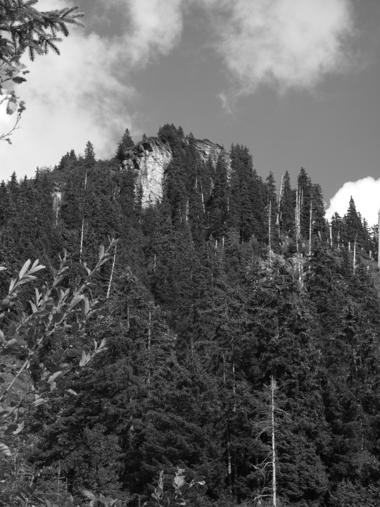



## Vogelsang



Im *Leglerwald*, unterhalb der Skihütte *Gams*, heisst eine Stelle *Im
Vogelsang*. Auch andere Wildtiere haben ihre Spuren in Flurnamen
hinterlassen: Birkhühner im *Hüenderplänggli*, im *Hane* und im *Fug*,
(«Fugge» ist eine junge Henne), Hasen im *Hasestei* und im
*Hasebergli*, Salamander im *Mollereplänggli*, Raben im *Rapp*. Dass
es früher im Tal auch Bären und Wölfe gab, zeigen die noch
gebräuchlichen Flurnamen *Bärebode*, *Bärezug*, *Wolfeloch*,
*Wolfetal* in Matt, *Wolfetalschlittweg* in Engi.

## Werbe



*Werbe* ist ein Alpweidegebiet zuhinterst im *Chessel* des
*Mülibachtal* auf 1757 Metern. Althochdeutsch «werpan» heisst werfen,
im Sinne von sich drehen, krümmen, biegen. *Werbe* ist also eine
Stelle, wo das Gelände eine Biegung macht, ein Talabschluss oder
Talkessel. Ähnlich situiert sind die Werben zuhinterst im *Chrauchtal*
(Matt), im *Durnachtal* (Linthal) und im *Rossmattertal*
(Glarus). Einheimische sagen zuhinterst im Kessel «im cher hinde», in
Elm, im Pleus, heisst eine ähnlich gelegene Stelle *Cheerbode*. Ein
«cher» ist also auch ein Talkessel. In einer solchen Talmulde liegt
auch der Unterstafel der *Alp Laueli;* der Wald am nördlichen Abhang
heisst *Cherwald*. *Im Cher* heisst ein Wegstück im unteren Teil des
alten Fussweges vom *Berge* hinauf Richtung *Gufel*; hier ist mit
«cher» die Wegbiegung gemeint, von mittelhochdeutsch «ker» = Richtung,
Wendung.

## Zindel



In verschiedenen Flurnamen wird die Landschaft mit Körperteilen von
Mensch oder Tier verglichen: *Brunnadere, Chamm, Chämmli, Chnü, Chopf,
Chüebuch, Horä, Höreli*, und *Tiergrind*. Zu dieser Gruppe gehört auch
der *Zindel*. Ein «Zind», mittelhochdeutsch «zint», ist ein Zahn, eine
Zacke. Der 1825 Meter hohe Zindel in Engi ist ein markanter,
stockzahnförmiger Felskopf mitten im Weide- und Waldgelände im Gebiet
Ochsefitterealp. Vom Dorf aus gesehen hebt er sich deutlich gegen den
Horizont ab, wenn man oben ist «uf em Zindel» hat man einen schönen
Ausblick hinunter auf die Alp Sandigen und aufs Dorf.
