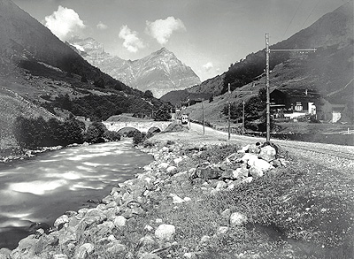
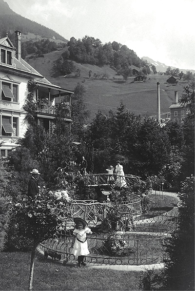
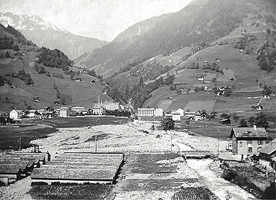



Nach einem kurzen, allgemeinen Teil werden Sie zu einem Spaziergang
eingeladen, der bei der Engibrücke beginnt und durch das ganze Dorf bis zum
Plattenberg und zur Mattlaui führt. Folgende «Stationen» werden eingehender
behandelt:



* Die Engibrücke
* Die Seidenwinde
* Der Stauweiher
* Die Sernftalbahn
* Weberei und Villa
* Ferienheim
* Mühlebach
* Ziegenhaltung in Engi
* Milchzentrale
* Schule
* Post
* Geschäft Blumer-Coray
* Ersparniskasse
* Plattenberg
* Mattlaui



Dank der vielen Fotodokumente lädt der Band wie ein Bilderbuch zum Blättern und
Betrachten ein; die erläuternden Kommentare erleichtern aber auch den Einstieg
in die Textteile und Textdukumente. Die Geschichte von Engi wird nicht
fortlaufend erzählt, sondern anhand der Stationen des Spaziergangs ergeben sich
einzelne ganz unterschiedliche geschichtliche Rückblicke.




Gerne senden wir Ihnen das Buch «Engi – Ein historischer Spaziergang» mit 190
Seiten und 140 Abbildungen zum Preis von **CHF 25.—** plus Versandkosten.

