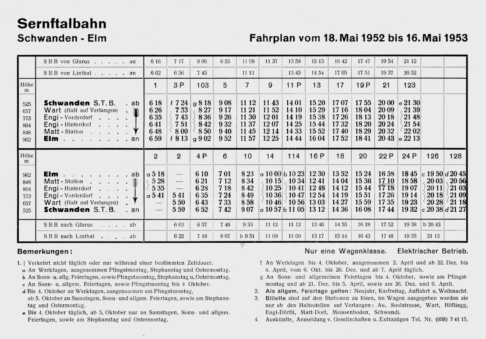

«Gewidmet allen Männern, die bei der Sernftalbahn
arbeiteten.»

Die «Erinnerungen an die Sernftalbahn» wurden von Adelheid Baumgartner
auf das 100-jährige Jubiläum der Inbetriebnahme der Bahn im Jahr 2005
verfasst. Das Werk gibt Einblick in ein bedeutendes und noch heute
lebendiges Kapitel der Geschichte des Sernftals.

Anders als in «Das war die Sernftalbahn» von Hans Waldburger[^1]
werden von Adelheid Baumgartner nicht die technischen Aspekte, sondern
die Eindrücke der Menschen thematisiert, die mit der Bahn zu tun
hatten oder mit ihr in Berührung kamen. Sie führte dazu Interviews,
die sie mit einem Kassettenrecorder aufzeichnete, um sie danach auf
Hochdeutsch niederzuschreiben. Die Erzählungen zeigen die
verschiedenen Blickwinkel, aus denen die Angestellte, ihre Angehörige
oder die Passagiere die Sernftalbahn erlebten.

Das Buch wurde im Jahr 2005 veröffentlicht und war nach wenigen Jahren
vergriffen. Die Publikation des Inhaltes auf unserer Homepage erfolgt
mit freundlicher Genehmigung der Autorin.

Rolf Stöckli

[^1]: Hans Waldburger: Das war die Sernftalbahn. Verlag Tschudi & Co.
    AG, Glarus 1971 (ISBN 3-85948-001-4). Neuauflage: Hans Waldburger,
    Jürg Aeschlimann: Sernftalbahn Schwanden–Elm. Prellbock Druck &
    Verlag, Leissigen 2005 (ISBN 3-907579-35-6).


