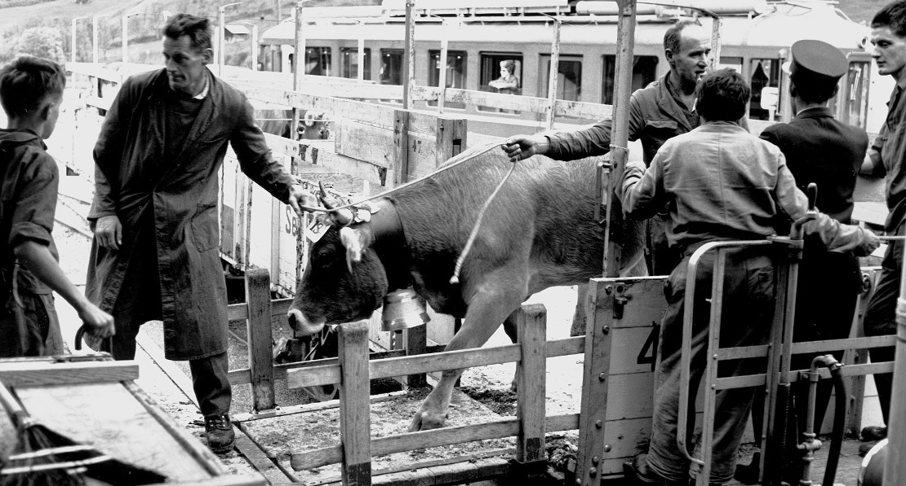



*Es erzählt Kaspar Zentner-Furrer, \*1925, Einsiedeln. Das Interview
wurde am 11. November 2004 geführt.*

Ich wuchs in Elm auf und arbeitete seit meinem Schulaustritt bei der
Sernftalbahn. Zuerst half ich im Winter beim Schneeschöpfen. Bald
wurde ich beim Bahnhof Elm als «Wärter» eingestellt. Das hiess, dass
ich rund um das Bahnhofgebäude Ordnung halten und im Sommer jäten
musste. Im Winter waren die Weichen zu warten. Das war eine wichtige
Arbeit, konnte man doch die Weichen nicht wenden, wenn sie
festgefroren waren. Ich war dafür besorgt, dass sie immer schneefrei
blieben. Waren sie festgefroren, musste das Eis herausgekratzt, und
die Weichen mussten gesalzen werde. Oft musste ich diese Prozedur
mehrmals am Tag wiederholen.

Zu den Aufgaben eines Wärters gehörte die Besorgung des Schuppens. Es
galt nicht nur im Schuppen Ordnung zu halten. Ich musste auch die
Waren, die mit dem Zug kamen, in den Schuppen bringen oder den Zug mit
Waren, die zum Abtransport bereit standen, beladen. Es gab den ganzen
Tag etwas zu tun.

Später wurde ich in die Arbeiten eines Wagenführers und Kondukteurs
eingeführt. Meine Lehrmeister waren Jakob Rhyner und Oswald Rhyner.
Ich war einer der ersten, die mit dem neuen, roten Zug fahren durften.
Lange waren wir zu zweit, ein Wagenführer und ein Kondukteur. Wir
wechselten in den Aufgaben jeweils ab. Es konnte geschehen, dass ich
mich verschlief. Zum Glück wohnte ich im Müsli. Der Speich fuhr dann
beim Bahnhof Elm ab und pfiff wie verrückt. Ich erwachte, sprang aus
dem Bett in die Kleider und rannte zum Bahngeleise hinüber. Dort hatte
der Speich den Zug angehalten. Ich stieg ein – und weiter ging's.

Ich fuhr, wenn immer möglich, mit der erlaubten Höchstgeschwindigkeit.
Bei den alten Wagen waren das 25 bis 30 Kilometer pro Stunde, bei den
neuen maximal 50 Kilometer. Es gab ältere Leute, die nicht gerne mit
mir fuhren; sie hatten Angst. Eine Frau kam jeweils zum Bahnhof, und
wenn sie sah, dass ich Fahrdienst hatte, kehrte sie wieder um und
benutzte einen späteren Zug. Einmal kam mir das schnelle Fahren
zugute. Ich war damals schon Vorstand, musste aber hie und da auch
einen Kurszug fahren. An diesem Tag hatte ich mit dem Zweiuhrzug
Fahrdienst. Ich aber sass im «Bahnhöfli» in Elm und liess mir vom Frei
die Haare schneiden. Zehn Minuten nach zwei kam ein Mann zur Türe
herein und fragte, ob der Zweiuhrzug nicht fahre. Ich erschrak, sprang
halb geschoren auf und rannte zum Bahnhof. Eine ganze Schulklasse
wartete. «Steigt sofort ein!», rief ich, und dann ging's wie der Blitz
ab nach Schwanden. Ich konnte einige Minuten einholen. Entgleist ist
kein Zug bei meinen rassigen Fahrten.

Kleinere Unfälle gab es schon. Auf der Höfliegg streifte ich einmal
einen Arbeiter, der am Geleise beschäftigt war, aber es machte ihm
nichts. Als der Autoverkehr zunahm, gab es hie und da kleine Unfälle.
So bog in Schwanden ein Auto aus einer Nebenstrasse in die
Sernftalstrasse ein. Das hatte einen Zusammenstoss zur Folge. In
Engi-Hinterdorf musste ich einen Wagen anhängen. Ich war allein
unterwegs, hätte also ein paar Augen mehr haben müssen, um alles zu
sehen. Prompt stiess ich rückwärts mit dem Auto des Milchmanns Kamm
zusammen; eine Beule zierte das Auto.

Noch besser sind mir andere Erlebnisse auf der Strecke in Erinnerung.
An einem schönen Sommertag fuhr ich mit einem Einmannwagen nach
Schwanden. Da hing bei der hohen Mauer im Stock eine Ziege an einem
Seil die Mauer hinunter. Sie hatte oben in der Wiese geweidet. Damit
sie nicht weglief, war sie mit einem Seil an einem Pfosten befestigt.
Durch ein Missgeschick war sie über die Mauer gefallen und hing nun am
Strick. Ich sah, dass sie noch lebte. Da hielt ich den Zug an, stieg
aus und brachte die Ziege wieder nach oben. Jemand berichtete das
Ereignis dem «Beobachter», und der Bericht wurde veröffentlicht.

Viel zu lachen gab die Episode mit dem selbständig gewordenen
Züritram. Durch den Direktor[^1], der in Zürich wohnte, erhielt die
Sernftalbahn ein Zürcher Tram. Es wurde auf der Strecke Schwanden–Elm
eingesetzt. Eines Winters war im Stock eine Lawine niedergegangen. Wie
meist in einer solchen Situation fuhr ein Zug von Engi bis zum
Lawinenkegel. Die Leute mussten dann die Lawine zu Fuss übersteigen,
und auf der anderen Seite wartete wieder ein Zug, der die Passagiere
nach Schwanden brachte. Das Zürcher Tram pendelte zwischen der Lawine
und Schwanden. Stand es bei der Lawine, so wurden die elektrische und
die Handbremse angezogen und ein hölzerner Hemmschuh untergeschoben.
Wahrscheinlich war das Eis bei der angezogenen Handbremse geschmolzen
– auf jeden Fall machte sich das Züritram ganz allein auf die Reise.
Dank der elektrischen Bremse konnte es nur wie eine Schnecke kriechen.
Es ging recht lange, bis es jemand merkte. Dann wurde Alarm
geschlagen. Ich war damals gerade im Depot in Engi. Es wurde mir
befohlen, ich müsse das Tram einholen. Ich nahm ein Velo und fuhr
dort, wo es am besten ging. Über den Lawinenkegel musste ich das Velo
tragen. Das blaue Tram holte ich erst in Schwanden bei der Therma ein.
Ich stellte das Velo ab und stieg ein. Dann brachte ich den Ausreisser
wieder zur Lawine zurück. Später tat das Tram seinen Dienst als
Transportmittel im Stollen beim Bau des Linth-Limmern Werkes.

Ich wurde in Elm zum Vorstand befördert. Martin Baumgartner, der
Vorstand von Engi-Hinterdorf, führte mich in meine Aufgaben ein. Er
kam nach Elm und erklärte mir jede Aufgabe eingehend. Ich war damals
noch jung, vergaucht und überstellig. Gerne probierte ich hie und da
meine Kräfte aus. Martin Baumgartner war viel älter als ich; ich weiss
nicht, ob er schon pensioniert war. Aber wir verstanden uns gut, und
so liess er mich auch in meinem Übermut gewähren. Einmal drückte ich
ihn gegen den Billettkasten, der fiel hinunter, und alle Billette
lagen über den Boden verstreut. Wir brauchten die halbe Nacht, bis wir
die Billette nach Haltestellen und Nummern wieder eingeordnet hatten.

Ein andermal waren ein paar gleichaltrige Kollegen im Stationsbüro.
Aus lauter Übermut rempelten wir einander an. Wir waren zu viert, und
das Stationsbüro war ja nicht allzu gross, sodass einer von uns in der
Hitze des Gefechts den Kanonenofen umstiess. Es war Winter, der Ofen
geheizt. Glut fiel auf den Boden, und bald zeigten sich angebrannte
Stellen auf dem Fussboden. Wir stellten den Ofen so rasch wie möglich
auf und fassten die Glut wieder ein. Ich versuchte mit Putzen und
Bodenwichse die Flecken zu entfernen, aber ohne Erfolg. Da
organisierte ich kurzerhand einen Teppich und legte ihn über die
Flecken.

Vor jeder Zugsabfahrt musste der Vorstand selbstverständlich im Büro
sein, den Schalter öffnen und den Leuten die gewünschten Billette
ausgeben.

Ganz wichtig war im Leben eines Vorstandes das Abfertigen der Züge.
Kein Zug durfte die Station verlassen, ohne dass der Vorstand seine
Einwilligung dazu gegeben hätte. Er musste vor das Bahnhofgebäude
hinaustreten; meist tat er dann noch einen Blick gegen das Dorf
hinauf, ob noch jemand komme oder nicht, dann sagte er: «Ihr könnt
fahren!» Der Kondukteur pfiff, und der Wagenführer fuhr ab. Sogar beim
ersten Zug, um 5 Uhr morgens, musste der Vorstand anwesend sein. Die
Aushilfe des Elmer Vorstandes wohnte in Matt. Es war Dietrich Elmer.
Hatte er Aushilfsdienst, musste er winters und sommers, bei jedem
Hudelwetter um 4 Uhr in der Frühe in Matt loslaufen, damit er den
Fünfuhrzug in Elm abfertigen konnte. Selbst wenn es keinen Passagier
gehabt hätte, hätte er da sein müssen. In Elm fuhr zwar immer ein
Passagier mit dem ersten Zug. Es war der «Voräbler». Er war
Weinhändler, und obschon sein Heimweg lang war, fehlte er am Morgen
nie. Im Winter kam er mit dem Schlitten, im Sommer zu Fuss.

Als ich Vorstand war, fiel auch alle Arbeit im Schuppen unter meine
Aufgaben. Damals gab es noch viel Güterumschlag. Alle Güter wurden mit
der Bahn transportiert, das Mehl für den Bäcker, die Lebensmittel für
die Läden, Esswaren und Getränke für die Gaststätten. Hie und da war
auch Mobiliar dabei. Wir hatten in Elm einen Camionneur mit Ross und
Wagen. Er brachte auf Wunsch die Sachen an die richtige Adresse. Im
Gegenzug wurden von Elm Waren mit der Bahn weggebracht, hie und da
Käse oder ein Stück Vieh. Die grössten Transporte waren natürlich
während der Zeit der verschiedenen Viehmärkte; da gab es viel zu tun
und einzuteilen. Im Herbst brachten die Jäger ihr Wild. Da musste ich
die Tiere wägen und einen Zettel ausfüllen. Einmal behauptete ein
Jäger, ich hätte falsch gewogen, seine Gämse sei viel schwerer. Er tat
wie ein Verrückter. Da liess ich den Eichmeister kommen, der prüfte
die Waage und stellte alles neu ein.

Natürlich gab es immer wieder Formulare auszufüllen, und Ende jeden
Monats musste ich die Billette abrechnen und die alten zusammenbinden.
Die Abrechnung aller Billette wurde in Engi ausgeführt.

1952 meldete ich mich bei der Südostbahn als Kondukteur. Ich erhielt
die Stelle und blieb bis zu meiner Pensionierung bei der Südostbahn,
zunächst als Kondukteur und später als Zugführer.

[^1]: 1945–1951 war die Betriebsleitung der Sernftalbahn dem Direktor
    der Städtischen Strassenbahn Zürich übertragen. 1945–1949 war dies
    J. Züger, 1949–1951 H. Weber. Vgl. Waldburger 1971, S. 93.


