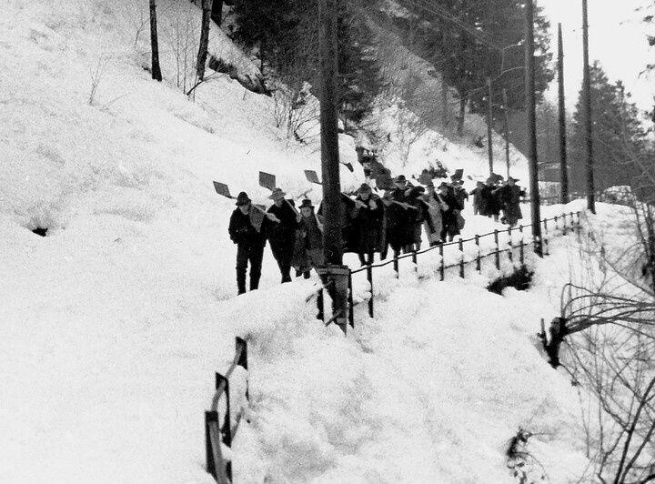
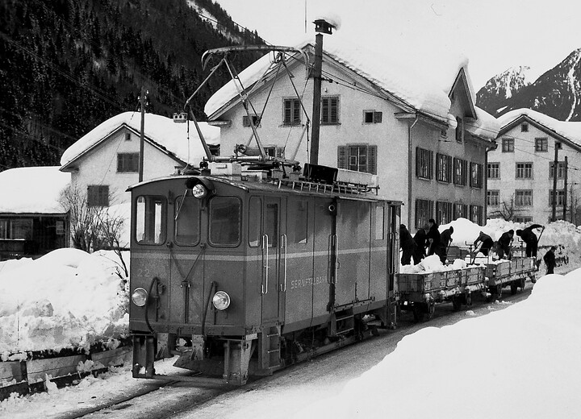
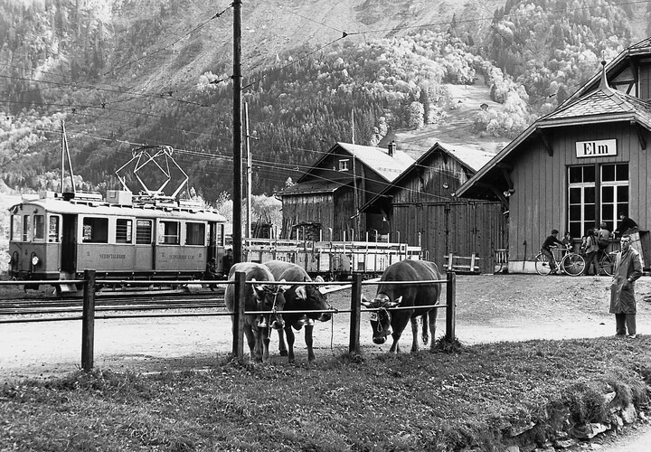



*Es erzählt Kaspar Marti-Marti, 1925-2005, Elm. Das Interview wurde am 11. November 2004 geführt.*

Ich wuchs in Engi auf. Nach der Schule hätte ich gerne einen Beruf
gelernt, aber das kam nicht in Frage. Weil ich, schon als Kind, bei
unserem Nachbarn Leonhard Däster im Stall mitgeholfen hatte und alle
Arbeiten kannte, wurde ich anfangs Krieg in Bauernbetriebe abbeordert,
wo wegen dem Aktivdienst der Mann fehlte. Ab 1941 arbeitete ich 7
Jahre beim Metzger Speich in Matt. 1948 war bei der Sernftalbahn eine
Stelle ausgeschrieben. Ich meldete mich, denn ich wollte etwas Rechtes
arbeiten, und eine Anstellung bei der STB galt fast als Ehre. Wir
waren zwei Bewerber, und so mussten wir eine kleine Prüfung ablegen.
Ich bekam die Stelle und wurde im Taglohn angestellt. Ich war eine Art
Mädchen für alles und arbeitete dort, wo ich gebraucht wurde.

1951, im Jahre meiner Heirat, wurde ich befördert und erhielt die
Stelle eines Vorstandes in Elm. Am Tage meiner Hochzeit fuhr uns
Heinrich Hämmerli, nach dem Nachtessen im «Bahnhöfli» in Engi, in
einem Bahnwagen nach Elm. Jetzt war ich fest angestellt, mit einem
Monatslohn von knapp 300 Franken. Zugleich bezog ich die
Vorstandswohnung im Bahnhof Elm. Die Aufgaben eines Vorstandes lernte
ich im Büro in Engi-Vorderdorf kennen. Der Wiier-Chueret, Konrad
Marti, machte mich damit vertraut. Einige Zeit konnte ich im Büro der
SBB in Schwanden mein Wissen vertiefen. Dann war ich in Elm auf mich
gestellt.

In gewisser Weise war man auf einem kleinen Bahnhof, wie Elm einer
war, auch Mädchen für alles. So gehörte die Ordnung rings um das
Stationsgebäude mit in mein Pflichtenheft. Ich wischte im Frühjahr den
Split zusammen, den ich im Winter ausgestreut hatte, Abfall und
Blätter im Sommer und Herbst. Im Winter hatte ich mit Schneeschaufeln
zu tun. Jeden Tag warf ich einen Blick ins WC, denn es lag mir daran,
dass es einigermassen sauber sei. Ich war mir nie zu gut, Kübel und
Putzlappen in die Hände zu nehmen. Einen Vormittag pro Woche stand
eine Putzfrau zur Verfügung.

Der erste Zug mit Anhänger fuhr schon 5.15 Uhr in Elm ab; er war
jeweils voller Thermaarbeiter. Mein Tag begann um 6 Uhr. Ich musste
jeden Tag mit dem zweiten Kurszug von Elm nach Schwanden fahren und um
8 Uhr wieder zurück. Mit dem alten Motorwagen fuhren immer ein
Wagenführer und ein Kondukteur mit; erst die neuen Wagen waren
Einmannwagen. Neben diesem in meinem Aufgabenbereich fest eingeplanten
Morgenkurs konnte es sein, dass ich in Notfällen den ganzen Tag in den
Fahrdienst eingeteilt wurde. Wenn z. B. durch Krankheit, freie Tage
oder Ferien zwei Elmer ausfielen, wurde ich eingesetzt. Der erste und
der letzte Kurszug fielen nämlich immer auf einen Elmer, damit kein
Matter oder Engeler am Morgen oder am Abend noch einen langen Weg
unter die Füsse nehmen musste. Dafür übernahm jeweils ein Engeler,
etwa Martin Bäbler, ab 8 Uhr meinen Stationsdienst.

War es im Winter lawinengefährlich, musste ich im Einmannwagen
mitfahren und bei den Lawinenzügen den Kopf durchs Fenster
hinausstrecken und angestrengt horchen, ob ein verdächtiges Geräusch
zu hören sei, das den Niedergang einer Lawine bedeuten konnte. Vor dem
Lawinenzug der Meissenbodenlaui hielten wir jeweils an, und ich
horchte hinaus.

Einmal schneite es, und dann begann es wie verrückt zu regnen. Es
rannen ganze Bäche zwischen den Schienen. Gegen Abend klarte es auf,
und man sah, dass es gefrieren würde. Das war immer eine besonders
gefährliche Situation, weil die Wagen dann leicht nebenaus fuhren. Da
erhielt ich die Anweisung, die ganze Nacht zwischen Schwanden und Elm
hin und her zu fahren, damit die Geleise nicht gefrören.

Gab es in einem Winter sehr viel Schnee, so wurde nur das Geleise frei
gehalten. Es wurde nur mit dem schmalen Schneeschlitten, dem Spitz,
gefahren. In Elm war dann nur das Geleise 1, unmittelbar beim Bahnhof,
frei. Dafür lag der Schnee auf dem anderen Geleise aufgetürmt. Hatte
eine Gruppe Schneeschaufler Zeit, kamen sie auch nach Elm, um das
Geleise zwei wieder freizuschaufeln. Sie mussten den Schnee auf offene
Wagen laden, und ich fuhr dann mit den beladenen Wagen und den
Arbeitern bis zur Kühbodenrunse. Dort wurde der Schnee in die Runse
geworfen, und ich musste während dieser Zeit als Wagenwache beim Wagen
bleiben. War die Meissenbodenlaui niedergegangen, musste ich die
Männer zum Schneeschaufeln hin- und hertransportieren.

An einem gewöhnlichen Tag kam ich also mit dem Achtuhrzug nach Elm
zurück. Dieser Zug brachte die Post und Güter für Engi-Hinterdorf,
Matt und Elm. Engi-Vorderdorf hatte einen speziellen Güterwagen. Ein
Postangestellter holte die Post, und ich begann mit dem Ausladen der
Güter. Die Leute, für die eine Sendung angekommen war, wurden
schriftlich avisiert, es sei etwas für sie am Bahnhof. Telefone gab es
ja noch ganz wenige. Leuten, die in der Nähe des Bahnhofs wohnten, gab
man während des Tages gelegentlich Bescheid. Anschliessend wurden die
Güter und Tiere, die vom Vortag für den Abtransport angemeldet waren,
eingeladen, denn um 10.15 Uhr fuhr der Güterzug ab, der von allen
Stationen die Güter mitnahm. Irgendwann dazwischen musste ich im
Winter im Büro und im Wartsaal einheizen. Wenn es ganz kalt war,
heizte ich im Winter im Büro vor der Abfahrt des Sechsuhrzuges ein,
denn ich wusste ja nie, wann ich Zeit zum Anfeuern finden würde.

Nach der Abfahrt des Güterzuges wäre für mich eine Pause fällig
gewesen, aber ich zog sie selten ein. Weil viel Vieh transportiert
wurde, war es oft sehr schmutzig, und so räumte ich in dieser Zeit die
Kuhfladen und anderes weg und schaffte wieder einigermassen Ordnung.
Schliesslich war es Zeit zum Mittagessen.

Es konnte sein, dass während dieser Zeit ein Elmer mit Kessel und
Karren kam. Ich hatte nämlich auch noch die Verkaufsstelle der Firma
Marti, Matt, zu bedienen. Etwas unterhalb des Bahnhofs stand, bis zur
Umstellung auf den Busbetrieb, der Zementschopf. Darin lagen
Zementsäcke und ein Fass mit Kalk. Die Elmer weissten ja ihre Küche
selber und brauchten immer wieder Kalk oder einen Sack Zement. Mit
diesen zwei Produkten musste ich sie bedienen. Die Firma Marti stellte
die Rechnung, und die STB erhielt einen Anteil am Ertrag.

Um 12.30 Uhr fing der Dienst wieder an. Der Halbeinuhrzug war für die
Einwohner der wichtigste Zug. Wer nach Glarus zu einem Spitalbesuch
oder einer Besorgung fuhr, nahm immer diesen Zug. Viele Billette
wurden da verkauft.

Am Nachmittag erledigte ich die Büroarbeit. Es gab viel mehr zu
schreiben, als man gemeinhin denkt, weil alle Güter durch die Bahn
befördert wurden. Nur ein Beispiel: Verkaufte ein Bauer eine Kuh,
wurde meistens noch etwas Zusätzliches ausbedungen. Der Verkäufer
brachte den Käufer dazu, ihm auf den Herbst hin einen Harass Äpfel zu
versprechen. Die Äpfel kamen in Elm an; der Empfänger kam mit einem
Karren und holte sie ab. Ein paar Tage später brachte er den leeren
Harass wieder zur Bahn, denn Leergut ging immer an den Absender
zurück. Wohnte der Absender in der Ostschweiz, so konnte es sein, dass
der Harass vier verschiedene Bahnen benutzte, die STB, die SBB, die
Südostbahn und die Bodensee- Toggenburgbahn. Beim Zurückschicken des
Harasses mussten ein Frachtschein und ein Abrechnungsformular
ausgestellt werden. Auf dem Abrechnungsformular wurden die Kilometer,
die der Harrass mit den verschiedenen Bahnen fuhr, sowie die Kosten
für jede Strecke eingetragen. Auf das Frachtgut wurde anfänglich ein
Zettel mit dem Bestimmungsort, später einer mit Bestimmungsort und
Nummer geklebt. Noch später gab es kleinere Frachtbriefe; einer wurde
an der Fracht befestigt, und die Kopie blieb bei mir zur späteren
Bearbeitung. Einmal pro Monat gingen alle Papiere an das
Rechnungszentrum der Südostbahn, das dann für alle Bahnen Rechnung
stellte. Die Abrechnung der Güter gab viel Arbeit. Während der
Schreibarbeiten wurde ich immer wieder von Leuten unterbrochen, die
etwas aufgeben wollten.

Die Abrechnung der Billette geschah nur einmal pro Monat. Ich musste
nur die auf der Station verkauften Billette abrechnen. Die Kondukteure
hatten ihre Billette selber abzurechnen. Im Personalzimmer stand eine
Kiste, in die sie die während den Fahrten eingesammelten Billette
hineinkippten. Von Zeit zu Zeit wurde die Kiste geleert und die
Billette wurden eingestampft.

Nach dem Krieg absolvierten oft Soldaten in Elm einen
Wiederholungskurs. Es konnten über hundert Mann sein. Alle rückten mit
der Bahn ein und fuhren auch mit der Bahn an Wochenenden in den
Urlaub. Der Fourier schickte mir zum Voraus eine Liste mit den Namen
und den Wohnorten der Soldaten. Bei der Sernftalbahn gab es ja nur für
wenige Ortschaften vorgedruckte Billette, nur für Gemeinden im Kanton
Glarus und für Zürich. Für alle anderen Ortschaften mussten die
Billette von Hand geschrieben werden. Die Soldaten kamen aus allen
Gegenden der Schweiz und wohnten in Ortschaften, deren Namen ich noch
nie gehört hatte. So musste ich an Hand von Kursbüchern herausfinden,
wo die Ortschaft sei. Ich musste die Umsteigeorte suchen und das Ganze
berechnen. Erst dann konnte ich das Billett ausfüllen. Da sass ich oft
nach dem Nachtessen nochmals ein, zwei Stunden auf dem Büro. Schon
beim Ausfüllen der Billette wurden die Nummer des Billetts und der
Preis in eine grosse Liste eingetragen. Diese Liste diente dem
Rechnungszentrum zur Kontrolle. Dazu kam noch ein Formular, in das,
bei Umsteigebilletten, der Strecken- und der Preisanteil eingetragen
wurden. Die grossen Formulare mussten jeden Monat, die Einzelformulare
nur alle vier Monate an das Rechnungszentrum der Südostbahn zur
Verrechnung eingesandt werden. Ich rechnete immer alles im Kopf
zusammen. Auf der Station Engi-Vorderdorf gab es eine Rechenmaschine,
bei der man, nach dem Eintippen der einzelnen Posten, eine Kurbel
drehen musste, um das Resultat zu erhalten. Später erhielt Engi eine
modernere Rechenmaschine, und die handbetriebene kam auf die Station
Elm. Ich benutzte sie aber nie, weil ich meinem Kopf mehr traute als
der Maschine!

Hie und da kamen Express-Sendungen, oder es wurden auch solche
versandt. In Elm gab Doktor Muhl hie und da eine Express-Sendung an
das Spital Glarus auf, z. B. eine Blutprobe, die dort untersucht
werden musste. Jede Express-Sendung musste mit dem nächsten Zug
transportiert werden. Die Express- Sendungen, die nach Elm kamen und
an Personen in der Nähe des Bahnhofes adressiert waren, wurden ihnen
durch mich gebracht. Die anderen wurden durch die Post erledigt. Kam
am Sonntag ein Express, war ich verpflichtet, diesen, wenn immer
möglich, dem Adressaten zuzustellen.

Im Herbst gab es viel Arbeit. Da waren die Viehschauen in den Dörfern,
auch in Elm. An diesem Tag trafen viele Viehhändler aus der Ostschweiz
ein, um Vieh einzukaufen. Fast jede verkaufte Kuh kam an einen anderen
Ort. Da musste ich neben der üblichen Arbeit des Ausstellens der
Formulare, neben dem Bestellen der Wagen und dem Einladen des Viehs
auch noch der Station Schwanden melden, wie viele Stück Vieh wohin
transportiert werden müssten. Meist hatten sie gar keine Freude an
mir, sie fluchten und waren ungehalten, wenn jede Kuh in eine andere
Himmelsrichtung reisen sollte. Und dann konnte es immer noch
geschehen, dass um 8 oder 9 Uhr abends einer angelaufen kam und sagte:
«Jetzt habe ich gerade heute nochmals eine Kuh verkaufen können. Ich
möchte sie morgen zur Bahn bringen.» Nochmals musste ich in Schwanden
anrufen, es komme dann noch eine mehr, sie sei nochmals an einen
anderen Ort zu transportieren. Da bekam ich aber etwas zu hören!

Der schlimmste Tag im Jahr war der Bremimärt[^1]. Von Elm wurden jeweils
100 bis 120 Kühe mit der STB nach Schwanden transportiert. Am Montag
vor dem Bremimärt waren von morgens 7 oder 8 Uhr bis nachmittags 14
Uhr drei Extrazüge zwischen Elm und Schwanden unablässig unterwegs. An
einen Motorwagen waren drei Güterwagen angehängt, in die man insgesamt
13 Stück Vieh einladen konnte; in zweien hatten je vier Stück Platz
und im dritten, der etwas grösser war, fünf Stück. Kaum war das Vieh
in Schwanden ausgeladen, kehrte die Zugskomposition wieder nach Elm
zurück. Es gab natürlich einen genauen Fahrplan, wo der normale
Kurszug und der Viehtransportzug zu kreuzen hatten.

Jeder Bauer meldete vorher bei mir an, wie viel Stück Vieh er bringen
werde. Ich war verpflichtet, die Viehwagen ganz zu füllen, damit
bestimmt alles Vieh nach Schwanden transportiert werden konnte. Wohl
wusste ich mit der Zeit aus Erfahrung, welcher Bauer sein Vieh früh
und welcher es lieber spät transportieren liess. Also stellte ich die
Transporte zusammen und meldete den Bauern, wann sie ihr Vieh bringen
sollten. Aber jedes Jahr hiess es von irgendeinem: «Das ist mir zu
früh» oder «In diesem Jahr will ich mit einem anderen Zug fahren.» Und
schon war mein schöner Plan wieder über den Haufen geworfen, und ich
konnte von neuem beginnen, zu schieben und zu rücken und zu
verhandeln. Es war zum Aus-der- Haut-Fahren. Aber irgendwie kamen
schlussendlich alle Kühe an den Bremimärt. Sie wurden nur bis
Schwanden mit der Bahn transportiert. Von dort aus liefen sie nach
Ennenda oder Glarus, wo die Bauern sie bei befreundeten Bauern
einstellen konnten. Am Dienstag, nach dem Bremimärt, kamen Bauern und
Kühe zu Fuss nach Elm. Sie trafen etwa um 6 Uhr in Elm ein, und die
Leute waren gespannt, zu sehen, welche Kuh einen Kranz auf der Stirne
trug.

Die Elmer Bauern verkauften auch oft Kälber oder Schweine an Metzger.
Diese Tiere brachten sie in einem Gatter zur Bahn. Im Güterschuppen
stand die Waage. Das Tier wurde zuerst im Gatter gewogen, dann wurde
das Tier herausgelassen und das Gatter separat gewogen. So wurde das
Lebendgewicht der Tiere festgestellt. Man wusste zwar, wie schwer ein
Gatter war, aber diese umständliche Methode des Wägens war nötig, weil
ein Gatter ja hätte nass sein können und so das Gewicht nach oben
gedrückt hätte. Das Tier musste jetzt wieder ins Gatter gebracht
werden. Das war vor allem bei Schweinen nicht leicht. Das Umherstöbern
in den Sachen, die sich im Güterschuppen befanden, gefiel den
Schweinen besser als ihr Aufenthalt im Gatter. Es brauchte allerhand,
bis sie wieder eingefangen waren. Der Besitzer des Tieres erhielt nach
der Prozedur einen amtlichen Wägschein, der das Lebendgewicht des
Tieres festhielt. Dieses Gewicht konnte vom Käufer nicht mehr
angefochten werden. Waren alle Tiere eingeladen, galt es, die
«Schweineordnung» im Güterschuppen zu beseitigen.

Anschliessend an den Schopf stand damals noch eine grosse Viehwaage
für Kühe. Sie war im Besitz der Viehversicherung. Es gehörte aber zu
meinen Aufgaben, die Kühe unter Mithilfe des Bauern zu wägen. Oft
musste man die Kuh zuerst beruhigen, um sie auf die Waage führen zu
können. Die Bahn erhielt von der Viehversicherung eine Entschädigung.

Die Landsgemeinde war für uns auch ein grosser Tag. Was Beine hatte,
fuhr in den Chriesi-Wagen an die Landsgemeinde. Die STB verdiente an
diesem Tag gut.

Für die Elmer war ihre Kilbi das grösste Fest im Jahr. Da fuhr fast
niemand weg. Alle gingen am Abend zum Tanz. Ich erinnere mich, dass
ich einmal an einer Kilbi Spätdienst hatte. Als ich um 10 Uhr nach
Hause kam, sagte ich zu meiner Frau: «Komm, wir wollen auch noch für
ein Stündchen an die Kilbi!» Wir schauten durch das ganze Dorf hinauf
in jede Wirtschaft hinein, fanden aber nirgends ein freies Plätzchen
zum Sitzen. Da kehrten wir wieder nach Hause zurück.

Im Winter war es ruhiger auf der Station. Was aber natürlich an jedem
Tag meines Dienstes zu meinen Aufgaben gehörte, war die Abfertigung
der Züge. Erst wenn ich die Erlaubnis zur Abfahrt gegeben hatte,
durfte der Kondukteur pfeifen und der Wagenführer losfahren. Jeder
Bähnler gab sich gewiss Mühe, seine Arbeit zuverlässig zu machen, so
auch ich. Aber manchmal konnte es trotzdem eine Verkettung von
Unachtsamkeiten geben. So geschah es auch in meiner
Vorstandstätigkeit. An einem Nachmittag brachten Thes Baumgartner und
Jakob Speich zwei offene Wagen, einen mit Heu und einen mit Stroh
beladen, nach Elm. Sie stellten die beiden Wagen aufs Stumpengeleise
und fuhren mit dem Motorwagen wieder nach vorne. Als die Zeit zur
Abfahrt nach Schwanden kam, gab ich die Erlaubnis zur Abfahrt. Jakob
Speich aber hatte vergessen, die Weiche umzustellen, und Thes
Baumgartner leitete die Fahrt ein. Gleichzeitig stöberte er noch nach
irgendetwas in seiner Bahntasche. Da bemerkte er zu spät, dass er auf
dem falschen Geleise fuhr. Er stiess gegen die abgestellten offenen
Wagen. Der Schaden war zwar klein, ein verbogener Puffer. Aber ich,
als verantwortlicher Vorstand, erhielt einen Verweis wegen
nachlässigerZugsabfertigung und musste drei Franken Busse zahlen.

Ein anderes Mal hätte es schlimmer ausgehen können. Damals waren auch
von Schwanden zwei offene Wagen Heu und Stroh gekommen. Ich stellte
den einen Wagen vor die Rampe, weil die Bauern jeweils jeden einzelnen
Ballen abwogen. Als der eine Wagen leer war, manövrierte ich ihn aufs
Stumpengeleise. Ich brachte den anderen offenen Wagen zur Rampe, damit
die Bauern weitermachen konnten, und stellte anschliessend den
Triebwagen vor dem Bahnhofgebäude zur nächsten Abfahrt bereit. Kaum
war ich dort, läutete das Telefon. Ich ging rasch ins Büro, denn
Telefonanrufe waren nicht zum Vergnügen da, sondern enthielten meist
eine dringende Mitteilung. Als ich wieder zum Stationsgebäude
hinaustrat, war der Motorwagen verschwunden. Ich spüre den Schrecken,
der mir damals in die Knochen fuhr, heute noch. Als ich sah, dass der
Triebwagen langsam weggerollt war, rannte ich los, und es gelang mir,
ihn zu stoppen, knapp, bevor er das Bord hinuntergerollt wäre. Ich
hatte, abgelenkt durch das Läuten des Telefons, vergessen, die Bremse
einzuschalten. Es war ein neuer Wagen, und der materielle Schaden wäre
sicher sehr gross gewesen. War ich froh, dass es so glimpflich
abgelaufen war!

Meine Präsenzzeit als Vorstand war wohl lange, von morgens um 6 Uhr
bis abends um 18.30 Uhr. Natürlich hätte ich meine Pausen dazwischen
einhalten können, aber ich war einfach da, wenn ich gebraucht wurde.
Ich konnte mir dafür auch ohne schlechtes Gewissen hie und da ein
Schwätzchen erlauben und hatte recht viele Freiheiten. Mir hat der
Umgang mit den Menschen gefallen, denn alle gehörten ja zusammen, und
einer achtete auf den anderen. Sogar als Wagenführer achtete man auf
das, was draussen passierte. Ich erinnere mich besonders gut an zwei
Begebenheiten.

Als ich noch bei Metzger Speich arbeitete, musste ich einmal im Winter
in Elm Gitzi holen. Ich zog den Hornschlitten mit einer
daraufgebundenen Kiste nach Elm. In Elm lud ich die Zicklein in die
Kiste und machte mich auf den Rückweg. Weil es ein schneereiches Jahr
war, waren nur die Schienen ausgepflügt. Im Meissenboden kam mir ein
Zug entgegen, ein Ausweichen gab es nicht. Der Wagenführer hielt an,
er und der Kondukteur stiegen aus, packten den Schlitten mitsamt den
Zicklein und hoben ihn aufs Schneebord hinauf. Dann fuhren sie mit dem
Zug ein Stück nach vorne, hielten an, liefen zurück und hoben meine
Fracht wieder herunter. Ich war erleichtert und froh um die Hilfe.

Einmal fuhr ich mit dem Einmannwagen Richtung Matt. Als ich in der
Nähe der Brücke in der Schwändi war, sah ich ein Mädchen mit dem Velo
gegen die Brücke fahren. Es wackelte unsicher auf seinem Fahrrad und
fuhr prompt in den Sernf hinunter. Es floss sehr viel Schmelzwasser im
Bach. Ich bremste, lief zum Bach und suchte eine Stelle, an der ich
hinuntergelangen konnte. Das Mädchen war glücklicherweise halb auf
einer Sandbank gelandet. Nur Beine und Unterkörper lagen im Wasser.
Rasch zog ich es ganz heraus. Das Mädchen hatte aber keinen Sinn für
die Gefahr, in der es geschwebt hatte. Es jammerte nur wegen seinem
Velo. «Das ziehe ich auch heraus», sagte ich und fischte nach dem
Velo. Zum Glück kam Oswald Rhyner von der Schwändi her. Er vollendete
die Rettung, damit ich mit dem Zug weiterfahren konnte. Der Vater des
Mädchens kam zu mir auf die Station, bedankte sich bei mir und
schenkte mir einen grossen Salami.

Mit der Umstellung auf den Busbetrieb fiel der ganze Güterverkehr weg.
Meine Arbeit veränderte sich stark. Alles wurde anders. Nur das
Zusammengehörigkeitsgefühl zwischen den ehemaligen Bähnlern ist noch
lebendig. Ich glaube, wir alten Bähnler sind in unseren Herzen immer
Bähnler geblieben und sind es auch heute im Alter noch. Die Zeit der
Sernftalbahn mit ihren Härten und Gefahren, aber auch mit dem Schönen
hat uns zu einer Schicksalsgemeinschaft zusammengeschweisst, die sich
nicht zerstören lässt.

[^1]: Der Bremimärt ist ein Prämierungsmarkt, eine Viehprämierung, die
    alljährlich an einem Dienstag Mitte Oktober auf dem Zaunplatz in
    Glarus stattfindet.


