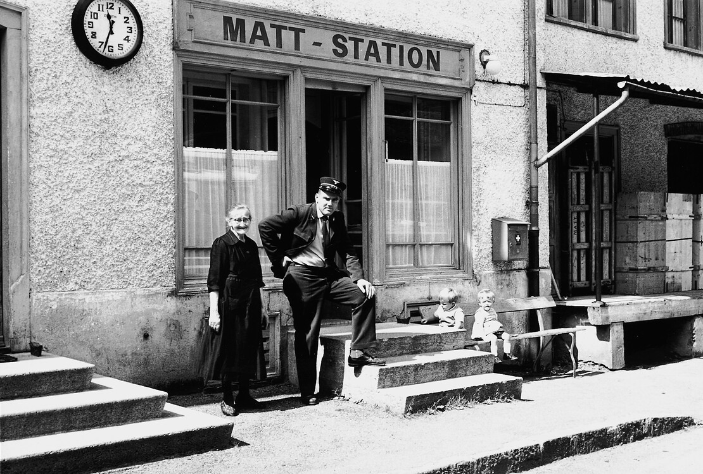
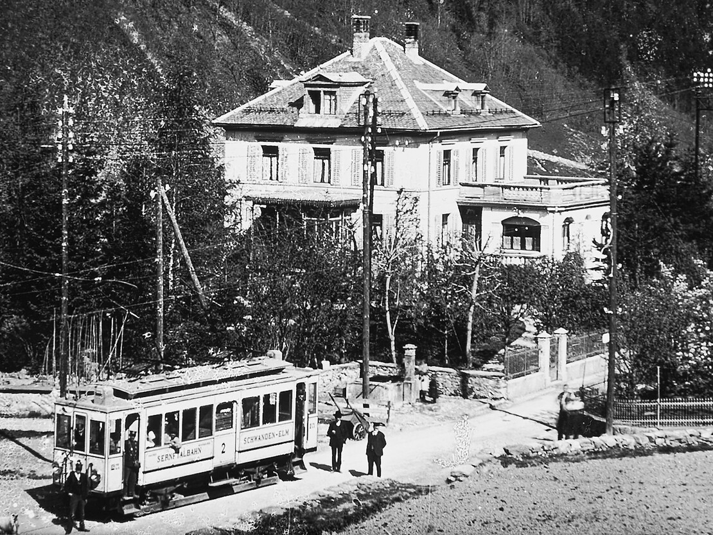



*Es erzählt Heinrich Elmer-Heer, \*1930, Mitlödi. Aufgeschrieben im September 2000.*

Matt-Staziu isch für üs Buebä ä intressantä Treffpungt gsi. Allimal,
wänn d'Bahn chu isch, het mä ettis erlebt. Der Chuerät isch
Staziusvorstand gsi. Ä Chappä mit ärä goldigä Nudlä dra isch sis
Marggäzeichä gsi.

Nüd wit vu dr Staziu heid mir däheimed ä chlinä Jelmoli ka. Fascht
alls, wo mä brucht het, hämer verchauft. So langs gi het natürli au ä
guetä Alpchäs us Bergli. I dener Zit, wos kä Alpchäs gi het, hämmer dä
Tilsiter, Ämmitaler oder Greierzer verchauft. Diä Chäs sind dä mit
üserem Bähndli vu ussä inä chu.

Sobald dä albigs derä Chäs vu der Bahn uf ä Rampä usglada wordä isch,
het der Chueret zu üs durä d'Armä verworfä we nä Räsigä. Dr Chäs het
er nämmli nüd mögä gschmöggä, und der wärem dä nie i Schuppä innä chu,
ä sonä Stinggchogä.

De besser Helfti vum Chueret het Bäbi gheissä. De zwei heid nüd nu
d'Staziu ka. Da isch im glichä Hus nuch ä Wirtschaft gsi, z'Gaschthus
«Elmer», und ä chlä purnet isch ä nuch wordä. Drum isch es dä halt
että vorchu, as ds Büro, wo mä d'Bilet glöst het, lär gsi isch. Dä het
mä chänne hindä im Wartsaal durnä Tür usä. Schu isch mä im Husgang
gstandä, links isch Gaschtstubä gsi und rechts ä waggeri Chuchi.

«Ich sött nuch es Bilet ha», het mä dä grüeft. Wänn si dä dr Chueret
nienä bliggä lu het, isch z'Bäbi us dr Chuchi oder us dr Gaschtstubä
usä chu. «Wit nuch fort? Wohi muesch? Mosch dängg nuch ettis gu holä?»
Wäred dem Frag- und Antwort-Spili isch z'Bähndli igfarä. «Etz mos i
aber usä, sust fared diä nuch uni mich ab». «Du chundsch nuch kand, de
fared erscht ab, wenn ich usä gu.» Eim nachä isch dä z'Bäbi usä chu,
het hinderä und füräglueget und g'seit: «Äs isch nüt mi, ihr chänted
dä farä.»

Für üs Buebä isch am Morged dr Brotzeltä mit Anggä und Hung druf das
Bescht vu dr Matterchilbi gsi. Aber derna het immer einä ä mi oder
weniger guetä Gedanggäblitz ka, as ettis laufi.

Uf eimal het einä ämal ä Chäpslirevolver ka und es Schächteli voll
derä Chäpslirölleli. De Rölleli het mä im Revolver igspannet, und
jedesmal, wä mä abdruggt het, hets ä sones Chäpsli vertätscht. Klepft
hets, ä chlä grochä und gstunggä derzue. Etz hämmer dängt, mi chännt
mit üserem Chlitalbähndli und ämä sonä Rölleli äs Chilbischüssä machä.
Bi ds Spältys Brunnä undä hämmer es Rölleli ganz abgrollet und uf
Bahnschinä gleit. Am Afang und am Ändi hämmer ä chliners Steindli druf
tue. So, etzä ab hinderä Brunnä, bis z'Zügli chunnt. Wo es dä chu
isch, simmer hinderäm Brunnä ufgstandä, zum luegä, wies tschätteret,
klepft und grochä het, äs isch ä wahri Freud gsi. Vornä im Füererstand
het dr Wagäfüerer und hindä dr Kunditör gfuschtet wie letz. Augä heid
bed gmacht we Guttäräbödä. Z'Bähndli isch aber gliich langsam witer
gfarä, wes chu isch. Mir heid ä umäri Freud ka a dem Chilbistreichli.
Hüt chäm ja wahrschindli Polizii.


