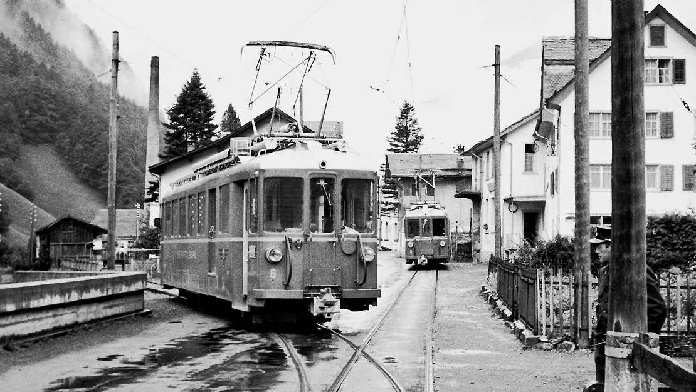



*Es erzählt Fritz Vögeli-Marti, \*1933, Jona. Das Interview wurde am 22. Mai 2004 geführt.*

Unsere Familie wohnte in der Mühle, gegenüber dem Gasthaus «Sonne».
Dort befand sich auch die Haltestelle Engi-Hinterdorf der
Sernftalbahn. Kein Wunder, dass die Bahn in meiner Kindheit und in
meinem Leben eine grosse Rolle spielte! Die Faszination durch die Bahn
wurde durch meinen Grossvater und meinen Vater, beides begeisterte
Hobby-Eisenbähnler, verstärkt. In unserem und in des Grossvaters Haus
stand je eine Hobby-Eisenbahn. Zudem arbeitete der Vetter Thes bei der
Sernftalbahn. So fiel meine Berufswahl fast automatisch auf den
Bubentraum Lokomotivführer, und das blieb ich auch bis zu meiner
Pensionierung.

In meiner Kinderzeit gab die Sernftalbahn den Rhythmus des Tages an.
Wann immer ein Zug fällig war und wir nicht in der Schule sassen,
waren wir Kinder in der Nähe. Wir schauten, wer aus- und einstieg und
welcher Wagenführer und Kondukteur im Zug waren. Wurden Güter auf die
Rampe ausgeladen, gingen wir etwas näher heran, um zu erkunden, was es
sein könnte. Sogar am Abend, wenn wir schon im Hause bleiben mussten,
konnte die Ankunft eines Zuges nicht unbemerkt bleiben. Wir besassen
nämlich ein Radio, vor dem mein Vater oft des Abends sass, um sich
eine Sendung anzuhören. Nahte ein Zug, so «chnotzerte» es dermassen im
Radio, dass man kein Wort mehr verstand und sogar der Vater über die
Bahn ungehalten wurde.

Es gab auch besondere und wiederkehrende, interessante Ereignisse. Das
Ein- und Ausladen von Vieh anlässlich der Viehmärkte war jeweils für
uns Kinder das reinste Fest. Besonders gefiel es uns, wenn ein Stück
Vieh einfach nicht die Rampe hochlaufen wollte. Die verschiedenen,
nicht immer zarten Versuche der Bahnangestellten, das «Viech» in den
Wagen zu kriegen, interessierten und belustigten uns.

Wir wussten auch, wer am Morgen chronisch in letzter Minute oder zu
spät kam. Dazu gehörte meine Tante Edith. Je nach Wagenführer wurde
für sie bei der Weberei Hinterdorf ein Spezialhalt eingelegt. Dieses
Ereignis wurde prompt zu Hause rapportiert.

Unvergesslich bleibt mir, wie der Vetter Thes einmal mit einem
Leerwagen von Elm nach Engi fahren musste und mich in Engi-Hinterdorf
fragte, ob ich mitfahren wolle. Und ob ich wollte! Ich durfte ganz
vorne im Wagenführerstand stehen und konnte durch das Fenster direkt
auf die Geleise sehen. In Engi-Vorderdorf hatte Vetter Thes Pause und
musste später mit einem anderen Zug wieder nach Elm fahren. Wieder
durfte ich bis Engi-Hinterdorf mitfahren und mich zuvorderst
hinstellen. Nichts entging meinen Blicken. Ich war begeistert und habe
diese Fahrt nie vergessen.

Unauslöschlich bleibt mir auch der 12. Januar 1954 in Erinnerung.
Der 12. Januar ist mein Geburtstag, aber nicht nur meiner. Einer
meiner Klassenkameraden, der Hugeten-Chueret, hatte auch an diesem Tag
Geburtstag. Geburtstage wurden bei uns in der Regel nicht gross
gefeiert, aber 1954 hatten Chueret und ich etwas Grosses vor. Wir
wollten nach der Arbeit miteinander im Restaurant «Sonne» unseren
Geburtstag begiessen. Chueret arbeitete bei der Sernftalbahn, und
deshalb wollte er nach Arbeitsschluss mit der Bahn bis ins Hinterdorf
fahren, wo ich auf ihn warten sollte. Ich wartete und wartete, aber
Chueret kam nicht. Am Abend zuvor, am 11. Januar, war nämlich in der
Warth ein Lawinenunglück geschehen. Fünf Bahnangestellte, die mit
Schneeräumarbeiten beschäftigt waren, waren von einer Staublawine
überrascht und verschüttet worden. Chueret war unter den
Verschütteten. Zum Glück konnten alle gerettet werden, aber Chueret
vergass über dem Unglück unsere Geburtstagsfeier. So war es auch
dieses eine Mal nichts mit Feiern.

Für uns Buben war das Stumpengeleise in Engi-Hinterdorf ein wichtiger
Spielplatz. Dort durften wir nicht nur zuschauen, sondern konnten mit
gut Glück aktiv Bähnler spielen. Das Stumpengeleise führte vom
Hauptgeleise, auf der Seite unseres Hauses, Richtung Engi-Vorderdorf
weg. Es war ziemlich lang und hatte am Ende einen Prellbock. Das
Stumpengeleise war so lang, weil es auch zum Rangieren diente. Mussten
zwei Züge in Engi-Hinterdorf kreuzen, so fuhr der Zug, der zuerst in
Engi-Hinterdorf ankam, ins Stumpengeleise hinaus. Dort wartete er, bis
der Zug aus der Gegenrichtung angekommen und abgefertigt war. Dann
konnte er aufs Hauptgeleise zurückfahren und seine Fahrt fortsetzen.
Während dieses Manövers musste die Weiche viermal umgestellt werden.
Im Normalfall stellte der Kondukteur die Weichen. Wir Buben standen
nahe dabei und wussten genau, wie man die Weiche umstellen musste. Nun
konnte es aber bei der letzten Fahrt, um 20.30 Uhr, sein, dass nur ein
Einmannwagen im Einsatz war. Der Wagenführer musste dann, um die
Weiche umzustellen, jedesmal den Wagen verlassen und zur Weiche
laufen. Je nach Wagenführer konnte es geschehen, dass einer der
grösseren Knaben die Weiche umstellen durfte. Das war für uns das
höchste der Gefühle. Der Auserkorene stand unter uns Knaben in hohem
Ansehen.

Hie und da standen auf dem Stumpengeleise leere Güter- oder
Kohlenwagen. Die Kohle für die Weberei Hinterdorf wurde mit der Bahn
gebracht. Der Chauffeur Heiri kam dann mit dem Lastwagen der Weberei
und zwei bis drei Männern. Diese schaufelten die Kohle aufs Auto,
fuhren zur Fabrik, entluden die Kohle in den Keller, kamen wieder und
wiederholten die gleiche Arbeit, bis die Kohlenwagen entleert waren.
Danach blieben die leeren Kohlenwagen auf dem Stumpengeleise stehen.
Das war unsere grosse Zeit! Obschon das Stumpengeleise relativ flach
war, hatten wir Buben doch gemerkt, dass, bei gelöster Bremse, die
Wagen ein paar Meter von selbst fuhren und dann still standen. So
vergewisserten wir uns zuerst, ob der Vorstand Martin Baumgartner im
Büro sei oder nicht. Er hatte nämlich nicht den ganzen Tag Dienst,
sondern ging zwischen der Ankunft von zwei Zügen oft nach Hause. War
er nirgends in Sicht, lösten wir die Bremsen und schoben die Wagen mit
vereinter Kraft bis zum Prellbock. Einer von uns musste auf den Wagen
bleiben und, sobald wir die Wagen bis zum Prellbock geschoben hatten,
die Bremse anziehen. Dann stiegen wir alle auf den Wagen, die Bremse
wurde gelöst – und los ging die paar Meter Fahrt. Dann begann alles
wieder von vorne. Wir merkten vor Begeisterung und Eifer oft nicht,
dass der Vorstand in der Zwischenzeit aufgetaucht war. Er ermahnte
uns, dieses Spiel zu unterlassen. Aber er war kein böser oder grober
Mensch und verstand wahrscheinlich unsere Begeisterung. Mir ist ein
bleibendes Andenken an diese wunderbaren Fahrten mit den Kohlenwagen
geblieben, eine Narbe am Hinterkopf. Wahrscheinlich war ich damals der
Kleinste unter den Buben. Ich muss nahe bei der Bremse gestanden
haben. Beim Lösen der Bremse musste man den Bremsschwirbel mit der
Hand festhalten. Entglitt er einem, so drehte er sich mit grosser
Geschwindigkeit von selbst. Das passierte eines Tages. Da traf mich
der Schwirbel am Kopf, schlug mir eine Wunde, und die Narbe ist mir
geblieben. Schliesslich gab es dann andere Bremsen, bei denen der
Schwirbel entfernt werden konnte. Der Vorstand nahm den Bremshebel von
da an mit aufs Büro, und die ganze Herrlichkeit war dahin.

Es blieb uns aber noch anderes. Hie und da legten wir einen roten
Räppler auf die Schiene, um zu erproben, wie er nach der
Zugsdurchfahrt aussehe. Wir freuten uns an der neuen, zerquetschten
Form, die er angenommen hatte.


