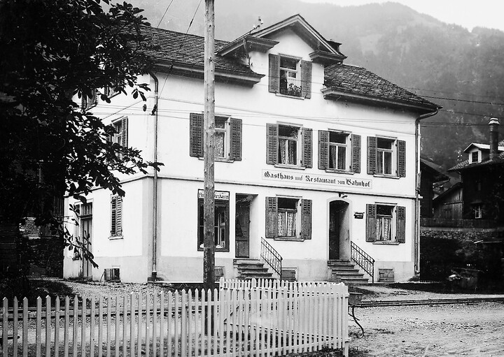



*Es erzählt Hildi (Hildegard) Blumer-Lötscher, \*1929, Engi. Das Interview wurde am 19. Oktober 2004 geführt.*

Für den Wagenführer und den Kondukteur gab es in Elm, Engi oder
Schwanden oft eine längere Wartezeit, bis der nächste Kurs zu fahren
war. In Schwanden bestand ein kleiner Raum in der ehemaligen
Dependance des Hotels «Bahnhof», in dem sich die Bähnler aufhalten
konnten. Dieses Zimmer war aber schlecht heizbar und deshalb gerade
dann, wenn man es gebraucht hätte, unbrauchbar; im Sommer konnte man
ja schliesslich draussen warten. So pflegten die Bähnler, vorab bei
kaltem Wetter, während der Wartezeit eine Wirtschaft aufzusuchen und
einen Kaffee oder Most zu trinken. Diese Wirtschaften lagen in der
Nähe der Bahnhöfe. In Elm und in Engi war es das «Bahnhöfli», in
Schwanden die «Krone». Der Wirt des «Bahnhöflis» in Elm betätigte sich
nebenbei als Coiffeur. War die Wartezeit bis zur Abfahrt des Zuges
lange genug, so konnte man sich bei ihm gleich die Haare schneiden
lassen. Die drei Wirtschaften erfüllten eine wichtige Funktion im
Alltag des Bahnpersonals.

Hildegard Blumer war Serviertochter im « Bahnhöfli» in Engi. Sie
erzählte folgendes:

Ich kam durch einen Zufall nach Engi. Wir führten zu Hause in Pratval
im Domleschg auch eine Wirtschaft. Als die spätere Wirtin des
«Bahnhöflis» Engi, Didi, noch jung war und mit Nachnamen Marti hiess,
arbeitete sie bei uns als Serviertochter. Ich war damals noch ein
Kind. Didi verheiratete sich, wurde Frau Freitag und Wirtin im
«Bahnhöfli» in Engi. Ich wuchs heran, machte ein Lehre, arbeitete und
überlegte mir, ob ich nicht im Welschland eine Stelle suchen solle, um
richtig Französisch zu lernen. Da rief Didi Freitag an, es sei in der
Klemme, ob ich ihm nicht für zwei Monate aushelfen könnte, in dieser
Zeit würde es dann eine neue Hilfe suchen. Ich war damals zu Hause,
weil meine Mutter krank gewesen war. So passte es mir, nach der
Krankheit der Mutter und vor der Suche nach einer Stelle im Welschland
zwei Monate in Engi zu servieren.

Ich fuhr am 2. Januar 1951 zum ersten Mal in meinem Leben nach Engi.
In diesem Winter hatte es viel Schnee. Als ich mit der STB Richtung
Warth und Engi fuhr, wurde es mir recht unheimlich zu Mute. Links
stieg es steil an, und rechts fiel es steil hinunter, bis zum Sernf,
und gleich ging es wieder steil gegen den Freiberg hinauf. «Wo sollen
denn da Menschen leben können?», fragte ich mich. Auf der Höfliegg
atmete ich auf; das Tal wurde weiter. Am Bahnhof Engi erwartete mich
das Didi – und schon waren wir im «Bahnhöfli». Aber auch hier schien
es mir recht merkwürdig. Sollten die wenigen Häuser das ganze Dorf
sein? Schaute ich zum Fenster hinaus, trafen meine Blicke wieder auf
eine steile Bergflanke. Es kam mir alles hart und eng vor. «Hier
bleibe ich nicht lange», dachte ich, «wenn mich mein Vater sähe, würde
er mich gewiss gleich wieder nach Hause nehmen.» – Und jetzt bin ich
immer noch hier!

Ich bezog mein Zimmer und wollte früh zu Bett gehen, denn von der
Reise und den neuen Eindrücken war ich müde. Zudem hatte ich ja zu
Hause über das Alt- und das Neujahr durchgearbeitet. Ich hörte aber,
dass unten Betrieb war, und plötzlich wurde ich nach unten gerufen.
Die Wirtschaft war voller Männer in dunkeln Kitteln, es war ja der
Berchtelistag, also ein halber Sonntag. An einen solchen Anblick war
ich mich nicht gewohnt; es kam mir merkwürdig und düster vor. Es
brauchte einige Momente, bis ich merkte, dass da mancher ein Bähnler
in seiner Uniform war. Sie pflegten am 2. Januar im «Bahnhöfli» auf
ein gutes, neues Jahr miteinander anzustossen. So sah ich all die
Gesichter an einem Abend, von denen ich in der Folge jeden Tag das
eine oder das andere sehen sollte. Bähnler und Bahn waren mir gar
nicht vertraut, lag doch bei uns zu Hause der Bahnhof eine halbe
Stunde vom Dorf entfernt. Hier war der Bahnhof ganz nahe, die Weiche
fast vor der Gasthaustüre, und Bähnler in Uniformen gingen im «
Bahnhöfli» aus und ein. Mit der Zeit lernte ich sie besser kennen, und
die verschiedenen Charaktere wurden mir vertraut wie der Bahnmeister
Heiri Hämmerli, dr Allmei-Frigg, ds Schiferdeggers Thes und viele
andere. Ich lernte sie schätzen. Ich sah auch, wie streng sie arbeiten
mussten und wie vor allem im Winter ihre Arbeitsstunden nicht gezählt
wurden. Oft kam der eine oder der andere nach der Arbeit noch auf
einen Sprung ins «Bahnhöfli», meist auf das Wochenende hin. Der eine
trank einen Most, der andere ein Zweierli. Sie plauderten miteinander,
und nach einer Weile nahmen sie den Weg nach Hause unter die Füsse.

Über den Winter assen Jakob Rhyner und oft auch seine beiden Töchter
im «Bahnhöfli». Der Weg nach Hause in den Kummenberg war über die
Mittagszeit im Winter nicht zu bewältigen. Die Gäste bekamen einfach
vom gleichen Essen, das Didi für die Familie gekocht hatte. Didi
kochte gut und reichlich, damit es für eventuelle Gäste auch noch
genug zu essen gehabt hätte. Es hatte jeden Tag eine währschafte Suppe
bereit, manchmal auch Teigwaren, die es nur abbräteln musste, oder
gesottene Kartoffeln, die es rasch verarbeiten konnte. Es konnte
richtig gute Kost auftischen: Speck und Bohnen, Kartoffelsalat mit
Wienerli, gute Suppe mit Schüblig und Brot oder Wähen.

Wollten mehrere Personen im «Bahnhöfli» essen, musste das Essen
bestellt werden. Das konnte im Winter der Fall sein. War viel Schnee
gefallen, so wurden alle Männer zusammengetrommelt, die verfügbar
waren, um die Geleise vom Schnee zu befreien. Manche Männer kamen von
weit her und konnten unmöglich über die Mittagszeit nach Hause, um zu
essen, und wieder zur Arbeit zurückkehren. Für diese wurde im
«Bahnhöfli» das Essen bestellt. Der Chef Blumer oder der Wiier-Chueret
meldeten die Anzahl der Mittagsgäste. Einmal vergassen die beiden ihre
Männer anzumelden. Plötzlich wurde die Türe aufgestossen, und eine
Gruppe von Schneeschöpfern verlangte zu Mittag zu essen. Wir waren
überrumpelt, aber Didi beeilte sich, so gut es konnte. Aber selbst
eine Suppe zu wärmen und Schüblige heiss machen braucht seine Zeit. So
zog sich die Mittagszeit über das gewöhnliche Mass in die Länge.
Plötzlich erschien der Chef Mathias Blumer. Es war ihm anzumerken,
dass er ungehalten war, und er gab dem auch Ausdruck. Wahrscheinlich
nahm er an, die Arbeiter würden die Mittagspause extra lange
ausdehnen, um nicht arbeiten zu müssen. Da nahm ich allen Mut zusammen
und sagte dem Chef, dass die Arbeiter nicht schuld seien, wir hätten
keine Meldung erhalten. Da glättete sich seine Miene, und das
Mittagessen konnte in aller Ruhe eingenommen werden.

Es gab noch einen anderen ständigen Kontakt zwischen den Bähnlern und
dem «Bahnhöfli». Die Fleischwaren kamen mit der Bahn von der Metzgerei
Kern in Ennenda. Beim Kauf des «Bahnhöflis» durch Jakob Freitag hatte
dieser mit dem Haus die Verpflichtung übernommen, die Fleischwaren vom
Verkäufer der Liegenschaft, Metzger Kern, zu beziehen. Die
Fleischwaren wurden telefonisch, zwei- bis dreimal pro Woche, durch
Didi bestellt. Manchmal wurde auch für Drittpersonen Fleisch bestellt,
vor allem für Leute, die in der Nähe des Bahnhofs oder im Höfli
wohnten. Ich war erstaunt zu hören, wie im Glarnerland noch Euter
bestellt wurde. Es kamen auch sonst hie und da Leute, die etwas aus
unserer Bestellung kaufen wollten. War die Bestellung gemacht, so
konnte man annehmen, dass der Korb mit dem Fleisch im Laufe des Tages
in Engi ankam. Genau mit welchem Zug das Fleisch zu erwarten war, war
ungewiss. Wir mussten uns aber nie sorgen. War etwa das Bahnbüro
geschlossen, so hatte sich sicher einer der diensttuenden Bähnler der
Sendung angenommen und sie an einen sicheren Ort gestellt. Wenn ich
dann zum Bahnhof kam, so hiess es, mein Korb stehe dort und dort. Das
fand ich immer wunderbar. Damals sorgten sich die Leute umeinander.
Sie sagten nicht: «Das geht mich nichts an, mögen die Hunde das
Fleisch fressen!» Nein, jeder war um das Gut des anderen besorgt. –
Ich trug dann den Korb in den ehemaligen Verkaufsladen der Metzgerei,
die zum «Bahnhöfli» gehört hatte, packte alles aus und legte es an
seinen Platz. Didi verkaufte auch hie und da Käse, denn es besorgte
sich von der Alp in Elm, auf der seine Brüder Sentenbauern waren,
ganze Käselaibe.

Feriengäste, die die Bahn benutzten, gab es nicht allzu viele. Im
Winter hatten wir hie und da Skifahrer, die im «Bahnhöfli» einkehrten,
um auf die Abfahrt des Zuges zu warten. Oft kehrten Vertreter bei uns
ein.

Natürlich hatten wir auch Gäste aus dem Dorf, meist Männer. Die Frauen
gingen selten in eine Wirtschaft. Ausnahmen waren
Vereinshauptversammlungen oder Feste, etwa die Kilbi, die Älplerkilbi
oder der Bremimärt. Da wurde im «Bahnhöfli» der Teppich zurückgerollt,
das Grammophon aufgezogen und getanzt. Tanz gab es aber auch nach Lust
und Laune, sobald ein paar Paare anwesend waren, die Lust zum Tanzen
hatten.

Nach den mit Didi vereinbarten zwei Monaten hatte ich mich in Engi
schon gut eingelebt. Der Lohn und das Trinkgeld stimmten für mich; so
entschloss ich mich, noch länger im «Bahnhöfli» zu bleiben. Didi, die
Wirtin, war mit mir wie eine Mutter; an das Dorf hatte ich mich auch
gewöhnt. Der Blick zum Gufelstock hinauf mit den braunen Häusern
gefiel mir besonders gut und auch das Haus, in dem ich jetzt wohne.
Ich hatte in Engi bei meinen Botengängen viele Menschen kennen und
schätzen gelernt.

In Engi lernte ich meinen Mann, Mathias Blumer, kennen. Sobald ich als
seine feste «Liebste» galt, gaben mir die Leute kein Trinkgeld mehr.
Sie sagten jedesmal: «Das Trinkgeld kann dir dann der Rüti-This
bezahlen.» Da aber das Trinkgeld Teil meines Lohnes war, entschloss
ich mich, das «Bahnhöfli» zu verlassen und bis zur Heirat noch andere
Arbeit zu suchen. Mit Didi Freitag aber, die fast 90 Jahre alt wurde,
blieb ich bis zu ihrem Tode herzlich verbunden.

Wegen der Nähe des Restaurants «Bahnhöfli» zum Bahnhof Engi-Vorderdorf
und dem Vorbeifahren der Züge waren mir die Geräusche der Sernftalbahn
bald vertraut. Sie wurde mir mit der Zeit recht lieb, und so war ich
denn auch betrübt, als ihr Ende kam und sie durch Busse ersetzt werden
sollte. Am 24. Mai 1969, am Tag, als die Bahn zum letzten Mal fuhr,
konnte ich nicht dabei sein. Just an diesem Tag brachte ich nämlich im
Kantonsspital Glarus meine jüngste Tochter, Sibylle, zur Welt.
Vergessen habe ich die Sernftalbahn nie.


