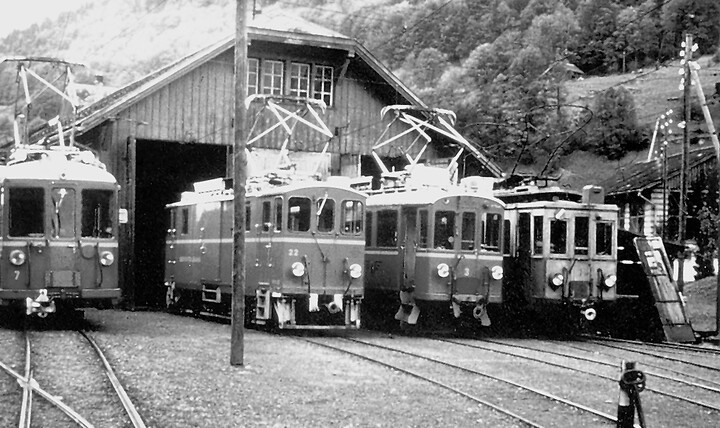
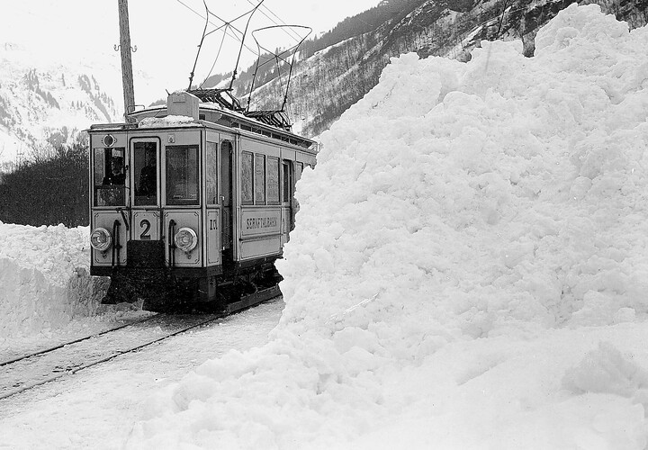



*Es erzählt Fritz Rhyner-Baumgartner, 1922-2013, Engi. Das Interview wurde am 18. September 2000 geführt.*

Ich bin in Elm geboren und aufgewachsen. Meine Mutter gebar 15 Kinder,
zwei davon starben. Es war auch noch ein Kind aus erster Ehe da, denn
die erste Frau meines Vaters war an der Geburt des ersten Kindes
gestorben. Ich habe zwei Geburtsdaten. Der damalige Zivilstandsbeamte
war zugleich Vorstand auf der Station Elm. Vielleicht sagte mein Vater
am Sonntag beim Lösen eines Billetts, er habe dann wieder ein Kind
mehr und der Zivilstandsbeamte solle es eintragen. Da schrieb der
Zivilstandsbeamte Sonntag, den 10. Dezember, ein.

Vorerst spielte das keine Rolle. Als ich in die Schule kam, sagte
meine Mutter: «Du bist am Samstag, den 9. Dezember, geboren, morgens
um 4 Uhr.» Ich glaubte es der Mutter, denn sie musste es ja
schliesslich wissen. Im Dienstbüchlein stand dann wieder der 10.
Dezember 1922. Ich aber blieb beim neunten und zahlte auch auf dieses
Datum die AHV ein. Als ich zur SBB wechselte, wurde mir gesagt, ich
müsste den 10. Dezember als Geburtsdatum angeben, sonst könnte es
Schwierigkeiten geben. So tat ich es, aber für mich stimmt es eben
nicht ganz.

Ich besuchte zuerst die landwirtschaftliche Winterschule in Glarus,
denn ich sollte Bauer werden. Aber auf der Post in Elm arbeitete ein
junges Mädchen, Leni. Zwischen diesem Mädchen und mir begannen sich
zarte Fäden zu spinnen. Ich wusste, wenn ich dieses Mädchen heiraten
möchte, kann ich nicht Bauer werden, denn es hatte mir gesagt: «Du,
ich gebe keine Bauernfrau.» Dazu kam noch, dass damals mein Bruder
Gäng, der auf der Alp Camperdun Käse machte, im Frühjahr das
Schlüsselbein brach. Da musste ich plötzlich einspringen und den
ganzen Sommer über auf der Alp käsen. Das konnte ich zwar wohl und
machte es nicht ungern, aber ich konnte Leni den ganzen Sommer über
nicht sehen. Da wusste ich, dass ich eine andere Arbeit suchen musste,
wollte ich Leni behalten.

Als ich im Herbst wieder von Camperdun ins Tal kam, wurde von der STB
einer für das Maschinenhaus gesucht. Ich meldete mich, aber es meldete
sich auch noch ein zweiter, Fritz Blumer, der Sonnenwirt. Dieser
erhielt die Stelle. Aber nicht lange danach war ich an einem
Schiessanlass in Hätzingen. Da kam der Chef Blumer zu mir und sagte,
sie brauchten noch einen Mann für den Fahrdienst an der STB. Zuerst
dachte ich: «Kannst du das wohl?» Ich war ans Melken, Heuen, Rechen,
Misten gewöhnt und hatte keine andere Tätigkeit gelernt. Aber ich
sagte zu und trat den Dienst etwas unsicher und schüchtern an. Ich
wurde aber gut aufgenommen, denn schliesslich arbeiteten ja mein
Bruder Schaagg und mein Verwandter Thes bei der STB. Nun wurde ich in
die Mange genommen. Zuerst musste ich mit dem Höfli-Läri Wagen
reinigen. Das fand ich im Nachhinein sehr gut, denn so wurde ich mit
den Wagen vertraut und lernte jeden Winkel der verschiedenen Wagen
kennen. Läri erklärte und erzählte mir auch vieles. Dabei hatte er die
Gewohnheit, mir bei Wichtigem mit dem Finger auf die Brust zu klopfen.
Er hatte einen sehr harten Finger, und oft tat es mir weh, so sehr
pochte er gegen meine Brust.

Dann lernte ich, einen Motorwagen vor das Depot hinauszustellen.
Zuerst war natürlich immer einer neben mir. Dann konnte ich allein vor
das Depot hinausfahren oder gar den Motorwagen auf ein anderes Geleise
manövrieren. Eines Tages hiess es, ich müsse einen Motorwagen aus dem
Depot hinausfahren. Da wartete draussen der Chef und sagte: «So, jetzt
fahren wir nach Schwanden!» Zum Glück kam es mir in den Sinn, dass ja
ein Zug von Schwanden nach Engi unterwegs war. Ich sagte es zum Chef,
und schon hatte ich einen Punkt gewonnen. Der Chef sagte: «Sehr gut.»

So fuhren wir los, nachdem der Zug eingetroffen war. Ich musste zuerst
über die Weiche hinausfahren, die Weichen umstellen, die beiden Hebel
von hinten nach vorne nehmen, aufsetzen, die Weiche wieder
zurückstellen, und dann erst ging es nach Schwanden. Ich fuhr, wie ich
es gelernt hatte, und mit der Zeit setzte sich der Chef nach hinten.
Im Stock rief er plötzlich: «Stopp, ein Stein liegt auf dem Geleise.»
Es stimmte zwar nicht, aber ich stoppte trotzdem. Der Chef war mit mir
zufrieden, weil ich so gut reagiert hatte. Von da an wurde ich überall
auf der Strecke eingesetzt. Zuerst war immer noch ein Wagenführer bei
mir. Es waren damals noch die Alten dabei, etwa der Paul Disch aus der
Schwändi, der Schang Bäbler, genannt «dr chli Bäbler», und der Heiri
Bäbler, genannt «dr grooss Bäbler». Der kleine Bäbler war sehr am Mond
und an den Sternen interessiert und wusste viel darüber zu berichten.
Am meisten fuhr ich mit Paul Disch.

Ich kann mich noch gut erinnern, wie ich eines Tages mit Paul Disch
von Schwanden nach Matt fuhr. Als wir in Matt bei der Station standen,
kam eine grosse Schafherde von Elm her. Wir mussten warten, bis sie
vorbeigezogen war. Ein Schaf lief zwischen den Geleisen und mir
schien, dass es noch vor dem Motorwagen sein müsste. Der Kondukteur
pfiff zur Abfahrt, aber ich blieb stehen. Da wurde Paul Disch
ungehalten und fuhr mich an, weil ich nicht sofort losfuhr. Ich
getraute mich kaum, mich zu wehren, aber wenn ein Schaf überfahren
worden wäre, hätte es mir leid getan. Item, wir stiegen aus, und da
stand ein kleines Schaf auf dem Chassispitz. Ich war heilfroh, dass
ich mich gewehrt hatte.

Schwieriger war es, als ich Kondukteur lernen musste, denn früher war
man ja eher schüchtern. Heiri Bäbler war dort der Chef und lief hinter
mir her; er war sehr exakt. Damals gab es die Kilometerkarten. Das war
ein braunes Büchlein mit etwa zehn Blättern. Auf jedem Blatt waren
hundert Kilometer, rund um das Blatt standen die Zahlen von eins bis
hundert. Nun musste man von einer Station zur anderen die
Kilometerzahl wissen und dann die abgefahrene Zahl der Kilometer auf
der Karte mit der Zange entwerten. Durch die vielen «Halt auf
Verlangen» und dadurch, dass ein Teil der Kilometer meist schon
entwertet waren, gab es eine grosse Rechnerei. Anfänglich hatte ich
immer Angst, ich würde mich verrechnen.

Die Billette, die unterwegs gelöst wurden, mussten abgerechnet werden.
Wir hatten einen Block, auf dem wir die Billette im Doppel ausfüllten;
das Doppel behielten wir zur Abrechnung. Ganz früher hatten die
Kondukteure noch Messingrollen, aus denen sie die unterwegs gelösten
Billette je nach Betrag herausziehen konnten.

Mein Dienst während der 23 Jahre im Fahrdienst der STB begann jeweils
morgens um 5.40 Uhr. Ich musste den Zug bereit stellen und 5.50 Uhr
nach Elm fahren. Das war eine Leerfahrt. Dann musste ich von Elm aus
zwei Touren fahren. Um 8 Uhr hatte ich Pause, und um 10.30 Uhr musste
ich mit der Arbeit wieder beginnen. Dann fuhr ich die Strecke Engi–
Schwanden–Elm–Engi, und von 13 Uhr bis 14.30 Uhr hatte ich wieder eine
Unterbrechung; anschliessend arbeitete ich bis 19 Uhr.

Ich hatte dann noch eine andere Tour, nicht im Fahrdienst, sondern als
Kondukteur. Da kam einer von Elm her mit dem ersten Zug allein bis
Engi. Ich stieg dann in Engi erst als Kondukteur zu. Als Kondukteur
musste ich ab 9 Uhr jeweils auf den Stationen auch Güter ein- oder
ausladen. Diese Tour war weniger unterbrochen, und so war ich jeweils
um 17.30 Uhr mit der Arbeit fertig.

Ich hatte auch die Viehtransporte gern, denn ich war an Tiere gewöhnt.
Oft hatte es recht viele Tiere. Am ersten Zuger Stierenmarkt gab es
oft um 100 Stiere aus dem Kleintal. Es gab noch einen zweiten Zuger
Stierenmarkt, da hatte es weniger Tiere, und dann war noch der
Rapperswilermarkt, der auch mit rund 80 Tieren beschickt wurde. Diese
drei Märkte fanden im Oktober statt. Später gab es nur noch einen
Zuger Stierenmarkt. Im November war der Sarganser Stierenmarkt. Und
natürlich war im Oktober der Bremimärt.

Viele führten das Vieh noch zu Fuss nach Glarus und zurück. Aber die
Sernftalbahn hatte Hochbetrieb; ein Wagen nach dem anderen fuhr, mit
Vieh angefüllt, nach Schwanden. Auf dem Heimweg kamen mehr Bauern mit
dem Vieh zu Fuss, damit man auch die Kränze sehen und bewundern
konnte.

Beim Einladen gab es oft «Kumedi», wenn eine Kuh nicht einsteigen
wollte; einer musste ziehen und einer stossen. Manchmal hatte eine Kuh
vom Laufen auch Durchfall, und man wurde vollgeschissen. Zum Glück gab
es die blauen Überhemden, die man sich zu dieser Arbeit überzog.

Die gewöhnlichen Viehtransporte machte man auf dem Zehnuhrzug ab Elm.
Vom Herbst bis gegen das Frühjahr gab es fast jeden Tag irgendein
Stück Vieh zu transportieren, sei es als Schlachtvieh oder zum
Verkauf.

Schweine gab es auch oft. Zum Glück waren diese in Gattern
eingesperrt. Einmal waren Schaagg und Oes Rhyner mit dem Zug
unterwegs. Als sie in Matt etwas zuladen mussten und die Türe zum
Viehwagen öffneten, entwich ein Schwein, das aus dem Gatter
freigekommen war. Da mussten die beiden das Schwein zuerst wieder
einfangen, bevor sie weiterfahren konnten, und der Zug erreichte
Schwanden mit Verspätung.

Einmal mussten wir ein Pferd einladen; die Sentenbauern «lechneten»[^1]
meist ein Pferd für die Alp. Das war eben ein solches Pferd. Wir
hatten eine einachsige Rampe, die wir an der Schiene des Viehwagens
einhängen konnten. War sie eingehängt, waren die Räder nicht mehr ganz
auf dem Boden. Das war nötig, damit die Rampe nicht aushängte. Die
Vorrichtung war sehr sicher; es hatte auch links und rechts ein
Geländer. Ich selber hatte immer etwas Angst vor den Pferden, aber ich
führte das Pferd zur Rampe. Es blieb vor der Rampe stehen. Wir
probierten alles. Wir warfen ihm eine Bluse über den Kopf, gaben ihm
Zucker und einer, der Trainsoldat gewesen war, führte es herum, redete
ihm zu und brachte es wieder zur Rampe. Nichts half, das Pferd ging
nicht die Rampe hinauf. Unter den Zuschauern war auch einer aus dem
Grosstal, der Traktor fahren lernte. Der rauchte eine Zigarette – wir
hatten dem Pferd eine Schlaufe um den Hintern gezogen, damit es nicht
mehr ausweichen konnte. Ich sagte zu dem Burschen, er solle dem Pferd
die Zigarette auf den Hintern drücken. Gesagt, getan. Das Pferd machte
einen Satz nach vorne, und weil niemand sich dessen versah, vergass
der Mann, der vorne den Zügel hielt, diesen nach unten zu ziehen,
damit das Pferd in den Viehwagen hineinkomme. Das Pferd krachte mit
seinem Kopf gegen den oberen Balken des Türeingangs, sodass es den
ganzen Wagen erschütterte. Es stand bolzsaitengerade zuoberst auf der
Rampe, drehte sich seitwärts, setzte zum Sprung über das Geländer an,
blieb mit einem Fuss im Geländer hangen, konnte sich losreissen und
landete wieder auf der Strasse. Zuerst blieb es liegen; dann stand es
wieder auf. Die Bähnler sagten: «Wir müssen losfahren. Jemand soll das
Pferd zu Fuss ins Kleintal bringen.» Sie banden das Pferd in Schwanden
fest. Am Nachmittag hatte ds Chämifegers This aus dem Knie Dienst. Er
schaute, dass ein Viehwagen beim Schuppen stand. Da hatte es jeweils
nur einen kurzen Steg, der von der Rampe des Schuppens zum Eingang des
Wagens gelegt wurde, damit man mit den Gütern auf dem Rolli
hineinfahren konnte. This nahm das Pferd, führte es von der
Hinterseite des Schuppens die Rampe hinauf, durch den Schuppen
hindurch und stracks, über den kurzen Steg, in den Viehwagen hinein.
Alle staunten.

Es gab auch besondere Ereignisse, lustige und schwierige. Da arbeitete
bei der STB auch der Chäpp Zentner; ein lustiger «Chaib» war das. Er
ging später zur Südostbahn. Da war doch das junge Warth Griti. Chäpp
sagte: «Wir halten in der Warth nicht. Wir nehmen das Griti mit, bis
nach Elm. Es kann ja dann wieder mit uns zurückfahren.» Chäpp machte
auch manchmal eine Fahrt, die in keinem Fahrplan stand. Chäpp war kein
böser, einfach vergaucht. Wir waren eine Zeit lang überhaupt eine
lustige Clique. Der Oes war damals dabei, und der Speich war da, der
hatte zuerst in der Werkstatt die Lehre gemacht und kam später zum
Fahrdienst. Wir hielten zusammen und hatten eine gute, schöne Zeit.
Überhaupt war das ganze Sernftal für uns wie eine grosse Familie. Ich
kannte alle Leute von Hintersteinibach bis in die Höfliegg. Nur die
Weissberger sah man weniger, und dort hatte ich hie und da Mühe zu
merken, welcher es war, ob der «Stiigäberger» oder der «Wieneggler».
Später kannte ich sie besser, weil der Vater auf Riseten und der
Krauchtalalp Sentenbauer war.

Im Winter war es nicht immer schön, aber wir waren noch jung, und wir
empfanden es nicht als schlimm. Für die Älteren war es sicher
schlimmer. Ich kann mich noch gut erinnern. Es war an einem Sonntag im
Winter 1968. Wir hatten schon die roten Wagen, seit der
Landsgemeinde 1949. In diesen Wagen war schon der Einmannbetrieb
eingeführt. Es war ein trüber Tag, ich fuhr mit dem Elfuhrzug. Es
waren etwa drei Ferienhäusler und vier Einheimische im Zug. Von der
Warth an nahm der Schnee plötzlich zu. Trockener Schnee rieselte
unentwegt herunter. Es war, wie wenn vom Lauizug her der Schnee gegen
den Zug fliessen würde. In der Mitte des Stocks lag der Schnee
beängstigend hoch auf den Geleisen. Ich dachte:
«Herrgottschternänuchämal, was soll ich jetzt machen?» Ich hielt an.
Wir hatten immer mindestens eine Schaufel und ein Hebeisen im
Postabteil, und im Winter waren meist noch drei Schneeschaufeln dabei.
Nun halfen alle mit, das Geleise vom Schnee etwas frei zu schaufeln.
Hatten wir ein Stück geschafft, fuhr ich wieder weiter, soweit es
ging, dann stiegen wir wieder aus und schaufelten wieder ein Stück
frei. So gelangten wir bis in den Bühl. Dort kam der Sepp mit dem
Lastwagen und dem Schneepflug. Er winkte uns, wir sollten warten, bis
er den Schienenübergang über die Strasse frei gepflügt habe. So kamen
wir sicher über die Strasse bis zur Station Engi-Vorderdorf. Der Chef
riss das Fenster auf und sagte: «Jä, sind er da?» Wir sagten: «Ja,
ja.» Man war damals in vielen Situationen auf sich selber gestellt und
konnte niemanden fragen, was jetzt gemacht werden solle. Man musste
ganz allein entscheiden und die Verantwortung tragen. Weiter hinten,
nach Engi, war es dann besser; es lag weniger Schnee.

Einmal, auch an einem Sonntag, war in Ennenda ein Schützenfest oder
ein Jubiläumsschiessen. Ich fuhr mit dem ersten Zug nach Schwanden. Da
lagen dort, wo jetzt die Galerien beginnen, Steine auf der Strasse.
Ich stieg aus und rollte die Steine von den Schienen weg und sah, dass
es von oben immer noch bröselte, und ich hörte auch das Geräusch von
fallenden Steinen. Ich musste entscheiden, ob ich langsam oder rasch
fahren müsste. Ich fuhr zuerst vorsichtig und dann rasch aus dem
Gefahrengebiet hinaus. Von Schwanden aus rief ich auf der Station Engi
an und sagte, dass ich möglicherweise nicht mehr nach Engi fahren
könne, denn im Brand kämen Steine nach unten. Aber beide, die Dienst
hatten, wollten auch an das Schützenfest und nahmen meine Botschaft
nicht so tragisch. Also fuhr ich von Schwanden wieder los. Als ich bei
der «Schwilse»[^2] Richtung Engi schaute, sah ich im Stock eine grosse
Staubwolke. Ich wusste, dass das lockere Gestein jetzt nach unten
gekommen war. Ich rief von der Warth aus wieder an. «Jä nu», sagten
sie, «dann schicken wir jemanden.» Ich fuhr so weit nach hinten, wie
es möglich war, und wartete, bis Hilfe kam. Die Strasse und die
Geleise waren zugeschüttet, ungefähr so hoch wie das Geländer. Ich
konnte nicht weiter nach hinten fahren. Zuerst wurde jeweils das
Trassee der Bahn freigelegt und erst dann die übrige Strasse. Das
Material wurde einfach über das Bord hinuntergeworfen.

Wahrscheinlich war es auch im 1968er-Winter, da gab es sehr viel
Schnee. Manchmal war ja von der Höfliegg bis zur Warth eine Lawine
nach der anderen niedergegangen. Damals war das Sernftal geschlossen,
und man wusste fast nicht mehr, wie wehren. Da kamen sie vom Militär,
von Andermatt, mit einer riesigen Schneeräummaschine; eine schwere
Maschine war das. Es war ein Instruktor dabei, der Schlichters Sämi
instruierte. Ich musste mit dem Vieruhrzug nach hinten fahren, der
Aeschner, der damals Streckenwärter war, war noch dabei. Die Strecke
war noch nicht frei. Bis zur Warth konnte ich fahren; dann mussten die
Leute über die Lawinen steigen und mit einem anderen Zug weiterfahren.
Im Laufe des Nachmittags kamen sie mit drei oder vier Mann von hinten,
mit der grossen Maschine. Wir kamen von unten mit dem Zug um die Kurve
vor der Warth. Das grosse Fahrzeug fuhr beim Sternen um die Kurve.
Plötzlich drehte sich das Fahrzeug quer zur Strasse und rutschte ganz
langsam über die Mauer ins Bord hinunter. Es hatte unglaublich viel
Schnee, und so rutschte das Fahrzeug geradeaus hinunter, bis es im
Schnee stecken blieb. Die Männer hatten das Fahrzeug noch verlassen
können. Es kam dann ein riesiger Kran. In der Nacht musste die
Oberleitung entfernt werden, damit der Kran die Maschine hochheben
konnte. Die Maschine wurde auf einen speziellen Strassentransportwagen
verladen und zur Kontrolle in die Militärwerkstatt abtransportiert.
Weshalb das Ganze passierte, weiss ich nicht.

Im Winter wurde auch Holz gereistet. Das war nicht ungefährlich. Die
Wagenführer gaben jeweils frühzeitig das Pfeifsignal, dann wussten die
Holzer, dass sie keine Stämme mehr reisten durften. Aber manchmal
dachten sie auch: «Für einen reicht es noch.» Einmal sah ich, dass
noch ein Trämmel hinuntersauste. Ich fuhr ganz langsam näher. Der
Baumstamm landete auf der Oberleitung und drehte sich dort wie ein
Kreisel, dann fiel er auf die Strasse. Ich dachte schon, die
Oberleitung sei wahrscheinlich kaputt. Die Holzer kamen und entfernten
den Stamm von den Geleisen, und, oh Wunder, ich konnte ohne Störung
weiterfahren. Niemand war dem anderen böse, das Leben war halt so.

Ich hänge bis zum heutigen Tag an der Sernftalbahn. Mich reut es noch
immer, dass sie aufgegeben wurde. Es ist nichts besser geworden, und
es hätte sicher eine Lösung gegeben, die Bahn zu behalten. Heute wäre
sie eine Attraktion. Die Bahn war menschlicher.

[^1]: Lechnen = in Pacht nehmen, zum Gebrauch mieten.

[^2]: Kurve nach dem Soolsträssli Richtung Warth, beim Bächlein.


