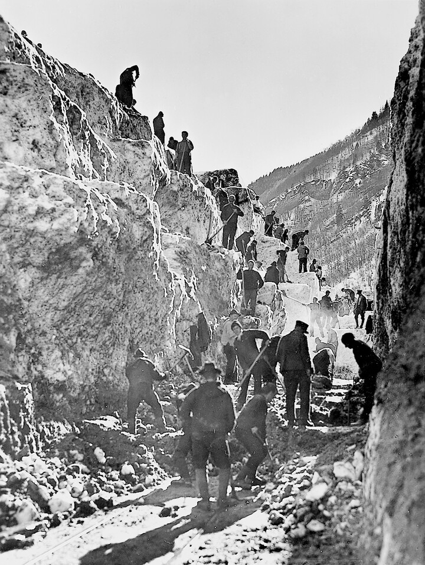
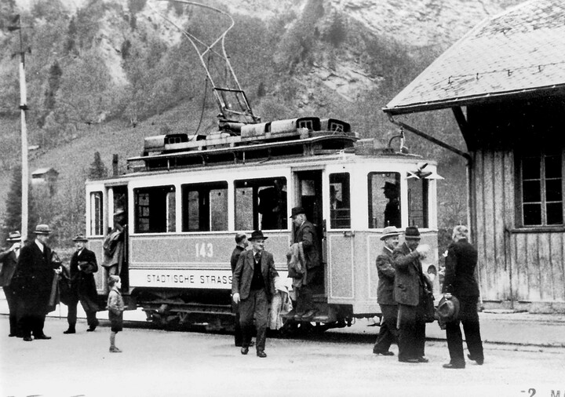



*Es erzählt Oswald Rhyner-Rhyner, \*1916, Elm. Das Interview wurde am 26. Oktober 2004 geführt.*

Mein erster Arbeitstag bei der Sernftalbahn war der 21. Januar 1937.
Da kurz zuvor der Wagenführer Jakob Bäbler und der Kondukteur Hans
Elmer, beide von Elm, verstorben waren, meldete ich mich auf Wunsch
meines Grossvaters im Sulzbach auf eine der freien Stellen. Der Wunsch
meines Grossvaters war verständlich, galt doch eine Stelle bei der
Sernftalbahn in den unsicheren Dreissigerjahren als sicher. Für die
offenen zwei Stellen meldeten sich damals 72 Männer. Ich hatte das
nötige Glück. Ich wurde zusammen mit Jakob Rhyner, ebenfalls von Elm,
für die eine der zwei freien Stellen ausgewählt.

Schaagg Rhyner und ich wurden miteinander in unsere Arbeit eingeführt,
ich als Kondukteur und Schaagg als Wagenführer. Unser Lehrmeister war
Thes Baumgartner. Er nahm uns sehr gut auf und bemühte sich, uns in
alles genau einzuführen. Überhaupt wurden wir von den meist älteren
Bahnangestellten sofort akzeptiert. Ebenso gute Aufnahme und grossen
Respekt erhielten wir vom Betriebsleiter Jakob Störi und vom Depotchef
Konrad Blumer.

Natürlich waren mit dem Beruf auch Gefahren verbunden, vor allem im
Winter. Gingen Lawinen nieder, mussten sie von Hand ausgeschaufelt
werden. Das brauchte seine Zeit, denn es gab noch keine
Schleudermaschine. Ich erinnere mich, dass im Winter 34/35 die
Meissenbodenlaui und die Chüebodenlaui niedergingen. Bis sie
ausgeschaufelt waren, brauchte es zwei bis drei Wochen. Natürlich
musste alles, was nach Elm geschickt wurde, über die Lawinenzüge
hinübergetragen werden, die Post und alles andere. Aber niemand
jammerte darüber oder dachte: «Ach, sind wir doch benachteiligt, das
Sernftal abgeschlossen, und wir müssen unter schwierigen Bedingungen
arbeiten!» Man war gelassen, nahm es als naturgegeben hin und machte
seine Arbeit wie immer, vielleicht sogar mit besonderem Elan. Es ist
ja verwunderlich, dass in all den Jahren mit den vielen
Lawinenniedergängen nie ein Mensch ums Leben gekommen ist.

Kleine Unfälle gab es natürlich hie und da. Einmal im Winter, Schang
Bäbler und ich hatten Fahrdienst, fuhr uns in der Weriweid ein
Motorwagen neben das Geleise hinaus. Auf dem Geleise hatte sich Eis
gebildet, und der Motorwagen fuhr darauf auf. Zum Glück war die
Geschwindigkeit der Sernftalbahn nicht so gross, dass ein grosses
Unglück hätte passieren können, aber die Fahrt war zu Ende. Die
Streckenarbeiter kamen, hoben den Motorwagen mit der Seilwinde hoch,
bockten ihn auf und verschoben ihn leicht. Den gleichen Vorgang
wiederholten sie, bis der Wagen wieder auf die Schienen passte. Diese
Arbeit hatten die Streckenarbeiter los. Natürlich brauchten sie dazu
länger als eine halbe Stunde.

Eines Sonntags schneite es, was der Himmel hergeben mochte. Wir fuhren
von Schwanden nach Elm. Gabriel Streiff, der im Depot in Schwanden
arbeitete, musste an diesem Sonntag den Wagenführer ablösen. Im
Meissenboden hatte es so viel Schnee, dass der Zug nicht mehr
weiterfahren konnte. Wir griffen zu den Schaufeln und befreiten das
Geleise ein paar Meter weit. Dann fuhr Gabriel die paar Meter, stieg
wieder aus, und wir schaufelten wieder ein Stück weit. So waren wir
bis in die Schwändi gelangt, als uns von Elm her die Kirchgänger
entgegenkamen. Da sagte der Gabriel: «Was haben wir denn verbrochen,
dass wir an einem Sonntag so schwer arbeiten müssen?» Mit der Zeit
erreichten wir trotz allem den Bahnhof Elm.

Der Winter 1938/39 war ein milder Winter mit wenig Schnee. Im Februar
1939 musste ich nach Pontresina zu einem Hochgebirgskurs einrücken.
Am 13. März begann meine Arbeit bei der Sernftalbahn wieder. An diesem
Tag begann es plötzlich zu schneien. Schaagg Rhyner und ich hatten den
18.30-Uhr-Kurs von Elm nach Schwanden zu fahren. Bei der Rigigasse, in
Engi, blieben wir stecken. Wir kamen wegen der Menge des Schnees nicht
mehr weiter. Einer von uns ging, um dies auf der Station Engi zu
melden. Der damalige Depotchef, Konrad Blumer, kam uns mit einem
Motorwagen entgegen, in der Absicht, diesen an unserem Zug anzukoppeln
und so mit doppelter Kraft trotz des Schnees vorwärts zu kommen. Aber
auch dieser Motorwagen blieb stecken. Wir konnten einander zwar sehen,
aber nicht zueinander kommen. Ein Versuch, mit Hilfe von
Schneeschauflern und italienischen Arbeitern den Weg freizubekommen,
scheiterte am vielen Schnee. Die Italiener waren sich nicht gewohnt,
im Schneegestöber zu arbeiten. Sie konnten kaum atmen und mussten sich
mit der Hand Mund und Nase bedecken. Wir gaben jeden Versuch auf und
liessen die Wagen auf der Strecke stehen. Schaagg und ich konnten
nicht nach Elm zurückkehren. Wir mussten in der «Sonne» übernachten,
und zwar, infolge Platzmangels, beide im gleichen Bett. Wir waren noch
jung und nahmen es mit Humor. Die Strasse von Schwanden nach Elm
musste von Hand ausgeschaufelt werden. Damals starb der Däster6. Zur
Beerdigung musste er auf einem Hornschlitten von Engi nach Matt
gebracht werden. Zur gleichen Zeit starb in Braunwald Anton Marti von
Matt. Seine Leiche wurde per Bahn nach Engi gebracht und von da an mit
dem Schlitten nach Matt.

Ende August, anfangs September 1939 begann der Zweite Weltkrieg.
Obschon man wusste, dass sich irgendetwas zusammenbraute, war der
Kriegsbeginn doch überraschend. Es fiel einem wie ein schwerer Stein
auf die Seele. Für uns war es ein Hangen und Bangen. Manchmal glaubten
wir, wir würden vom Krieg verschont, und dann gab es wieder Zeiten, in
denen wir fürchteten, die Schweiz würde auch angegriffen. All die
Jahre lebten wir in einer bedrückten Atmosphäre. Die Bahnangestellten
mussten sieben Tage nach der allgemeinen Mobilmachung einrücken, denn
zuerst musste ja der Truppentransport garantiert sein. Dazu mussten
die Einberufungen gestaffelt vor sich gehen, damit der Bahnbetrieb
jederzeit funktionierte. Ich wurde immer wieder einmal einberufen und
musste Militärdienst leisten. Die älteren Bähnler, die 192er, wurden
oft für heikle Bewachungsaufgaben einberufen, nach Davos etwa oder zur
Generalwache. Für die Bahnen, auch für die Sernftalbahn, trat der
Kriegsfahrplan in Kraft; es fuhren viel weniger Züge. Ich erinnere
mich aus einem bestimmten Grund daran, dass ich und der Schaagg von 2
Uhr bis 5 Uhr in Schwanden Pause hatten, denn für drei Stunden galt
der Kriegsfahrplan. Es war ein schöner Tag, und Schaagg und ich
setzten uns im Tschachen an das Bahnbord. Nun hatte ein Mann jedem von
uns einen Stumpen geschenkt. Auf einmal sagte Schaagg: «Komm, wir
rauchen die Stumpen, wir haben ja Zeit!» Es war das erste und das
letzte Mal, dass ich rauchte, so sterbensübel wurde mir! – Die
Kriegsfahrpläne blieben nicht immer gleich, sie änderten je nach
politischer Lage. Am 6. Mai 1945 war Kriegsende. Alle atmeten befreit
auf und freuten sich. Erst jetzt merkten wir, wie bedrückend und
düster die Kriegszeit auch für uns gewesen war.

Mich betraf auch die Geschichte mit dem Züritram auf besondere Weise.
Eines Winters, als im Stock eine Lawine niedergegangen war, wurde ein
Züritram nach Schwanden gebracht, das den Verkehr zwischen der Lawine
und Schwanden garantierte. Von Engi her fuhr ein Motorwagen bis zur
Lawine und wieder zurück. Die Lawine musste zu Fuss überquert werden.
So wurde der Verkehr ins Sernftal aufrechterhalten. Ich hatte eines
Tages das Züritram bis zur Lawine gefahren und es dort abgestellt. Wie
gewohnt zog ich die Handbremse an und schaltete die elektrische Bremse
ein; zusätzlich legte ich den aus Holz bestehenden Radhemmschuh unter.
Der Betriebsleiter Mathias Blumer war auch anwesend und fragte mich,
ob ich recht gebremst habe. Ich sagte, ich hätte alles gemacht. Ich
fuhr dann nach Elm. Als ich am Nachmittag wieder zur Arbeit ging,
hörte ich, dass sich das Tram selbständig gemacht habe und ganz allein
nach Schwanden gefahren sei. Dank der elektrischen Bremse konnte es
das ja nur ruckweise tun, fahren, aufladen, fahren, aufladen usw. Die
Thermaarbeiter staunten nicht schlecht, als sie ein Tram ohne
Zugführer anzockeln sahen. Ein Thermaarbeiter stieg ins Tram ein und
zog die Handbremse an; so blieb es stehen. Es gab eine Untersuchung,
die zum Schluss kam, dass sich zwischen den Bremsklötzen und den
Rädern Schnee angesammelt hätte, der dann durch die beim Fahren
entstehende Wärme geschmolzen sei und dadurch die Bremswirkung
aufgehoben habe. Ich erhielt einen Verweis, und eine Busse von 10
Franken wurde mir auferlegt. Damit war ich nicht einverstanden, denn
ich hatte alles, was gemacht werden musste, getan. Laut Reglement
hätte nämlich ein auf der Strecke abgestellter Wagen bewacht werden
müssen; das war nicht geschehen. Aus diesen Gründen wurde mir die
Hälfte der Busse erlassen. Ich liess es dabei bewenden. Ich war ja
immerhin froh, dass das Tram, das sich selbständig gemacht hatte, kein
Unglück hervorgerufen hatte.

Nach dem Zweiten Weltkrieg änderte sich die Einstellung zum
Arbeitsplatz auf allen Arbeitsgebieten. Lange hatte der Wert einer
sicheren Arbeitsstelle im Vordergrund gestanden, und die Höhe des
Lohnes kam erst an zweiter Stelle. Nun trat die Diskussion um die Höhe
der Löhne in den Vordergrund. Auch die meisten der Angestellten der
Sernftalbahn traten der Gewerkschaft VHTL bei. Sie forderten und
erhielten etwas mehr Lohn. Ich wurde damals Präsident der Sektion
Sernftal der Gewerkschaft.

1950 sah ich mich nach einer anderen Stelle um. Einerseits reizte es
mich, noch ein anderes Arbeitsgebiet auszuprobieren. Andererseits war
ich ein begeisterter Schütze und nahm an der Schweizer
Gruppenmeisterschaft teil. Diese Leidenschaft verlangte immer wieder
die Teilnahme an Trainingswochenenden. Als Bähnler kam ich dadurch in
Konflikt mit meiner Fahrdienstzeit, die ja den Sonntag mit einschloss.
So sagte ich mir, dass eine andere Arbeitsstelle diesen Konflikt aus
der Welt schaffen würde. Die Zeit bei der Sernftalbahn ist mir aber in
guter Erinnerung geblieben. Ich möchte sie nicht missen.
