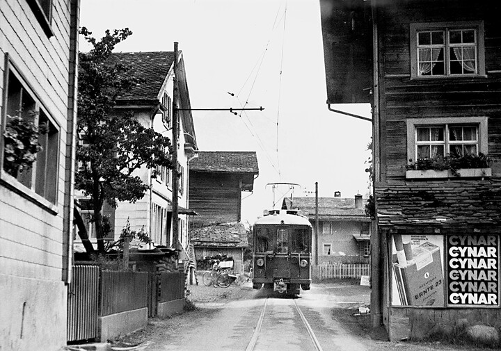



*Es erzählt Ursula Sigrist-Stauffacher, \*1930, Linthal. Das Interview wurde im April 2000 geführt.*

Die Sernftalbahn gehörte zu meiner Jugend. Sie fuhr ganz nahe an
unserem Haus vorbei, sozusagen mitten durch die Stube hindurch. Auch
die Haltestelle Matt-Dorf war bei unserem Nachbarhaus, bei «ds Beggä».
Wir betrachteten sie als «unsere Bahn».

Wollte der Vater einmal nach Glarus und war mit dem Umkleiden etwas im
Rückstand, so musste eines von uns zwei Mädchen nach unten rennen und
dem Kondukteur sagen, der Vater komme dann auch noch. Ich machte es
zwar sehr ungerne, aber der Kondukteur wartete mit «Abpfeifen», bis
mein Vater zum Türloch hinaushastete.

Später, als ich in der Lehre war, konnte es auch sein, dass ich am
Morgen spät dran war. Der Kondukteur Thes Baumgartner stellte sich
jeweils schon mit einem Bein aufs Trittbrett, und sobald ich im
Eilschritt zur Haustüre herauskam, gab er den Abfahrtspfiff. Er sagte
zu mir: «Du musst es einfach am Abend vorher sagen, falls du nicht
kommst, dann warten wir nicht. Wenn du nichts sagst, können wir einen
Moment warten.» Eines Tages war ich aber so spät dran, dass die Bahn
losfuhr. Als ich auf die Strasse rannte, war sie schon beim Friedhof.
Da hielt der Wagenführer noch einmal an und wartete, bis ich angeeilt
kam.


