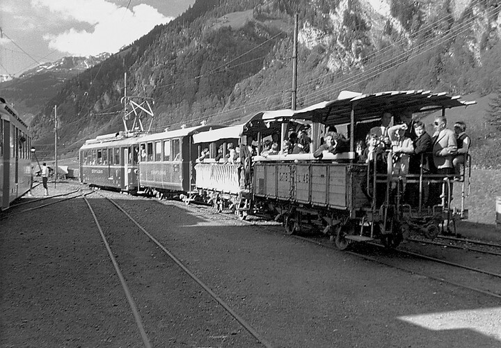



*Es erzählt Didi (Katharina) Blumer, 1927-2015, Engi. Das Interview wurde am 21. November 2003 geführt.*

Ich wuchs im Bühl in Engi auf, nahe bei der Sernftalstrasse, durch die
auch die Sernftalbahn fuhr. Sie gehörte von meinem ersten Lebenstag an
zu meinem Leben. Das Quietschen, das die Sernftalbahn bei bestimmten
Kurven erzeugte, ist meinem Gehör wie eingebrannt. Höre ich, selbst in
einer Stadt, das Quietschen eines Trams, so steigen in meinem Innern
unweigerlich Bilder der Sernftalbahn auf. Finden andere dieses
Geräusch grässlich, so ist es für mich die schönste Musik.

Von Kind her erinnere ich mich noch an die offenen Chriesi-Wagen, die
an der Landsgemeinde und an der Kilbi fuhren. Ganz besonders gefielen
mir die Litzen, die oben befestigt waren und die hin- und
herflatterten. Durfte ich einmal in einem Chriesi-Wagen fahren, war
ich überglücklich.

Natürlich kannten wir auch die Bahnangestellten, vor allem die
Streckenarbeiter. Im Winter schaute ich ihnen oft durchs Fenster zu,
wie sie mit Schaufel und Pickel gegen Schnee und Eis kämpften. Wenn es
viel Schnee hatte und dreinregnete, konnte die Bahn nicht mehr fahren.
Dann kam eine ganze Schar Männer. Ich sehe sie heute noch vor meinen
Augen, in ihren Überpelerinen. Sie mussten den Geleisen entlang Eis
und Schnee entfernen. Auch wenn die Arbeit streng war, habe ich doch
die Vorstellung, es sei bei ihr gemütlicher als heute zu- und
hergegangen. Hie und da konnten sie ein Wort miteinander sprechen oder
eine Pfeife anzünden. Das Arbeitstempo war nicht von der heutigen
Hektik und vom Tempo einer Maschine geprägt, sondern den menschlichen
Möglichkeiten angepasst.

Eindruck machte mir jeweils der Turmwagen, auf den die Männer steigen
mussten, um an der Oberleitung etwas zu reparieren.

War es gefroren, so bildete sich zwischen den Schienen ein Eisbuckel.
Da die Strasse nicht in der ganzen Breite vom Schnee befreit wurde,
mussten die wenigen Autos, die hin und her fuhren, zwischen die
Schienen ausweichen. Natürlich mussten die Autofahrer den Fahrplan
kennen, und sie fuhren nur dann, wenn kein Zug auf der Strecke war.
Eines Winters lud mich Mathias Speich ein, mit ihm nach Hause zu
fahren. Mit der rechten Seite fuhr das Auto zwischen den Schienen. Als
wir an einer breiteren Stelle hinausfahren wollten, kamen wir nicht
über den Eisbuckel hinweg. Wir mussten beide aussteigen und schieben,
und wir hatten etliche Mühe, das Auto neben die Schienen zu bringen.

Ich fuhr lange Zeit mit dem Zug zur Arbeit, zuerst von 1951 an nach
Luchsingen und von 1961 an nach Glarus. Zuerst gab es bei der
Sernftalbahn noch die alten Wagen. Meist war der Zug gut gefüllt, weil
alle mit der Bahn zur Arbeit fuhren. Oft war er überfüllt, und ich
musste stehen. Ganz schlimm war es, als die Oberleitung erneuert
wurde. Da konnte nur ein Motorwagen fahren. Ich erinnere mich, wie ich
im Winter einmal vorne beim Zugführer stehen musste. Es war bitter
kalt und zog bei den Türritzen grässlich herein. Ich erkältete mich,
und ich verstand, weshalb die Zugführer im Winter so dicke Mäntel und
Handschuhe trugen. Die Männer im Führerstand hatten es wirklich hart.

Mir gefiel im Allgemeinen die Fahrt mit der Sernftalbahn. Wir waren
immer eine Clique zusammen. Oft strickten wir und plauderten über
alles, was uns in den Sinn kam. Wir freuten uns jeden Morgen, einander
wieder zu sehen. Wir haben immer noch Freude, wenn wir uns zufällig
treffen. Heute setzt sich beim Bahnfahren meistens jede Person in ein
eigenes Coupé, und keine schaut die andere an. Verbindungen, die jeden
Tag gepflegt werden, gibt es nur noch selten. Es gab auch besondere
Ereignisse. So war in Matt noch der Bäcker Bäbler. Er selber backte
vor allem Brot oder Zopf und Mureli, aber keine Stückli[^1]. Die
Zwanziger-Stückli brachte Leni Kubli von einer Konditorei in Glarus.
Wir freuten uns schon, wenn wir die grosse Schachtel sahen, die Leni
trug. Jetzt hatten wir erste Wahl. Wir kauften Leni ein oder zwei
Stückli ab und genossen die seltenen Leckerbissen. Das waren schöne
Zeiten.

Wir konnten am Abend, nach der Arbeit, in Glarus wohl den Siebenuhrzug
erreichen. Aber in Schwanden fuhr der Zug ins Sernftal erst um ein
Viertel nach 8 Uhr. War das Wetter schön, wanderten wir oft bis zur
Warth und setzten uns dort noch auf ein Bänklein, bis die Sernftalbahn
kam. Wollte uns eines der spärlichen Autos mitnehmen, sagten wir:
«Nein, danke, wir laufen lieber.» Manchmal hatte eine von uns Birnen
oder ein paar kleine Chrämli. Die teilten wir untereinander und
plauderten drauflos. Es war wunderbar.

Besuchte man auswärts ein Konzert oder ging an die Kilbi, musste man
zu Fuss ins Kleintal laufen. Einmal gingen meine Schwester und ich an
die Kilbi nach Elm. Vater hatte uns gesagt, wir müssten mit dem
letzten Zug um 8 Uhr nach Hause kommen. Eine Freundin lud uns zu ihrer
Tante zum Nachtessen ein, und anschliessend gingen wir noch tanzen.
Als wir endlich auf dem Heimweg waren, begann es zu regnen, und wir
kamen mitten in der Nacht, ganz durchnässt, nach Hause. Die Haustüre
war verschlossen. Wir machten uns bemerkbar, bis der Vater oben
herausschaute und sagte: «Ihr könnt wieder heimkommen, wenn ihr bräver
geworden seid.» Dann schloss er das Fenster. Aber die Mutter öffnete
uns die Türe dann doch.

In der Regel fuhr ein Motorwagen mit Anhänger. Nach der Umstellung auf
den Bus hatte der Bus zuerst auch noch einen Anhänger. Das war nötig,
es brauchte so viele Sitzplätze. Mit den Jahren kam der
Privatautoboom, und noch später reduzierte die Therma die
Arbeitsplätze. Heute sitzen oft nur ein paar wenige Personen im Bus.
Hoffentlich bleibt er uns erhalten!

Als unser Jahrgang in die Rekrutenschule musste, das war im Jahr 1947,
gingen am Fasnachtsmontag sowohl die Gelbruuslaui als auch die
Mettlenlaui nieder. Es hatte geregnet, und der Schnee war ganz schwer.
Da wurde der Sernf gestaut. Auf unserer Wiese, dem tiefsten Punkt von
Engi, entstand ein See. Zum Glück steht unserer Haus etwas am Rain, so
dass wir im Trockenen waren. Die Rekruten mussten beim Bühltürli in
die Wiese hinaus, denn dort begann der See. Sie gingen dann vor
unserem Haus vorbei und dann zum Haus Blesi. Sie mussten bis in die
Warth zu Fuss gehen. Von dort brachte sie ein Sernftalbahnwagen nach
Schwanden.

Das Gleiche geschah 1999. Wieder staute die Mettlenlaui den Sernf. Es
war ein schneereicher Winter, und es gab bis zu drei Meter Schnee.
Dementsprechend waren auch die Lawinen mächtig. Das Wasser wurde bis
zum Bühltürli gestaut. Die Lawine ging etwa um 16 Uhr nieder. Ich
hielt mich in der Küche auf, und plötzlich hörte ich ein merkwürdiges
Geräusch. Ich fragte mich, was es wohl sei. Ich begab mich in die
Stube, um durch die Fenster nach draussen zu blicken. Aber die Fenster
waren ganz gelb. Ich öffnete ein Fenster, und da sah ich, wie sich die
Lawine langsam nach unten bewegte. Natürlich wurde mit Baggern sofort
versucht, einen Abfluss frei zu machen. Bis zu unserem Haus ist das
Wasser noch nie hochgestiegen.

Als ich in Luchsingen beim Tuch Hefti arbeitete, d. h. in den
fünfziger Jahren, musste ich auch eines Winters bis in die Warth über
die Lawinen steigen. Ich erinnere mich noch genau an den Tag. Meine
Mutter wollte mich davon abhalten, zur Arbeit zu gehen, und meinte,
ich müsse zu Hause bleiben, sonst müsste sie voller Angst sein. Aber
da ich sehr gewissenhaft erzogen war, meinte ich, ich könnte doch
nicht einfach fehlen, ich müsste zur Arbeit. Am Morgen wurde jeweils
von zwei Männern in der Warth die Post geholt. Ich schloss mich daher
Fritz Blumer, der die Post holte, an und ging mit ihm bis zur Warth.
Dort stand ein Wagen der STB. Als ich in Schwanden ankam, war
natürlich die SBB Richtung Linthal abgefahren. Ich musste warten.
Inzwischen war zu Hause ein Unglück passiert. Mein Vater
beaufsichtigte das Wehr in Engi-Vorderdorf. Da war er just an diesem
Morgen mit dem einen Unterarm in eine Maschine geraten. Der ganze
Vorderarm war aufgerissen, das Fleisch hing herunter. Mutter versuchte
mich zu erreichen. Weil ich aber den Zug nach Luchsingen nicht
erreicht hatte, war ich noch nicht in Luchsingen angekommen. Mutter
verzweifelte fast. Auch der Transport des Vaters ins Spital war
schwierig. Er wurde auf einem Hornschlitten bis in die Warth gebracht
und von dort nach Glarus transportiert. – So war Liebes und Leides mit
der Bahn verbunden.

[^1]: Ein Mureli ist eine Art Weggen, ein Stückli ein Patisseriegebäck.


