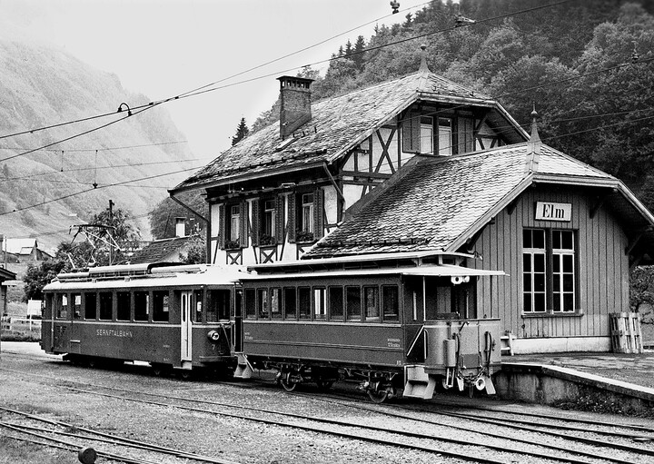
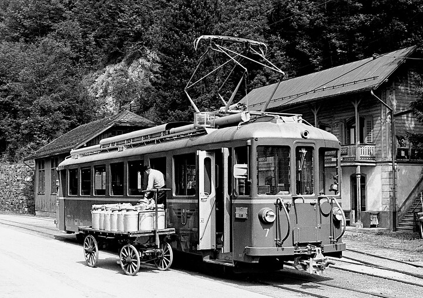



*Es erzählt Jakob Speich-Rhyner, \*1922, Elm. Das Interview wurde am 9. November 2004 geführt.*

Zu der Zeit, als ich die Sekundarschule beendet hatte, war die Auswahl
an Lehrstellen im Kleintal nicht gross. Ich wusste auch nicht recht,
was ich eigentlich gerne gelernt hätte. Man wurde ja auch nicht gross
gefragt. Mein älterer Bruder hatte Schmied gelernt, und der sagte zu
mir: «Mach doch eine Mechanikerlehre!» Mein Vater sagte: «Ich gehe zum
Depotchef und frage ihn, ob bei der Sernftalbahn eine Lehrstelle zu
haben wäre.» Damals war noch der alte Depotchef, Konrad Blumer. Dieser
sagte: «Ich könnte einen Lehrling brauchen.» Sein Sohn, der erste
Lehrling bei der Sernftalbahn, hatte gerade die Lehre abgeschlossen.
So konnte ich am 1. Mai 1938 meine Lehre als Elektromechaniker bei der
Sernftalbahn beginnen. Die Lehre dauerte dreieinhalb Jahre, bis zum
Herbst 1941. Ich verdiente am Anfang der Lehre 20 Franken im Monat,
und im letzten Halbjahr waren es 50 Franken. Einmal in der Woche fuhr
ich, oft mit dem Velo, nach Schwanden in die Therma. Dort konnte ich
zusammen mit den Lehrlingen der Therma die «Berufsschule» machen. Ein
Teil dieser Ausbildung geschah in der Therma selber. Die theoretischen
Fächer wie Rechnen, Buchhaltung und Deutsch wurden im Grundschulhaus
durch Lehrer Peter Blesi erteilt. In der Werkstatt waren Konrad Blumer
und Mathias Blumer meine Lehrmeister.

Im Winter war mein Arbeitsplatz recht kalt. Das Depot war nicht
geheizt, und in der Werkstatt stand in der Mitte ein runder Ofen. Es
war meine Aufgabe, diesen am Morgen zuerst anzuheizen. Gegen das Depot
hin liess sich eine Türe notdürftig zuziehen. Aber durch viele Spalten
zog es herein. Der Depotchef zündete oft, sobald er kam, die Esse an,
damit es rascher warm werde. Eines Tages zog der Ofen schlecht. Da kam
der Bergen-Köbi und sagte: «Wart nur, dem ‹Chaib› will ich Beine
machen!» Er holte eine Kanne mit Petrol. Aber kaum war er dem Ofen
nahe, gab es einen riesigen Knall, und der Deckel oben auf dem Ofen
flog fast bis zur Decke. Leider befand sich genau darüber das Büro des
Depotchefs. Der Bergen-Köbi verschwand wie der Blitz im Maschinenraum,
und die berechtigte Schelte des Depotchefs ergoss sich über mich.

Schon während der Lehre wurde ich als Kondukteur eingesetzt, weil
immer wieder Bähnler ins Militär einrücken mussten und zu wenig
Arbeiter zur Verfügung standen. Ich bekam eine Kondukteurtasche
umgehängt und eine Zange in die Hand gedrückt, und so betätigte ich
mich, ohne Uniform, als Kondukteur. Nach der Lehre und einem
Spitalaufenthalt musste ich in die Rekrutenschule einrücken. Ob ich
nachher wieder bei der STB arbeiten konnte, wusste ich nicht, und eine
andere Stelle zu suchen, war auch nicht einfach. Aber der
Betriebsleiter Jakob Störi sagte mir, ich könne wieder zur Bahn
kommen. So wurde ich als Mechaniker eingestellt, und ich blieb bei der
STB.

Bis 1945 arbeitete ich in der Werkstatt, dann trat ich in den
Fahrdienst über. Das kam so. Jakob Rhyner, der im Fahrdienst
eingeteilt war, wohnte in Elm. Er wäre aber lieber nach Engi gezogen,
um in der Freizeit seinen Schwiegereltern im Bauernbetrieb zu helfen.
Mir selber wäre es auch gelegen gekommen, nicht jeden Morgen mit dem
Velo oder den Skiern nach Engi fahren zu müssen, denn ich wohnte in
Elm. So kamen wir überein, wir könnten die Stelle tauschen. Der
Depotchef war zuerst von der Idee nicht begeistert, aber schliesslich
stimmte er zu, und die Lösung bewährte sich.

Es war aber bei der Sernftalbahn im Allgemeinen so, dass man zwar in
einer der Funktionen angestellt war, wenn aber Not am Mann war, musste
man da oder dort mitarbeiten. Man musste fast alles können. So
arbeitete ich immer wieder einmal im Depot oder in der Werkstatt. Als
ein neuer Schneepflug gemacht werden musste, wurde ich zur Mitarbeit
in der Werkstatt aufgeboten.

Als Wagenführer musste ich auch Kondukteurdienste leisten. Meist
wechselte man ab. Der Dienstplan wurde durch den Betriebsleiter
monatlich erstellt. Freizeit hatten wir wenig. Die wöchentliche
Arbeitszeit betrug 54 Stunden. Jeder vierte Sonntag war frei. Während
der Lehre hatte ich im Jahr eine Woche Ferien, als Angestellter zwei.
Viel später gab es dann mehr Freizeit und mehr Ferien, man musste sich
den allgemeinen Arbeitsbedingungen anschliessen.

Manche arbeiteten am Vormittag im Fahrdienst und am Nachmittag im
Depot, so etwa der Maler Sepp Marti und Thes Baumgartner.

Mein Fahrdienst begann meist mit dem Frühzug um 5 Uhr, und wenn ich
den langen Frühdienst hatte, dauerte er bis 12 Uhr. Nach der
Mittagspause musste ich nochmals für zwei Stunden antreten. Der
Spätdienst begann um 10 Uhr, um 12 Uhr gab es schon wieder die
Mittagspause, dann aber dauerte der Dienst von 16 bis 22 Uhr.

Eine Zeitlang arbeitete ich auch als Maschinist. Ich musste am Morgen
die Turbinen laufen lassen und den Strom einschalten und am Abend
wieder alles abschalten. Bei Schneewetter musste ich um 4 Uhr in Engi,
im Maschinenhaus, sein. Ich fuhr jeweils bei jedem Wetter mit den
Skiern nach Engi. Dann liess ich die Turbinen laufen, und schon kamen
der Bahnmeister und die Streckenarbeiter und fingen mit Schneepflügen
an, damit die Schienen für den ersten Zug frei waren. Ich hatte dann
nur den Maschinistendienst, der ja in der Regel Aufgabe vom
Bergen-Köbi und von Samuel Blumer war. Fahrdienst hatte ich an diesen
Tagen keinen. Im Winter gab es anfänglich oft zu wenig Strom. Später
wurde ein Dieselmotor angeschlossen. Das war eine gute, starke
Maschine, aber weil Diesel teuer wurde, baute man unter meiner
Mithilfe einen Gleichrichter ein. Aber erst durch den Einbau eines
zweiten Gleichrichters in Schwanden wurde das Problem mit dem Strom
gut gelöst.

Das Verhältnis zu den Passagieren war sehr gut, denn alle waren von
den gleichen Bedingungen abhängig. Auch die Passagiere mussten vieles
in Kauf nehmen. Sie taten es ohne Murren. Man kannte ja alle Leute und
wusste, wann wer zur Arbeit fuhr. Kam einer nicht, sorgte man sich, ob
er sich verschlafen habe oder ob gar etwas passiert sei. Bevor man
losfuhr, schaute man nochmals die Strasse hoch, ob er nicht angerannt
komme.

Es gab unter den Passagieren auch Originale, z.B. Ardüser, einen
Bündner, der in Engi wohnte. Die anderen nahmen ihn immer hoch, schon
allein wegen seiner Sprache, und trieben Schabernack mit ihm, aber er
nahm es nie übel. Er liebte Scherze. Einmal befestigten zwei der
regelmässigen Bahnfahrer einen Zettel hinten an seiner Jacke. Darauf
stand: KALB NACH MATT. Die anderen lachten fürchterlich, aber Ardüser
merkte nichts. Erst zu Hause kam er dem ständigen Gelächter auf den
Grund.

Bei den Stationen mussten der Wagenführer und der Kondukteur immer
beim Ausladen helfen oder gar alles selber ausladen. Es gab jeden Tag
Güter zum Ein- und Ausladen und jeden Tag einen Güterkurs, der um 10
Uhr in Elm wegfuhr. Natürlich konnten auch Personen mitfahren, aber
dieser Kurs hatte keine festen Ankunfts- und Abfahrtszeiten, denn es
wurde nur Rücksicht auf die Güter genommen. Alles musste mitgenommen
werden, was bereitstand, oder es war etwas auszuladen, je nach
Bestimmungsort. Der Zug war im Fahrplan nicht angegeben, aber jeder
wusste, dass er mit verlängerter Fahrzeit einmal in Schwanden ankommen
würde. Vieh wurde im Normalfall nur zweimal pro Woche transportiert,
am Montag und am Donnerstag. Meist waren es Kälber oder Schweine für
einen Metzger. Aus dem Güterwagen entwischte uns in der Bitzi in Matt
einmal ein Schwein. Es rannte den Abhang hinunter. Es dauerte recht
lange, bis wir es wieder eingefangen hatten.

Oft transportierten wir Holz oder Steine aus dem Steinbruch in der
Bitzi. Das Holz und die Steine standen schon bereit; wir mussten die
Wagen nur noch anhängen. In Schwanden stellten wir sie auf dem
Stumpengeleise ab, und die Steine wurden von Hand durch einen Arbeiter
des Steinbruchs umgeladen. Der machte ganze Tage nur diese Arbeit;
eine Zeit lang war das Giroldi. Von Schwanden her brachten wir oft Heu
und Stroh. Für die Weberei Engi und die Spinnerei Matt gab es oft
grosse Sendungen Baumwollballen. Wir konnten die gefüllten Güterwagen
auch auf die Stumpengeleise stellen. Sie wurden von Fabrikarbeitern
entladen.

Auf den Stationen Engi und Schwanden war immer ein Wärter, der für den
Schuppen verantwortlich war, angestellt. In Engi erinnere ich mich an
den Boden-Peter, den Siitli-Peter und den Chnü-This. Im Schuppen gab
es viel zu tun. Die Weberei Engi brachte viele Güter, die im Schuppen
auf den Abtransport warteten. In Schwanden war ein Streiff für die
Transporte ins Sernftal verantwortlich. Als er pensioniert wurde,
stellte man für die STB keinen besonderen Wärter mehr an. Die Wärter
der SBB und die Angestellten der Sernftalbahn mussten von da an
gemeinsam die Güter aus- und einladen. Von da an gab es für uns keine
Ruhepausen zwischen den Fahrten mehr. Wir mussten in den
Zwischenzeiten die Güterwagen entladen und beladen. Da hiess es sich
sputen, und oft wurden wir mit dem Einladen der angekommenen Güter
nicht fertig, bis der nächste Kurszug fällig war.

Besondere Ereignisse gab es immer wieder. 1939 konnte nur noch von
Engi nach Schwanden gefahren werden. Es hatte nämlich am 13. März
einen furchtbaren Sturm gegeben. Am gleichen Tag sollte die
Meissenbodenlawine, vom Geisstal aus, zum Abschuss gebracht werden,
aber es gelang nicht, und wegen des Sturms musste das Unterfangen
sowieso aufgegeben werden. Disch und ich fuhren Richtung Engi, aber
unterhalb Dästers blieben wir stecken. Auch der Schneepflug, der von
Engi her zu öffnen versuchte, kam nicht weiter. Die Wagen blieben über
Nacht auf der Strecke stehen.

Die schlimmsten Winter waren die der Jahre 1942 bis 1945. Die grosse
Lawine im Stock ging ja 1945 nieder. Drei Wochen lang musste die
Lawine überstiegen werden, bis das Geleise wieder freigeschaufelt war.

Oft hatte es sehr viel Schnee auf den Fahrleitungen. Thes und ich
nahmen einmal lange Stangen und schlugen ihn herunter, damit die Fahrt
nicht behindert würde. Es hatte zwar Strom drauf, aber es machte uns
nichts. Wir fragten später deswegen jemanden und erhielten den
Bescheid, der trockene Schnee sei ein ganz schlechter Leiter. Wir
hatten einfach oft Glück.

Einmal war eine Lawine niedergegangen, und es war ausgerechnet dann
kein Motorwagen in Schwanden abgestellt. Da fuhr Tschudi mit dem
Möbelwagen zwischen Schwanden und der Lawine hin und her.
Sitzgelegenheiten gab es in diesem Wagen nicht. Die Leute standen im
Wagen und versuchten festen Stand zu behalten. Es reklamierte nie
einer. Man wusste, dass es keine andere Lösung gab, und alle waren
einfach froh darüber, nach Hause zu gelangen. Angst hatte ich
eigentlich nie. Ich nahm es einfach, wie es war.

Anfang Januar 1953 fiel sehr viel Schnee. Am 12. Januar war ein
furchtbarer Sturm. Wir fuhren um 10 Uhr in Elm ab und kamen erst am
Nachmittag um 2 Uhr in Schwanden an. Die Geleise waren ganz vereist,
und wir mussten immer wieder aussteigen, um sie zu enteisen. Wir
hatten drei Motorwagen aneinander gehängt, zuhinterst war einer der
neuen Wagen. In der Kurve beim Schwanderhof stiess dieser letzte Wagen
die anderen beiden zum Geleise hinaus gegen den Kiosk. Einer von uns
beiden stieg in den letzten Motorwagen ein und fuhr langsam Richtung
Sernftal. Die entgleisten Wagen fuhren genau in der Rinne, die sie
beim Entgleisen in den harten Schnee gegraben hatten, zurück und
standen nach kurzer Zeit wieder auf den Schienen, wo sie hingehörten.
Das war ein gewagtes Unterfangen, aber es gelang.

Im gleichen Winter spürte ich auf dem Heimweg vom Bahnhof Elm, ich war
schon fast bei der Brücke in der Schwändi, dass von irgendwoher Gefahr
drohte und eine Lawine niederging. Ich rannte eine paar Schritte
zurück, legte mich auf den Boden und drückte mein Gesicht auf die
verschränkten Arme. Schon ging eine Staublawine über mich weg und
deckte mich etwa 30 Zentimeter tief mit Schnee zu. In Sulzbach wurden
zwei Ställe abgedeckt. Das ist das einzige Mal, von dem ich weiss,
dass in Sulzbach eine Lawine Schaden angerichtet hat. Ich selber war
wohlauf.

1968 war das Geleise auch stark vereist. Wir konnten noch mit Mühe und
Not nach Elm fahren. Unterwegs mussten wir immer wieder aussteigen und
die Schienen vom Eis befreien, damit wir weiterfahren konnten. Als wir
in Elm ankamen, sagten wir zueinander: «Wir sollten in Elm bleiben. Es
hat keinen Sinn mehr, bei diesem Wetter noch zu fahren.» Kaspar Marti
rief den Chef in Engi an. Dieser aber meinte, nur eine Fahrt sollten
wir noch wagen, es hätte sicher noch Personen, die gerne nach Hause
kämen. Also fuhren wir los. Wir fuhren zu Dritt oder zu Viert, und
immer wieder mussten wir aussteigen, um die Schienen zu enteisen. So
ging es bis zu den ersten Häusern von Matt. In der Kurve beim Hause
von Fritz Marti fuhr der Zug geradeaus, in die Strasse hinaus. Wir
sagten: «So, jetzt können wir aufhören!» Wir mussten in Matt bleiben
und im Hotel Elmer übernachten. Es wurde ein langer Abend. Wir
spielten Karten bis tief in die Nacht hinein, und das Hotel-Bäbi
schaute uns zu. Am anderen Tag kamen die Arbeiter von Engi, um den
Wagen wieder auf die Schienen zu heben. Sie brauchten fast den ganzen
Tag, weil er weit in die Strasse hinein geraten war.

Bei den alten Wagen gab es oft Achsbrüche. Einmal war von den vier
alten Motorwagen nur noch einer ganz. Wir mussten zur
Personenbeförderung den alten Gütermotorwagen nehmen. Auch in diesem
mussten die Leute stehen.

Die alten Motorwagen hatten zwei schräg nach hinten gestellte Bügel.
Fuhr man in der anderen Richtung, musste man die Bügel in die andere
Richtung stellen. Das konnte man mittels eines Seils, das vorne beim
Führerstand herunterhing und das man durch ein Fensterchen ergreifen
konnte. Besonders beim Manövrieren musste man darauf achten, sonst
konnten sich die Bügel mit den falschen Drähten verbinden. Kaspar
Zentner vergass das eines Tages. Er fuhr frisch und fröhlich los, und
sofort verhedderten sich die Bügel. Bald reckten sich, wie bei einem
Geweih, nur noch zwei Reste der Bügel in die Höhe.

Die Oberleitung musste auch oft repariert, oder Stangen mussten
ausgewechselt werden. Auch da hatte mitzuhelfen, wer gerade zur
Verfügung stand.

Unfälle gab es nicht viele. Als der Autoverkehr etwas zunahm, kam es
hie und da zu einem Zusammenstoss zwischen Bahn und Auto. Der
schlimmste, der mir passierte, geschah im Stock mit einem der neuen
Wagen. Ich fuhr Richtung Schwanden. Da überholte mich ein
Militärfahrzeug, und im gleichen Moment kam von unten ein Lastwagen
von «Freitag». Es gab für keinen ein Ausweichen. Der Lastwagen prallte
dermassen stark gegen den Motorwagen, dass es mir die Bodenbretter
unter den Füssen wegschlug. Der Motorwagen hatte natürlich einen
beträchtlichen Schaden. Alle Beteiligten blieben unverletzt.

Im Weriweidstutz, vor dem Meissenboden, entgleiste mir der Motorwagen
auch einmal. Fritz Rhyner war Kondukteur; er stand vorne neben mir.
Ich sagte: «Zum Glück haben wir keine Passagiere.» Aber Fritz
erwiderte ganz erschreckt: «Die Stalden-Bäsi ist doch in Elm
eingestiegen.» Fritz ging rasch nach hinten und sah, dass Frau Zentner
ziemlich viel Blut im Gesicht hatte. Auf diesen Bericht hin lief ich,
so rasch ich konnte, nach Matt zu Doktor Muhl. Er fuhr sofort mit dem
Auto zum Zug. Die Frau war durch den Stoss von der Bank gefallen und
blutete stark aus der Nase. Es war aber nichts Schlimmes, und Doktor
Muhl brachte sie mit dem Auto nach Hause. Der Wagen musste wieder auf
die Schienen gehoben werden.

Das Ende der Sernftalbahn verbrachte ich im Spital. Ich hatte beim
Umladen von 20 Säcken Zucker den Daumen aufgerissen und gebrochen. Der
Rolli war zu schwer gewesen. Ich hatte ihn nicht mehr zu halten
vermocht, war zwischen Rolli und Wand eingeklemmt worden und hatte die
Hand verletzt.

Pensioniert wurde ich dann als Buschauffeur erst 1987; während zwei
weiteren Sommern fuhr ich noch als Aushilfschauffeur.


