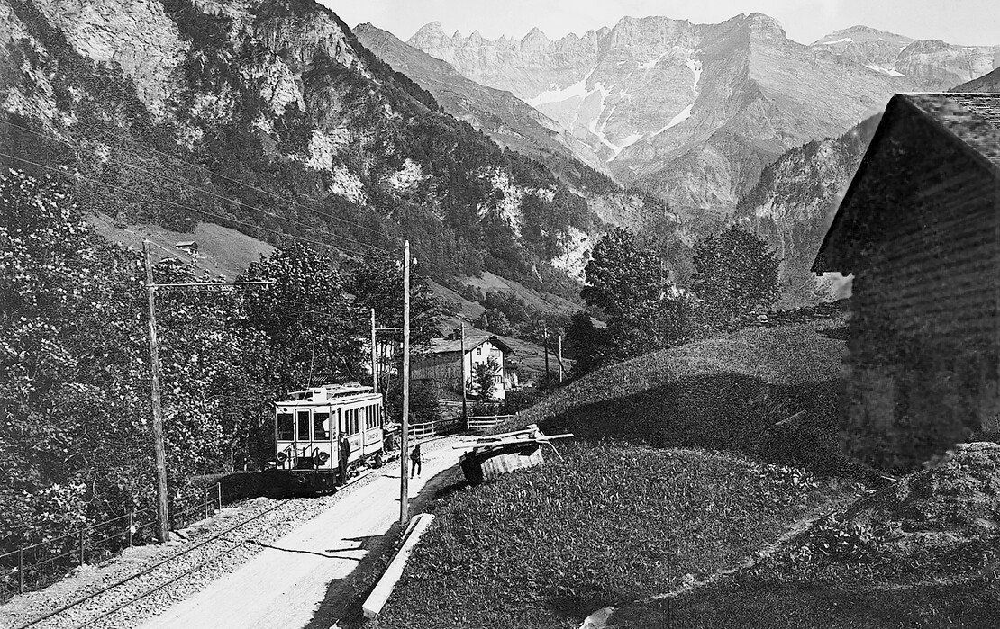



*Es erzählt Didi (Katharina) Speich-Rhyner, \*1924, Elm. Das Interview wurde am 9. November 2004 geführt.*

Ich heiratete Schaagg aus Liebe, aber ich war auch stolz auf ihn, dass
er Bähnler war. Es war etwas Besonderes.

Als wir uns kennenlernten, war ich bei Doktor Zweifel in Schwanden als
Magd angestellt. In dieser Zeit sprachen wir oft darüber, ob Schaagg
nicht auswärts eine Stelle suchen sollte und wir, nach der Heirat, aus
dem Kleintal wegziehen würden. Einmal sprach ich zu meiner Mutter
davon. Sie schrieb mir darauf einen Brief und bat mich, doch bei ihnen
im Sulzbach zu wohnen. Es mache ihr Kummer, dass wir fortziehen
wollten, sie hätte manche Nacht nicht geschlafen.

So entschlossen wir uns, nach der Heirat in meinem Elternhaus zu
wohnen,und Schaagg blieb bei der Sernftalbahn. Wir waren in diesem
Haus allerdings nicht allein. Die Stube teilten wir mit unseren
Grosseltern, und die andere Stube teilten meine Eltern mit einem
Bruder, seiner Frau und ihren zwei Kindern. Einzig der Schlafgaden,
die Nebenstube, gehörte uns allein. Meine Eltern waren Bauern, und so
war es selbstverständlich, dass ich und Schaagg mithalfen, wo es ging.
Wir arbeiteten von morgens bis abends.

Das hatte auch Vorteile. Die Anstellung an der Bahn war zwar nach den
Jahren der Arbeitslosigkeit sehr begehrt und galt als sicher, aber der
Lohn war klein. Durch das Wohnen und Mitarbeiten auf dem Bauernbetrieb
der Eltern hatten wir wenigstens immer genug Milch, Butter und Eier.
Wir mästeten auch immer ein eigenes Schwein; so hatten wir eigenes
Fleisch. Zudem pflanzten wir Kartoffeln und Gemüse. Ich war
verantwortlich dafür, dass alles reichte. Ich lernte aber dabei auch
sparen und einteilen. Am schwierigsten war es, als die beiden älteren
unserer vier Söhne zur gleichen Zeit in der Berufsausbildung waren.
Einer, Heiri, besuchte die Verkehrsschule in St. Gallen. Kam er übers
Wochenende heim, konnte ich ihm oft nur einen Fünfliber für die andere
Woche mitgeben. Aber er klagte nie, und es reichte ihm immer.

Von unserem Haus aus sieht man über den Sernf direkt in die
Landstrasse hinüber; so konnte ich jeden Zug vorbeifahren sehen. Ich
winkte immer hinüber, wenn ein Zug oder der Turmwagen vorbeifuhr, vor
allem, als ich noch jung und frisch verheiratet war. Eines Tages sagte
mir der Kummenberg-Schaagg: «Du musst nicht soviel winken. Du winkst
nämlich immer dem Falschen, z. B. mir!»

Aber ich schaute oft zur Strasse hinüber, vor allem im Winter, wenn es
viel Schnee hatte. Ich vergewisserte mich, ob die Bahn zur richtigen
Zeit komme. Fuhr sie nicht zum fahrplanmässigen Zeitpunkt vorbei oder
kam sie gar nicht, so wurde ich sofort unruhig und bekam es mit der
Angst zu tun. Ich musste viele Ängste ausstehen.

Mein Bruder war Wegmacher. Da rief er eines Abends an und fragte: «Wo
ist Schaagg?» Ich sagte: «Ja, der hat Fahrdienst.» Mein Bruder wurde
ungehalten und sagte, die Strassenverhältnisse seien prekär und es sei
unverantwortlich, dass die Sernftalbahn ihren Betrieb nicht einstelle;
er werde in Engi anrufen. Von da an war mir angst und bange. Ich blieb
beim Fenster und spähte durch das Schneetreiben nach den Lichtern der
Bahn. Als die Lichter der Bahn nie aufleuchteten, nahm ich meinen
jüngsten Sohn bei der Hand, und wir liefen in die Schwändi,
überquerten die Brücke und beugten uns in der Dunkelheit zu den
Geleisen nieder, um zu schauen, ob sie vom Schnee befreit seien und
also der Zug, von uns unbemerkt, vorbeigefahren sei. Aber die Geleise
waren schneebedeckt. So warteten wir weiter. Mich tröstete die
Gewissheit, dass die anderen Bähnler meinem Mann beistehen würden,
denn sie bildeten ja eine richtige Schicksalsgemeinschaft, und die
Kameradschaft zwischen ihnen war kein leeres Wort. Sie pflegen
übrigens auch jetzt nach der Pensionierung gute Kameradschaft. Zum
Glück war nichts passiert.

Es gab auch lustige Ereignisse. Schaagg verschlief sich nur zweimal in
all den Jahren, die er bei der STB arbeitete. Das eine Mal lagen wir
beide noch in unseren Betten in der Nebenstube, als plötzlich die Türe
aufging und die Stimme meiner Mutter uns weckte: «Jesses, Schaagg ist
ja noch hier!» Auf diesen Weckruf hin schoss Schaagg aus dem Bett, in
die Hosen, und in der Eile bemerkte er nicht, dass er die Jacke
verkehrt trug. Das gab ein Gelächter! Am Nachmittag wusste man es im
Dorf schon, und die Frauen sagten zu mir: «Du hast ihn scheint’s heute
morgen zu lange behalten!»

Hatte Schaagg frei, so konnte er mit seinen Kollegen auch
«überhoggen». Einmal wurde er sogar nach Chur «entführt», und von dort
wurde ich angerufen. Nach dem ersten Schrecken erholte ich mich. Er
musste ja schliesslich auch hie und da eine Abwechslung haben.

Für mich gab es auch wunderbare Zeiten. Wir besitzen oberhalb von
Sulzbach eine Wiese mit einem Stall darauf. Schaagg nahm immer in der
Zeit des Heuens seine zwei Wochen Ferien. Dann stiegen wir, anfänglich
nur wir beide allein, hinauf, um die Wiese zu heuen. Später kamen auch
die Kinder mit. Dort oben war eine wunderbare Ruhe. Endlich waren wir
für uns; wir waren frei und konnten tun und lassen, was wir wollten.
Mitten im Heuen konnten wir uns hinsetzen, miteinander sprechen oder
die Berge, von denen wir rings umschlossen waren, bewundern. Im Stall
gab es eine kleine Küche, wo wir unser Essen zubereiten konnten. Für
mich ist dieser kleine Flecken Erde mein Paradies, mein Glück. Jetzt,
wo ich nicht mehr so leicht hinaufsteige, schaue ich halt jedesmal,
wenn ich ins Dorf gehe, zum Stall und zur Wiese hinauf, und mein Herz
freut sich und sehnt sich danach.

Die Umstellung von der Bahn auf den Bus war für uns eine ganz schlimme
und schwierige Zeit. Viele, auch ich, konnten nicht einsehen, wieso
jetzt die Bahn, mit der wir so sehr verbunden waren, auf einmal nicht
mehr gut sein sollte. Wir konnten uns die Veränderungen durch die
Zunahme des Autoverkehrs gar nicht vorstellen. Auch Schaagg war
unsicher, ob er, der noch nie ein Auto gefahren hatte, mit einem so
grossen Bus fahren könne. Er trug sich mit dem Gedanken, die Stelle zu
wechseln. Aber von Elm fortzuziehen war unmöglich, denn wir hatten
eben erst das Heimwesen von unseren Eltern gekauft. Dann hatte ich in
dieser Zeit, 44-jährig, meinen letzten Sohn geboren. Und wie war es
mit einer neuen Stelle in Elm? Ich verbrachte schlaflose Nächte und
hätte den Verantwortlichen, die die Abschaffung der Bahn beschlossen
hatten, am liebsten den Kopf umgedreht. Durch das Zureden seiner Söhne
entschloss sich Schaagg, bei der AS[^1] zu bleiben und sich zum Busfahrer
ausbilden zu lassen. Es war hart für ihn. An manchem Abend kam er
deprimiert nach Hause, aber er schaffte es.

Von «meiner» Wiese über Sulzbach konnte ich die vielen Veränderungen
in Elm gut beobachten, den Bau der Umfahrungsstrasse, des
Waffenplatzes, des Gemeindehauses und des Truppenlagers. Alles lag zu
meinen Füssen ausgebreitet. Wir waren wirklich in einer anderen Zeit
und Welt angekommen.

[^1]: Bei den Autobetrieben Sernftal AG, dem Nachfolgeunternehmen der
    Sernftalbahn.
