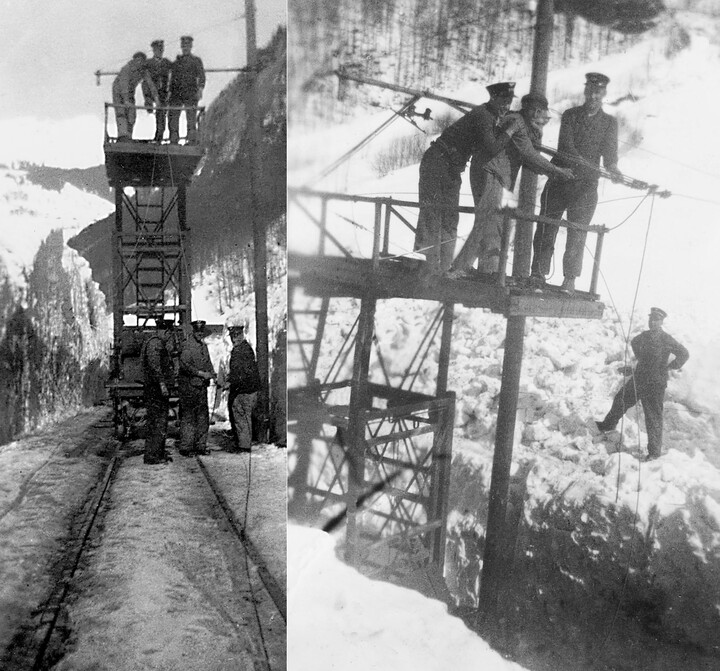



*Es erzählen Marie Blumer-Rhyner, \*1942, und Elsbeth Rhyner, 1946-2023, Engi. Das Interview wurde am 10. Juni 2000 geführt.*

Jakob Rhyner-Hämmerli (1916–1997), machte eine Lehre als Huf- und
Wagenschmied in Rorbas. Sein Vater fuhr mit ihm dorthin, um die
Lehrstelle zu besichtigen. Ohne seinen Sohn um seine Meinung zu
fragen, liess er ihn gleich dort. Jakob Rhyner kam zuerst fast um vor
Heimweh. Da es keinen Lehrlingslohn gab, machte er, wenn er manchmal
ein Bier trinken wollte, auf Wunsch den Handstand auf dem
Wirtshaustisch oder jodelte für ein Bier. In der Lehre erwarb er sich
jedoch viel handwerkliches Können und Geschick. Als er ins Sernftal
zurückkehrte, fand er eine Stelle in der Werkstatt, dem Schuppen der
Sernftalbahn. Da er Elsbeth Hämmerli aus dem Kummenberg geheiratet
hatte, schickte sich alles aufs Beste.

Für Jakob Rhyner war die Sernftalbahn sein Leben. Sein Schicksal
meinte es gut mit ihm, dass er mit dem Ende der Bahn nicht gezwungen
war, auf den Bus umzulernen, sondern im Kummenberg als Arbeitskraft
gebraucht wurde.

Marie und Elsbeth erinnern sich auf mannigfache Weise an ihren Vater.
Jakob Rhyner hatte sich ein Motorrad zugelegt, und wenn es sich ergab,
warteten seine beiden Töchter nach der Schule auf ihn. So konnten sie
zu Dritt nach Hause fahren. Im Winter, wenn es zu kalt war, um im
Stall, beim Oberbergli, mit der Mutter das Mittagessen einzunehmen,
gingen die beiden Mädchen zum Bahnhof in den Schuppen zu ihrem Vater.
Sie waren mächtig stolz auf ihn, dass er etwas von einem Bahnwagen
abschrauben und es wieder gut machen konnte. Wenn geschweisst werden
musste, nahm der Vater einen Schild vors Gesicht, und die beiden
Mädchen mussten hinaus, weil es «zu gefährlich war». Wenn der Vater
mit der Arbeit fertig war, gingen alle drei ins Restaurant «Bahnhöfli»
zum Mittagessen.

Im Sommer hatte Jakob Rhyner eine geregelte Arbeitszeit; im Winter war
es schwieriger. Noch während der Schulzeit von Marie und Elsbeth wurde
die Bifangstrasse nicht von der Gemeinde gepflügt. Es gab lediglich
einen Trampelpfad bis ins Bergen. Fiel sehr viel Schnee, so
schaufelten die Bewohner des Gufelstocks von Zeit zu Zeit den Weg
etwas frei. So war Jakob Rhyner meist der erste, der hinunter musste,
denn im Winter war seine Arbeitszeit anders. Fiel Schnee, musste er um
4 Uhr morgens beginnen und mit dem Schneepflug fahren. Oft musste er
vom Kummenberg an waten. Wenn der Schnee gar zu dicht fiel, versuchte
man vom Kummenberg aus auf den Abend hin einen Weg zu schaufeln oder
mit einer Kuh und einem selbst gebauten Schneepflug einen Weg zu
bahnen.

Der Winter war mit vielen Ängsten um den Vater verbunden. Lange hatte
man im Kummenberg kein Telefon und war so im Ungewissen, ob eine
Lawine niedergegangen und der Vater etwa darunter gekommen sei oder
nicht. Eines Winters geschah es, dass ein Zug der Sernftalbahn von
einer Lawine verschüttet wurde. Jakob Rhyner, ds Schmids Sämi und
andere Bahnarbeiter befanden sich darin. Jakob blieb unverletzt.

Am schlimmsten war es, wenn es hiess, die Signalanlage im Stock, die
bei einem Lawinenniedergang auf Rot schalten sollte, funktioniere
nicht mehr. Dann musste Jakob Rhyner in den Lawinenzug hinaufklettern.
Obschon er beweglich und verwegen war, hatten doch alle Angst um ihn.
Was konnte nicht alles passieren? So lagen Stolz und Angst im Blick
auf den Vater nahe beieinander.

*Nachtrag von A. Baumgartner*

Mir selber hat Jakob Rhyner folgendes Erlebnis erzählt:

Es war Brauch, dass an der Oberleitung unter Strom gearbeitet wurde,
denn die Fahrten mit der Bahn mussten gewährleistet sein. Einmal
arbeitete ich auf dem Turmwagen, einem Gerüst, das mit Rädern versehen
war und auf den Schienen hin- und herfahren konnte. Irgendwie muss ich
mit der Leitung in Kontakt gekommen sein. Auf jeden Fall traf mich ein
Schlag und warf mich gegen hinten. Zum Glück hatte ich die
Geistesgegenwart, mich mit den Füssen in den Leitersprossen fest zu
halten. Zuerst stand ich senkrecht von der Leiter gegen aussen. Dann
legte es mich nach unten gegen die Leiter. Zum Glück hatte ich die
Kraft, mich immer noch mit den Füssen zwischen den Sprossen fest zu
halten. So konnte einer von unten heraufsteigen, unter meinen Rücken
kriechen und mir helfen, mich langsam aufzurichten.


