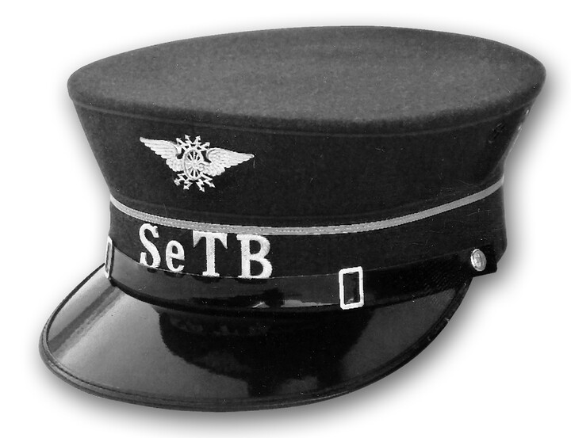
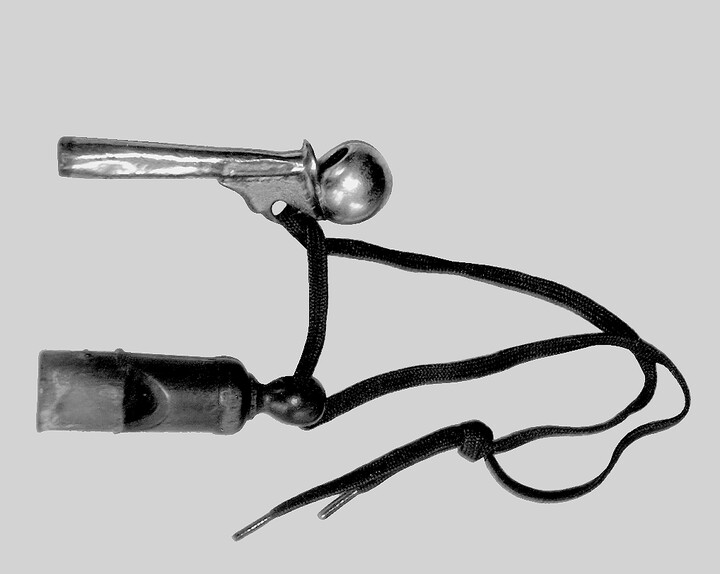
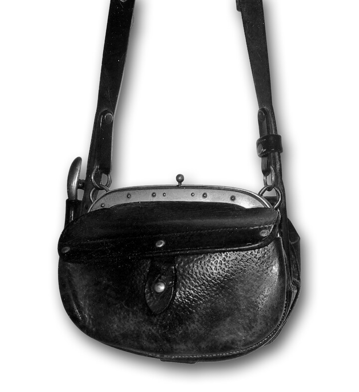
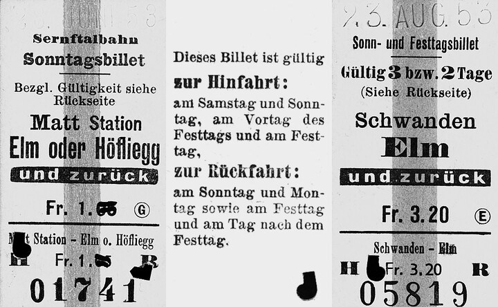
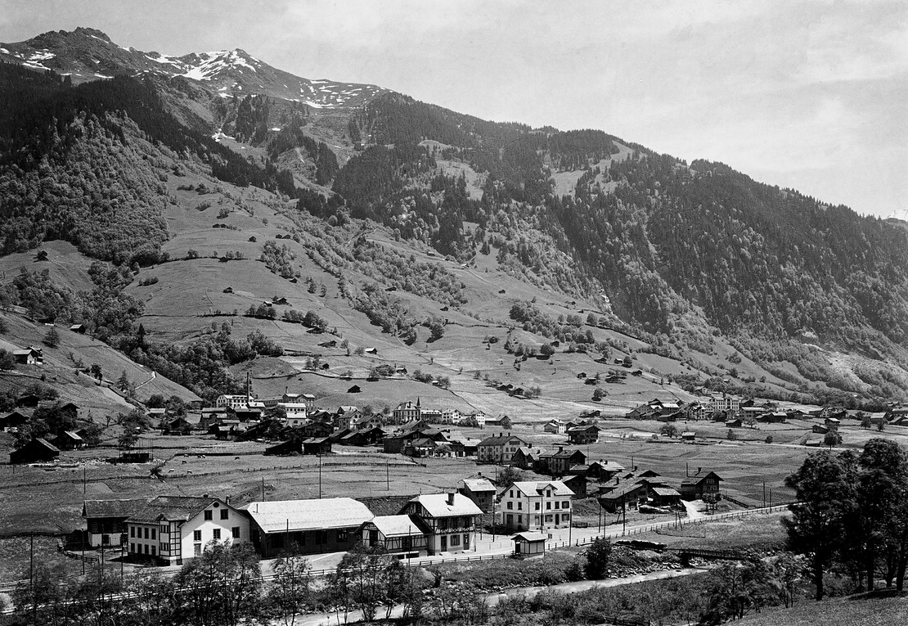



*Es erzählt Adelheid Baumgartner, \*1930, Sool. Aufgeschrieben im November 2000.*

Mein Vater, Matthäus Baumgartner (1898–1966), arbeitete seit dem
Austritt aus der Schule bis zu seinem Tod bei der Sernftalbahn. Er
liess nichts über die Sernftalbahn kommen. Als einmal ein paar
Burschen am Schalter in Engi «Hongkong retour» verlangten und mein
Vater sich eben im Schalterraum aufhielt, regte er sich zu Hause über
eine solche Frechheit furchtbar auf. Auch das Spott-Liedchen «Häbed
ech am Bänggli, häbed ech am Bänggli, ds Chliital- Bähndli macht es
Ränggli» hörte er gar nicht gerne. Ich bin froh, dass er das Ende der
Sernftalbahn nicht mehr miterleben musste.

Mein Vater arbeitete sowohl im Fahr- und Kondukteurdienst als auch im
Depot. Soweit ich mich erinnere, hatte er meist Frühdienst, d. h. er
musste mit dem ersten Zug von Elm nach Schwanden fahren. Da er in Engi
wohnte, fuhr er zuerst mit einem Leerwagen nach Elm. Der erste Zug
verliess Elm um 5.18 Uhr. Um 10 Uhr vormittags kam der Vater zum
ersten Mal nach Hause. Am Nachmittag arbeitete er von 13 Uhr bis 17.30
Uhr. Vater hatte wöchentlich einen Tag frei. Einmal monatlich fiel der
freie Tag auf einen Sonntag.

Als Kind interessierten mich alle Sachen, die zu Vaters Arbeit an der
Sernftalbahn gehörten, die Bahnuniform und die Tasche. Die erste
Uniformjacke, an die ich mich erinnere, hatte einen Stehkragen, der am
Rand mit weissen «Chrälleli» eingefasst war und vorne links und rechts
ein Abzeichen besass, ein Rad mit Flügeln. In die Seitennähte der
Hosen war eine andersfarbige, schmale Stoffmarkierung eingenäht. Die
Mütze war steif, vorne mit einem glänzenden Schirm versehen. Mich
interessierten vor allem die weissen «Chrälleli» und das Abzeichen.
Gerne hätte ich ein Abzeichen für mich gehabt und auch von den
«Chrälleli» ein paar. Aber gab es einmal eine neue Uniform, so behielt
Mutter alle Teile der alten Uniform, um sie als Flickmaterial für die
neue in Vorrat zu haben. Wir Kinder durften die «Chrälleli» an der
Uniformjacke auch nicht berühren, weil sie sich relativ leicht lösten
und das Flicken eine knifflige Sache war.

Die beiden Pfeifen, die zur Ausrüstung gehörten, zogen mich magisch
an. Sie waren an einem Schuhbändel mit etwas Abstand zueinander
angeknüpft. In einem Knopfloch der Uniformjacke festgemacht, führte
der Bändel zur Brusttache der Jacke, wo die Pfeifen drinsteckten. Die
eine Pfeife war aus geschwärztem Holz; aus ihr ertönte das
Abfahrtssignal. Die andere war aus Metall; ein Röhrchen führte zu
einem kugeligen Pfeifenende. Sie wurde Schrillpfeife genannt. Mit ihr
wurden die Signale für das Rangieren erzeugt. Durch die verschiedene
Form und das unterschiedliche Material hatte jede dieser beiden
Pfeifen eine andere Klangfarbe. Man brauchte nicht hinzuschauen, um zu
merken, aus welcher Pfeife ein Signal ertönte. Für die Benutzung der
Pfeifen gab es ein Signalreglement. Ich erinnere mich noch gut ans
Rangieren mit den alten Wagen. Ich schaute als Kind mit Verwunderung
zu, vor allem, wenn Vater bei den beiden Wagen stand, die verbunden
werden mussten. Zuerst stand er neben den Geleisen und zeigte dem
Fahrer mit den Händen an, wie nahe die beiden Züge beieinander seien.
Die Schrillpfeife hatte er oft von Anfang an im Mund und pfiff dann,
je nach Erfordernis, die verschiedenen Signale: Vorwärts: einmal kurz;
Rückwärts: zweimal kurz; Halt: dreimal kurz. Die Kupplung an den alten
Wagen war eine sog. Becherkupplung; die beiden Pufferbecher konnten
mit einem Kuppeleisen verbunden werden. War dieses mit dem sog. Nagel
im Puffer des Motorwagens befestigt, fuhr der Motorwagen langsam auf
den anzuhängenden Zug zu, bis das Kuppeleisen in den anderen
Trompetenpuffer eingefahren war. Oft musste der Bahnangestellte, der
neben den Wagen stand und mit seiner Pfeife das Manöver dirigierte,
zwischen die Wagen treten, um dem Kuppeleisen im letzten Moment die
erforderliche Richtung zu geben. Das war nicht ungefährlich. Ich
erinnere mich, dass man vom Höfli-Läri sagte, er sei einmal bei einem
missglückten Manövrieren zwischen den beiden Wagen eingeklemmt worden.
War es aber geglückt, wurde der Nagel auch auf der Seite des
angehängten Wagens eingestossen, und die Wagen wurden mit den beiden
Notketten gesichert. Ein Sicherheitskettchen wurde auch am Lufthahnen
festgemacht, und die beiden Luftschläuche wurden zusammengehängt. Dann
war das Manöver fertig. Der Fahrer kontrollierte noch, ob die Bremsen
funktionierten, und dann war alles zur Abfahrt bereit.

Und da war noch die Bahntasche. Sie war ein schweres, ledernes Ding.
Die älteste Tasche, an die ich mich erinnere, hatte oben einen
Metallbügel mit Schnappverschluss. Sie war mit lauter Kostbarkeiten
gefüllt. Geld war drin, alte Billette und eine Messingrolle, aus der
verschiedenfarbige Papierchen hervorguckten, an denen ich gerne
gezupft hätte. Auf einer Seite der Tasche war die Billettzange in
einen ledernen Querriemen eingesteckt. Jeder Bähnler hatte sein
eigenes Lochzeichen, rund oder quadratisch oder ein Kreuzlein usw. So
konnte man an der Form des Lochs jederzeit ablesen, wer das Billett
geknipst hatte. Aber alle Dinge, die zu Vaters Beruf gehörten, durften
wir drei Kinder nicht berühren. Sie gehörten ausgesprochen dem Vater
und der Bahn. Nur wenn der Vater uns selber die Mütze aufsetzte,
konnte eines von uns Kindern in der Stube umherstolzieren.
Ausnahmsweise durften wir auch einmal in die eine der Pfeifen blasen
oder die schwere Tasche aufheben und ein paar Schritte nachschleppen.
Es erfüllte mich jeweils mit Stolz, wie stark mein Vater sein musste,
der diese Tasche ohne weiteres zu tragen vermochte.

Später, als ich schon zur Schule ging und das Geld kannte, durfte ich
Vater jeweils bei der Monatsabrechnung helfen und bekam so den Inhalt
der Tasche zu Gesicht. Die Abrechnung war immer ein schwieriger
Moment. Die während der Fahrt ausgegebenen Billette und der Betrag in
der Bähnlertasche mussten übereinstimmen. Ich durfte das Geld nach
Münzsorten sortieren und je zu einem Franken aufschichten. Oft klappte
es nicht auf Anhieb. Hatte es ein paar Rappen zuviel, war es nicht
weiter schlimm; aber ein paar Rappen zu wenig bedeuteten eine
Katastrophe. Machte mein Vater beim Ausfüllen der dazu gehörigen Liste
einen Fehler, wurden wir mäuschenstill, denn das war ein ganz
kritischer Moment. Wir besassen nämlich keinen Radiergummi. Der Vater
versuchte mit Speichel, mit Brot, schliesslich mit dem Bügeleisen den
Fehler auszubügeln. Schliesslich konnten wir nicht mehr an uns halten
und platzten vor Lachen.

Für mich war die Arbeit des Vaters mit grossen Ängsten verbunden. Als
ich gut drei Jahre alt war, nahm er mich einmal auf eine Fahrt von
Engi nach Schwanden mit. Ich durfte allein im gepolsterten
Zweitklasswagen[^1] sitzen und konnte meinen Vater durch das Fenster der
Wagentüre am Führerstand sehen. Mir war es unheimlich zu Mute;
krampfhaft hielt ich mich am Sitz fest. Die Funktion der Schienen war
mir noch nicht einsichtig, und so hatte ich das Gefühl, dass der Wagen
irgendwohin fahren könnte, und hoffte, dass mein Vater den Weg finden
würde.

Später nahm mich der Vater ins Depot mit, und ich konnte in den
dunklen Gang hinunterblicken, von dem aus die Wagen von unten
repariert werden konnten. Sogar das Maschinenhaus durfte ich einmal
betreten, denn die Bahnangestellten konnten dort Früchte und Bohnen
dörren. Mutter gab mir ein Stoffsäckli mit, in dem ich unsere
Apfelstückli abholen sollte. Das Maschinenhaus war das Reich vom
«Disch». Er liess mich ausgiebig alles anschauen. Die Generatoren
machten mir mächtig Eindruck. Erklärungen wurden Kindern damals keine
abgegeben.

Das Gefühl der Angst um Vater hat sich später vor allem auf den Winter
konzentriert. Fiel eine Menge Schnee, so klopfte es mitten in der
Nacht an die Dachrinne, und dann musste mein Vater aufstehen und mit
dem Schneepflug fahren. Nie wusste man, ob der Vater nicht unter eine
Lawine gekommen war. Wenn es an die Dachrinne klopfte, kroch ich vor
Angst meist unter die Decke. So konnte ich wieder einschlafen.

Merkwürdigerweise erinnere ich mich nicht mehr an den Unfall von 1936
in der Warth. In der Kurve beim «Sternen» entgleiste ein Güterwagen,
der mit Zement beladen war. Nachdem er wieder auf das Geleise gehoben
und im Stumpengeleise abgestellt worden war, versagte beim nachherigen
Manöver die Handbremse. Mein Vater und der Depotchef waren auf dem
Wagen und versuchten verzweifelt, diesen zu bremsen, doch vergeblich.
Der Depotchef fühlte sich, von seiner Position her, verpflichtet, auf
der Plattform des Wagens zu bleiben. Er sagte aber zum Vater: «Thes,
spring ab, denn du hast drei kleine Kinder.» Da sprang mein Vater vom
fahrenden Wagen. Der Wagen fuhr weiter, entgleiste und stürzte den
Abhang hinunter. Der Depotchef war erheblich verletzt. Vater hatte
keine Verletzungen. Allerdings schmerzte ihn von da an das eine Bein
von Zeit zu Zeit. Ich erinnere mich, dass er in diesem Zusammenhang
vom Unfall erzählte.

Für das Kraftwerk der Sernftalbahn bestand ein kleines Reservoir
gegenüber der Bäckerei Hefti. Dort hatte Vater die zusätzliche Aufgabe
der Wartung des Rechens übernommen. Er musste von Zeit zu Zeit den
Rechen säubern, d. h. Blätter und Äste etc. herausfischen. Einmal, im
Winter, brach der morsche Boden unter dem Vater ein. Mit Mühe und Not
konnte er sich aus dem Wasser ziehen und Halt für die Füsse finden. Es
war Winter und bitterkalt. Obschon es bis zu unserem Haus nur ein paar
Schritte waren, kam Vater ganz durchnässt und mit halb gefrorenen
Kleidern nach Hause. All das hat in der Kindheit den Eindruck der
Gefährlichkeit der Arbeit meines Vaters und meine Angst um ihn
verstärkt.

Natürlich musste Vater auch beim Aus- und Einladen der Güter und beim
Umladen des Viehs helfen. Ich erinnere mich, dass er erzählte, wie ein
Stier einmal begonnen habe, wild zu werden. Das war kein Spass. Keiner
wollte sein Leben riskieren. Es gelang, den Stier im Freien irgendwo
anzubinden. Sie berichteten dem Hugeten-Sämi, er solle nach Schwanden
kommen und seinen Stier selber holen. Sämi liess ausrichten, er
schicke das Meitli. Alle dachten, ob Sämi wohl von allen guten
Geistern verlassen sei. Das Marili, damals ein halbwüchsiges Mädchen,
kam, und der Stier lief hinter ihm her wie ein Hündli. Alle staunten.
Aber der Stier war eben Marilis Stier, den es von jung an «gesaugt»
und besorgt hatte und der ihm deshalb in allem gehorchte.

Vater kannte alle Sernftaler und Sernftalerinnen. Es machte ihm keine
Mühe, mit verschiedenen Menschen umzugehen. Er selber war ein ruhiger,
umgänglicher und dienstfertiger Mensch. In all den Jahren hatte er
auch «ein Auge» für die verschiedenen Passagiere entwickelt. So war er
etwa der Meinung, dass jede Person sich für eine Bahnfahrt sauber und
ganz kleiden sollte, und wenn jemand «verhudlet» wegfuhr, regte er
sich auf. Er liebte es, wenn jemand wie aus dem «Trüggli» verreiste.
Auch von Personen, die jeden Tag zur Arbeit fuhren, erwartete er, dass
sie ihre Kleider flickten. So konnte er sich über Frauen aufhalten,
die eine ganze Woche lang mit der gleichen Fallmasche in die Bahn
einstiegen und den Strumpf nie flickten. Auch gereinigte Schuhe waren
ihm wichtig. Um seinem Ideal zu entsprechen, bürstete und wichste er
seine Schuhe oft selber.

In seiner freien Zeit kümmerte sich der Vater um das Beschaffen des
Holzvorrats für den Winter. Das war seine Erholung. Im Wald war er
glücklich, ging er doch meist dorthin ins Holz, wohin er schon als
Kind gegangen war. Oft brachte er ein paar Blumen aus dem Wald mit.

War der Vater zu Hause, hatte er es gerne ruhig. Er musste früh zur
Arbeit und war ständig unter Menschen. So hatte er in der Freizeit ein
grosses Bedürfnis nach Ruhe. Über Mittag legte er sich aufs Sofa und
ruhte aus. Im Winter lag er am Abend oft auf dem Ofen. Ich denke,
seine Arbeit war mit grosser Kälte verbunden, denn der Führerstand war
nicht geheizt. So mussten die Wagenführer den ganzen Tag in der Kälte
ausharren. Natürlich schützte man sich. Unter die Bähnlerkappe kam
eine Züttelkappe. Die Männer trugen unter den dicken Winterhosen so
genannte Strümpfe, die aber nur bis zu den Knien reichten und mit
Sockenhaltern befestigt waren, und lange Unterhosen. Hatte es frisch
geschneit, wurden die grünen, aufgerauten Wadenbinden über den Schaft
der Schuhe bis weit in den Unterschenkel hinauf umgewickelt und
festgebunden. So konnte kein Schnee in die Schuhe eindringen.
Zusätzlich konnte man Überstrümpfe darüber ziehen. Das waren zwei
Rohre aus dickem, verfilztem Wollstoff, die vorne in eine Lasche
ausliefen. Unter dem Knie wurden sie festgebunden, und die Lasche
hielt mittels eines Gummibandes, das sich unter der Schuhsohle hinzog,
fest. Vater hatte weder die Wadenbinden noch die Überstrümpfe
besonders gern. Sie hielten nach ein paar Stunden meist nicht mehr so
tadellos fest, wie sie sollten, und während der Arbeit blieb keine
Zeit, um beides wieder in Ordnung zu bringen. Zum Schutz gegen die
Kälte gab es auch einen sehr schweren, gefütterten Bähnlermantel. Aber
in einem kalten Winter mit Minustemperaturen drang wohl die Kälte im
Laufe eines Tages bis auf die Knochen. Der warme Ofen sollte Vater am
Abend etwas aufheizen. Wir drei Mädchen verstanden das Bedürfnis des
Vaters nach Ruhe und Wärme nicht immer. Da wir auf der Stubenkammer,
direkt über dem Ofen, schliefen, hätten wir natürlich besonders ruhig
sein sollen. Aber uns war nicht immer danach zu Mute. Der Vater
klopfte jeweils an die Decke, wenn wir mit Jubel, Trubel, Heiterkeit
nicht aufhören konnten. Hatte er das dritte Mal geklopft, wussten wir,
dass es jetzt ernst galt. Als wir einmal auch dies missachteten, kam
der Vater mit einem Bürdelischeit in die Kammer und sagte uns, wenn
wir nicht ruhig seien, gebe es eins auf den Hintern. Ich sagte mir,
dass ich zum Glück nicht neben der Türe mein Bett habe und, falls der
Vater sein Vorhaben in Tat umsetze, längst aus dem Bett geflohen sei,
bis er zu mir komme.

Rund um den Bahnhof Engi-Vorderdorf gab es verschiedene, von den
Eltern «verbotene» Attraktionen. Ein besonderer Anziehungspunkt war
das Bahn-WC. Meist waren wir zwei oder drei Mädchen, «Gschpili»,
zusammen, wenn wir uns entschlossen, das WC aufzusuchen. Es stand, ein
hölzernes Häuschen, dem Bahnhof gegenüber auf der anderen Seite der
Sernftalstrasse. Es war ein echtes WC, d. h. Wasser-Closett; denn
unter dem hölzernen Sitz mit dem runden Loch in der Mitte, floss ein
richtiges Bächlein, das ein paar Schritte weiter in den Sernf mündete.
Wir warfen Steine, Blätter oder Zeitungspapier hinunter. Das
Zeitungspapier lag zum Gebrauch auf dem «Hock». Gebannt schauten wir,
wie das Wasser die Dinge wegtrug. Der Höhepunkt war, wenn eines der
Mädchen «musste», besonders Dickes. Kaum war das Geschäft erledigt,
sprang das Mädchen vom Sitz auf. Alle hofften, es müsste doch möglich
sein, das «Geschäft» davonschwimmen zu sehen. Aber, oh weh, das
Bächlein war immer geschwinder als wir. Wenn Vater oder Mutter von
unserem Besuch hörten, sagten sie, das WC sei nur für Leute, die bei
der Bahn arbeiteten oder die Bahn benutzten. Für Kinder sei die
Benutzung nur im Notfall gestattet. Zum Glück gab es bei uns immer
einen Notfall.

Eine andere Attraktion war der Brunnen an der Südwand des Bahnhofs.
Neben dem Brunnen hing ein gusseiserner Becher an einer Eisenkette.
Daraus zu trinken war streng verboten, wer weiss, womit man sich da
hätte anstecken können! Aber nur ein Schluck konnte doch nicht
schaden, davon würde man doch wohl nicht sterben! Probiert musste
sein.

Und weil der Wartsaal, der nur für Reisende gedacht war, gleich so
nahe war, wurde der auch noch für ein paar Momente aufgesucht. War
zwar der Vorstand, der «Störi», im Büro, blieben wir nur einen Moment.
Zu kurz, als dass Störi schimpfen würde, aber doch lang genug, um zu
sehen, ob er die Backen aufblase. Störi hatte nämlich einen Tick. Er
blähte immer die Backen auf und blies. Diesen Anblick liessen wir uns
nie entgehen.

Oft wurden unsere Bahnhofbesuche durch einen Gang zur «Hürbi»,
jenseits der Brücke, abgerundet. Wir wühlten in den hingeworfenen
Schätzen und hofften, etwas Kostbares zu finden. Hatten wir Glück, so
nahmen wir den Schatz mit, obschon wir wussten, dass unsere Mütter,
unverständlicherweise, keine Freude an Hürbikostbarkeiten hatten.

Die Sernftalbahn fuhr nicht allzu rasch. Als Sekundarschüler machten
sich vor allem die Buben einen Spass daraus, mit dem Velo ebenso rasch
zu fahren wie die Bahn. Sie zu überholen galt als Heldentat. Schwierig
waren bloss die Stellen, wo die Schienen die Strasse überquerten. Da
galt es weder mit der Bahn zu kollidieren noch in die Rinnen der
Schienen hineinzugeraten und so zu verunfallen. Einst war, während der
Kriegsjahre, ein junger, hübscher Lehrer als Stellvertreter an der
Sekundarschule in Matt. Alle Mädchen schwärmten für ihn. Eine
Klassenkameradin sagte eines Morgens, sie sei gestern nach der Schule
von Matt bis Engi immer neben der Sernftalbahn gefahren und hätte
immer den jungen Lehrer anschauen können. Wir anderen Mädchen waren
wütend und neidisch auf sie.

Unser Haus an der Allmeind war wie ein Aussichtsturm. Als Kinder
liebten wir es hinauszublicken, wenn die Leute von der Bahn kamen. Wir
registrierten, wer ausnahmsweise verreist war, und es nahm uns wunder,
wo wer gewesen sei und weshalb. Wir kannten aber natürlich auch alle,
die mit der Bahn zur Arbeit fuhren. Wenn jemand mehr als zwei Tage
nicht zur gewohnten Zeit vom Zug die Allmeind hoch kam, fragten wir
uns, was wohl los sei.

So gehörte die Sernftalbahn in das Leben unseres Vaters und in meine
Kindheit.

[^1]: Bei der Sernftalbahn gab es nur zweite und dritte Klasse; die
    Zweitklasswagen wurden vom Volk oft als «erste Klasse» bezeichnet.


