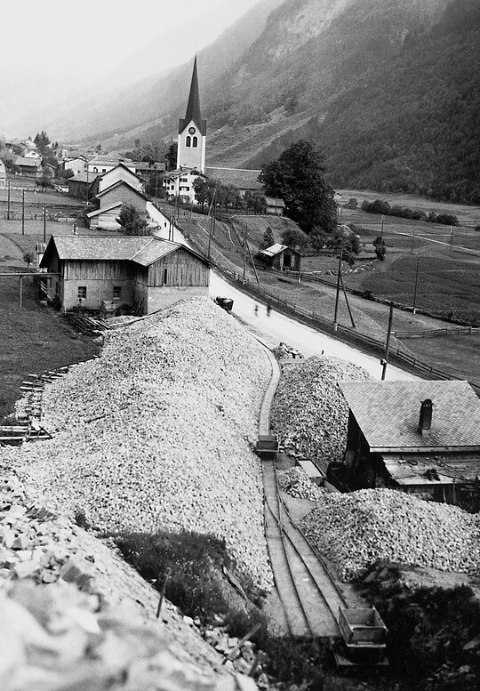



*Es erzählt Hans Marti-Malacarne, \*1930, Schwanden. Das Interview wurde am 6. Dezember 2004 geführt.*

Nach dem Besuch der Primarschule in Engi und der Handwerkerschule in
Glarus galt es für mich, eine Lehrstelle zu suchen. Eine solche zu
finden, war damals nicht leicht. Eduard Hämmerli beendete eben seine
Lehrzeit bei der Sernftalbahn, und der sagte zu meinem älteren Bruder:
«Du, bei der Sernftalbahn wird ein neuer Lehrling gesucht. Der Hänsel
soll sich doch melden.» Ich zögerte, denn ich hatte ein leicht
schlechtes Gewissen und dachte: «Da brauchst du dich nicht zu melden,
die nehmen dich nicht.» Das kam so: Ich war als Jugendlicher ein
richtiger « Luuschaib», immer zu Streichen aufgelegt. Eines Sonntags,
auf dem Weg zur Kinderlehre, kamen wir zu dritt, ich, der Rigi-Frigg
und ds Hermänndels-Heiri bei der Bitzi vorbei. Dort standen auf dem
Stumpengeleise mit Steinen beladene Wagen zum Abtransport bereit.
Voller Übermut stiegen wir auf die Wagen und lösten die Handbremsen.
Die Wagen begannen sich in Bewegung zu setzen. Wir sprangen ab und
machten, dass wir in die Kirche kamen. Während wir mehr oder weniger
zuhörten, was der Pfarrer erzählte, rollten die mit Steinen beladenen
Anhänger Richtung Engi-Hinterdorf. Bei der «Sonne» kamen sie von
selbst zum Stillstand, zum Glück, denn von Engi-Vorderdorf her nahte
schon ein Kurszug. Natürlich gab es hinterher eine grosse
Untersuchung, und wir drei Missetäter wurden nicht geschont.

Zudem war man bei meinen täglichen Bahnfahrten während meiner
Berufsschulzeit auf mich aufmerksam geworden. Es gab da einen Mann im
Kondukteur- und Fahrdienst, den wir Jugendliche gerne plagten. Er war
gross, schlank und hatte einen grossen Schnauz. Deshalb wurde er «dr
Schnuuz» genannt. War er Kondukteur, so betrat er das Abteil und
sagte: «Alle Billette, bitte!» So redete sonst keiner der Bähnler, uns
aber reizte diese Gewohnheit zu Unfug. War ein Güterwagen angehängt,
stiegen wir während der Fahrt vorne aus und hinten wieder auf die
Plattform des Güterwagens. Dort zogen wir die Handbremse an. Der Zug
blieb nicht stehen, aber es war merklich strenger zum Fahren, und der
Wagenführer merkte sofort, dass da etwas nicht stimmte. Beim nächsten
Halt gab es ein Donnerwetter, und wir wurden vom «Schnuuz» als
«Schloränä» betitelt.

Deshalb zögerte ich, mich bei der Sernftalbahn als Lehrling zu melden.
Eine andere Möglichkeit aber war nicht in Sicht, und so biss ich in
den sauren Apfel und bewarb mich um die Lehrstelle. Der Betriebsleiter
Jakob Störi und der Depotchef Mathias Blumer liessen mich zu sich
kommen und sagten zu mir: «Du bist zwar ‹ä Luuschaib›, aber wir wollen
es mit dir probieren, gib dir Mühe!»

Am 1. Mai 1947 begann ich meine Lehre als Elektromechaniker bei der
Sernftalbahn. Es hat mich nie gereut. Fast alles, was für mein
späteres Berufsleben nötig war, habe ich hier gelernt. Das hatte
zweierlei Gründe: Einerseits war der Betrieb klein, und dadurch musste
jeder alles können und bekam Einblick in verschiedene Berufe.
Andererseits fiel meine Ausbildung in eine Zeit grosser Umstellungen
bei der Sernftalbahn. Jede Umstellung brachte mich beruflich einen
Schritt weiter. Ich habe der Sernftalbahn viel zu verdanken.

Angefangen habe ich aber natürlich ganz unten. Damals war auch der
Samstagnachmittag nicht frei. Für den Lehrling hiess das damals
putzen. Ich musste die Drehbänke, die Bohrmaschinen und alle anderen
Maschinen reinigen. Die Metallspäne wurden während der Woche nur etwas
beiseite geschoben und erst am Samstag zum Alteisen geworfen. Die
Wange der Drehbank und vieles andere musste geölt werden. Meist nahm
die Reinigung der Arbeitsplätze und Maschinen den ganzen
Samstagnachmittag in Anspruch.

Während der Woche wurde ich zuerst in die Schlosser- und
Mechanikerarbeiten eingeführt. Vieles wurde für den Betrieb selbst
hergestellt, z. B. Werkzeuge. Auch die Spindeln für die Weichen wurden
selber gedreht. Zum Drehen mussten je nachdem die Zahnräder
ausgewechselt werden. Zuerst musste die Steigung ermittelt und die
Übersetzung berechnet, und erst dann konnten die richtigen Zahnräder
eingesetzt und es konnte mit dem Drehen begonnen werden. Später wurde
eine Okkasions-Drehbank in Oerlikon gekauft. Dadurch wurde das Drehen
der Spindeln wesentlich einfacher. Man brauchte nur die richtige Zahl
einzutippen und konnte mit Drehen beginnen.

In der Werkstatt in Engi wurde auch noch manches selber gegossen, so
etwa die Lagerschalen für die alten Wagen. Sie mussten alle paar Jahre
oder dann, wenn ein Lager rauchte, erneuert werden. Wir benutzten dazu
eine Form, in die hinein wir eine Zinnmischung gossen. Für jede Achse
brauchten wir zwei halbe Lagerschalen, so dass das Lager ganz von der
Schale umschlossen war. War eine Schalenhälfte abgekühlt, musste man
sie schleifen und schaben, bis sie nirgends mehr am Lager rieb. Um
dies festzustellen, färbte man die Achse ein und rieb die Schale
darüber; so konnte man sehen, wo noch Reibflächen waren. Dort wurde
weiter geschliffen und geschabt, bis es klappte, und dann musste noch
die Ölrinne eingegraben werden. Achse und Lagerschale liefen in einem
Ölbad. Das Öl wurde durch das Drehen durch die Ölrinne nach oben
getrieben und kühlte so das Lager. So lernte ich mit der Zeit alle
Arbeiten, die in der Werkstatt Engi ausgeführt wurden. Meine
Lehrmeister waren Jakob Rhyner, ein vorzüglicher Praktiker, aber auch
Jakob Speich, der Elektromechaniker gelernt hatte und mir im
Elektrobereich vieles beibringen konnte. Auch die anderen drei
Arbeiter, die in der Werkstatt arbeiteten, waren jederzeit bereit, mir
ihr Können beizubringen.

Die erste Umstellung bei der Bahn, die ich miterlebte, war der
Fahrleitungswechsel, der durch die Firma Kummler und Matter
durchgeführt wurde. Ich nahm regen Anteil am Neuen, das da entstand.
Hie und da konnte ich bei den nachts ausgeführten Arbeiten mitmachen,
aber nur als Aushilfe und nur, wenn ich wollte. Ich wollte immer, vor
allem, weil ich dann 50 Rappen Stundenlohn erhielt. Das war zum
spärlichen Lehrlingslohn eine echte Aufbesserung, verdiente ich doch
im ersten Lehrjahr bloss 15 Franken im Monat, im zweiten Lehrjahr 20
Franken und so jedes weitere Lehrjahr 5 Franken mehr Monatslohn.

Nach dem Fahrleitungswechsel wurde auf die neuen Wagen umgestellt. Die
neuen Triebwagen hatten eine pneumatische Steuerung. Um diese Neuerung
mitzubekommen, durfte ich mit Jakob Rhyner, dem Werkstattchef, für
eine Woche in die Werkstatt nach Oerlikon. Dort wurde uns die Funktion
und die Wartung dieses neuen Bremsmechanismus genau erklärt. Mich
überraschte immer, wie Jakob Rhyner alles rasch auffasste und es
nachher in der Werkstatt auch gut umsetzen konnte.

Die neuen Wagen machten auch eine neue, grössere Werkstatt nötig,
damit sie zur Kontrolle oder zur Reparatur hineingefahren und
aufgebockt werden konnten. Andere, neue Werkzeuge, mit denen ich mich
vertraut machen konnte, tauchten auf.

Und schon erschien wieder Neues am Horizont, nämlich das Installieren
der Gleichrichteranlagen in Engi und in der Au, Schwanden. Bis dahin
war ja die Sernftalbahn von den beiden Turbinen abhängig, die in
Engi-Vorderdorf standen. Floss wenig Wasser, etwa im Winter, oder
waren ein paar Züge zu gleicher Zeit im Einsatz, so vermochten die
beiden Turbinen den nötigen Strom nicht zu liefern. Deshalb war eine
zusätzliche Energiequelle nötig. In einem Stall unweit des Bahnhofs
Engi-Vorderdorf war der ganze Boden mit Batterien belegt. Die
einzelnen Batterien wurden in Serie geschaltet und konnten so 800 Volt
erzeugen. Sie waren mit einer Leitung zugeschaltet. Sobald die
Turbinen zu wenig Strom lieferten, schaltete es automatisch auf die
Elemente. In der Nacht wurden die Elemente auch automatisch wieder
aufgeladen. Allerdings brauchten sie ein Minimum an Wartung. Mittels
eines Instruments mussten von Zeit zu Zeit der Wasser- und der
Säuregehalt der Batterien überprüft werden. Alle paar Jahre fiel eine
grössere Arbeit an; alle Batterien mussten entschlammt und gereinigt
werden. Zu stark verschlammte Batterien wurden ersetzt. Mit der
Installation der Gleichrichteranlagen wurden die Batterien
überflüssig. Sie wurden entfernt und die Glasbehälter, in denen sie
steckten, als Aquarien verkauft.

Zu meinem Glück fiel die Rekrutenschule in die letzten Monate meiner
Lehre. Ich wurde zu den Flugzeugmechanikern eingeteilt. Erst jetzt
lernte ich noch etwas Wichtiges dazu: Elektrische Pläne lesen und
daraus Berechnungen und Folgerungen ableiten. Wir wurden darin richtig
eintrainiert und geschlaucht. Das hatte in meiner Ausbildung bei der
Sernftalbahn gefehlt, und ich war froh, dass ich das durch die
Rekrutenschule mitbekam. Mein Abschlusszeugnis an der Gewerbeschule
der Therma war denn auch sehr gut, in der Theorie sogar ein bisschen
besser als in den praktischen Fächern. Der Chef sagte zu mir: «Du hast
es sehr gut gemacht, aber lieber hätte ich es umgekehrt gesehen,
nämlich, dass die bessere Note auf die praktischen Fächer gefallen
wäre und nicht auf die Theorie.» Aber sei es, wie es wolle, für mich
ging mit der Lehre bei der Sernftalbahn eine reiche, gute Zeit zu
Ende. Das Tor zum Leben war für mich weit offen.


