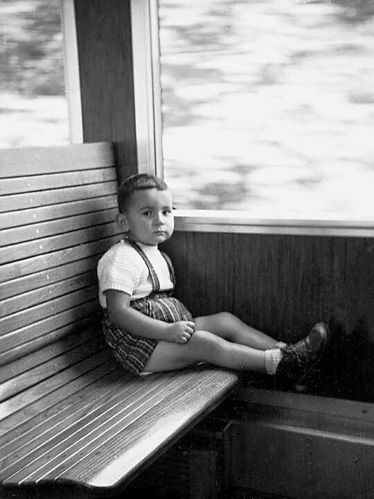
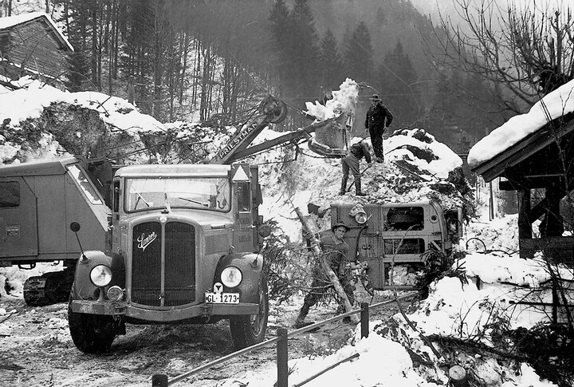
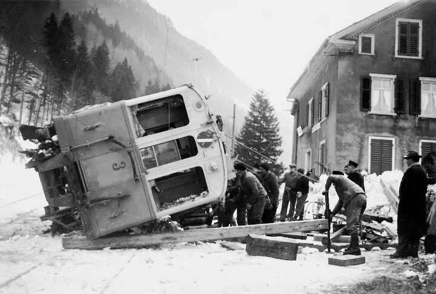
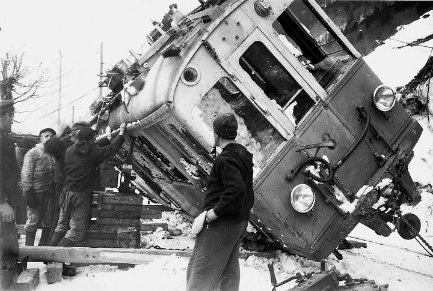
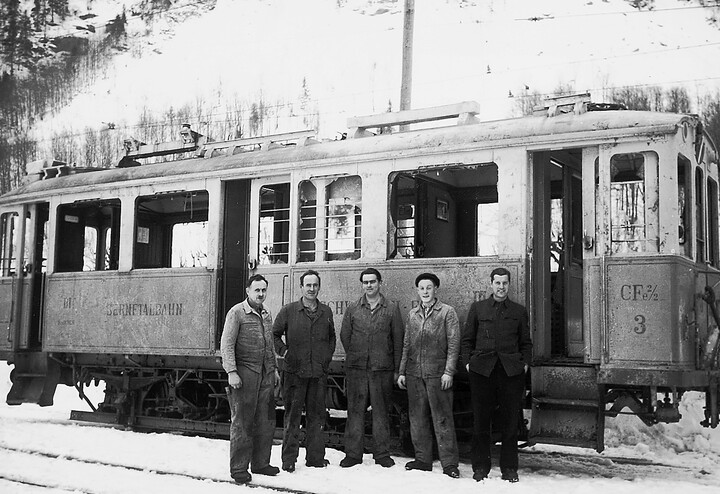



*Es erzählt Jakob Kubli-Cia, \*1928, Elm. Das Interview wurde am 16. November 2004 geführt.*

Nach dem Schulaustritt arbeitete ich zuerst in der Therma. 1953 wurde
ich bei der Sernftalbahn angestellt. Zuerst half ich im Depot und in
der Werkstatt. Dort, wo ich gebraucht wurde, wurde ich eingesetzt.

Eine grosse Arbeit war die Revision der Wagen. Jeder Wagen wurde alle
zwei bis drei Jahre vollkommen überholt. Er wurde dazu über die
Putzgrube gefahren. Über eine Treppe gelangte man in die Grube, die
sich unter dem Geleise befand, auf dem der Wagen, der zur Revision
kam, ins Depot gefahren wurde. So konnte man von unten alles
kontrollieren. Der Wagen wurde dazu zuerst abgespritzt, damit
eventuelle Mängel festgestellt werden konnten. Alles, was in der
Werkstatt repariert werden konnte, wurde auch da gemacht; so wurden
alle Dreharbeiten durch die gelernten Mechaniker, den Kummenberg-
Schaagg, Hans Marti oder den Hugeten-Chüeri, ausgeführt. Es musste ja
auch zum Geld Sorge getragen werden. Doch manche Bestandteile wurden
in Oerlikon bestellt. Mussten die Radkränze neu aufgezogen werden, so
wurde die Achse samt den Rädern nach Zürich in die Werkstätte des
Zürich-Trams geschickt, zuerst per Bahn, später mit einem Lastwagen.
Dort gab es eine Maschine, mit der man die Felgen schleifen und neu
auf den Radstern aufziehen konnte. Zum Entfernen der Achse mitsamt den
Rädern musste der Wagen aufgebockt werden. Waren wir in der Werkstatt
uneinig, wie ein Mangel zu beheben sei, so riefen wir den Chef, damit
er entscheide. Er musste ja schliesslich auch die Verantwortung
tragen. Waren die neuen Bestandteile eingesetzt, wurde das ganze
Fahrwerk neu geschmiert.

Bei der Revision eines Wagens musste auch im Innern jedes Abteil einer
gründlichen Reinigung unterzogen werden. Die Holzleisten, aus denen
die Sitze bestanden, mussten einzeln abgeschraubt, gereinigt und
lackiert werden. Leisten, an denen z. T. der Lack abgesplittert war,
wurden mit Glasscherben abgekratzt und neu lackiert. Dann wurden die
Leisten wieder angeschraubt. Meist wurden die Decken frisch gestrichen
und die Wände gereinigt. Einmal wurden alle alten Wagen aussen von
blau auf grünlich umgestrichen. Die Revision eines Wagens dauerte bis
drei Wochen.

Eine weitere grosse Arbeit innerhalb des Jahres war das Bereitstellen
der Chriesi-Wagen auf die Landsgemeinde hin. Zuerst mussten die
offenen Wagen, die ja in der Regel zum Transport der Steine aus dem
Steinbruch Matt dienten, gründlich gereinigt werden. Zu jedem Wagen
gab es nummerierte Einzelstücke; so gehörten zum Wagen 46 alle 40er-
Nummern. Diese Einzelteile des Aufbaus waren oben im Depot gelagert
und wurden von dort heruntergeholt. Zu jedem Wagen gehörte zudem ein
Segeltuchdach mit «Fälbeli» und Segeltuchvorhängen. Die Vorhänge zog
man nur bei schlechtem Wetter zu, damit die Fahrgäste nicht allzu nass
wurden. Der Chriesi- Wagen war bei schönem Wetter sehr beliebt, und
jeder und jede wollten sich darin einen Platz ergattern. Nach dem
Festtag musste von uns wieder alles weggeräumt, nach oben getragen und
die Wagen mussten wieder in die Bitzi gestellt werden. Jetzt denke
ich, es gab doch manche schöne Stunde, auch wenn man damals hie und da
über die zusätzliche Arbeit «fluchte».

Natürlich gab es nach dem Bremimärt manchen Wagen zu reinigen, und da
waren noch die wöchentliche Reinigung jedes Wagens und das Beheben
kleinerer Schäden. Die Holzbänke und die Wände wurden feucht
abgerieben. Im Raucherabteil gab es etwas mehr zu tun als im
Nichtraucher. Dort wurde auch, durch den Maler Schaagg oder den Maler
Näf, die Decke öfters neu gestrichen.

An den Wänden neben den Türen der alten Wagen waren Fotos in Rahmen
angeschraubt und bei den Fenstersimsen weisse, emaillierte Täfelchen.
Dort standen unerwünschte Verhaltensweisen drauf, wie etwa: «Nicht auf
den Boden spucken» oder « Hinauslehnen verboten!» Tatsächlich gab es
noch Personen, die auf den Boden spuckten. Die Arbeiter aus dem
Plattenberg oder aus dem Steinbruch in der Bitzi setzten sich mit
Vorliebe im Postfach auf die zwei Bänke. Der Hinterbach-Kubli räumte
immer zuerst seine Pfeife auf den Boden des Wagens aus, stopfte sie
neu und fing an, die Reste des «Schigg» und, was sonst damit hochkam,
auf den Boden zu spucken. Einmal machte ich ihn darauf aufmerksam,
dass das für die anderen Fahrgäste vielleicht nicht appetitlich sei.
Er aber sagte nur, wenn ich im Staub arbeiten würde wie er, würde ich
wahrscheinlich auch « chöderen».

Im Depot und in der Werkstatt half man einander immer aus. Bei grossem
Arbeitsanfall kamen die beiden Maschinisten aus dem Maschinenraum nach
unten und arbeiteten mit, und fiel etwas Unvorhergesehenes im
Maschinenraum an, halfen Depotarbeiter mit, die Arbeit zu bewältigen.

Auf der Strecke arbeitete ich nur aushilfsweise, etwa, wenn es die
schweren Schienen auszuwechseln galt.

Bei der Umstellung der Bahn auf die neuen Wagen wurde die
Linienführung begradigt. Die schärfsten Kurven wurden ausgemerzt.
Zuerst wurde durch eine Spezialfirma eine neue Fahrleitung eingezogen.
Waren bei den alten Wagen zwei Fahrleitungen nötig gewesen, brauchte
es bei den neuen nur noch eine. Diese war dafür dicker. Alles andere,
das Versetzen der Stangen und das Verschieben der Schienen, geschah in
Nachtarbeit. Dazu wurde auch ich aufgeboten. Licht spendeten uns
Karbidlampen und ein Scheinwerfer, der durch eine Batterie gespiesen
wurde.

Wir waren uns gewohnt, bei eingeschaltetem elektrischem Strom zu
arbeiten. Aber die neuen Fahrleitungen standen immerhin unter 800
Volt. Da es aber Gleichstrom war, war es weniger gefährlich als
Wechselstrom. Auf dem Turmwagen waren wir schon früher hie und da mit
einer Leitung in Kontakt gekommen. War der Turmwagen trocken, merkte
man es kaum, war er dagegen nass, war es weniger angenehm. Zu Anfang
der Nachtarbeit erklärte man uns, bei den neuen Fahrleitungen könne
man den Strom unterbrechen. In bestimmten Abständen gab es eine
Stelle, wo man ein Stück Draht herausziehen konnte, und dadurch wurde
der Strom unterbrochen. Es wurde uns gesagt, wir dürften nicht «unter
Strom» arbeiten. Aber eben… Zuerst mussten die Stangen versetzt
werden. Diese waren oft im Fels mit Stahlkabeln verankert. Die Arbeit
des Herauslösens, Versetzens und das Wieder-Neubefestigen nahm
manchmal mehr Zeit als vorgesehen in Anspruch. Wir mussten aber in
jeder Nacht mit dem angefangenen Schienenabschnitt fertig werden, weil
der tägliche Verkehr garantiert sein musste. So nahmen wir uns keine
Zeit zum Abstellen des Stroms. Manchmal konnten recht gefährliche
Situationen entstehen, etwa wenn wir die Drahtkabel über die Leitungen
hinüberziehen mussten. Es durfte da keinen Kontakt zwischen Leitung,
Drahtkabel und Boden geben. Oft sagten wir am Morgen zueinander:
«Heute Nacht haben wir wieder Glück gehabt.»

In schneereichen Wintern wurde aus den Arbeitern des Depots und der
Werkstatt eine Ersatzequipe zum Schneeräumen zusammengestellt. So war
es auch am 11. Januar 1954. Heinrich Hämmerli war mit den
Streckenarbeitern am Tag zuvor unablässig mit dem Schneeschlitten hin-
und hergefahren. Die Männer waren erschöpft und brauchten unbedingt
eine Ruhepause. Da wurden wir als Ersatzequipe aufgeboten. Es waren
Jakob Rhyner, Samuel Blumer, Fritz Blumer, Chueret Blumer, Jakob
Hämmerli als Aushilfe und ich. Von allen bin heute nur noch ich am
Leben. Wir fuhren mit zwei zusammengekoppelten Motorwagen vor dem Zug,
der um 10 Uhr in Elm abfuhr, her, um die Geleise vom Schnee zu
befreien. An den Kurszug war noch ein Viehwagen, mit einer Kuh drin,
angehängt. Aber es schneite so heftig, dass unsere beiden Motorwagen
die Menge des Schnees nicht vor sich her zu schieben vermochten. So
hängten wir noch den Kurswagen mit dem Viehwagen hinten an, um mehr
Schubkraft zu bekommen. Nun aber war der hinterste Wagen der stärkste
und der vorderste der schwächste. Wir wussten wohl, dass das nicht
ideal war, aber am vordersten Wagen war ja der Schneepflug montiert.
Der musste zuvorderst bleiben, und mitten auf der Strecke konnten wir
daran nichts ändern. Was wir befürchteten, trat ein. In einer Kurve
lief der vorderste Wagen geradeaus. Die Schubkraft der hinteren Wagen
hatte ihn aus dem Geleise gestossen. So mussten wir Rinnen pickeln und
Schnee wegräumen, damit es uns gelang, den Wagen wieder auf das
Geleise zu ziehen. Es gelang zwar, aber wir kamen erst um gut 15 Uhr
in Schwanden an, hatten also für die Fahrt Elm-Schwanden fünf Stunden
gebraucht. Jakob Hämmerli lief sofort in den Schwanderhof, um ein
verspätetes Mittagessen zu bestellen. Im Nachhinein war es ein Glück
für uns, sonst hätten wir das, was uns noch erwartete, nicht so gut
überstanden.

Gestärkt machten wir uns auf den Rückweg. Wir kamen bis über die Warth
hinaus, und plötzlich stiessen wir auf einen Lawinenzug. Die
Chlepferlaui war niedergegangen. Der Kummenberg-Schaagg sagte: «So
rasch wie möglich zurück, aus dem Gefahrengebiet hinaus!» Wir zogen
den Schneepflug hoch und fuhren bis zur Warth zurück, um dann dort zu
rangieren und den Schneepflug wieder vorne anzukoppeln. Alle befanden
sich ausserhalb der beiden Wagen, nur Chueret Blumer musste im Wagen
ohne Schneepflug Wagenwache halten, damit der Zug nicht
unbeaufsichtigt in Bewegung geraten konnte. Ich hörte noch, wie jemand
rief: «Eine Lawine!» – Und schon ergriff mich ein Luftzug und warf
mich zu Boden. Alles ging blitzschnell. Als ich mich wieder bewegen
konnte und langsam «aufkalberte», sah ich zwei der Männer, die schon
aufgestanden waren. Der Luftdruck hatte sie gegen die Wand des
«Freihofs»[^1] getrieben. Ich hatte mit dem Kopf unter dem Schneepflug
gelegen. Nicht auszudenken, wenn auch dieser Wagen umgekippt wäre!
Schliesslich sahen wir, dass zwei von uns fehl ten, Samuel Blumer und
Chueret Blumer. Wir begannen zu suchen. Zuerst fanden wir Samuel
Blumer. Er lag nur etwa 20 Zentimeter von der Längsseite des stehenden
Zuges entfernt. Auch er hatte Glück, dass der Zug nicht auf ihn
gekippt war. Samuel Blumer war mit etwa dreissig Zentimeter Schnee
bedeckt, aber der Schnee war hart wie Zement. Wir gruben rund um den
Kopf frei und glaubten im ersten Moment, Sämi sei tot. Inzwischen war
aber Doktor Zweifel von Schwanden gekommen und schloss Sämi sofort an
die Sauerstoff-Flasche an. Nach kurzer Zeit bewegte sich Sämi wieder.
Wir gruben ihn ganz aus. Doktor Zweifel sagte, die Bähnlermütze, die
Sämi vor das Gesicht gerutscht war, habe ihm das Leben gerettet, weil
sie zum Atmen einen kleinen Hohlraum gebildet hätte. Sofort machten
wir uns auf die Suche nach Chueret Blumer. Der Wagen, in dem er
Wagenwache gehalten hatte, war seitwärts gekippt und mit Schnee,
Steinen und Geröll bedeckt. Wir begannen zu schaufeln und mit einer
Säge, die wir erst mit Hindernissen hatten organisieren können, den
Baumstamm zu zersägen. Plötzlich stiess ich auf ein Fenster. Wir
drückten das Fenster ein, und ich zwängte mich durch den Schnee
hinein. Wir fanden Chueret im Führerstand, wo er sich vorher
aufgehalten hatte. Er stand aufrecht da, und es fehlte ihm gar nichts.
Er sagte, er hätte durch den Schnee immer einen kleinen Lichtschimmer
gesehen. Durch das zerschlagene Fenster schob ich Chueret hoch, und
die anderen zogen ihn ganz nach draussen. Im Laufe dieser
Rettungsaktion zerriss ich meine Hosen. Mathias Blumer und Walter
Spälty waren inzwischen von Engi her in die Warth gekommen. Samuel
Blumer wurde zur Kontrolle ins Spital gebracht. Alle anderen konnten
im Schwanderhof übernachten, und am Morgen waren meine Hosen wieder
geflickt; eine Serviertochter hatte mir, ungeheissen, diesen Dienst
erwiesen. Wir mussten eine Woche lang in Schwanden bleiben und von da
aus in die Warth zum Wegräumen der Lawine fahren.

Wie die meisten lernte auch ich Wagenführer, und ich fuhr mit den
Einmannwagen oft zwischen Elm und Schwanden hin und her. Da gäbe es
noch viel zu erzählen. Aufs Ganze gesehen war es eine gute Zeit.
Natürlich gab es auch Spannungen. Ich war ja Präsident der
Bähnlergewerkschaft für die Sernftalbahn, und da konnten
Auseinandersetzungen nicht fehlen. Aber wo gibt es das nicht?

Mit der Umstellung auf den Bus und dem Erlernen des Busfahrens wurde
manches anders und neu. Auch diese Phase gehört zu meinem Leben. Ich
war fast alle meine Arbeitsjahre bei den Verkehrsbetrieben Sernftal
angestellt.

[^1]: In der Warth gab es damals ausser dem «Sternen» noch das
    Restaurant «Freihof», direkt bei der Haltestelle.


