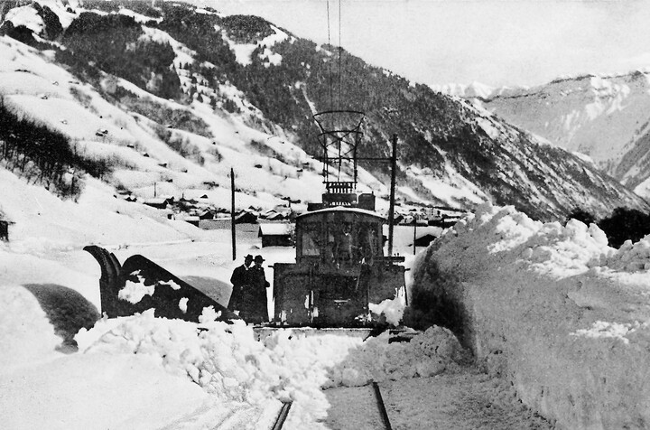
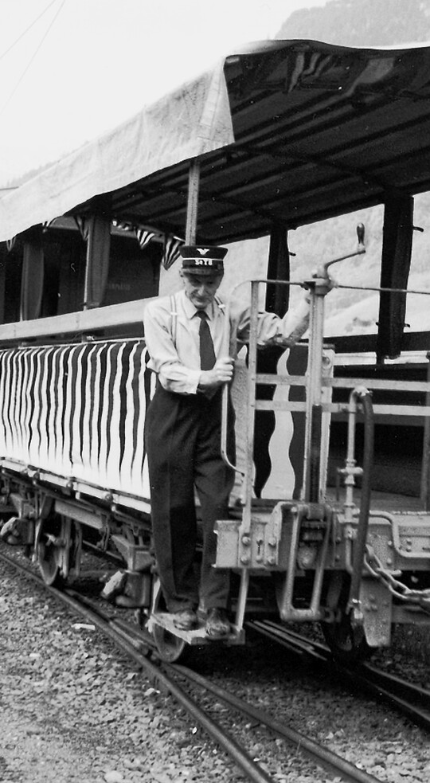



*Es erzählt Leni (Magdalena) Blumer-Altmann, 1924-2014, Engi. Das Interview wurde am 18. November 2003 geführt.*

Mein Vater, Fritz Altmann-Stauffacher (1892–1968), kam 1917 als
25jähriger zur Sernftalbahn. Vorher war er jeweils im Sommer «dz Alp».
Von Anfang an arbeitete er bei der STB an den Geleisen, in der Gruppe,
die dem jeweiligen Bahnmeister unterstand.

Am schlimmsten war für alle der Winter, ganz besonders für die Männer,
die an der Strecke arbeiteten. Sie mussten an erster Stelle darum
besorgt sein, dass sie offen blieb. In strengen Wintern waren sie Tag
und Nacht auf den Beinen. Sie fanden oft nicht manche Stunde Schlaf.
Schneite es ununterbrochen, mussten sie auch ununterbrochen hin- und
herfahren. Sie teilten dann die Nacht in zwei Schichten ein.
Spätestens um 4 Uhr musste einer wieder auf die Strecke, damit die
Geleise für den ersten Zug frei waren. Die meisten, die auswärts
arbeiteten, hatten ihren Arbeitsplatz in der Therma, und die mussten
rechtzeitig mit der Arbeit beginnen.

Mein Vater musste hie und da auch die Aufgaben des Streckenwärters
übernehmen. Er musste jeden Morgen von 4 Uhr an von Engi nach
Schwanden die Geleise ablaufen und kontrollieren, ob alles in Ordnung
sei. In der dunkeln Jahreszeit nahm er eine Karbidlampe mit. War das
Geleise blockiert, etwa durch einen Stein, so entfernte der Vater
diesen, falls er nicht zu schwer war. Sonst musste man Hilfe holen
oder den Zug anhalten. War alles in Ordnung, kam der Vater mit dem
nächsten Zug wieder nach Engi zurück und nahm das Morgenessen ein.

Für die Arbeit auf der Strecke hatte man eine Art Güterwagen mit
Motor. Darin war das Werkzeug untergebracht. Im Winter konnte der
Schneepflug vorne montiert werden. Es gab zwei Arten von
Schneepflügen. Der kleinere, «der Spitz», war zum Freimachen der
Geleise bestimmt, mit dem grösseren hingegen wurde ein Teil der
Strasse geräumt, damit auch Fussgänger und Fuhrwerke Platz hatten. Der
Motorwagen stiess einen offenen Güterwagen vor sich her, an welchem
der grosse Pflug befestigt war. Damit der Güterwagen beim Räumen der
Strasse nicht aus dem Geleise gedrückt wurde, war er mit Bahnschienen
beladen. Die Arbeit mit dem Strassenpflug war ein grosses Theater. Die
Schienen der Sernftalbahn waren in der Strasse verlegt und führten an
manchen Stellen, so etwa in Matt oder beim «Murer-Schang»[^1] in Engi-
Hinterdorf, ganz nahe an den Häusern vorbei. So mussten die Arbeiter
immer wieder aussteigen und je nachdem den Winkel des Schneepflugs
kleiner oder grösser machen, den Sperrbalken lösen und nachher wieder
festmachen. Zuerst fuhren sie immer mit dem kleinen Schlitten und dann
erst mit dem grossen. Der Strassenpflug hätte gar nicht allen Schnee
auf einmal wegschieben können.

Eines Winters war es so kalt, dass sie auf der ganzen Strecke zuerst
das Eis aufpickeln mussten, bevor sie mit dem Schlitten fahren
konnten. War eine Lawine niedergegangen, mussten alle verfügbaren
Männer beim Schneeräumen mithelfen. Es waren oft bis gegen hundert.
Sie machten nicht ungerne mit, denn sie verdienten dabei ein paar
Rappen. Mein Vater hatte die Elmer unter sich und musste ihnen die
Arbeit zuteilen. Waren sie zwischen Matt und Elm fertig, halfen sie,
wenn nötig, auch weiter vorne beim «Schorren».

Einmal war ein ganz schlimmer Tag; es schneite und stürmte
ununterbrochen. Die Lawinensituation war prekär. Ich hatte dann
jeweils grosse Angst um meinen Vater. Gegen Abend kam er kurz heim und
sagte: «Ich rechne, dass wir während der ganzen Nacht Schnee räumen
müssen. Bringe mir etwa um 10 Uhr eine Thermosflasche mit Kaffee zum
Bahnhof hinunter.» Die Mutter machte den Kaffee, und ich ging zum
Bahnhof Engi-Vorderdorf. Der Güterwagen kam. Er war vom Schnee ganz
verklebt und sah aus wie ein Schneehaus auf Rädern. Der Zug hielt an.
Ich gab dem Vater die Thermosflasche in den Wagen hinein – und wer
stand denn da vorne? Es war Walter Spälty, der damalige
Verwaltungsratspräsident. Die Männer waren alle übermüdet, durchfroren
und in gedrückter Stimmung. Auf mich machte es damals grossen
Eindruck, dass Walter Spälty mitfuhr. Er hätte ja schliesslich in
seiner Villa im warmen Bett bleiben können. Stattdessen blieb er, wie
die Arbeiter in Überstrümpfen und einem dicken Tschoopen, die ganze
Nacht bei ihnen. Ich vergass das nie und rechnete es ihm hoch an, weil
er in einer schwierigen Situation die Arbeiter nicht im Stich gelassen
hatte.

Der Begräbnistag von Hermann Däster-Wyss, dem Grossvater von Hermann
Däster-Leuzinger, war auch ein stürmischer Schneetag. Die
Streckenarbeiter kamen zwischen Engi-Vorderdorf und Engi- Hinterdorf
mit ihrem Wagen nicht weiter. Sie mussten ihre Werkzeuge zu Hilfe
nehmen. Da stiessen sie plötzlich auf eine Frau, die in einer Wächte
steckengeblieben und schon halb eingeschneit war. Es war die Frau vom
Bühl-Kobi, die Grossmutter von Anni und Didi Blumer. Sie war auf dem
Weg von der Beerdigung in Matt nach Hause. Die Schneefälle waren so
heftig, dass es für sie kein Weiterkommen mehr gab. Wären die
Streckenarbeiter nicht unterwegs gewesen, wäre sie ganz eingeschneit
worden und wahrscheinlich in der Nacht erfroren.

Wenn ich zurückdenke, muss ich sagen, dass die Sernftalbahn aufs Ganze
gesehen hundert Schutzengel hatte. Die Männer, die an der Bahn
arbeiteten, gingen, vorab im Winter, manchmal haarscharf am Tod
vorbei. Mein Vater erzählte einmal, wie sie wegen der
Meissenbodenlawine mit knapper Not aus dem Wagen springen und
davonlaufen konnten.

Im Winter hatte mein Vater oft nur eine Viertelstunde zum Essen Zeit.
Er zog dann die Schuhe gar nicht aus, und die Mutter legte ihm eine
Türvorlage unter die Schuhe, damit nicht alles nass wurde.

Oft war er den ganzen Tag in nassen Kleidern. Natürlich hatten sie die
schweren Doppelmäntel, die einige Kilo wogen. Aber auch diese waren
nicht wasserundurchlässig und wurden durch die Feuchtigkeit umso
schwerer. Die hagebuchenen Hosen waren hingegen im Sommer nicht ideal,
da waren sie viel zu dick. Die Schuhe mussten für die Arbeit geeignet
sein. Es waren genagelte Hochschuhe. Für meinen Vater machte sie der
Schuhmacher Davi im Unterhaus. Die Schuhe waren nicht gefüttert. Mein
Vater fütterte darum die Schuhe im Winter mit Zeitungen aus, und wenn
er am Abend heimkam, stopfte er die nassen Schuhe ganz mit Zeitungen
aus, um sie zu trocknen. Aber es konnte doch geschehen, dass er am
Morgen wieder in die feuchten Schuhe schlüpfen musste und sie ein paar
Tage nicht trocken brachte. Fast alle hatten ja nur ein Paar Schuhe
und kein zweites zum Wechseln.

Eines Winters versuchte das Militär mit Minenwerfern die
Meissenbodenlaui auszulösen. Die Bahnarbeiter mussten durch den tiefen
Schnee alles Material ins Geisstal hinaufbuckeln. Der Versuch brachte
nicht viel. Die Meissenbodenlaui kam, wann sie wollte.

Im Frühjahr mussten die Arbeiter im Stock den grossenLauizug
abschreiten und die losenSteine zum Teil nach unten befördern oder
irgendwie sichern. Zum Teil war das aber eine müssige Massnahme. Mein
Vater sagte oft, wenn alle einmal im Lauizug gewesen wären, würde
mancher die Sernftalbahn nicht mehr besteigen.

Auch im Sommer konnte es hart werden. Die Arbeit an den Geleisen war
an sich streng, aber in heissen Sommern war es oft kaum zum Aushalten.
Vater kam dann oft wie gesotten heim. Ich weiss noch, dass sie in
einem der heissen Sommer am Morgen sehr früh mit der Arbeit anfingen
und dann über die Mittagszeit eine lange Pause machten, um der
grössten Hitze auszuweichen. Sie waren halt sommers und winters dem
Wetter ausgesetzt.

Einmal hatte mein Vater einen schweren Unfall. Er war mit anderen
Männern auf dem Turmwagen, um einen Neuanstrich auszuführen. Da
streifte ein am Wagen befestigtes Brett ein Gebäude, und der Turmwagen
kippte um. Der Seiler-Heiri, der damals noch jung war, konnte
hinunterspringen. Mein Vater und Heinrich Hämmerli, der Vater von
Au-Hans, von Fritz und Vreni, fielen hinunter. Mein Vater fiel auf den
Schotter, Heinrich dagegen auf die Geleise. Heinrich war schwer
verletzt. Er konnte nie mehr arbeiten und musste an Stöcken gehen.
Just an diesem Tag war ich aus der Schule zu einer Freundin, statt
nach Hause, gegangen. Ich wusste, dass meine Mutter damit nicht
einverstanden gewesen wäre. Als ich nach Hause kam, näherten sich eben
ein paar Männer von der Seidenwindi her mit einer Bahre unserem Haus.
Darauf lag mein Vater. Ich erschrak, meinte, er sei vielleicht tot,
und hatte sofort ein schlechtes Gewissen und dachte: «Jetzt bist du
schuld, weil du unerlaubterweise zur Freundin gegangen bist.» Vater
erholte sich wieder, aber eine gewisse Schwäche im Rücken blieb. Wir
waren aber dankbar, dass er bei dem Unfall so gut weggekommen war[^2].

Der Lohn war ja nicht gross. Gut, niemand erwartete damals eine grosse
Entlöhnung, aber die Bahnarbeiter mussten wenn nötig «allzeit bereit»
sein, ob es nun Sonntag war oder nicht. Der Samstag war ja auch noch
nicht frei. Als andere Betriebe am Samstag frei hatten, machten die
Streckenarbeiter auch einen Versuch. Aber der Chef sagte, das sei
unmöglich. Mein Vater, der 77 Jahre alt wurde, hat es nach seiner
Pensionierung doch noch erlebt, dass der Samstag frei wurde.

Etwas war schön. Beide Bahnmeister, unter denen mein Vater arbeitete,
waren gute Männer, sowohl Leonhard Hämmerli als auch Heinrich
Hämmerli. Als Leonhard Hämmerli 1939 starb, wurde auch mein Vater
angefragt, ob er nicht Bahnmeister werden möchte. Aber das Befehlen
und Vornedranstehen war ihm nicht gegeben. In der Gruppe waren ds
Chüechnechtä-Mathis, der Siitli-Peter (später arbeitete er im
Schuppen), der Dittli, für eine Weile auch der Egg-Heiri und im Laufe
der Jahre auch noch andere. Untereinander hatten sie es gut; es gab
selten Differenzen. Sie waren wie zusammengeschweisst, denn sie
wussten, dass sie im Notfall auf Gedeih und Verderb aufeinander
angewiesen waren, und das machte aus ihnen beinahe eine Bruderschaft.

Natürlich hatten sie auch ihre kleinen Abwechslungen, wenn sie auf der
Strecke am Grampen waren, und erlaubten sich vor allem jüngeren Frauen
gegenüber hie und da einen Spass. Das Gemsberg-Lili war eines ihrer
Opfer. Sie hatten das Gefühl, es wäre Zeit, dass es sich verheiraten
würde, und so foppten sie es immer deswegen, sobald sie es sahen. Wenn
es dann darüber ungehalten wurde, hatten sie die grösste Freude.

Im Aufgabenheft meines Vaters war auch der Ablösungsdienst im
Schuppen, entweder in Engi- Vorderdorf oder in Schwanden. In Engi
musste jederzeit eine Person im Schuppen sein. Die Güter aus der
Weberei wurden zuerst noch mit einem Fuhrwerk, durch den
Ochsen-Schaagg und Tagwenvogts Thes, und später mit einem Auto, durch
den Chauffeur- Heiri, an den Bahnhof Engi-Vorderdorf gebracht. Dort
wurden die Kisten und Stückgüter in die Sernftalbahn eingeladen und in
Schwanden in die SBB umgeladen. Dasselbe geschah mit den Platten aus
dem Plattenberg. Auch die Milch wurde täglich per Bahn transportiert
und musste ein- und umgeladen werden. Die Steine aus der Bitzi wurden
durch eigene Arbeiter umgeschichtet. Oft war es Giroldi, der diese
Arbeit machte. Ein Sernftalbahngüterwagen wurde auf einem
Stumpengeleise in Schwanden neben einen SBB-Güterwagen gestellt, und
dann wurden die Steine von Hand umgeschichtet.

Viel Arbeit gab es auch während der Viehschauen. Da musste das Vieh in
den Dörfern eingeladen und in Schwanden umgeladen werden. Das
Umgekehrte geschah am Abend nochmals. Da kam es dem Vater zugute, dass
er von der Alpwirtschaft her wusste, wie er mit dem Vieh umgehen
musste. Die Elmer hatten eine Zeitlang einen schweren Prachtsstier,
der weit herum bekannt war. Nicht alle wollten diesen Stier umladen,
gab er doch sofort bedrohliche Laute von sich, wenn man ihm näher kam.
Mein Vater verstand es, auch mit diesem Vieh zurechtzukommen. – Am
anderen Tag mussten natürlich die Viehwagen gereinigt werden.

Mein Vater arbeitete während vierzig Jahren bei der Sernftalbahn und
war deshalb mit diesem Betrieb verwachsen. Er starb im Jahr, bevor die
Umstellung auf den Bus kam. Ich weiss nicht, wie er es empfunden
hätte, wenn er gesehen hätte, wie statt der Sernftalbahn die Busse
hin- und herfuhren.

[^1]: Mit «z’Murer Schange» (des Maurer Johanns) bezeichnete man das
    1970 abgebrochene ehemalige Ratsherrenhaus in Engi-Hinterdorf.

[^2]: Der Unfall ereignete sich am 29. Juni 1932, vgl. Waldburger
    1971, S. 63.
