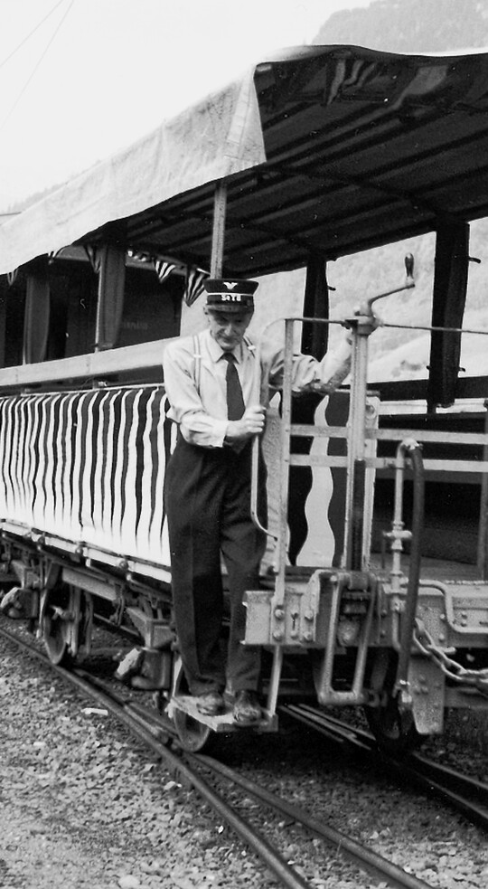



*Es erzählt Mathias Vögeli-Stauffacher, \*1923, Rüti. Das Interview wurde am 26. April 2000 geführt.*

Das erste Mal fuhr ich in der ersten oder zweiten Klasse mit der
Sernftalbahn. Wir machten eine Schulreise nach Elm. Wenn die Bahn um
die Kurven quietschte, stiess ds Begg-Esyse Meitli jedesmal Schreie
aus. Es hatte Angst, die Bahn könnte entgleisen. Den grössten Eindruck
machte mir aber damals ein dreieckiger Stein im Garten des Elmer
Kurhauses, über den das Wasser hinunterlief und den man von hinten mit
einer kleinen Leiter ersteigen konnte.

Dann kam ich viele Jahre nicht mehr ins Kleintal. Erst als ich die
Ausbildung als Bergführer gemacht hatte und dann meine spätere Frau,
ds Didi, kennenlernte, fuhr ich wieder mit der Sernftalbahn. Aber «dz
Liecht» fuhr ich mit dem Velo nach Matt, denn man hatte nicht soviel
Geld, dass man für jede Gelegenheit die Bahn benutzen konnte.

Später, als ich Wildhüter war und wir, nach vielen Jahren, endlich
auch Anspruch auf Ferien hatten, ging ich, zusammen mit einem
Ennendaner, während der Ferien ins Holz. So konnte ich etwas
dazuverdienen. Wir bereiteten Holz im Sernftal, im Stock, auf. Damals
reistete man die Baumstämme in die Kleintalstrasse hinunter. Das war
recht gefährlich, denn einem Baumstamm kann man ja nicht befehlen,
wohin er fahren soll; er kann eben nebenaus gehen. Einmal, als wir bei
der Staffelrunse reisteten, fuhr ein Trämmel blitzartig nach unten und
traf, hart neben dem Bahnwagen, der dort stand, eine Stange. Die
Stange wurde durch den Trämmel abrasiert, und die Leitungen wurden
abgerissen. Natürlich hatte der Bahnmeister Heiri Hämmerli keine
Freude, und uns war es auch nicht recht. Da konnte es schon geschehen,
dass man einander im ersten Schrecken «Schlötterlig» anhängte. Aber
beide Seiten wussten, dass es nicht mit Absicht geschehen war, und man
beruhigte sich wieder.

Die Sernftalbahn war für uns Holzer praktisch. Man kannte den
Fahrplan, und der jeweilige Wagenführer pfiff jedesmal schon von
weitem. So wussten wir, wann wir reisten durften und wann nicht. Als
die Sernftalbahn verschwand, wurde das Reisten unmöglich. Es gab mehr
Verkehr, und man brauchte unten zwei Aufpasser, die auch bezahlt
werden mussten. Kaum wollten wir einen Stamm loslassen, kam von unten
der Befehl «Heb auf!» So wurde das Reisten undurchführbar.


