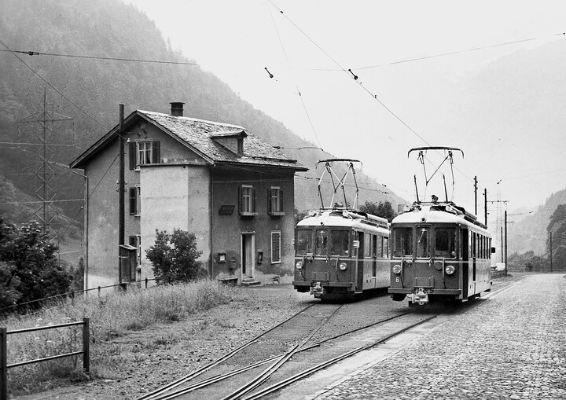
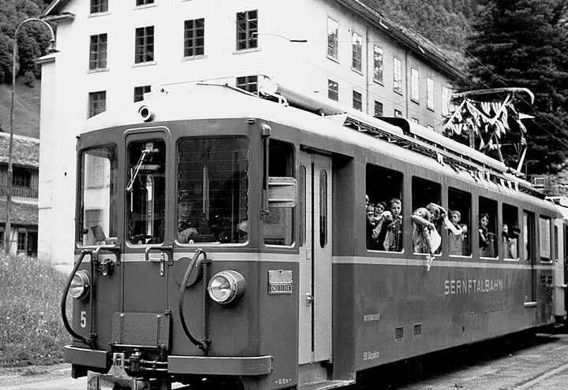
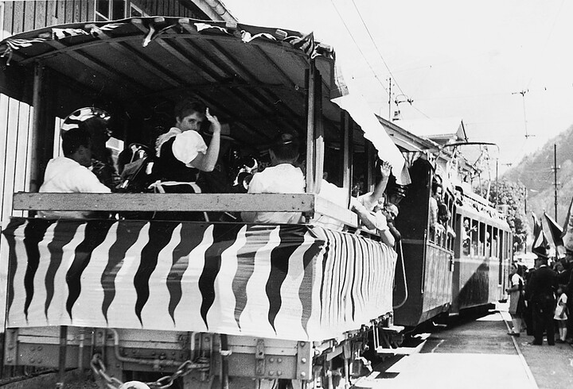
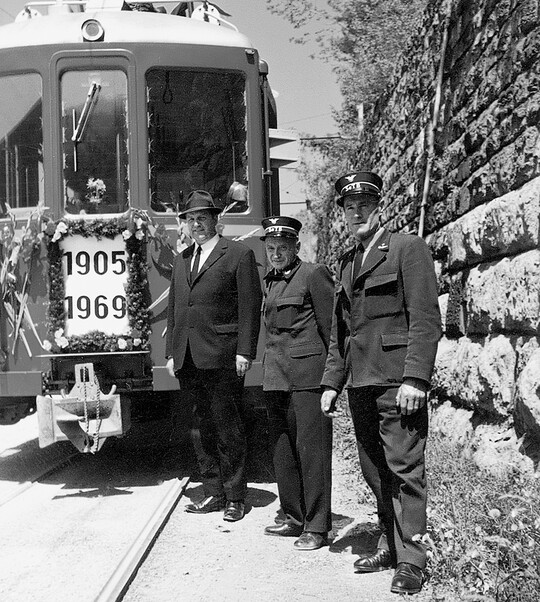



*Es erzählt Katharina Cadonau-Decurtins, \*1922, Warth. Das Interview wurde am 20. Januar 2000 geführt.*

Solange ich in die Therma zur Arbeit ging, fuhr ich jeden Tag mit der
Sernftalbahn nach Schwanden. Im Winter konnte ich manchmal mit dem
Schlitten vom «Sternen» bis zur Therma fahren. Der Schlitten lief
gegen die Therma hin langsam aus. Ich fuhr nahe bei den Geleisen, denn
dort war die Strasse glatt. Kam aber die Bahn, musste ich zur Seite
hin ausweichen.

Wenn der Zug überfüllt war, durfte man auch im Zweitklasswagen sitzen,
aber nur, wenn kein Passagier drin war. Dort waren die Sitze
gepolstert und mit Plüsch oder Manchester überzogen. Mir gefielen die
Holzbänke und die hölzernen Gepäckträger aber ebenso gut. Ganz selten
konnte man im Gepäckwagen fahren, aber nur im äussersten Notfall. Dort
musste man stehen, konnte sich aber an Schlaufen, die von der Decke
baumelten, halten. Die Bähnler hatten es nicht gern, wenn Leute im
Postwagen waren, wegen der Post. Einmal sagte einer: «Rührt ja nichts
an und nehmt nichts!» Da sagte ich: «Ich nehme nur so viel, wie ich zu
tragen vermag.» Alle lachten. Ich erzog meine Buben dazu, dass sie
aufstehen sollten, wenn Erwachsene einstiegen und der Platz knapp war;
vor allem bei den Frauen sollten sie aufstehen. Mein kleinerer Sohn
sagte eines Tages zu mir: «Heute ist eine Dame in den Zug
eingestiegen, da bin ich sofort aufgestanden.»

Es gab auch noch die Viehwagen. Gab es Vieh zum Aus- oder Einladen,
zogen sich die Bähnler eine blaue Bluse über die Uniform an, damit sie
nicht schmutzig wurden. Es wurde eine Rampe zum Viehwagen geschoben.
Meist war es nicht leicht, das Vieh in den Wagen zu bringen. Viele
Tiere sträubten sich und taten dumm. Ein Bähnler zog dann von vorne,
und einer schob von hinten.

Aus der Warth arbeiteten eine Zeitlang acht Personen in der Therma,
ich, zwei Personen von Heftis, drei von Schiessers und zwei aus dem
«Sternen». Früher konnte man die Sernftalbahn von der Warth aus sehen,
wenn sie durch den Stock fuhr. Meistens gab der Wagenführer dort auch
ein Pfeifsignal. Das war der letzte Moment für uns, um zur Haltestelle
Warth zu eilen. Eines Tages hatten wir diesen Moment verpasst. Wir
rannten senkrecht den Hang zur Strasse hinunter. Der Boden dieses
Rains ist lehmig; immer fliesst dort Wasser hinunter. Unsere Schuhe
blieben stecken, und unsere Kleider waren nass und mit Schmutz
bespritzt. Der Wagenführer sah uns und hielt mitten auf der Strecke
an. Alle im Zug lachten und riefen uns zu: «Hopp, hopp!» Wir stiegen
ein, und schon hiess es: «Steht früher auf, ihr Warthner!» Dabei
arbeitete ich vom Morgen früh bis am Abend spät. In der Therma musste
ich mich zuerst sauber machen, so gut es ging. Heute wäre so etwas
nicht mehr möglich. Wenn ein Busfahrer jemanden herbeieilen sieht,
wartet er zwar, aber es ist doch nicht mehr die gleiche Verbundenheit
wie früher.

Während vielen Jahren hielt die Sernftalbahn bei der Therma; so hatten
wir es zum Arbeitsplatz nicht weit. Plötzlich aber hiess es, die Bahn
dürfe nur bei der Station halten. Warum, weiss ich nicht mehr. Zeit
zum Halten wäre sicher übrig gewesen, denn die Fahrpläne waren nicht
so genau aufeinander abgestimmt wie heute. Wollte man nach Glarus,
musste man meistens zwanzig Minuten warten.

Im Winter konnte es geschehen, dass wegen der niedergegangenen Lawinen
im Stock die Arbeiter aus dem Sernftal nicht zur Arbeit kommen konnten
oder in Schwanden bleiben mussten. Manche schliefen dann während der
kritischen Zeit im Schwanderhof. Andere fanden bei Mitarbeiterinnen
Unterschlupf. Bei mir übernachtete auch für ein paar Nächte eine Frau
Marti aus Engi.

Als wir wussten, dass die Sernftalbahn aufgehoben werden würde, war
ich sehr traurig. Ja, ich trauere ihr immer noch nach, aber es war
nicht zu ändern. Der aufkommende Autoverkehr und der Bau des
Panzerwaffenplatzes auf Wichlen liessen keine andere Lösung zu. Ein
paar Wochen vor der letzten Fahrt war ich mit meinen Kindern am Sernf
unten, beim kleinen Brüggli. Plötzlich hörte ich das vertraute
Geräusch der Sernftalbahn. Zwischen den Bäumen sah ich sie
daherfahren. Mir wurde schwer und traurig zu Mute, wie beim Abschied
von einer Person, die man geliebt hat. Da schrieb ich ein
Abschiedsgedicht:

**Abschied von der Sernftalbahn**

Durchs liebe Glarnerland,\
geführt von treuer Hand,\
schlingt sich die Sernftalbahn\
ja täglich streng heran.

Am steilen Hang vorbei,\
dass Gott jetzt bei dir sei.\
Wo die Lawine braust\
und auch der Bergwind haust.

Wo Hirsch und Murmeltier\
hier leben im Revier.\
Der Jäger auf der Tour\
sucht seine Beute nur.

Von Schwanden bis nach Elm,\
mit Hut und auch mit Helm,\
der Wanderer gar viel\
du leitest hin zum Ziel.

Gabst Platz auch gar so gern\
dem Verehrer aus der Fern,\
zum lieben Vaterhaus\
zurück vom Weltgebraus.

Nun musst du von uns gehn,\
auf Nimmerwiedersehn.\
So tief trifft uns der Schmerz.\
Das arme treue Herz!

Fährst du dem Bach entlang\
und hörst der Wellen Sang\
auf deinem letzten Gang.\
Mir wird das Herz so bang.

Bei der letzten Fahrt wurden alle Gedichte und Zeichnungen in der Bahn
aufgehängt, und man sagte zu mir, ich müsse auch mitfahren. Aber mir
war so schwer, dass ich zu Hause blieb. Ich ging auf meine Kammer. Von
dort aus konnte ich die Sernftalbahn sehen. Als sie in der Warth
vorbeifuhr, pfiff sie zum letzten Mal für mich. Die Tränen stiegen mir
in die Augen, und ich weinte.


