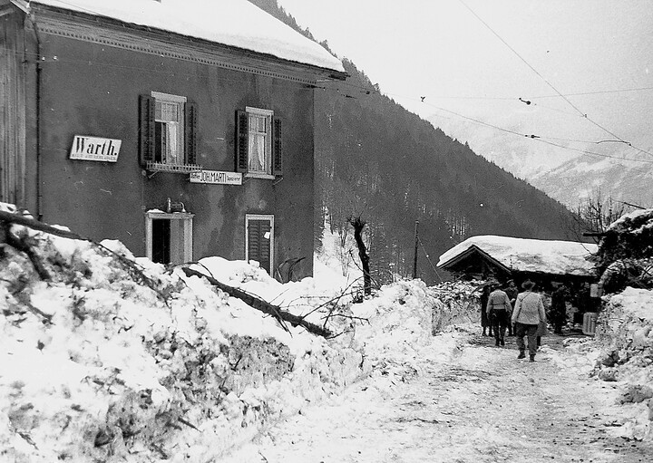
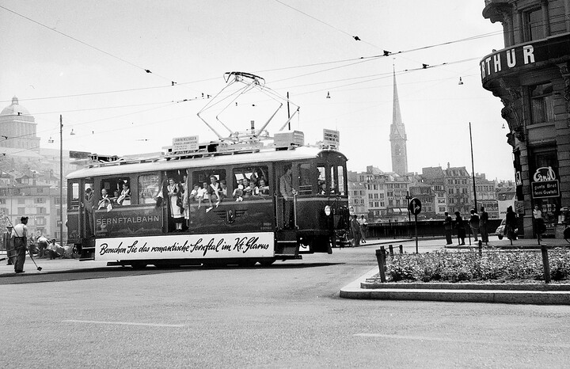
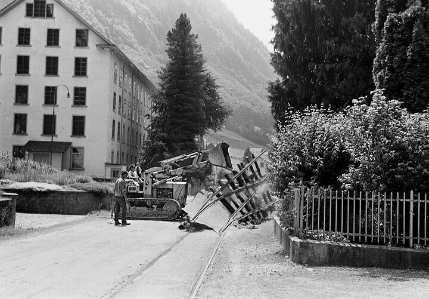



*Es erzählt Mathias Blumer-Baumgartner, 1914-2006, Engi. Das Interview wurde am 2. November 2004 geführt.*

Ich wurde am 18. April 1914 geboren. Am 1. Mai 1929 trat ich als
Lehrling in den Betrieb der Sernftalbahn ein. 1979 wurde ich
pensioniert. Ich verbrachte mein ganzes Arbeitsleben, 50 Jahre, bei
der Sernftalbahn (STB) und der Autobetrieb Sernftal AG (AS). Dabei
habe ich fast alle Arbeitsbereiche und Funktionen, die bei der STB und
der AS möglich waren, durchlaufen und ausgefüllt. Wenn ich bedenke,
dass mein Vater schon bei der Sernftalbahn tätig und ich von Kind an
mit der Bahn verbunden war, kann ich fast behaupten, die Zeit zu
überblicken, während der die Bahn das Sernftal mit der übrigen Welt
verband. Wird jetzt, 2005, an das Jahr 1905 erinnert, in dem die
Sernftalbahn zum ersten Mal fuhr, so kann ich beinahe auf 100 Jahre
zurückblicken.

Aus den ersten Jahren des Bahnbetriebes weiss ich nur noch das, was
mich in meiner aktiven Zeit bei der Bahn betroffen hat. Der Bund hatte
schon 1892 die Konzession zum Bau einer Schmalspurbahn ins Sernftal
erteilt unter der Bedingung, dass am Sernf ein Kraftwerk errichtet
würde. Die Schwander aber wollten das Wasserrecht nicht abtreten. 1904
wurde die Konzession erneut erteilt, mit der Auflage eines
Kraftwerkbaus am Mühlebach. Nun konnten die Sernftalbahn und das
kleine Kraftwerk erbaut werden. Den Nachteil des Kraftwerks am
Mühlebach habe ich noch selber erlebt. Es hatte zwei Turbinen mit je
200 Pferdestärken. Im Sommer floss genügend Wasser, um die Turbinen
anzutreiben. Im Winter aber hatte es nur für eine Turbine genügend
Wasser. Da musste die STB in der Warth, in Engi-Vorderdorf und in Matt
oder im Meissenboden einen längeren Halt einschalten und warten, bis
die Druckleitung wieder mit Wasser gefüllt war und wieder Strom
produziert werden konnte. Erst dann konnte weitergefahren werden.

Ich trat im Betrieb der Sernftalbahn eine Lehre als Bahnmechaniker an.
Am liebsten hätte ich ein Technikum besucht, aber das war zur
damaligen Zeit unmöglich und musste für mich ein Traum bleiben.
Immerhin war ich an allem Technischen interessiert, und so war mir
auch eine Bahnmechanikerlehre recht. Mein Vater war mein Lehrmeister.
Ich war lernbegierig und suchte aus eigenem Antrieb mein Wissen zu
erweitern. Ich bestellte einen Ferntechnikkurs beim Institut Onken.
Zuerst arbeitete ich den Elektrotechnikkurs durch und machte auch die
Schlussprüfung. Als zweiten Kurs nahm ich «Die Maschinenbautechnik» in
Angriff. An freien Tagen besuchte ich die Werkstätten anderer
Privatbahnen, etwa der Südostbahn und der Appenzellerbahn. So konnte
ich sehen, wie andere Betriebe und Mechaniker arbeiteten. Das brachte
mir für meine Arbeit sehr viel, und ich konnte manche Kontakte
knüpfen. Die Appenzellerbahn gefiel mir besonders gut, und ich nahm
mir vor, dort nach der Lehre eine Stelle anzunehmen. Natürlich musste
ich die Lehrzeit als Bahnmechaniker mit einer Prüfung abschliessen.
Experten für die praktische Prüfung im Glarnerland zu finden, war
einfach, aber einen Experten für die Theorie aufzutreiben, war
schwieriger. Schliesslich musste einer von Zürich kommen.

Kurz nach der Prüfung zerquetschte ich an der Hobelmaschine den Daumen
meiner rechten Hand. Ein gutes Stück davon musste amputiert werden,
sodass nur ein Stummel blieb. Bei der Arbeit behinderte mich dies zwar
wenig, aber als ich in die Rekrutenschule eintreten wollte, hiess es:
Dienstuntauglich. Das Militär und die Diensttauglichkeit hatten damals
einen ganz anderen Stellenwert als heute. Viele Betriebe stellten
keine Männer ein, die keinen Militärdienst leisten konnten. Ich wehrte
mich mit allen Mitteln für die Aufnahme in die Rekrutenschule, weil
ich wusste, dass mir bei einer Ablehnung viele Möglichkeiten verbaut
sein würden. Vergebens! Der für die Aufnahme zuständige Offizier
sagte: «Mit ihrem Daumenstummel können Sie nicht schiessen, und jeder
Soldat muss schiessen können.» Dabei war ich, trotz Stummel, ein guter
Schütze und habe manchen Kranz herausgeschossen.

Als Militärdienst-Untauglicher konnte ich mich nicht bei der
Appenzellerbahn bewerben, und so war die STB die Möglichkeit, die mir
blieb. In der Werkstatt Engi war ein guter Mechaniker, Hans Bäbler,
beschäftigt, mit dem ich mich gut verstand. Seine Frau war Genferin,
und da beschloss das Ehepaar, nach Genf zu ziehen und eine Wäscherei
zu eröffnen. Da bekam ich 1945 die frei werdende Reparateur-Stelle.
Ich wurde für den Unterhalt aller Anlagen verantwortlich.

In den nächsten Jahren änderte sich für mich vieles. Nach vielen
Diskussionen wurde an der Landsgemeinde 1946 beschlossen, die
Sernftalbahn beizubehalten und das Rollmaterial zu erneuern. Zu diesem
Entschluss hatte das angeforderte Gutachten von Joseph Züger, Direktor
der Städtischen Strassenbahn Zürich, nicht wenig beigetragen. Die
Landsgemeinde stellte die Bedingung, dass Züger die Direktion der STB
übernehmen und die Sanierung der Bahn durchziehen müsse. Züger
übernahm die Direktion der STB. Die STB wurde in SeTB umbenannt, da
das Kürzel STB schon für die Sensetalbahn vergeben war. 1949 wurden
die neuen, roten Wagen eingeführt, und es wurde auf Einmannbetrieb
umgestellt. Die Wagenführer konnten in den neuen Wagen sitzen, sie
mussten beim Fahren nicht mehr stehen wie in den alten Wagen. Die
neuen Wagen hatten ein Ventil, auf das der Fahrer immer einen Fuss
halten musste, liess er dieses los, bremste der Zug automatisch.
Dadurch wurde gewährleistet, dass auch bei Unpässlichkeit des Fahrers
der Zug stillstehen würde und die Passagiere in den Einmannwagen nicht
gefährdet waren.

In dieser Zeit der Umstellung wurde mein Vater pensioniert, und ich
erhielt die Stelle als Depotchef. Damals gab es viel Arbeit. Die alten
Wagen 1 bis 4 mussten umgerüstet und in alle musste auch ein
Bremsventil eingebaut werden. Zum Glück hatte ich damals in der
Werkstatt ein gutes Arbeitsteam, Jakob Rhyner, meinen Bruder Fritz,
Schmieds Sämi. Jeder hatte seine bestimmte Aufgabe, in die er, wenn
nötig durch einen Spezialkurs, eingeführt wurde. So wurde Matthäus
Baumgartner nach Zürich geschickt, um die nötigen Malerarbeiten
kennenzulernen und sie dann in der Werkstatt anzuwenden. Wir mussten
alles selbst in die Hand nehmen. Ich machte die Arbeitsskizzen, und
dann wurde gearbeitet und probiert, bis es klappte. Ich bin noch heute
stolz, dass es uns gelungen ist, auf das Untergestell des alten
Motorwagens 1 einen Dienstmotorwagen aufzubauen, mit Schneepflug, der
sich über die Weichen mittels einer Vorrichtung in die Höhe heben
liess und so nicht hängen blieb. Wir waren die reinsten Erfinder. Weil
wir, wegen der Umrüstung der Wagen, etwas knapp an Rollmaterial waren,
wurde im Sernftal ein Züritram eingesetzt.

In dieser Zeit liess sich auch Betriebschef Jakob Störi vorzeitig
pensionieren, und die Verantwortlichkeiten wurden neu eingeteilt. Der
ganze technische Betrieb wurde meiner Verantwortung übergeben.

Zusammen mit der Erneuerung der Wagen mussten auch Veränderungen an
der Linienführung vorgenommen werden. So war es für die neuen Wagen in
Engi-Hinterdorf zwischen der alten Post und dem «Sternen» zu eng. Der
«Sternen» musste abgerissen werden, damit die neuen Wagen dort fahren
konnten. Manche Kurven mussten neu angelegt werden; sie waren zu eng.
Manche Strassenabschnitte wurden begradigt. Das gab viel Nachtarbeit,
denn die Schienen mussten bei Nacht verschoben und die neuen
Profildrähte der Oberleitung mussten auch nachts eingezogen werden,
denn während des Tages musste ja der Verkehr garantiert sein. Für
diesen Umbau arbeiteten zwar die Monteure von Kummler und Matter.
Trotzdem fiel für uns viel Mehrarbeit an.

1949 starb Züger und wurde durch Hans Weber ersetzt, der aber nur bis
1951 blieb. Dann übernahm Walter Spälty die Direktion. Er merkte aber,
dass der Einsatz, den dieses Amt verlangte, neben seinen anderen
Aktivitäten zu gross war, und so demissionierte er nach wenigen
Jahren. So wurde ich sein Nachfolger; ich wurde Direktor.

Da meine Aufgaben mannigfach waren, wurde ich entlastet. Die
Buchhaltung wurde über diejenige der Südostbahn abgewickelt. Auf dem
Büro in Engi wurden lediglich die Abrechnungen der Stationsvorstände
und der Kondukteure gesammelt und dann an die entsprechende Stelle der
Südostbahn geschickt. Die Kondukteure erhielten jeweils einen Stock
von nummerierten Billetten für die einzelnen Stationen. Diese mussten
sie dann Ende Monat abrechnen und ihren Stock eventuell wieder
auffüllen.

Ich erhielt auch eine Hilfe auf dem Stationsbüro, Samuel Altmann, «dr
Höfli-Sämi». Er musste einen Schreibmaschinenkurs besuchen und hatte
die Schreibarbeiten auszuführen und viele andere Arbeiten, die
anfielen. Trotzdem blieb für mich ein gerüttelt Mass an Arbeit. Auf
mir lastete die Hauptverantwortung. Zeitweise arbeiteten 26 Männer bei
der Sernftalbahn, für die ich verantwortlich war. Alle technischen
Bereiche fielen immer noch in meine besondere Verantwortung,
Rollmaterial, Werkstatt, Maschinenhaus, Geleise, Fahrleitung. Als
Vorstand machte ich Aushilfsdienst oder fertigte den letzten Zug in
Engi ab.

Natürlich häuften sich im Laufe der Jahre viele Nebenämter an,
manchmal zu viele: Gemeinderat als Baupräsident, Präsident des EW
Engi, Präsident des Verkehrsvereins, Präsident der
Matt-Weissenberg-Seilbahn. Über mangelnde Arbeit konnte ich mich nie
beklagen. Zum Glück hatten meine Frau und die Familie Verständnis.

Wir hatten aufs Ganze gesehen mit der Sernftalbahn viel Glück. Gar nie
gab es einen tödlichen Unfall, was, vor allem im Winter, leicht
möglich gewesen wäre. Es gab zwar recht viele Störungen mit den Wagen.
Streckenweise hatte es ja auch ein rechtes Holpergeleise. Ich erinnere
mich noch gut, wie der Wagen 4 beim Hause vom Fritz Marti in Matt
neben das Geleise geriet. Da musste jeweils der Wagen wieder
aufgegleist werden. Das war zwar kein Kinderspiel, aber die Arbeiter
bekamen mit der Zeit im Aufgleisen richtig Routine und machten diese
Arbeit ohne grosses Federlesen.

Die grösseren Unfälle sind alle bekannt. Der erste geschah ziemlich am
Anfang des Bahnbetriebs. Ein Motorwagen fuhr Richtung Schwanden. Bei
der Lochsite war das grösste Gefälle der ganzen Bahnstrecke. Der
Wagenführer bremste ab, aber die Räder waren blockiert, die Schienen
nass. Das Bremsen nützte nichts. Der Zug nahm an Tempo zu. Da bekamen
einzelne Fahrgäste Angst. Eine Frau sprang bei der Wirtschaft «Au» vom
Wagen ab. Sie war nur unerheblich verletzt, und der Wagen verlor ja
auch an Tempo, sobald er auf das ebene Strassenstück kam.

Auf Fotografien ist auch das Unglück im Chlepfer zu sehen. Drei Wagen
waren darein verwickelt, einer blieb stehen, einer kippte um, und
einer war halb ins Bord hinuntergerutscht. Obschon im umgestürzten
Wagen Fahrgäste waren, gab es zwar leicht und mittelschwer Verletzte,
aber, zum Glück, keine Toten.

In einen Unfall war mein Vater verwickelt. Das war damals, als ein
Wagen mit einer Zementladung von fünf Tonnen in der Warth ins Rollen
kam. Der Zementwagen sollte neu angekuppelt werden; dazu wurde der
Bremsschuh entfernt. Der Wagen kam ins Rollen und bei der schweren
Fracht erwies sich die Bremse als zu schwach. Die Bremsen des Wagens
waren ohne Fracht geprüft worden. Bei der maximalen Ladung von fünf
Tonnen aber griffen die Bremsen nicht mehr voll aufs Rad, was den
Wagen unbremsbar machte. Mein Vater blieb bis zur Lochsite auf dem
Wagen und hoffte immer noch, den Wagen abbremsen zu können. Vor der
Lochsite, beim Güetli, sprang er ab. Der Wagen raste den Abhang
hinunter und kippte. Überall lagen Zementsäcke verstreut. Durch den
Absprung zog der Vater sich Verletzungen zu, die einen
Spitalaufenthalt nötig machten.

Die grösste Verletzung zog sich Heinrich Hämmerli zu, der Vater von
Vreni Hämmerli im Dörfli in Engi. Die Streckenarbeiter mussten am
Turmwagen die Ausleger reinigen und frisch streichen. Der Turmwagen
konnte abgedreht werden, was gewisse Arbeiten möglich machte. Bevor
der Fahrer ihn weiterfuhr, musste der Turmwagen zurückgedreht werden.
Das ging einmal vergessen; der Turmwagen streifte eine Mauer. Zwei
Arbeiter stürzten samt dem Turm zu Boden. Heiri Hämmerli blieb von da
an invalid und konnte nicht mehr arbeiten.

Persönlich bewegte mich das Lawinenunglück vom 11. Januar 1954 in der
Warth am meisten. Es hatte viel Schnee und schneite unentwegt weiter.
Lawinenniedergänge waren zu erwarten. Von Schwanden war ein
Dienstmotorwagen losgefahren, um das Geleise frei zu machen. Der Wagen
3 war hinten angehängt, um den Motorwagen zu stossen, weil man
fürchtete, der Dienstwagen könnte zur Räumung des vielen Schnees zu
schwach sein. Da erhielt ich einen Telefonanruf, die
Chlepferloch-Lawine sei niedergegangen. Ich gab die Anweisung, der
Wagen 3 und der Dienstmotorwagen sollten in der Warth wenden, um die
Strecke zwischen der Lawine und Schwanden offen zu halten, und teilte
mit, ich käme gleich persönlich in die Warth. Walter Spälty war bei
mir im Büro und sagte, er komme auch mit. Martin Bäbler fuhr uns mit
einem Motorwagen bis zur Lawine im Chlepfer und kehrte sofort nach
Engi- Vorderdorf zurück, um den Wagen aus der Lawinengefahrzone in
Sicherheit zu bringen. Wir stiegen aus, schaufelten Stufen aus und
überstiegen die Lawine. Als wir uns etwa 100 Meter von der Lawine
entfernt hatten, hörte ich Rufe. Ich dachte: «Das ist gewiss die
Warthlaui!» Ich begann zu rennen. Als ich mich der Station Warth
näherte, sah ich, dass es nicht die Warthlaui war, sondern dass eine
Lawine direkt bei der Station niedergegangen war. Von den sechs Mann,
die sich in den beiden Wagen befunden hatten, waren vier zu sehen.
Einer der Wagen lag seitwärts am Boden und war von Schnee, Gestein und
Holz verschüttet. Der andere Wagen war stehen geblieben, aber mit
Schnee angefüllt. Die zwei fehlenden Männer mussten verschüttet sein.
Es waren mein Patenkind Chueret Blumer und Samuel Blumer. Mein
Patenkind war erst in der Lehre. Alle fingen fieberhaft an zu graben.
Ich eilte zum «Sternen», um einem Arzt anzurufen. Zuerst fanden wir
Samuel Blumer. Er hatte als Wagenwache neben den Wagen gestanden. Er
befand sich etwa 30 bis 50 Zentimeter unter dem Schnee, lag auf dem
Gesicht, hatte die Arme vor dem Gesicht verschränkt, und seine Kappe
war nach vorne gerutscht. Er regte sich nicht mehr und gab keine
Lebenszeichen von sich. Alle hatten Tränen in den Augen, weil sie das
Schlimmste befürchteten. Zum Glück kamen zwei Ärzte. Der eine hatte
eine gefüllte Sauerstoffflasche bei sich. Er gab Samuel Blumer
Sauerstoff, und bald schlug Samuel die Augen auf; er war wieder zu
sich gekommen. Wir trugen ihn zum Sattler Marti im ehemaligen
Restaurant «Freihof» und legten ihn aufs Sofa. Die anderen suchten
Chueret Blumer. Plötzlich fanden sie ihn. Chueret Blumer hatte sich in
dem nun umgestürzten Wagen aufgehalten. Er war im vorderen Teil des
Wagens eingeschlossen. Er stand aufrecht im Abteil und schaute ganz
verloren zur Decke hoch. Es fehlte ihm gar nichts. Wir atmeten auf.

Unterdessen trafen von Schwanden Leute mit Autos ein. Diese halfen
tüchtig beim Ausgraben der Wagen mit. Weil wir nicht ins Sernftal
zurückkehren konnten, fuhren uns die Autos nach Schwanden, und wir
übernachteten im «Schwanderhof». Ich fuhr aber mit Samuel Blumer
zuerst ins Spital zur Kontrolle wegen eventueller Unterkühlung. Dann
kehrte ich in den «Schwanderhof» zurück. Am anderen Tag wurden die
Aufräumarbeiten fortgesetzt und die Öffnung der Lawinen in Angriff
genommen.

Diesmal kam zum Aufrichten des gekippten Wagens zusätzliche Hilfe von
auswärts. Der Wagen wurde nach Zürich zur Renovation gebracht. Als er
repariert war, lud ich aus jeder der drei Sernftal-Gemeinden je sechs
Kinder ein. Wir fuhren nach Zürich, und dort hatten die Zürcher schon
eine Strecke gesucht, auf der auch der Sernftalbahnwagen fahren
konnte. Wir stiegen ein, und los ging's. Am Wagen hatten wir ein
grosses Sernftalplakat befestigt, um Propaganda für das Sernftal zu
machen. Am Nachmittag besuchte ich mit den Kindern noch den Flughafen
Kloten. Es war für alle ein genussreicher Tag.

Aber einmal war auch die Zeit für die Sernftalbahn vorbei. Die
Landsgemeinde 1967 gab die Zustimmung zur Umstellung vom Bahn- zum
Busbetrieb im Sernftal, weil in Elm ein Panzerwaffenplatz entstehen
sollte. Das war das Aus für unsere Bahn. Schienen in der Strasse waren
da fehl am Platz. Die drei Gemeinden Engi, Matt und Elm mussten dem
Landsgemeindebeschluss noch zustimmen. Bis die Zustimmung zustande
kam, brauchte es, auch von meiner Seite, viel Überzeugungsarbeit, denn
die Leute hatten die Bahn lieb; sie hatte ihnen viele Jahre gedient.
Ich erinnere mich, wie ich einmal mit einer Gruppe von Männern über
die Umstellung diskutierte. Ich versuchte die Gegner der Abschaffung
der Bahn von der Notwendigkeit einer neuen Lösung zu überzeugen.
Schliesslich wuchs doch die Einsicht, dass der Abschied von der Bahn
nötig sei, nicht nur wegen des Panzerwaffenplatzes, sondern auch im
Blick auf den zunehmenden Autoverkehr. Und vielleicht würde ja der Bus
auch Vorteile bringen, weil er durch die Dörfer fahren würde.

So kam am 24. Mai 1969 der letzte Tag. Die SeTB fuhr den ganzen Tag
zwischen Elm und Schwanden gratis hin und her. Wer wollte, konnte
mitfahren, und es wurde reger Gebrauch von dieser letzten Gelegenheit
gemacht. Um 10 Uhr abends stellten Jakob Rhyner und ich zum letzten
Mal einen Sernftalbahnwagen ins Depot in Engi. Wir traten vor das
Depot und setzten uns dort auf eine Bank. Wir sprachen beide kein
Wort, erfüllt von vielen Gedanken, von Abschied und Trauer.

Die Sernftalbahn wurde abgeräumt, und für mich begann nochmals die
grosse, Kräfte raubende Umstellung auf den Busbetrieb.

