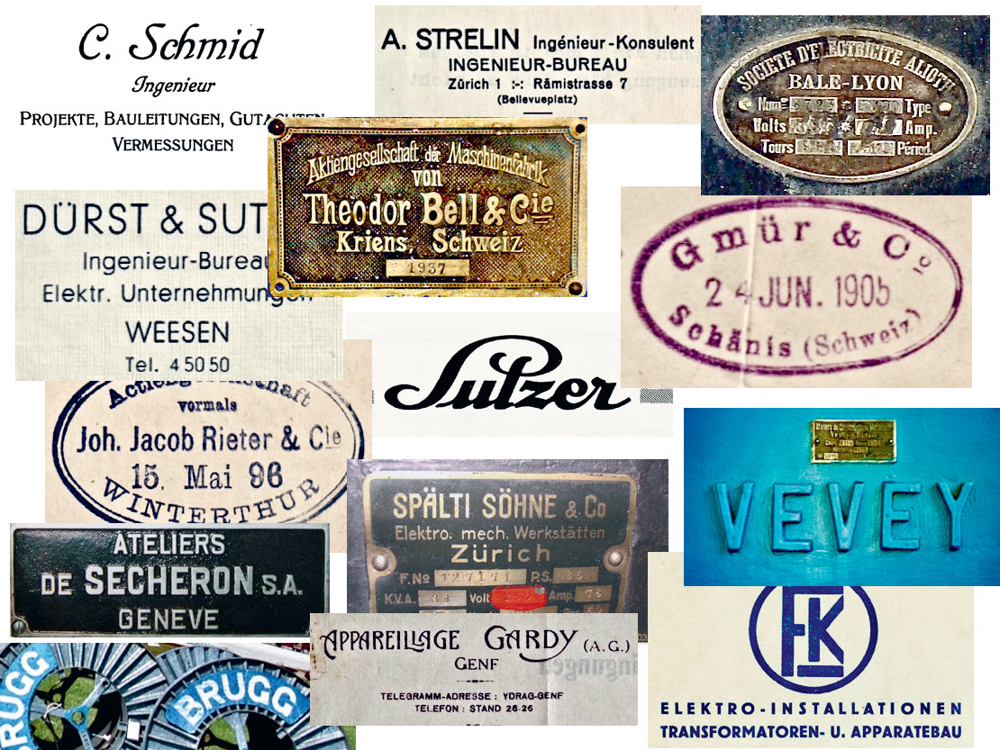
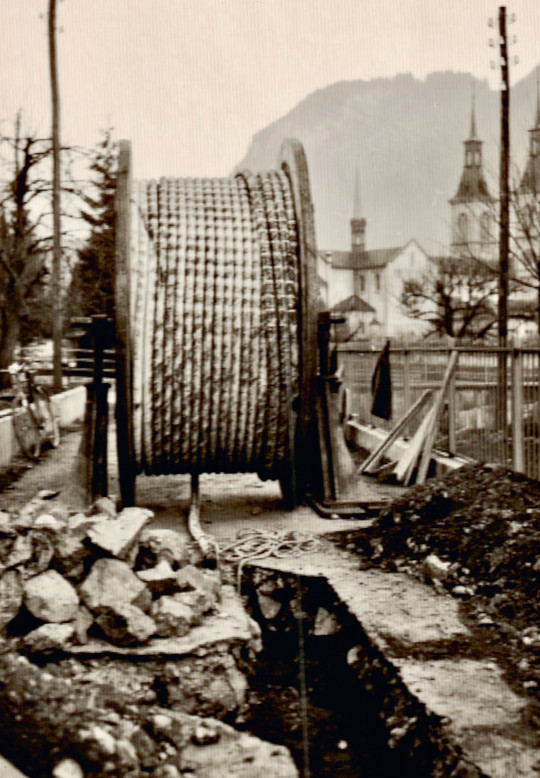
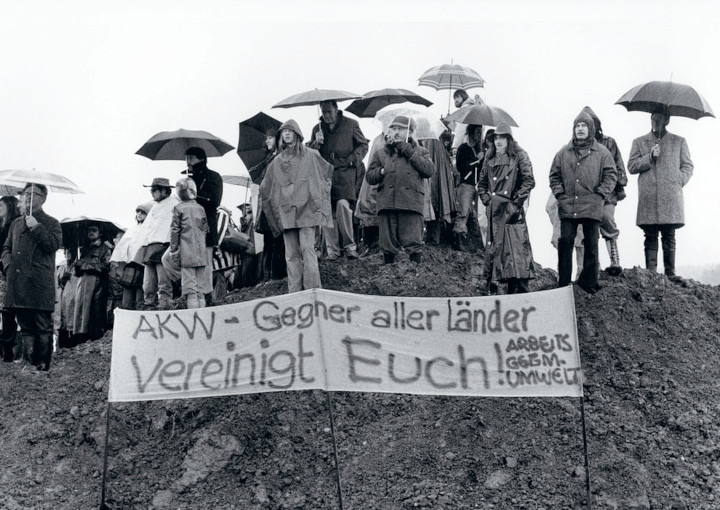
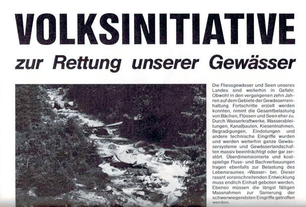



Die «Biografien» der Glarner Elektrizitätsversorger könnten nicht
unterschiedlicher sein und doch haben sie vieles gemeinsam. Die
Unterschiede liegen in den Ansprüchen, die an sie gestellt wurden und
wie sie darauf reagierten. Und leider auch darin, wie viele Akten den
Wechsel von den alten zu den drei neuen Gemeinden überlebt haben.
Gemeinsam sind die technischen, ökonomischen und politischen Wechsel,
denen sie ausgesetzt waren.

Die meisten Gründungen lagen innerhalb rund eines Dutzends Jahren um
und nach 1900 – zwei knapp zehn Jahre davor, fünf bis 40 Jahre danach.
Ausser in Matt, Sool, Schwändi, Riedern und Obstalden hatten 1909 die
Haushaltungen im jeweiligen Ortsbereich Zugang zu elektrischem Licht.
An mehreren Orten am Anfang von einem ortsansässigen
Industrieunternehmen geliefert.

Bis zum ersten Weltkrieg war die Auswahl an einschlägigen Ingenieuren,
Lieferanten, Geräten und Materialien eingeschränkt. Und danach machten
sich die Normierungen breit. Das schlägt sich natürlich in den
Werk-Biographien nieder. Um die daraus resultierenden Wiederholungen
von Begriffserklärungen, Normen und (langen) Namen möglichst zu
reduzieren, wird in diesem Kapitel auf diese Gemeinsamkeiten
eingegangen, die in den Werkkapiteln damit nur noch gestreift werden
müssen.

Die meisten frühen Anlagen wurden für Gleichstromproduktion und
-verteilung gebaut. Als die Kraftstromnachfrage stark stieg und das
Löntschwerk ab 1908 Wechselstrom (auch Drehstrom genannt) abgab, kam
es zu Parallelnetzen mit Gleichstrom für Licht und Wechselstrom für
Gewerbe- und Industriemotoren. Erst nach dem Zweiten Weltkrieg wurden
die letzten Gleichstromanlagen aufgegeben! Auch bei den
Stromspannungen herrschte Vielfalt. So waren Lichtanlagen – unabhängig
ob Gleich- oder Wechselstrom – in einer Bandbreite von 100 bis 220
Volt gebaut worden. Die ersten regionalen
Wechselstrom-Übertragungsleitungen wurden mit 4,8 bis 5,6 Kilovolt
betrieben, die Spannung aber bald auf 8 kV erhöht.

Bei der Stromkennzeichnung gab es ein ziemliches Wirrwarr, obwohl
meistens nur zwei Spannungen an die Haushalte abgegeben wurden. Sie
waren reine Tarifbezeichnungen, benötigten aber oft einen eigenen
Anschluss mit Zähler. Eine Vielzahl von Stecker- und Steckdosenformen
sollten dafür sorgen, dass nicht « billiger» Strom für «teure» Zwecke
bezogen werden konnten. Zum Lichtstrom als tariflich teuerste Gruppe,
gehörten neben Beleuchtungskörpern auch Haushaltgerätemotoren und
kleine Wärmeapparate. Zur Kraftstromgruppe mit mittelgrossen Haushalt-
und Gewerbemotoren konnten vielfach auch Wärmenutzungen gehören. Der
Wärmestrom konnte auch Heiz-, Koch- oder Bügeleisenstrom heissen und
jeweils anders abgerechnet werden.

Die Leuchtstärkenbezeichnung war lange nicht das Watt (oder das
Lumen), sondern die «Kerze». Diese war auch die Berechnungsgrösse für
die Pauschalabrechnungen. Bei den anfänglich verwendeten
Kohlefaden-Glühlampen brauchte es für die Leuchtkraft einer Norm-Kerze
(NK) 3 bis 3,5 Watt, bei den folgenden teureren Metallfaden-Glühlampen
nur noch 1,1 Watt. Daher waren für Strassenbeleuchtungen fast
durchwegs Metallfadenlampen vorgeschrieben. Bei den «Glühbirnen» gab
es für den Hausgebrauch die Abstufungen 8, 12, 16, 20 und 24 Kerzen,
für die Strassenbeleuchtung anfänglich solche von 14 bis 32, später
bis 84 Kerzen. Das war noch romantisch schummrig.

Lange wurde der Lichtstromverbrauch in definierten Verbrauchsgrössen
pro Jahr pauschal abgerechnet, denn Zähler waren teuer. Dabei wurden
pro «Leuchtstelle» die Kerzenzahl und der Standort der Lampe und damit
die angenommene durchschnittliche Gebrauchsdauer berücksichtigt. Das
ging vom nur kurzzeitig benutzten Kellerlicht über Gang, Schlafzimmer,
Küche und Stube bis zur lang dauernden Beleuchtung von Arbeitsräumen.
Nur bei «Grossbezügern» wie Gaststätten wurden Zähler installiert und
in Kilowattstunden abgerechnet. Für Mühlehorn ging der beigezogene
Ingenieur pro Tag einfach pauschal von einer Lampenbrenndauer von 2
Std.(!), Bügeleisenbenutzung von 3/4 Std., Gewerbemotorenlaufzeit von
3 Std. und einem Fabrikmotorenbetrieb von 10 Std. aus.

Die Pauschalabrechnung für Motoren erfolgte nach möglicher und nicht
nach wirklich bezogener PS-Leistung, oft einfach «Pferd» genannt.
«Ganztagesmotoren» wurden teurer eingestuft als «Tageslichtmotoren»,
die nur in Betrieb sein durften, wenn kein Strom für Raumbeleuchtung
benötigt wurde. Dazu kamen noch die Minimalgarantien, also Beträge,
die immer verrechnet wurden, auch wenn der effektive Bezug diese Summe
nicht erreichte. Die Bezüger mieteten also einen individuell
festgelegten Maximalanteil am Stromangebot und hatten darauf während
des ganzen Jahres ein Anrecht. Man bezahlte also für ein Bezugsrecht
und nicht für eine Bezugsmenge.

Die Elektrizität brauchte man anfänglich praktisch nur für
Beleuchtungszwecke – für Strassenbeleuchtung und einige private
Nutzer. Daher liefen die Turbinen z. B. in Näfels oder Elm anfangs nur
nachts und das auch nur von der Abenddämmerung bis Mitternacht und von
fünf Uhr bis zur Morgendämmerung resp. bis die im Werk zusätzlich
installierten Akkumulatoren (Speicherbatterien) wieder «voll» waren.
Die bald aufkommende und dann stetig steigende Nachfrage für Strom zu
Motor- und Heizzwecken erlaubte einen Ganztagesbetrieb mit besserer
Auslastung und Rentabilität. Um eine gewisse Qualitätskontrolle zu
haben, mussten «Lampen» (Glühbirnen), Sicherungen und meist auch
Elektroapparate beim örtlichen Stromlieferanten bezogen werden. Damit
die vereinbarte Pauschale nicht überzogen werden konnte, mussten an
einigen Orten Pauschalstrombezüger die «gestorbene Birne» abgegeben,
um wieder eine neue kaufen zu können.

 

Zu den Lieferanten der frühen Jahre gehören bei den Turbinen Escher
Wyss & Cie., Zürich (EWC) und Theodor Bell & Cie., Kriens (Bell),
Ateliers de Constructions Mécaniques de Vevey (ACMV) sowie
Maschinenfabrik Rieter AG, Winterthur (Rieter) und Bühler AG, Uzwil
(Bühler). Bei den Dynamomaschinen (Generatoren) sowie den Steuerungs-
Schalt- und Sicherungsanlagen waren es Maschinenfabrik Oerlikon (MFO),
Brown, Boveri & Cie. (BBC), SA Sécheron, Genf (Sécheron), Société
d'Electricité Alioth, Bâle-Lyon (Alioth), Spälti Söhne & Co., Zürich
(Spälti) und Gebrüder Gmür & Cie., Schänis (Gmür). Heute produziert
keine einzige dieser Pionierfirmen mehr elektromechanische
Komponenten!

 

Die frühen Leitungsbauten stammten vorwiegend aus der Region, vom
elektrotechnischen Universalanbieter Gmür und den Installationsfirmen
Heinrich Bäbler und Fridolin Freuler in Glarus sowie Dürst & Sutter,
Weesen, und in den Mittellandgemeinden von der Installationsabteilung
des «Motor», AG für angewandte Elektrizität in Baden, der späteren
Nordostschweizerischen Kraftwerke AG (NOK). Die ersten planenden
Ingenieure waren Wasserversorgungsplaner, die gleichzeitig die
Kombination mit Stromproduktionsanlagen propagierten, vorallem Otto
Possert in Rapperswil. Weiter Rudolf Steiger, Mels, Dürst & Sutter
sowie Carl Schmid, Weesen und Kantonsingenieur Blumer, aber auch
Binder & Richi, St. Gallen und Locher & Cie., Zürich.

Der erste grosse «Stromnachfrageförderer» war der Erste Weltkrieg mit
seinem Kohlemangel. Die in jener Zeit und kurz danach bereitgestellten
Produktionskapazitäten wollten abgesetzt werden. Dies zeigte sich
während der Zwischenkriegszeit in einer massiven Propagierung von Koch
und Heizapparaten im Haushalt. Und der Industrie wurden lukrative
«Überschusstrom»-Angebote für Heisswasser- und Dampferzeugung in
Elektrokesseln während den absatzschwachen Stunden gemacht. Mit der
nach und nach eingeführten Tarifaufteilung in teuren Tagesstrom
(Hochtarif; in der Regel von 7 bis 22 Uhr) und billigen Nachtstrom
(Niedertarif) wurde auch den Haushalten und Gewerbebetrieben der
weniger nachgefragte Energiebezug während der Nacht schmackhaft
gemacht und tagsüber die Stromverwendung gedämpft.

Die beginnende Hochkonjunktur Ende der Fünfzigerjahre verlangte nach
noch grösseren Energiemengen. Um die Übertragungsnetze nicht forciert
verstärken und ausbauen zu müssen, drängten die Stromproduzenten auf
den Spannungswechsel von meist 8 auf 16 kV. Parallel dazu sollte auch
die Spannung auf den Ortsverteilnetzen von meist 250/145 auf 380/220 V
erhöht werden. Während die Umstellung auf der Primärseite
(Energiebezug) – wenn auch in Etappen – dank der Unterstützung durch
die Stromkonzerne und der Lieferbereitschaft der Komponentenhersteller
relativ schnell vollzogen wurde, harzte es auf der Sekundärseite
(Energiefeinverteilung) oft gewaltig. Wegen der anfallenden Kosten für
die Stromversorger und der Überforderung der Installationsfirmen wegen
Personalmangel dauerte dieser Prozess Jahre bis Jahrzehnte!

Dank Subventionen (bis 60%) von Bund und Kanton für Investitionen im
Berggebiet ab den Fünfzigerjahren wurde es für die Stromversorger erst
möglich, die Elektrifikation von Berg-Liegenschaften zu planen und
auszuführen. Diese erforderten lange Zuleitungen bei geringem
Energiebezug und waren daher unrentabel und eine Belastung der
Betriebsrechnung. Ebenfalls in diese Zeit fällt die Einführung der
Rundsteuerungen (Netzkommando). Diese sollten die ebenfalls
kostenintensiven Stromspitzen brechen helfen. Dies konnte z.B. durch
das zentral gesteuerte Ausschalten von «Stromfressern» wie
Direktheizungen oder Waschmaschinen während der Kochzeiten erreicht
werden.

In einigen grösseren Gemeinden wurden bereits ab den Vierzigerjahren
im Kernbereich die bestehenden Freileitungen sowie neue Netzstrecken
verkabelt. Zum Standard wurde dies ab den Sechziger-, vorallem aber in
den Siebzigerjahren, die dann meistens auch mit
Leiterquerschnittvergrösserungen für erweiterte Stromtransportvolumen
verbunden waren. Die laufend kräftig steigende Nachfrage brachte die
Netze ständig an deren Grenze. Darauf zurückzuführende Vorfälle gab es
wenige, aber einer war gravierend und von schweizweitem Interesse. In
Glarus geriet ein Kondensator in Brand und das allgemein verwendete
Kühlöl setzte giftiges PCB (Polychlorierte Biphenyle) frei. Die
Sanierung war langwierig und kostenintensiv. Der Vorfall leitete
überall eine forcierte Ersetzung dieser Öle ein.

Um die vielen Tarife und damit auch die Stecker- und Steckdosenformen
sowie die Stromzähler zu reduzieren, wurden verschiedene Tarifsysteme
ausprobiert. Ab etwa 1960 wurde an einigen Orten der Blocktarif
angewendet. Dabei wird im Prinzip bis zu einer festgelegten
Bezugsmenge (Block) ein teurerer Tarif verrechnet, der auch die
jährlichen Netzaufwendungen und Verwaltungskosten abdeckt. Nach dieser
Limite werden nur noch die Energiekosten verrechnet. Ab ungefähr 1970
führten einige Stromversorger den Einheitstarif ein. Dabei werden die
Kosten für Netz und Verwaltung durch eine Grundgebühr abgedeckt und
die Energiekosten nach Verbrauchsaufwand verrechnet. Beide Systeme
waren in der Regel mit tieferem Sommer- und höherem Wintertarif
gekoppelt. Die heutige Stromverrechnung, aufgeteilt in Erzeugungs-,
Netznutzungsund Abgabenkosten gilt schweizweit seit 2008.

 

Ab den Achzigerjahren stellte ein neues Umweltbewusstsein und die
damit verbundene eidgenössische Politik die Stromwirtschaft vor ganz
neue Herausforderungen. Die erstarkende Skepsis in der Bevölkerung
gegenüber der nuklearen Energieerzeugung und die «
Moratoriumsinitiative» von 1990 liessen werbetechnisch aus
Atomkraftwerken Kernkraftwerke werden – das Wort «Atom» wurde in der
Branche tabu. Die «Rettet unsere Gewässer»-Initiative mit der
Forderung nach genügendem Restwasser jagte 1992 den Stromproduzenten
einen gehörigen Schreck ein und liess sie einen Produktionsverlust bis
zu einem Viertel an die Wand malen. Wirklich echte Probleme brachten
den Stromversorgern um die Jahrtausendwende die Beschlüsse und Gesetze
über die Rücknahme der Stromproduktion aus Kleinkraftwerken zu
festgelegten Preisen. Einige wurden gar in ihrer Existenz gefährdet.

 

Die Energienutzungsverordnung von 1992 sah daher vor, dass kleine
kommunale und regionale Unternehmen der öffentlichen Energieversorgung
(z.B. EW Linthal) unverhältnismässige Abnahmemengen an das
übergeordnete Versorgungsunternehmen (z.B. NOK) weiterleiten konnten.
Die Abnahmemenge war unverhältnismässig, wenn sie fünf Prozent der
jährlichen Energieabgabe an die Konsumenten überstieg. Doch mit dem
Energiegesetz, das 1999 den Energienutzungsbeschluss ablöste
verschwand diese Fünf-Prozent-Klausel. Das traf einige Gemeindewerke
empfindlich, denn es war nun dem Goodwill ihres Lieferanten
überlassen, die alte Regelung freiwillig weiterzuführen. Danach
erhoffte man sich eine Lösung vom Elektrizitätsmarktgesetz, das jedoch
2002 beim Referendum durchfiel und daher nicht in Kraft trat.
Schliesslich nahm eine Änderung der Energieverordnung im Jahr 2005 den
Stromversorgern die Last solcher Rücklieferungen definitiv ab.

Die sogenannte «Strommarktliberalisierung», resp. deren schleppende
und unklare politische Umsetzung, brachte für die Strombranche
anhaltend grosse Unsicherheiten. Sie ist noch heute (2020) ein
Zankapfel zwischen politischen und wirtschaftlichen Interessen und
Rücksichten. Im Jahresbericht eines Betriebsleiters kann man lesen:
«Ab 1. Januar 2009 gelten als Vorstufe zur freien Marktwirtschaft neue
Richtlinien, die für den Bezüger eine grössere Transparenz bringen
sollen. Die Stromwirtschaft hat mit der Aufteilung in Energie,
Netzentschädigung und allgemeine Zuschläge die behördliche Verordnung
umgesetzt und damit die Verwirrung vollendet. An Stelle der erwarteten
Verbilligung bewirkten die neuen Abgaben für erneuerbare Energien und
allgemeine Dienstleistungen eine Verteuerung. Eine Tatsache, welche
auch bei der geplanten vollständigen Marktöffnung Bestand haben wird.»

 

Neben diesem Ärger verblassen leider die alltäglichen, aber überaus
wichtigen Betriebs- und Unterhaltanstrengungen der Stromversorger.
Mindestens ein gutes Ergebnis hat die «Liberalisierung» dennoch
gebracht. Das Übertragungsnetz, welches in der Regel auf der
Spannungsebene 220/380 kV betrieben wird, ist nun in einer eigenen
Gesellschaft, der «Nationalen Netzgesellschaft» (Swissgrid)
zusammengefasst. Das Übertragungsnetz sowie die übrigen,
nachgeordneten Netze sind grundsätzlich allen Produzenten zugänglich.
Auch den privaten, einheimischen Photovoltaikanlagenbesitzern, die
dank der KEV (Kostendeckende Einspeise-Vergütung) nun nicht mehr auf
die Hilfestellungen der Glarner Solarstrombörse angewiesen sind.

*Dieser Text ist ein Auszug aus «Strom fürs Glarnerland» von August
Berlinger, erschienen 2022 und erhältlich im Buchhandel (ISBN
978-3-033-09268-6).*
