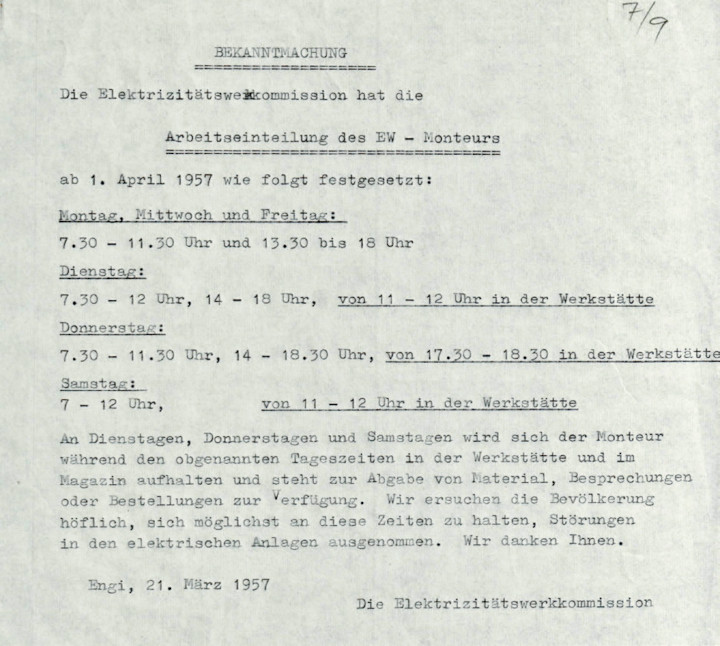



## Gründung und Entwicklung

Engi ist die Gemeinde mit einem der frühesten Elektrifizierungsanfänge
und der spätesten eigenen Elektrizitätsversorgung. Zwischen den beiden
Daten liegt ziemlich genau ein halbes Jahrhundert. Auf die
Gemeindeversammlung vom 2. Oktober 1898 hin, stellte die Firma
Leonhard Blumer, Weberei Sernfthal (auch bei den folgenden
Namenswechseln als Weseta genannt) das Gesuch, «es möchte ihr
gestattet werden, behufs Gewinnung eines besseren elektrischen Lichtes
im alten Geschäft [Bergen], entweder vom Wyer od. vom neuen Geschäft
[Hinterdorf] weg der Dorfstrasse nach, Stangen zur elektrischen
Leitung stellen zu dürfen.» Die Versammlung stimmte zu.

Kaum zwei Wochen später beschloss die Schulgemeindeversammlung, es sei
die Weseta für die Schulhausbeleuchtung um Strom anzufragen und eine
Kostenrechnung für die Installationen einzuholen. Letztere wurde dem
Gemeinderat knapp eine Woche darauf vorgelegt mit dem Gesuch, «in
Betracht etwelcher Benützung der Räumlichkeiten im Schulhause» durch
den Tagwen (Gemeindekanzlei), einen Drittel der Kosten zu übernehmen.
Der Gemeinderat bot einen Viertel an mit dem zusätzlichen Wunsch, es
solle der Zugang zum Schulhaus von der Strasse her, «durch geeignete
Plazierung von Lampen, der bisherigen Finsternis entrissen werden».
Die Energie wurde in 130 V Gleichstrom vom Schulpräsidenten und
Weseta-Inhaber Blumer gratis geliefert.
<a id="engi_01" href="../06-quellen#engi_01">¹</a>

Eine weitergehende öffentliche Beleuchtung war lange kein Thema. Bei
der 1905 angestrebten Konzessionserneuerung für die von der Weseta
bereits benützten Wasserkraft wollte der Gemeinderat, dass die Weseta
«für die noch erforderliche Zahl von Lampen für eine Dorfbeleuchtung
die Kraft gratis, wie den bisherigen Lampen zuleite». Die Bürger sahen
mit Rücksicht auf den schlechten Geschäftsgang der Firma schliesslich
davon ab. Im April 1911 erbat sich der Gemeinderat von den
Stimmbürgern mehr Zeit, um die Frage einer Strassenbeleuchtung von der
Säge bis zur Post (Hinterdorf) – besonders die Kosten – noch besser
abklären zu können.

Bereits drei Monate danach wurde ein Vertrag mit der Weseta
unterzeichnet. Diese hatte die Erweiterung um zwölf Lampen zu
erstellen und zu betreiben und wurde mit 170 Franken pro Jahr
entschädigt – 90 für die Kapitalzinskosten, 80 für die Amortisation.
Der Strom selbst war gratis! Nebst den zehn Lampenstellen der
Dorfstrasse entlang, erhielten die Brunnenplätze im Hinterbach und
Bergen Licht, weil sich dort auch Hauptschieber der Wasserversorgung
befanden. Mehr lag nicht drin, da die Weseta im Winter knapp an
Energie war. 1921 kündigte die Weseta den bestehenden Liefervertrag
für die Strassenbeleuchtung. Neu musste die Gemeinde für die 25
Strassenlampen à 32 Kerzen den normalen kWh-Preis von 54 Rappen
bezahlen, immerhin mit 20 % Rabatt.
<a id="engi_02" href="../06-quellen#engi_02">²</a>

1918 erweiterte die Weseta ihre Energieanlagen und lieferte vermehrt
Lichtstrom auch an Privathaushalte und Gewerbe, unter einschränkenden
Bedingungen ebenfalls Wärme- und Kraftstrom. Für die «Normalkerze»
(ca. 3.2 W) wurde bei Metallfadenlampen pro Jahr 50 Rappen verlangt,
bei Kohlefadenlampen das Doppelte. Die «Birne» zu 16 Kerzen war die
Norm. Für ein 400-Watt-Bügeleisen waren 15 Franken pro Jahr zu
entrichten. Grössere Verbraucher wurden über Zähler mit 50 Rappen per
kWh abgerechnet.

Im Laufe der Jahre geriet die Weseta-Kraftanlage erneut an ihre
Kapazitätsgrenze. Da kam es Engi nicht ungelegen, dass im Frühjahr
1926 die Gemeinde Schwanden aus ihrem Werk (EWS) den Sernftaler
Gemeinden Strom offerierte. Schwanden bot an, die Versorgungsleitung
ins Tal selber zu berappen, verlangte aber eine Abnahmegarantie von
25’000 Franken pro Jahr. Da Matt bereit war, seinen ganzen Bezug neu
zu regeln, waren die Bedingungen realistisch. An der
Gemeindeversammlung vom 18. April opponierte der Weseta-Direktor
dagegen und warb für eine eigenständige Sernftaler Lösung. Die
Anwesenden beauftragten den Gemeinderat aber zu verhandeln. Nun ging
das grosse Feilschen zwischen den Akteuren Engi, Weseta und Schwanden,
später vereint mit der SN, so richtig schön los.

Für Schwanden konkretisierte sich 1927 die Realisierung der
Sernf-Niederenbach-Werke. Dazu brauchten sie aber die bedeutenden
Wasserrechte Engis am Sernf. Die Weseta wollte das lukrative
Stromverkaufsgeschäft nicht an die Gemeinde verlieren und war daher an
der neuen Bezugsmöglichkeit interessiert. Und Engi brauchte für seine
Einwohner und den neuen Plattenbergpächter erheblich mehr Strom und
wollte seine eigene Elektrizitätsversorgung, jedoch ohne die Weseta
ernsthaft zu vergraulen. Der Gemeinderat liess sich im Auf und Ab
dieses Verhandlungspokers von versierten Fachleuten beraten und war
dadurch ein zäher Verhandlungspartner.

Das Ergebnis war ganz kurz zusammengefasst: Engi überlässt der SN
seine Wasserrechte und erhält dafür auf 80 Jahre hinaus jährlich einen
Wasserzins von maximal 9000 Franken und 85 kW Vorzugsenergie zu 2½
Rappen die Kilowattstunde, sowie auf 15 Jahre 250 kW Ergänzungsenergie
zu 5 Rappen. Diese bevorzugten kW bezieht die Gemeinde über die
Weseta, die weiterhin das Dorfnetz betreibt. Dafür bezahlt die Weseta
eine jährliche Konzessionsgebühr von 4500 Franken im Minimum und
rüstet das Dorfnetz auf eigene Kosten auf Wechselstrom um. Die beiden
Transformatorenanlagen im Hinterdorf und im Wyden zwischen der
Talversorgungsleitung und dem Dorfnetz samt den Gebäuden lässt die
Gemeinde in ihren Kosten erstellen, diejenigen für die Fabriken die
Weseta. Nach 15 Jahren hat die Gemeinde das Recht, das Dorfnetz zum
dannzumaligen Wert zurückzukaufen.
<a id="engi_03" href="../06-quellen#engi_03">³</a>

Die bestehende Regelung über die Strassenbeleuchtung, bei der die
Weseta die Erstellungskosten und die Gemeinde diejenigen von Unterhalt
und Strom zu tragen hatten, wurde 1931 erneuert. Die dadurch
anfallenden Kosten von etwa 450 Franken jährlich schienen dem
Gemeinderat so hoch, dass er sich ausserstande sah, zu den bestehenden
31 Lampenstellen noch deren zwei bis drei im Hinterdorf einrichten zu
lassen, wie es die Leute wünschten. Auch wollte er zwei bisher von
Anwohnern getragene Lampen nicht ins Gemeindenetz integrieren.
Offensichtlich mussten zuerst die angefallenen Leitungs- und
Trafostationenkosten von rund 30’000 Franken verdaut werden.

1945 war der Zeitpunkt gekommen, von der Dorfnetz-Rückkaufklausel
Gebrauch zu machen und den Weg zur eigenen Elektrizitätsversorgung zu
ebnen. Die Gemeindeversammlung vom 13. Mai erteilte dem Gemeinderat
«Vollmacht, zur event. Kündigung des Vertrages, sofern die diesbezügl.
Beratungen mit technischen Fachmännern deren Ratsamkeit ergeben». Der
Vertrag wurde in der Folge auf Ende 1946 gekündigt. Die Weseta
reagierte prompt und stellte vorsorglich Rechnung von 108’662 Franken.
Der beigezogene Experte bezifferte den Betrag nach diversen Auf- und
Abrechnungen und Kompromissen auf 86’070 Franken. Im Kontobuch der
Gemeinde steht unter dem Datum 2. August 1947 die Summe von 98’003.35
Franken. Der Strombezug von der SN erfolgte weiterhin über die Weseta.
<a id="engi_04" href="../06-quellen#engi_04">⁴</a>

Mit der Wahl der EW-Kommission durch den Gemeinderat sowie der
Verabschiedung der Reglemente und der Wahl von Ortsmonteur und
Verwalter an der Gemeindeversammlung vom 23. August 1947 war das
Stromnetz operativ an die Gemeinde Engi übergegangen. Die erste
Netzbauaufgabe war 1949 die neu erdverlegte Zuleitung zum
Landesplattenberg mit Kosten von 800 Franken, wobei davon ausgegangen
wurde, dass der Kanton als Besitzer 500 Franken daran zahlen und
Baumeister Marti als Pächter die Grabarbeiten in Eigenregie ausführen
werde. Im Jahr darauf waren 40 – 50 Leitungsstangen zu besorgen, die
man aber auf Abruf beim Lieferanten lagern liess. Die
Gemeindeversammlung vom 20. Mai 1951 entschied, es seien vom EWE die
bisher privaten Hauszuleitungen entschädigungslos zu übernehmen und zu
unterhalten. 1952 erhielt die TS Wyden einen Blitzschutz, woran die
Weseta als Mitbenützerin die Hälfte zu übernehmen hatte.

1955 wurden 2000 Franken für die Strassenbeleuchtung von der Station
Vorderdorf zum Höfli bewilligt, die man teilweise noch an den
Sernftalbahnmasten befestigte. Zwei Jahre später wurden für die
Beleuchtung der Allmeindstrasse trotz höherer Kosten Stahlmasten und
Kabelleitungen favorisiert. 1960 erstellte man unterhalb der Villa für
die Elektrizitätsversorgung ein Wohn- und Geschäftshaus, in dem
Werkstatt, Laden und Monteurwohnung zusammengeführt werden konnten.
Mit der Umstellung der Sernftalbahn (SeTB) 1969 auf Busbetrieb wurden
deren Kraftanlagen nutzlos. Damit stand die Frage im Raum, ob die EVE
die freiwerdende Gefällsstufe selber nutzen solle. Das
Ingenieursgutachten kam zum Schluss, dass die eigentlich moderaten
Gestehungskosten (3.6 Rp./kWh) unwirtschaftlich seien im Vergleich mit
dem Vorzugsenergiepreis der SN von 2.5 Rp./kWh.

Um die inzwischen prekären Spannungsverhältnisse im Dörfli zu
beseitigen, stand 1970 als nächstes grosses Projekt der Bau einer
dritten Trafostation an, für welche 55’000 Franken bewilligt wurden.
Die vierte Trafostation (TS ARA) beanspruchte 1978 fast den dreifachen
Betrag. Der Neubau der EWS-Talversorgungsleitung mit der neuen
Messtelle in der TS ARA erforderte 1983 Anpassungen an der
Verbindungsleitung TS Hinterdorf – TS Wyden. Da die Weseta diesen
Strang mitbenutzte, waren Erstellungsund Unterhaltskosten neu zu
regeln. Auch die TS Wyden selbst wurde nach gut 50 Jahren Betrieb
endlich auf Vordermann gebracht. Im folgenden Jahr war die fast gleich
alte TS Hinterdorf an der Reihe. In den nächsten Jahren kam auch etwas
Schwung in die Erneuerung des Leitungsnetzes, vorallem mit
Verkabelungen.

Nach Jahrzehnten der «Ruhe» gab es nun auch Erschliessungen neuer
Bauquartiere. Wegen des Umbaus des Primärnetzes von 8 auf 16 kV hatten
die Engeler am 26. und 29. Juli 1986 zwischen 12.30 und 16.00 Uhr auf
die zur Gewohnheit gewordene Elektrizität zu verzichten. Der
Magazinanbau mit Garage am Geschäftshaus kostete 1989 ungefähr gleich
viel wie 29 Jahre vorher das ganze Gebäude. Die folgenden Jahre waren
gekennzeichnet durch starke Verkabelungstätigkeit. 1994 gliederte die
Gemeinde der Wasserversorgung im neuen Reservoir Brunnengaden eine
Trinkwasser-Maschinengruppe an, die sie sich 1997 von der EVE für
71’000 minus einen Franken abkaufen liess. Im neuen Traforaum der
Weseta am Sägeplatz konnte im Jahr 2000 für rund 145’000 Franken eine
eigene 400-kW-Anlage eingerichtet werden, womit netztechnisch EVE und
Weseta ganz unabhängig voneinander wurden.
<a id="engi_05" href="../06-quellen#engi_05">⁵</a>

## Betrieb und Finanzen

Am 1. August 1947 war vertragsgemäss das Dorfnetz juristisch von der
Weseta an Engi übergegangen. Das Verwaltungsreglement vom 23 August
hielt fest: Das Elektrizitätswerk ist ein Unternehmen der
Einwohnergemeinde Engi; die Gemeindeversammlung ist zuständig für
Organisation, Jahresrechnung und Ausbaukredite; der Gemeinderat ist
verantwortlich für Personal, Aufstellung der Reglemente und Tarife
sowie Vertretung bei Rechtsstreitigkeiten; die Verwaltungskommission
(EW-Kommission, EWK) ist Bindeglied zu Gemeinderat und -versammlung
und hat die Aufsicht über das Tagegeschäft. Der Verwalter und der
Ortsmonteur hatten eine Bürgschaft von je 10’000 Franken zu leisten.
Und natürlich ganz wichtig: Das EWE hatte die früher von der Weseta
bezahlte Konzessionsgebühr von 4500 Franken jährlich der Gemeindekasse
abzuliefern.

Ziemlich prosaisch sah das Tagesgeschäft aus. Der Glühlampenverkauf
übertrug man mit einer bescheidenen Provision der Eisenhandlung und
mit Anschlag wurde bekannt gemacht, dass «alle ins Fach einschlägigen
Reparaturen durch das EWE ausführen zu lassen sind». Den
Verrechnungslohn des Monteurs setzte man mit 3 Franken per Stunde fest
und die Stundenentschädigung für die Monteurhilfsdienste des
Schulabwartes betrug 1.80 Franken. Die Anschaffung einer
Schreibmaschine für den Verwalter verschob man auf das nächste
Rechnungsjahr. Die erste Spitzenstromabrechnung der Weseta Ende 1948
erschien den Verantwortlichen so kompliziert, dass man sie dem
Vertrauens-Ingenieur zur Begutachtung übergab. Wegen der schweizweiten
Winterstromknappheit wurde 1949 die Strassenbeleuchtung von 22.30 bis
5 Uhr ausgeschaltet und die Haushalte ersucht, wenn immer möglich
nicht (!) elektrisch zu kochen.

1950 wurde ein Antrag auf Erstellung eines Gebäudes mit
Monteurwohnung, Werkstatt und Laden wegen Finanzknappheit verschoben.
Man war derart sparsam, dass der Verwalter seinen Posten zur Verfügung
stellte, weil er weniger als ein Gemeindearbeiter verdiente. Die vom
Eidg. Starkstrominspektorat (ESTI) verlangten Hauskontrollen wollte
man nicht auf einmal der Pro Radio übertragen, da der Monteur nicht
alle Mängel fristgerecht erledigen könne. Das EWS erledigte die
Aufgabe in den folgenden Jahren etappenweise und stellte wenn möglich
aushilfsweise einen Monteur zur Verfügung. An die verlangten
Änderungskosten gewährte das EWE 10 % Rabatt, allenfalls von ihm
mangelhaft erstellte Änderungen hatte es gratis anzupassen. 1955
verlangten die Rechnungsrevisoren, EW-Betrieb und
Hausinstallationsgeschäft seien getrennt abzurechnen und die
Stromverkäufe nach «Sorte» (Licht, Kraft, Wärme) auszuweisen.

Der neue EWK-Präsident hatte 1956 einen maroden Betrieb zu übernehmen.
Der ESTI-Kontrollbericht hielt fest: Das Leitungsnetz sei in desolatem
Zustand, beim nächsten Vorfall werde an das Eisenbahndepartement
(oberste Behörde) Anzeige erstattet; im Berichtsjahr 1955 seien nach
den Installationskontrollen die Mängel nicht behoben worden; im
Materialmagazin sei eine unbeschreibliche Ordnung. Der dafür
verantwortliche Monteur war Engi 1947 vom EWS empfohlen worden, da für
den vorrangigen Freileitungsnetzunterhalt kein Elektroinstallateur
notwendig und er dazu unter seiner Aufsicht sei. Da diese Lösung
«günstig» war, ging Engi damals darauf ein. Der Monteur wurde Ende
1958 verabschiedet. Kurze Zeit nach der ESTI-Schelte konnte der
Betriebsleiter melden, dass die gröbsten Mängel behoben seien und der
Rest umgehend erledigt werde, sobald kein Kulturschaden mehr entstehe.

Die folgenden Jahre waren angefüllt mit Mängelbehebungen im
Freileitungsnetz, die teilweise noch in die Weseta-Zeit
zurückreichten. Alles eigentlich «einfache» Sachen: Nullungen
nachziehen, Erdungen verbessern, viele Stangen auswechseln und alle
bezeichnen, Netzplan nachführen. Parallel dazu wurde Ordnung in die
Installationskontrollen gebracht und das lange geforderte Verzeichnis
– wenn auch langsam – systematisch angelegt. Ab 1960 waren die
Trafostationen an der Reihe: Schutzgitter anbringen, Erdungen
verbessern und einiges mehr. Alle diese Bemühungen wurden auch vom
ESTI anerkannt. Parallel dazu mussten, um die leidigen
Verbrauchsspitzen in der Mittagszeit zu brechen, Sperrschalter
montiert werden und der Bäcker hatte zu dieser Zeit den Ofen
abzuschalten.

Mit dem Neubau des eigenen Betriebsgebäudes 1960 wechselte man den
Namen auf Elektrizitäts-Versorgung. Nicht gewechselt hatten die
vergangenen 30 Jahre die Tarife. Der kWh-Preis war für Licht immer
noch 45 Rp., für Kraft 6 Rp. und für Wärme sommers 4, winters 8 Rp.
Erst 1977 erfolgte eine provisorische lineare Tariferhöhung um 2
Rp./kWh bei Wärme und Kraft – Licht blieb bei 45 Rp./kWh. Auch die
Zahlungsmoral wechselte kaum. Ein Lichtblick war jener einsichtige
Abonnent, welcher einen Münzzähler verlangte, damit die Familie besser
spare. Wenig Einsicht zeigten hingegen jene Bauern, die es sich zur
Angewohnheit gemacht hatten, an die pauschal verrechnete
Lichtinstallation unerlaubterweise noch zusätzliche Handlampen und
Weiteres anzuschliessen.

Weil sich in der Schweiz einiges in der Wasserzins- und
Tariflandschaft bewegte, sicherte sich Engi 1973 den Rat eines
Energieökonomen. Erste Verhandlungsversuche blockte die SN mit der
Begründung ab, das EWS sei Lieferantin. Engi liess sich auf dieses
Versteckspiel nicht ein und beharrte auf den grundlegenden Punkten des
Wasserrechts-Abtretungsvertrags mit der SN von 1930. Mit Blick auf den
künftigen Ergänzungsenergiebezug wies Engi auf die markant gestiegenen
Wasserzinsen hin und wollte wie die SN-Aktionärsgemeinden behandelt
werden. Man einigte sich dahin, dass die SN weiterhin der Partner für
die bevorzugten Energiemengen sei und das EWS die weitere
Ergänzungsenergie zum jeweiligen NOK-Tarif(!) minus 12 % liefere. Aus
dieser Situation ergab sich, dass 1979 der Einheitstarif eingeführt
wurde mit einer Grundgebühr von 12 Franken pro Zähler und 13 Rp./kWh
im Hochtarif resp. 7 im Niedertarif.

Ab 1970 liess sich die Ortsgemeinde beträchtliche Summen – meist für
Strassenprojekte – auszahlen. Andererseits wollte sie aus
Kostenrücksichten keinen zweiten, vom ESTI angeregten und auch
dringend benötigten, gelernten Elektroinstallateur einstellen und mit
ungelernten Aushilfen weitermachen. 1976 konnte der pensionierte
langjährige Betriebsmonteur durch einen Fachmann mit Meisterprüfung
ersetzt werden. Als indirekten Hilferuf kann der Brief des ebenfalls
neuen Betriebsleiters an das ESTI interpretiert werden, in dem er
schrieb, es seien seit vier Jahren keine Installationskontrollen mehr
durchgeführt worden, der Zustand der Trafostationen machten ihm Sorgen
und der Netzunterhalt leide, weil die finanziell angeschlagene
Gemeinde die dafür nötigen Mittel anderweitig verwende.

1991 scheint sich die finanzielle Lage gebessert zu haben, denn für
die Einführung der EDV konnten 43’000 Franken gesprochen werden. Im
folgenden Jahr wurde die Anschaffung einer Rundsteueranlage (Fr.110
000 Fr.) bewilligt, die den eigenen Bedürfnissen gerecht wurde. 1994
löste das neue EV-Reglement dasjenige von 1931 ab. Mit dem
Energienutzungsbeschluss (ENB) des Bundes und der darin festgehaltenen
Pflicht für örtliche Stromverteiler, Kleinkraftwerken die Energie zu
durchschnittlich 16 Rp./kWh abzunehmen, brauten sich ab 1995 über der
kleinen EVE dunkle Wolken zusammen. Einerseits überlegte sich die
Schreinerei Cotti ihre Kraftanlage wieder zu reaktivieren und
andererseits bestand die Weseta nach einem entsprechenden
Bundesgerichtsentscheid darauf, dass ihr die gesamte Produktion ihrer
beiden Werke zu den neuen Bedingungen abgenommen werde.

Eine buchstabengetreue Umsetzung der ENB-Richtlinien hätten entweder
tiefrote Zahlen für die EVE oder unüblich hohe Tarife für die Bezüger
bedeutet. Mit einem Kompromiss aller Beteiligten konnte das
Allerschlimmste für die EVE abgewendet werden. Die Weseta gab sich mit
13 Rp./kWh für die Rücklieferungen zufrieden, welche das EWS resp. die
SN zu 95 % und die EVE mit 5 % übernahmen. Ab 2003 waren die Eckwerte:
12 Rp./kWh, 88 und 12 %. 2002 ging die bis dann selbständige
EV-Verwaltung an die Gemeindeverwaltung über. Beim Betrieb lief es bis
zum Übergang zu den Technischen Betrieben Glarus Süd Ende 2010 mit dem
Betriebsleiter, einem Elektroinstallateur, zwei Lehrlingen und zwei
Hilfskräften weiter.

Eine interessante Innensicht der EVE-Geschichte mit weiteren Details
vermittelt der Beitrag der ehemaligen EVE-Verwalterin Elfie Luchsinger
im Neujahrsboten 2006.
<a id="engi_06" href="../06-quellen#engi_06">⁶</a>

## Trinkwasserkraftwerk Brunnengaden

Mitte 1993 bewilligte die Gemeindeversammlung einen Kredit von 75’000
Franken für die Turbinierung der neu gefassten Üblitalquellen im
Reservoir Brunnengaden. Um die Höhendifferenz von 230 Metern der
anfallenden 6.5 Minutenliter in Strom umzuwandeln, wurde eine
12-kW-Turbal-Peltonturbine und ein 15-kW-Bartholdi-Asynchrongenerator
installiert. Im Herbst 1994 ging die Anlage ans Netz. Sie sorgte wegen
des Betriebsgeräusches in der Nachbarschaft für Unmut, den der
Betriebsleiter mit einer simplen Isoliermatte aus der Welt schaffen
konnte. Engi hatte endlich seinen selbstproduzierten Strom! 1997
übernahm die EVE die Anlage von der Ortsgemeinde für 70’999 Franken.
<a id="engi_07" href="../06-quellen#engi_07">⁷</a>

## Kraftwerk Weseta

Die Weseta betrieb im Laufe der Zeit Stromerzeugungsanlagen an drei
Orten: Im Bergen in und nachher bei der Fabrik Vorderdorf, im Wyer
parallel zu den Sernftalbahn-Maschinengruppen und bei der Fabrik im
Hinterdorf. Die im Hinterdorf wieder aufgebaute Weberei wurde ab 1898
mit Strom für Licht und Kraft versorgt. Diese Anlage leistete bei 2
m³/s 150 PS (Turbine), resp. 120 kW (Generator) – mehr ist nicht zu
erfahren. 1903 verhandelte die Weseta mit der Gemeinde über Abgabe des
Restwassers aus dem Reservoir und im November 1904 wurde dieses an die
neue Turbine in der Zentrale im Wyer abgegeben. Über deren Leistungen
ist auch nichts bekannt.

1918 erweiterte die Weseta ihre bestehenden Energieanlagen im Bergen
um ein Ausgleichs- und Geschiebeabsetzbecken mit 660 m³ Inhalt bei der
Fassung im Atel und ein neues Turbinenhaus bei der Säge. Die
Maschinengruppe bestand aus einer Francisspiralturbine von Bell mit
einer Leistung von 150 PS bei einem Gefälle von 33 Metern und 0.5
m³/sec., sowie einem BBC-Asynchrongenerator von 130 kW. 1928 wurde die
Maschinengruppe im Wyer ersetzt durch eine 40-PS-Turbine und einen
30-kW-Generator mit 145 V und 150 A. In den 1950ern baute man im
Hinterdorf eine neue vertikalachsige Kaplanturbine (230 kW) mit direkt
gekoppeltem Generator (250 kVA) ein.

Weil das Kraftwerk am Mühlebach mit der Gefällstrecke vom Üblital bis
zur Säge 1999 nicht zu Stande kam, wurde das bestehende Werk erneuert
und mit einer Ossberger-Turbine (150 kW) mit direkt gekuppeltem
Bartholdi-Generator (170 kVA), sowie neuer Steuertechnik versehen.
2009 kam das «grosse» Mühlebachwerk mit den Partnern
Weseta-Kraftwerke, SN und Engi doch noch ans Netz. Bei einem Gefälle
von 350 Metern und 1.1 m³/sec. leistet die fünfdüsige
Andriz-Hydro-Peltonturbine 3.6 MW und der direkt gekoppelte
Leroy-Somer-Generator 3788 kVA. Und zur Abrundung noch die Eckdaten
des 2013 ans Netz gegangenen neuen Werkes im Hinterdorf: Kompaktanlage
(Kaplan vertikalachsig) von Andriz-Hydro, 8.2 m Gefälle, 7 m³/sec.
Wasserdurchfluss, 522 kW Leistung.
<a id="engi_08" href="../06-quellen#engi_08">⁸</a>

## Kraftwerkspläne am Mühlebach

Die Liste der Kraftwerksprojekte, bei denen der Mühlebach eine Rolle
spielte, ist eindrücklich – diejenige der Realisierungen ernüchternd.
1908 schloss sich die Gemeindeversammlung vom 24. Mai der Meinung des
Gemeinderates an, mit der von Bürgerseite angeregten Projektierung
eines Mühlebachwerkes noch zuzuwarten. Als jedoch Ende Jahr Pläne,
Beschriebe und Berechnungen aus privater Initiative vorgestellt
wurden, war das Interesse geweckt. An der Versammlung vom 2. Mai 1909
wurde mitgeteilt, «dass man ohne unser Zutun u. Auftrag in den Besitz
einer erheblichen Zahl von Plänen u. Berechnungen für ein
Elektrizitätswerk am Mühlebach gekommen» sei.

Dieses Projekt sah die Ausnützung der Gefällstufe vom Üblital bis ins
hintere Atel vor, sollte 1600 PS maximal leisten und 280 – 400’000
Franken kosten. Die Versammlung beauftragte den Gemeinderat mit der
Beschaffung eines Detailprojektes und der kantonalen Konzession. Das
neue Projekt wurde um ein grosses Staubecken mit entsprechender Mauer
ergänzt und hätte bei einer Maximalleistung von 2400 PS 900’000
Franken kosten sollen. Es war daher auch für die Versorgung des ganzen
Tales und der Fabriken von Jenny in Ziegelbrücke vorgesehen. Das
erloschene Interesse der letzteren liess das Projekt 1911 scheitern.
In einem Bericht an die Baudirektion über Ausbaupotentiale im Kanton
tauchte 1912 erstmals eine Kombination von Krauch- und Mühlebach sowie
Sernf auf.

Wegen der Kohlenknappheit im Ersten Weltkrieg schossen in der ganzen
Schweiz Kraftwerksprojekte wie Pilze aus dem Boden, auch am Mühlebach.
Die ersten waren 1916 Locher & Cie., Zürich. Sie gingen von einem um
die Murgseegegend vergrösserten Einzugsgebiet und drei Gefällstufen
mit Zentralen im Üblital, im Wyer und in Schwanden sowie einer
Bruttoleistung von 40’000 PS aus. Die Gemeindeversammlung vom 10.
Dezember war bereit, auf das Bauvorrecht, nicht aber auf die
Wasserrechte zu verzichten. Die nächste war 1917 die NOK, die in ihrem
Projekt das Einzugsgebiet mit dem Niederenbach nochmals erheblich
vergrösserten und auf Mettmen zwei Jahresspeicherseen vorsahen (Brutto
58’000 PS). Doch auch diese Projekte blieben bloss Papier. Im
Zusammenhang mit dem Lieferangebot 1926 von Schwanden, kam es nochmals
zu Studien, die auch kein befriedigendes Resultat ergaben.
<a id="engi_09" href="../06-quellen#engi_09">⁹</a>

An der Gemeindeversammlung vom 18. Mai 1947 nahm der Gemeinderat einen
Antrag «zur Einholung von Plänen und Kostenberechnungen für ein
Gemeindekraftwerk am Mühlebach» an – weiter fehlt jede Spur. Gleiches
Szenario 1954. Im August 1981 lud der Gemeinderat Engi die
Nachbargemeinde Matt zu einer Vororientierung über ein
Kraftwerksprojekt Mühlebach/Krauchbach ein. Da aus Sondierbohrungen in
den Sechzigerjahren bekannt war, dass sich im Krauchtal Wasser nicht
verlustlos stauen lässt, wollte man dieses Wasser ins Mühlebachtal
überleiten. Dort war vorgesehen, im Gamserkessel ein Tagesausgleichs-
und Wochenendspeicherbecken zu bauen, ab dem eine Druckleitung nach
Engi führen sollte. Man konnte davon ausgehen, dass die jeweils
untenliegenden Werke in ihrer Produktion kaum gestört würden.

Weitere Studien folgten mit dem Resultat, dass eine installierte
Leistung von gut 10 MW realistisch sei. Im Januar 1988 gründeten die
drei Sernftalgemeinden zusammen mit der SN die «Interessengemeinschaft
Sernftaler Wasserkräfte». Diese gab umgehend beim Kanton ein Gesuch um
einen KLL-Energieanteil ein, um die starke Sommerlastigkeit der
erwarteten Produktion auszugleichen. Der Entscheid des Kantons 1989,
seinen Energieanteil nicht für kantonsinterne Projektförderung
einzusetzen und die bisherigen Verwerter – NOK und SBB – zu
berücksichtigen, gab dem Projekt den Todesstoss.

1999 haben die Initianten einer Kraftwerk Mühlebach AG die Gemeinde
Engi eingeladen, sich daran zu beteiligen. Vorgesehen war die
Ausnützung des Gefälles vom Üblital bis zum Sägeplatz. Die Gemeinde
hätte als Sachleistung ihre Wasserrechte einbringen sollen. An der
Gemeindeversammlung vom 19. November wurde ein Beitritt
grossmehrheitlich abgelehnt, weil ein unwiederbringlicher Verlust der
Wasserrechte befürchtet wurde. Damit war die Sache vom Tisch. Beim
zweiten Anlauf 2007 waren die Wasserrechte zwar zur Verfügung zu
stellen, aber nicht abzutreten. Der Gemeindeanteil am Aktienkapital
war in Geld einzubringen. Die Gemeindeversammlung beschloss fast
einstimmig, sich am Werk zu beteiligen und den Anteil von 10 auf 15 %
zu erhöhen. Im März 2009 ging das Werk ans Netz und Engi war kurz vor
der Gemeindefusion noch zweiter Kraftwerkeigentümer geworden.
<a id="engi_10" href="../06-quellen#engi_10">¹⁰</a>

## Statistik: Elektrizitätsversorgung Engi

Gegründet: 1947

Lieferanten: WESETA, EW Schwanden, SN

Eigenwerke: Trinkwasserwerk Brunnengaden (ab 1994), Mühlebachwerk
WESETA Kraftwerke AG (ab 2009; Beteiligung).

|                                     | 1910 |   1935 |   1960 |      1985 |    2010 |
|-------------------------------------|-----:|-------:|-------:|----------:|--------:|
| Mitarbeiter, inkl. Leitung          |      |        |      2 |         5 |         |
| Umsatz Werk (CHF)                   |      | 41’405 | 66’626 |   415’040 | 823’057 |
| Umsatz Installationsabteilung (CHF) |      | 14’259 | 21’588 |   405’110 | 345’501 |
| Wert Strassenbeleuchtung (CHF)      |      |    662 |    662 |     4’951 |   6’900 |
| Stromabsatz (MWh)                   |      |        |    476 |     2’653 |   4’000 |
| Eigenproduktion (MWh)               |      |        |        |           |     ~70 |
| Kabelnetz MS (m)                    |      |        |        |           |  ~1’500 |
| Freileitungsnetz MS (m)             |      |        |        |     1’000 |  ~1’450 |
| Trafostationen Ebene 6 (Stk.)       |      |      2 |      2 |         4 |       5 |
| Kabelnetz NS (m)                    |      |        |        |       800 | ~15’000 |
| Freileitungsnetz NS (m)             |      |        |        |     8’500 |  ~6’500 |
| Rundsteuerungsanlagen (Stk.)        |      |        |        | durch EWS |       1 |
| Anschlüsse MS (Stk.)                |      |        |        |           |       1 |
| Anschlüsse/Abonnenten NS (Stk.)     |      |        |   ~370 |           |    ~550 |
| Strassenlampen (Stk.)               |   ~5 |     31 |     42 |           |     105 |

| Betriebsleitung |                                           |
|-----------------|-------------------------------------------|
| 1947 – 1954     | Mathias Marti, EWK-Präsident              |
| 1954 – 1956     | Fritz Kubli-Vontobel, EWK-Präsident       |
| 1956 – 1976     | Mathias Blumer-Baumgartner, EWK-Präsident |
| 1976 – 1982     | Hans Heierle-Luchsinger, EWK-Präsident    |
| 1982 – 2010     | Hans Zweifel                              |

| Ortsmonteure |                        |
|--------------|------------------------|
| 1947 – 1958  | Johannes Bäbler-Speich |
| 1959 – 1976  | Hans Baumgartner-Uhler |
| 1976 – 2010  | Hans Zweifel           |

| Verwaltung  |                             |
|-------------|-----------------------------|
| 1947 – 1962 | Jakob Baumgartner-Schindler |
| 1962 – 1971 | Jakob Marti-Schrepfer       |
| 1972 – 1990 | Karl Stadler-Schnellmann    |
| 1990 – 2001 | Elfie Luchsinger            |
| 2002 – 2010 | Gemeindeverwaltung          |



*Dieser Text ist ein Auszug aus «Strom fürs Glarnerland» von August
Berlinger, erschienen 2022 und erhältlich im Buchhandel (ISBN
978-3-033-09268-6).*
