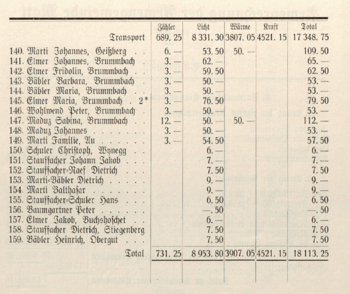
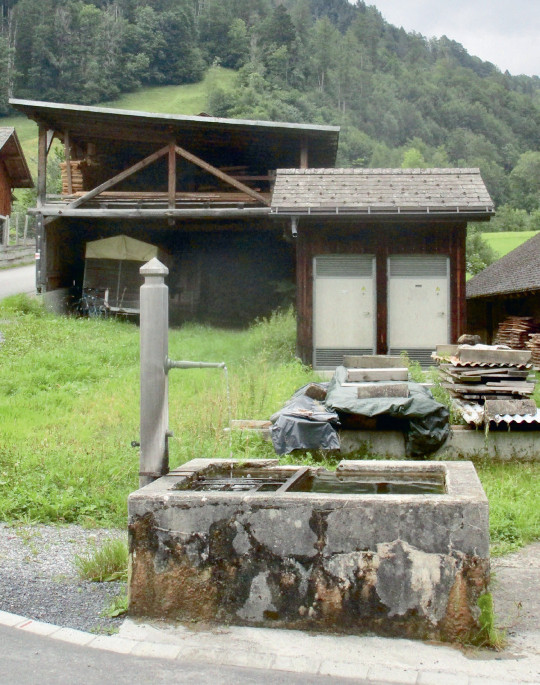



## Gründung und Entwicklung

Die Geschichte des Elektrizitätswerks Matt ist eng verknüpft mit der
Wasserkraftanlage der Spinnerei Spälty am Krauchbach. Gemäss Vertrag
vom 1. Juli 1867 überliess der Tagwen Matt den Brüdern Rudolf und
Caspar Spälty aus Netstal die Wasserkraftnutzung des Krauchbaches «von
der neuen Landstrasse bis zur Waldibachruns». Weiter stellte er
Steine, Sand und Holz für den Fabrikbau zur Verfügung und übernahm den
Bau der Wasserfassungseinrichtungen. Dies alles um geregelten
Verdienst in die Gemeinde zu holen – von elektrischem Licht war zu
diesem Zeitpunkt noch keine Rede. Dies änderte sich, als Spälty 1901
seine Wasserfassung weiter nach oben «zu den grossen Steinen»
(Kesselwand) verlegen wollte.

Der Gemeinderat zeigte sich zu Verhandlungen bereit, wollte aber neben
dem Weiterbestand von Holzreistrechten und anderem, dass Spälty «wenn
möglich» Kraft zu elektrischem Licht abtrete. Auch solle die Firma
überzählige Kraft den Bürgern zu gleichen Bedingungen überlassen, «wie
sie Herr Ständerat Blumer in Engi abtritt». Und auch für später ganz
wichtig, es solle bestimmt werden, «dass die Conzession wieder dem
Tagwen zufalle, wenn das Geschäft abbrennen sollte.» Die
Gemeindeversammlung vom 14. April erteilte in diesem Sinne das
Verhandlungsmandat.

Das Vertragsdokument vom 15. April 1902 enthält weder Bestimmungen zu
einem Konzessionsrückfall noch über Abtretung von Strom für die
öffentliche Beleuchtung, hingegen eine Klausel, die Spälty rundweg
verbietet, elektrische Kraft ausserhalb der Gemeindehuben zu
verwerten. Ein Jahr später ging die neue Anlage ohne Strom für die
Strassenbeleuchtung in Betrieb. Aber beim Gemeinderat blieb die Sache
pendent und er beantragte der Gemeindeversammlung vom 13 März 1904
«Aufnahme von Plänen um Erstellung eines Wasserwerkes am Berglibach».
Das Projekt wurde verschoben, um nicht allfälligen (Strom)Interessen
der im Aufbau befindlichen Sernftalbahn in die Quere zu kommen.

Fragen wirft ein nirgends erwähnter Plan mit dem Titel «Projekt eines
Elektrizitätswerkes für die tit. Gemeinde Matt» auf, datiert auf
Dezember 1904, resp. 24. Juni 1905. Abgebildet ist ein Verteilnetz mit
drei Hauptsträngen und offensichtlichem Beginn in der Spinnerei. In
der Aufstellung sind vermerkt: Lampenspannung 220 Volt, 300 Hauslampen
à 16 «Kerzen» sowie Heiz- und Kochapparate für die Villa Spälty und
das Fabrikbüro. Klar hingegen ist der Auftrag der
Frühlingsgemeindeversammlung vom 17. März 1908 zur Beschaffung von
Plänen und Kostenberechnungen für Gewinnung von elektrischer Kraft am
Berglibach. Die entsprechenden Arbeiten zogen sich hin, da der
Gemeinderat verschiedene Anliegen betreffend Fassung und
Leitungsführung berücksichtigt haben wollte.

In diese Aktivitäten platzte im Januar 1909 die Einladung des
Gemeinderates Engi zu einer Besprechung aller Sernftalgemeinden
«betreffend eines gemeinsamen Elektrizitätswerkes am Mühlebach». Die
Matter liessen trotzdem ihre Projektarbeiten weitertreiben und
erhielten im Juli die nötigen Unterlagen zum Studium. Im Januar 1910
reichte Engi ein Konzessionsgesuch für das Mühlebachwerk beim
Regierungsrat ein, welcher die Meinungen der Nachbargemeinden
einholte. Matt liess wissen, man sei gegen den geplanten Stromexport
an Jenny in Ziegelbrücke und wolle diese Energie zu Gestehungskosten
für das Sernftal. Dafür sei man bereit, sich am Werk finanziell zu
beteiligen. Engi verzichtete im folgenden Jahr wegen hoher Kosten und
mangelnden Absatzaussichten bei Nachbargemeinden und Sernftalbahn auf
den Bau.

Dass auch Matt in der Folge auf sein bisheriges Projekt verzichtete,
ist 1914 im «Bericht über die Einführung der elektrischen Energie in
der Gemeinde Matt» nachzulesen. Darin wird neu vorgeschlagen, die
Elektrizitätserzeugung mit einem eher früher als später notwendigen
leistungsfähigen Hydrantennetzbau zu verbinden. Wasserfassung und
Reservoir sollen weiterhin am Berglibach auf knapp tausend Metern zu
stehen kommen, das Maschinenhäuschen mit zwei Maschineneinheiten von
je 30–40 «Pferd» (PS) am Sernf. «Alle diese Bauten [...] sollen solid,
aber unter Einhaltung möglichster Einfachheit, ausgeführt werden.» Das
Verteilnetz solle für 250/145 oder 350/200 Volt ausgelegt werden.
Kostenpunkt: 61’000 Franken.

Die Vorlage kam an der ausserordentlichen Gemeindeversammlung vom 17.
Januar 1915 zur Beratung und fand Zustimmung. Im Versammlungsprotokoll
vom 13. Mai 1917 sieht das Vorhaben etwas anders aus. Die anhaltenden
Kriegsverhältnisse hatten die eigene Kraftanlage verhindert. Mit
Fabrikant Spälty konnte jedoch ein Stromliefervertrag für 4’000
«Kerzen» (ca. 14 kW) ausgehandelt werden und die Gemeinde liess
daraufhin einen Teil des Verteilnetzes für 3’000 Franken erstellen.
Spälty hatte die Gunst der Stunde genutzt, eine leistungsfähigere
Turbine installieren lassen und bot nun der Gemeinde die doppelte
Energieleistung an. Bereits die Herbstversammlung trat auf das Angebot
ein und bewilligte 12’500 Franken für eine Netzerweiterung, womit
«fast jedes Haus angeschlossen werden kann».

Wie überall, stieg die Nachfrage nach Lichtstrom und wurden auch
Wünsche für Wärmestrom laut. Daher wurde Ende 1924 ein
Versammlungsantrag gutgeheissen, der Gemeinderat habe sich um mehr
Strom zu bemühen. Dieser berichtete am 10. Mai 1925, Spälty könne
seine Stromproduktionsanlagen nicht ausbauen. Weiter habe er alle
ausbeutbaren Gewässer prüfen lassen, doch keines könne den erwarteten
Bedarf decken – auch der Berglibach nicht. Hingegen wolle das EW
Schwanden (EWS) ausbauen und habe sich daher Strom von der NOK
gesichert. Es könne sich eine Belieferung von Engi und Matt zu
gleichen Konditionen wie sie für die Grosstalgemeinden gelten
vorstellen. Eventuell werde ein Leitungszuschlag verlangt, da rund
80’000 Franken investiert werden müssten.

Der Entscheid zum Bau des Sernf–Niederenbachwerkes brachte eine neue
Situation und damit neue Verzögerungen. Erst Anfang 1931 sah sich das
EWS imstande, ein vernünftiges Angebot zu machen: Auf zehn Jahre
hinaus Lieferung zu 6½ Rp./kWh und eine jährliche
Zuleitungspauschale von 500 Franken. Der Bau einer Trafostation (TS)
sowie der notwendige Umbau des Netzes wurde auf 38’000 Franken
veranschlagt. Im September kam nochmals ein Berglibachwerk in
Diskussion, doch die Bürger entschieden sich für den Vertrag mit
Schwanden. Bereits Ende Jahr war die Leitung von Engi nach Matt
erstellt und das «Probezeit»-Reglement verabschiedet. Weiter wurde
mitgeteilt, dass die Änderungskosten bis ans Tableau vom EWM
übernommen würden.

Wer damit rechnete, man habe für eine Weile Investitionsruhe, hatte
nicht mit den Weissenbergern gerechnet. Diese stellten nämlich bereits
an die Frühlingsgemeindeversammlung 1934 das Begehren, auch sie seien
mit der nun überall alltäglichen Energie zu versorgen. Die Bürger
genehmigten diesen Antrag unter der Voraussetzung, dass Bund und
Kanton diese Berg-Erschliessung zur Hälfte mitfinanzierten. Zwei
Jahre später floss Strom in die Weissenberge. Wegen kriegsbedingt
teurem und schlechtem Petrol wollten 1944 die Talbauern auch die
abgelegenen Ställe im Bühl, Hänigen und Gruben ans Netz angeschlossen
haben.

1952 brannte der Stangentrafo Weissenberge wegen Ölschaltversagen bei
Föhnsturm aus. Man ersetzte ihn durch einen grösseren, liess ihn aber
bei Knobel, Ennenda, für spätere Verwendung reparieren. Im gleichen
Jahr einigte sich das EW Elm (EWE) mit dem EWS auf Stromlieferungen
und beantragte, auf Matter Boden Leitungsstangen stellen zu dürfen. Da
auch in Matt der Bedarf stieg, machte man sich erneut Gedanken über
ein eigenes Werk, nun am Krauchbach. 1955 teilte der Gemeinderat mit,
er sei am Verhandeln über die Wasserrechte. Im Jahr darauf machte ein
Bürger Druck mit dem Antrag, es seien mit einem Fachmann die
technischen und finanziellen Fragen für eine eventuelle
Selbstversorgung abzuklären.

Für den Turnhallenbau musste 1959 die Trafostation abgebrochen und die
Einrichtungen ins Untergeschoss des Neubaus versetzt werden. Dazu
kamen Netzerweiterungen im Boligen und Erlen. Im gleichen Jahr gab der
Gemeinderat bekannt, das eigene Krauchbachprojekt sei in Arbeit und
die NOK verhandle mit der Spinnerei Spälty über eine Ablösung der
Krauchbachkonzession. Zwei Jahre später waren die geologischen
Untersuchungen und Berechnungen für die Krauchtalwassernutzung immer
noch im Gang, 1964 und 1965 machte die SN Sondierbohrungen im
Krauchtal. 1966 fiel dann der Entscheid, ein neues Krauchbachwerk
werde in absehbarer Zeit nicht realisiert, da der Fokus der Schweizer
Stromwirtschaft neu auf thermischen Kraftwerken (Öl und Atom) liege.

Nach der Schliessung der Spinnerei Spälty 1967 kam deren
Krauchbachwerk wieder ins Gespräch. Der Gemeinderat bestellte ein
Gutachten zur Frage, ob bei nichtindustrieller Weiterverwendung des
Spinnereiareals dessen Wasserrecht von der Gemeinde zurückgefordert
werden könne. Schon im folgenden Jahr musste sich die Gemeinde gegen
den vertragswidrigen Verkauf von Strom ausser die Gemeinde an die SN
durch den Bund als neuen Eigentümer wehren. 1969 vertrat der
Gemeinderat den Standpunkt, ein Kauf und Eigenbetrieb des Kraftwerkes
könne wegen der Unterhalts- und Personalfrage nicht angestrebt werden.

Mit dem Gemeindepräsidentenwechsel wechselte 1972 auch die Gangart.
Man machte mit dem Beizug eines Advokaten und dem inzwischen
eingetroffenen Wasserrechtsgutachten Druck beim Bund, der darauf in
Verhandlungen einwilligte. Bald war für beide Parteien klar, dass das
Wasserrecht der Gemeinde gehöre, die Anlagen aber Eigentum des Bundes
seien. «Gütliche Verhandlungen» waren damit angezeigt. Diese verliefen
zäh und mit Unterbrüchen, denn es mussten der Anlagenwert und die
voraussichtlichen Betriebskosten festgestellt sowie die Betreiberfrage
und die Stromverwendung festgelegt werden. 1977 wurde von Matt ein
Gang vor Gericht vorbereitet, dieser jedoch durch
Vermittlungsverhandlungen aufgeschoben.

1979 schlug der Bund die Möglichkeit eines gemeinsamen Eigentums vor.
Nach einigem hin und her einigte man sich auf diese Eigentumsform, den
Betrieb durch die Gemeinde und die Stromlieferkonditionen für die
Militäranlagen in Matt. Die Gemeindeversammlung vom 22. Februar 1980
genehmigte den Vertrag diskussionslos und kurz darauf unterschrieb ihn
auch Bundespräsident und Militärdepartementschef Chevallaz. Ab dem 1.
April bezog das EWM Strom vom Krauchbachwerk. Damit hatte Matt sein
(halbes) Kraftwerk. Ab 1992 kamen Bestrebungen in Gang, das Werk
weiter zu entwickeln. Der Bund war bereit, dies im Rahmen seiner
jeweiligen Anteile finanziell mitzutragen. Alles, was über eine reine
Sanierung des Bestehenden hinausging, hatte jedoch das EWM zu
berappen, konnte aber auch über den Mehrertrag verfügen.

Parallel zu den Kraftwerksgeschäften waren auch die Verteilanlagen
weiter auszubauen. 1972 war eine Erneuerung der TS Turnhalle sowie die
Verkabelung ins Trämligen notwendig. 1974 wurde der Militärparkplatz
im Obererlen ans Netz angeschlossen. 1977 wurde in den Weissenbergen
der Stangentrafo durch eine TS im Suterheimet ersetzt und 1978 folgte
der TS-Neubau bei der Seilbahnstation im Trämligen samt Verkabelung
des Quartiers. Nach Erstellung der Dorfumfahrung sanierte man ab 1979
die Dorfstrasse und montierte eine zeitgemässe Beleuchtung. Von 1984 –
1987 waren Verkabelungen auf den Weissenbergen, im Auen, vom Wysswand
bis Waldgüetli sowie der Trafo im Brummbach an der Reihe.

1986 realisierte man im Primärnetz den Spannungsumbau von 8 auf 16 kV
inklusive Trafowechsel im Kraftwerk und Verkabelung der
Weissenbergezuleitung. 1987 war die Netzerweiterung im Tschogglen in
Ausführung. Von 1991 – 1999 vervollständigte man Schritt für Schritt
das Ringleitungsnetz samt anfallenden Anpassungen und Erweiterungen,
zuerst östlich und dann westlich der Dorfstrasse. Damit verschwanden
bis 2000 fast alle Freileitungen. Ab 2002 konnte die Verkabelungen im
Krauch, Sand, Geissberg und Stalden fertiggestellt werden. Bis zum
Übergang des EWM an die Technischen Betriebe Glarus Süd waren vor
allem vom ESTI verlangte Sicherheitsarbeiten an den Trafostationen
auszuführen. Dazu kamen 2006 ganz neue Anlagen in der TS Turnhalle und
2008 ein neuer Trafo mit Schaltanlage in der TS Talstation.

## Betrieb und Finanzen

Die Gemeinderechnung 1916 weist Einnahmen für Lichtzins von 1’789
Franken und für Lampen von 273 Franken aus; 1917 waren es 2’541
Franken, wobei drei Viertel dieses Betrages an Spälty gingen. 1919
erscheint mit Schreiner Fritz Marti der erste Kraftstromabonnent. Für
die Bedienung der vier Strassenlampen wurden 20 Franken ausgegeben.
Einen neuen Ausgabeposten gab es 1922 mit dem Wartgeld von 100 Franken
für «Gemeindeelektriker» Emil Stapfer. Einen Spezialfall stellte die
Kirche dar, denn den Strom für die Beleuchtung lieferte die Gemeinde,
denjenigen für den Orgelmotor direkt die Firma Spälty.

Nach dem Lieferantenwechsel 1931 von Spälty zum EW Schwanden wurde im
neuen Reglement u.a. festgehalten, dass (fast) überall mit Zähler
abgerechnet werde, eine Minimale von 50 Franken für Lichtstrom zu
bezahlen sei und bei Anschlüssen von mehreren Motoren
Spezialregelungen gelten sollen. Im ersten Betriebsjahr wurde für
Lichtstrom 9’124, für Wärme 2’410 und für Kraft 6’953 Franken
eingenommen, wobei beim letzten Betrag allein auf den Steinbruch Bitzi
5’543 Franken entfielen. Wegen der neuen Bezugsmöglichkeiten fiel der
Apparateverkauf mit 5’224 Franken sehr hoch aus. Das
Abonnentenverzeichnis listet 145 Positionen auf.

In der Gemeinderechnung 1932 wird von der ausführenden Firma Dürst &
Sutter und vom Tagwenvogt als Werkverantwortlichem Rechenschaft über
die erheblichen Mehrkosten von rund 4’200 Franken (70 %) beim
Netz(um)bau abgelegt. Der Hauptgrund war eigentlich erfreulich, denn
viel mehr Abonnenten als angenommen wollten von der neuen Möglichkeit
für Kraft- und Wärmestrombezug Gebrauch machen. Das erforderte aber
weitgehend den Wechsel vom Zwei- zum Vierleitersystem mit
entsprechendem Drahtmehrverbrauch. Weiter wechselte man noch
bestehende Aluminium- oder gar Eisendrahtleitungen aus und profitierte
dabei vom tiefen Kupferpreis. Auch bei den Hausanschlüssen gab es –
wen wunderts – einige Überraschungen. Fazit: «Das Hauptnetz wird nun
aber auf Jahrzehnte hinaus auch bei viel grösserem Konsum genügen und
befriedigen.»

1934 wurden Tarifvergünstigungen zu Gunsten einer höheren
Abschreibungsrate noch zurückgestellt, drei Jahre später aber mit
durchschnittlich 20 % vom Gemeinderat beantragt. Die bereinigten
Tarife betrugen – auch in den Weissenbergen – für Licht 40 Rp./kWh
sowie eine Minimale von 40 Franken. Bei der Wärme verlangte man
sommers 8 und winters 10 Rp./kWh und auch eine Minimale von 40
Franken. Der Krafttarif blieb gleich (keine Angaben) bei einer
Minimalen von 50 Franken pro installierter PS. Die Sonderregelung für
den Steinbruch sah einen Aufschlag von 0.8 Rappen auf die
Gestehungskosten (Einkauf und Nebenkostenanteil) vor.

1943 waren die Anlagen abgeschrieben und es konnte ein Erneuerungsfond
mit 7’000 Franken geäufnet werden. Weiter wurden die Minimalen um gut
10 % herabgesetzt und das Licht-Kilowatt auf 35 Rappen festgesetzt.
1955 bezog die Gemeindekasse erstmals Geld vom EW und zwar 6’000
Franken für den Baufonds. 1962 stiegen erstmals die Strompreise im
Matt und es wurde die kostenlose Stromzuführung bis ans Gebäude
eingeschränkt. Für die Ermöglichung des neuen Wärme-Niedertarifs
schaffte man Rundsteuerungsempfänger an. 1970 wurde beschlossen, auf
freiwilliger Basis schrittweise zum Einheitstarifsystem überzugehen.
Die Eckwerte dazu waren eine monatliche Grundgebühr von 10 Franken
sowie ein Hochtarif von sommers 8 und im winters 10 Rp./kWh und ein
Niedertarif von 5 resp. 6 Rp./kWh.

Damit die Ferienhäuser mit ihrem niederen Verbrauch dennoch die
Infrastrukturkosten mittrugen, erhob man ab 1972 einen
Anschlussbeitrag von 60 Franken pro Ampère an der Hauptsicherung. Die
Tariferhöhung von 1974 wurde durch die Tarifrevision des EWS
ausgelöst. 1931 betrug der kW-Einkaufs-Preis 6½ Rappen und die
jährliche Zuleitungspauschale 500 Franken. Im Versammlungsprotokoll
von 1961 – also 30 Jahre später – ist von einem Teuerungsfaktor von
1.46 (= 9½ Rp.) die Rede. Im Vertrag mit dem EWS wurde neu das
System von Leistungspreis per kW des Jahresmaximums sowie Arbeitspreis
pro bezogene Kilowattstunde eingeführt, was ungefähr 12 Rp./kWh. alte
Berechnung ergab.

Mitte der 1970er-Jahre begann die Zeit der grossen Kreditbegehren für
die Infrastruktur; allein von 1976 – 1978 betrugen die bewilligten
rund 400’000 Franken. Parallel dazu waren bis 1994 Tariferhöhungen
fast ein Zweijahresritual. So musste man 1977 auf den Hochtarifen
durchgehend einen Rappen mehr verlangen und die Minimalen erhöhen. Die
Übernahme 1980 des «halben» Krauchbachwerkes mit seinen moderaten
Gestehungskosten brachte etwas Luft bis 1984, als wieder durchgehend
um einen Rappen aufgeschlagen werden musste. 1980 wurde das Reglement
von 1937 abgelöst. 1985 ergab sich die Möglichkeit eine Vollzeitstelle
für einen Einheimischen zu schaffen, die den Unterhalt und Betrieb des
Krauchbachwerkes, des EWM-Netzes und der ARA Engi umfasste.

1982 legte der Lampenwart Fritz Schuler nach rund 60 Jahren täglicher
– und vorallem nächtlicher – Pflichterfüllung seine Stangensteigeisen
weg. 1985 ist nachzulesen: «Der Tagwenvogt teilt als EW-Verwalter mit,
dass er bei X. einen Münzzähler einbauen wollte. X. erklärte, wenn
dies geschehe, ziehe er sofort samt seinen Angehörigen von Matt weg
und lasse alles liegen. Über solche Schicksale kann der EW-Verwalter
nicht allein entscheiden.» 1986 ging die EW-Verwaltung vom Tagwenvogt
an die Gemeindeverwaltung über und 1989 wurde die EDV eingeführt. Im
Frühjahr 1993 führte «einmal mehr» eine fehlerhafte Kupplerschaltung
zu Überspannung, welcher diverse Waschmaschinen zum Opfer fielen.

Ende 1991 musste auf die Gründung der Genossenschaft für
Sonnenenergieanlagen Sernftal (GSS) im EW-Reglement mit
Rücklieferungsvorschriften für Kleinproduzenten reagiert werden. 1994
erhielt die Tür der TS-Gädmeren mit tatkräftiger Unterstützung durch
Schüler einen neuen Farbanstrich. 1996 bezweifelte ein Abonnent den
richtigen Gang seines Zählers; das EWM liess ihn unter der Bedingung
kontrollieren, dass bei intaktem Apparat es die Kosten abwälzen könne.
Wer bezahlt hat, ist leider nirgends vermerkt.

Um einiges grössere Beträge ging es Ende 1996, als die a. o.
Gemeindeversammlung dem Baukredit von 3.47 Mio. Franken für die
Kraftwerkserweiterung zustimmte. Der Bund als Mitbesitzer beteiligte
sich mit 1.21 Mio. und für den verbleibenden Rest griff man mit 1,1
Mio. auf das «Eingemachte» des EWM zurück. Das Projekt wurde 2000
innerhalb des Kreditrahmens abgerechnet. Für den Absatz des zu
erwartenden Überschusstromes führte man 1997 Verhandlungen mit dem EWE
und dem EWS. Im Frühjahr 2000 ging man davon aus, dass Ende Jahr im
Dorf die letzten Freileitungen abgebaut sein werden. Daher liess man
einen neuen Leitungskataster erstellen und um der neuen Situation mit
dem ausgebauten Kraftwerk gerecht zu werden, beauftragte man einen
auswärtigen Fachmann mit der Neufassung des EW-Reglements.

Als 2001 das EWM eine Kostenrechnung für Kabelverlegungen beim EWS
überprüfen liess, geriet dies den Verantwortlichen des EWE in den
falschen Hals und sie liessen wissen, man sei der wichtigere
Geschäftspartner (Überschusstromabnehmer) für Matt als das EWS. Gegen
Ende des gleichen Jahres wies man den Werkführer an, unverzüglich mit
den entsprechenden Grabarbeiten im Krauch zu beginnen, damit an der baldigen
Gemeindeversammlung nicht gefragt werden könne, warum es für das
Kreditbegehren einen « Kästlibeschluss» gebraucht habe. Und noch eine
Reminiszenz: Im folgenden Jahr wurde in den Weissenbergen eine
Strassenlampe individuell ausschaltbar geplant, weil der anstossende
Hausbesitzer eine Sternwarte betreibe.

Bereits 1991 wurde von Bürgerseite gefordert, es sei kein Geld mehr an
die Gemeindekasse abzuliefern, da dies eine indirekte Steuer sei.
Gegen die langjährige Praxis, der Gemeindekasse als Kreditor zu
dienen, wurden hingegen bei einem Zins von 3 % keine Einwände gemacht.
2001 gewährten die Stimmbürger sich einen fast totalen Schuldenerlass
von einer halben Million Franken, doch bereits zwei Jahre später
betrug die Schuld wieder über 560’000 Franken und am Ende des
Jahrzehnts 720’000 Franken! 2005 geriet auch die Gewohnheit, die
Luftseilbahn Weissenberge jährlich mit 15’000 Franken aus der EW-Kasse
zu subventionieren, in die Kritik; damit wurde jedoch bis 2009
fortgefahren. Mit diesen Praktiken konnten immerhin die kritischen
Gemeindefinanzen etwas stabilisiert werden.

2003 wurde in der Verwaltung eine neue EDV-Software eingeführt und
alle Daten neu erfasst, was eine «gewisse Verzögerung» in der
Stromrechnungsstellung bewirkte. Diese bestand darin, dass in diesem
Jahr approximative Beträge eingefordert wurden und im folgenden die
Rechnungen an Gewerbetreibende «vergessen» gingen. In immenser
Zusatzarbeit mussten alle Rechnungen kontrolliert und ein Viertel
davon in Handarbeit korrigiert werden. «Es gibt Einwohner in Matt, die
bewusst oder unbewusst zweimal Weihnachten hatten und keine Gebühren-
bzw. Stromrechnungen erhielten.» An der Software lag es wohl kaum.

2005 musste das Sanierungskreditbegehren für die TS-Turnhalle
zurückgezogen werden, weil das EWE eine unvollständige Offerte
erstellt hatte. Im Zuge der Strommarktliberalisierung und der damit
fallenden Strompreise konnte 2006 ein Rabatt von 10 % auf die
geltenden Tarife gewährt werden. Ebenfalls finanziell glimpflich lief
2007 ein Maschinenschaden samt Produktionsausfall von 19 Tagen ab, da
die Versicherung mitzahlte. Hingegen mussten zwei Jahre später der
Turbinenrad-Ersatz und eine Schieberreparatur ganz auf eigene Rechnung
genommen werden. Mit der Gemeindefusion ging 2011 auch das EW-Matt
samt Kraftwerkanteil in den TBGS auf.

## Kraftwerk

1867 liessen die Brüder Rudolf und Caspar Spälty aus Netstal zu ihrem
neuen Spinnerei-Etablissement auch eine Wasserkraftanlage am
Krauchbach bauen. Die Wasserfassung befand sich unterhalb der
Waldibachruns auf etwa 910 Metern. Von dort führte ein überdeckter
Kanal zum Bödeli bei der Krauchegg in ein Wasserhäuschen. Ab diesem
bestand eine Röhrenleitung zur Fabrik. Über Bauart, Lieferant und
Leistung der ersten Turbine ist nichts mehr bekannt. Dasselbe gilt für
die meisten Kraftanlageteile der Erneuerung von 1902/03. Hingegen
entsprachen die zugehörige Wasserfassung auf ca. 930 Metern und die
Druckleitungsführung weitgehend dem aktuellen Werk.

Man kann davon ausgehen, dass ab 1903 zwei Turbinen installiert waren,
wovon die grosse mit 500 l/sec. Schluckvermögen und geschätzten 300 PS
(220 kW) die Transmission antrieb und die kleine, die 1917 durch eine
Peltonturbine mit 50 l/sec. und 37 kW ersetzt wurde, einen Generator
für die Fabrikbeleuchtung. 1948 wurde der Betrieb ganz elektrifiziert
und dafür das heutige Maschinenhaus erstellt. Zur Aufstellung kam neu
als Gruppe 1 eine Francis-Spiralturbine von Escher-Wyss (317 kW) mit
einem direkt gekuppelten BBC-Synchrongenerator und als Gruppe 2 die
vorhandene kleine Peltonturbine mit einem neuen BBC-Generator. Ab 1980
lieferte das Werk im Vollbetrieb rund 2 GWh Strom.

Die Um- und Neubauten von 1999 umfassten eine Totalsanierung der
Wasserfassungsbauten und den Neubau der Druckleitung mit 70 cm
Lichtweite (alt 50 cm). Weiter die Revision der Gruppe 1 mit
Leistungssteigerung auf 331 kW und den Einbau einer neuen Gruppe 2 mit
einer Francis-Spiralturbine von VA-Tech/Escher-Wyss mit 400 l/sec.
Schluckvermögen und 267 kW Leistung sowie direkt gekuppeltem
Bartholdi-Synchrongenerator. Und schliesslich die Totalerneuerung der
Schalt-, Mess- und Steuerungsanlagen. Das Werk kann im Inselbetrieb
gefahren werden.

## Kraftwerkspläne

Für einen Eigenausbau des Krauchbaches bestellte Matt Ende 1984 ein
Vorprojekt mit Plänen, das eine kosten- und energiemässig günstige
Lösung unter Berücksichtigung von Umweltverträglichkeit und Restwasser
aufzeigen sollte. Im Herbst 1986 wurden vom Ingenieurbüro Locher zwei
valable Varianten vorgestellt, eine mit Wasserfassung auf 1220 Meter
im Bruch mit rechtsseitiger und eine auf 1130 Meter beim Geisssteg mit
linksseitiger Ableitung mit Gestehungskosten pro Kilowattstunde von
etwa 11 Rappen. Die Sache wurde nicht weiterverfolgt. Ab 2008 gab es
im Hinblick auf das Sanierungsprojekt der Matter Wasserversorgung noch
Abklärungen für zwei Trinkwasser-Kraftnutzungen im Reservoir Chnü und
in der Brunnenstube Stutz. Die Gemeindeversammlung vom 16. Juni 2010
stimmte einem Kredit von 50’000 Franken zu. Die bauseitigen Arbeiten
wurden von der neuen Gemeinde Glarus Süd ausgeführt, mit den
elektrotechnischen Anlagen wird noch zugewartet (Stand 2018).

## Statistik: Elektrizitätsversorgung Matt

Gegründet: 1916

Lieferanten: EW Schwanden / SN

Eigenwerk: Krauchbachwerk (hälftiger Anteil ab 1980).

|                                 |  1910 |   1935 |   1960 |     1985 |      2010 |
|---------------------------------|------:|-------:|-------:|---------:|----------:|
| Mitarbeiter, inkl. Leitung      |       |        |        | Teilzeit |  Teilzeit |
| Umsatz Werk (CHF)               | 2’541 | 19’565 | 42’099 |  280’928 |   590’060 |
| Wert Strassenbeleuchtung (CHF)  |       |    250 |        |   ~1’500 |    13’522 |
| Abgaben an Gemeinde             |   618 |        |  7’000 |   15’000 |    15’000 |
| Ausleihe an Gemeinde            |       |        |        |  400’000 |   720’253 |
| Stromabsatz (MWh)               |       |        |        |    1’841 |     2’500 |
| Eigenproduktion (MWh)           |       |        |        |    2’124 |     3’725 |
| Kabelnetz MS (m)                |       |        |        |          |    ~2’500 |
| Freileitungsnetz MS (m)         |       |        |        |          |      ~500 |
| Trafostationen Ebene 6 (Stk.)   |     1 |      1 |      2 |        6 |         6 |
| Kabelnetz NS (m)                |       |        |        |          |   ~13’800 |
| Freileitungsnetz NS (m)         |       |        |        |          |   ~1’7000 |
| Rundsteuerungsanlagen (Stk.)    |       |        |      1 |        1 | durch EWS |
| Anschlüsse MS (Stk.)            |       |      6 |        |          |           |
| Anschlüsse/Abonnenten NS (Stk.) |       |    139 |        |          |      ~320 |
| Strassenlampen (Stk.)           |     4 |     18 |    ~30 |          |        68 |

| Wartung     |                   |                                               |
|-------------|-------------------|-----------------------------------------------|
| 1920 – 1982 | Lampenwart        | Fritz Schuler (Spinnermeister und Elektriker) |
| 1980 – 2010 | Anlagenwart       | Heinrich und Dietrich Elmer (EMD/VBS)         |
| 1920 – 2010 | Wartung Kraftwerk | Oswald Hefti (zusammen mit ARA Sernftal)      |



*Dieser Text ist ein Auszug aus «Strom fürs Glarnerland» von August
Berlinger, erschienen 2022 und erhältlich im Buchhandel (ISBN
978-3-033-09268-6).*
