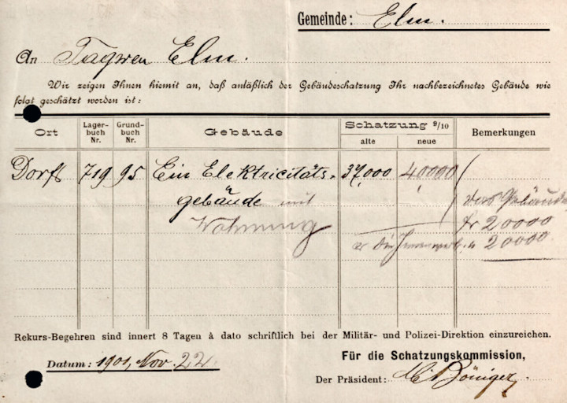



## Gründung und Entwicklung

Bereits Ende des 19. Jahrhunderts war die elektrische Beleuchtung in
Elm ein Thema. Im Zusammenhang mit dem geplanten Bau der Sernftalbahn
ist aus dem Protokoll der Gemeindeversammlung (GV) vom 3. Dezember
1893 zu erfahren: «Es wird beschlossen beim Initiativ-Comite der
Sernfthalbahn folgende Lampen zu bestellen, & zwar nur für den Fall,
dass die Wachtkorporation Dorf die Kosten für zwei Lampen im Dorf
übernehme, die übrigen geplanten 2 Lampen sowie je eine in der
Schwändi & Obmoos seien auf Kosten des Tagwens zu erstellen. Im
weitern wird dem Gemeinderath Vollmacht ertheilt, für das Schul- &
Pfarrhaus die benöthigten Lampen zu bestellen.»

Bis zum Sernftalbahnbetrieb dauerte es aber noch ein Jahrzehnt. Zu
lange für die Elmer, um zwischenzeitlich auf die neue Errungenschaft
zu verzichten. Nach Bedarfsabklärungen beim 1898 eröffneten Kurhaus
und in den Haushalten im Dorf, trat der Gemeinderat mit einem Projekt
vor die Versammlung vom 12. Februar 1899. Darin rechnete man für das
Kraftwerk neben der Säge sowie für das Verteilnetz im Dorf mit Kosten
von 41’000 Franken. Die Kapitalzinskosten veranschlagte man mit 1’700
Franken, was in etwa den zugesagten Strombezügen aus dem Dorf
entsprach. Dazu verpflichtete sich die Kurhaus Elm AG für eine
jährliche Abnahmegarantie von 900 Franken. Den entstehenden Überschuss
wollte man für die Amortisation verwenden.

Weitere Argumente waren: «Ueberdiess sei der Tagwen noch in der Lage
die Dorfbeleuchtung gratis abgeben zu können, welches schon längere
Zeit ein Wunsch der Einheimischen & Fremden hauptsächlich in Bezug auf
die Fremdenindustrie gewesen sei.» Für die noch nicht belegten 13 PS
hoffte man bald Abnehmer zu haben, was die Sache noch günstiger mache
im Hinblick darauf, dass «auch in unserer Gemeinde auf das Aufblühen
der Kleinindustrie Bedacht zu nehmen sei». Nach ausgiebiger Diskussion
von «Freund & Gegnern der Vorlage» wurde mit grosser Mehrheit
beschlossen, das Werk so schnell als möglich zur Ausführung zu
bringen. Selbst gehandelt hatte Schiefertafelfasser Fritz Hauser und
bereits im Mai um Boden für ein Reservoir im Gand sowie
Durchleitungsrechte zu seiner «Hochdruckwasseranlage» im Dorf ersucht.

Ein Übersichtplan zeigt, wie Säge und EW-Zentrale nebeneinander, resp.
nacheinander funktionierten. Da es sich beim EW um ein Licht- und
somit ein Nachtwerk handelte, liess sich die Säge wie bisher während
der Tagesstunden betreiben. Das bestehende Sernfwehr konnte ebenfalls
weiterverwendet werden. Das Säge-Kett (hölzerner Kanal) wurde entfernt
und der Bacheinlauf für das neue Druckrohr zur Zentrale abgeändert. Ab
diesem Rohr von 80 cm Lichtweite wurde tags das Wasser auf das
Säge-Wasserrad geleitet. Als Stromart wurde Gleichstrom gewählt.
Turbine und Regulator lieferte Escher-Wyss und die Dynamos samt
Tableau wahrscheinlich Gebr. Gmür in Schänis. Für die Netzerstellung
können Gmür und J. Bäbler & Sohn in Glarus angenommen werden.

Als im folgenden Jahr auf die Hauptgemeinde hin die definitive
EW-Bauabrechnung noch nicht vorlag, schossen die Gerüchte über massive
Überschreitungen ins Kraut. Der Gemeindepräsident sah sich genötigt
mitzuteilen, dass die Verzögerung durch Differenzen mit Lieferanten
entstanden sei und der Abschluss bei 56’000 Franken liege (immerhin
+37 %). 1901 wurde «nach etwas erregter Diskussion» die Baurechnung
dem Ersteller verdankt. Auch im folgenden Jahr bestand ein gewisses
Misstrauen gegenüber den Gemeindevätern und daher ein Bürgerantrag
angenommen, das EW samt Säge aus der allgemeinen Rechnung zu nehmen
und separat zu führen, damit «eine allfällige Rendite od. event.
Passivsaldo genau ersichtlich sei». Ausgewiesen waren 1904 die
Versicherungssummen: Gebäude 16’000, Turbine 4’000, Bremsregulator
500, zwei Dynamos mit Transmissionen 7’200, Tableau mit Apparaten
2’000 und Werkzeug & Material 300 Franken bei einer Prämie von 1¾ ‰.

An der GV vom 24. April 1910 referierte Ingenieur Schmid aus Weesen
über ein neues Hydranten- und EW-Projekt. Geplant seien einerseits 20
Hydranten in den Dorfteilen Müsli, Dorf und Obmoos, sowie andererseits
ein Hochdruckwerk mit zwei Maschinengruppen zu «zehnstündigen» 75 PS.
Die benötigten 1000 Minutenliter Wasser zweige man vom Pläusbach
(Steinibach) im Käsernloch in eine Brunnenstube ab und leite sie von
da zum Reservoir Güetli mit 1000 m³ Inhalt. Ab diesem führe eine
200-mm-Druckleitung direkt zum Maschinenhaus. Neu werde die
Wechselstrom-Technik eingeführt, was die Versorgung der entfernteren
Weiler ermögliche und die bestehende Turbine sei für den Sägebetrieb
vorgesehen.

Sechs Wochen später kam das Projekt zur Abstimmung. Der bereinigte
Kostenvoranschlag für Hydrantennetz und EW-Erweiterung betrug 153’000
Franken, wobei auf letztere 75’000 Franken entfielen. Mit 61 gegen 4
Stimmen bewilligten die Bürger das Geschäft. Ein 1912 ausgefüllter
Fragebogen gibt Aufschluss über die Werkdaten. Neu werden auch die
Empächliquellen als Wasserlieferanten der durchschnittlich 1000 l/min.
genannt und dass dieses Quantum ganzjährig genüge, weil nur ein Teil
davon verstromt werde. Die Produktion werde durch Ablesung der Volt-
und Ampère-Meter ermittelt. Die abgegebene Leistung betrage bei 380
Volt in den vier Sommermonaten durchschnittlich 20, in den restlichen
14 Ampère. Bei den angegebenen 3500 – 4000 Jahresbetriebsstunden
ergibt das ungefähr 21’000 – 24’000 kWh Jahresproduktion.

Die neue Stromart brachte Vorteile. So konnten 1911 die Weiler
Steinibach und Sulzbach, sowie etwas später der Meissenboden, ans Netz
angeschlossen werden und die Kirche erhielt erstmals überhaupt eine
Heizung mit Einzelheizkörpern in Chor und Schiff. 1913 kam ein
Kraftstromvertrag für 15 «Tagespferde» ( Kraftstrom während der
Tageshelle) mit der Schieferbruch AG für deren Werkplatz im Boden
zustande. Im folgenden Jahr stellte die Gemeinde im Gand einen mit
Elektromotor betriebenen Steinbrecher auf. Eine « Kreuzungstabelle»
samt Plan der Telefonverwaltung von ca. 1914 listet auf, wo die
Leitungen des EWE entweder auf grössere Distanz zu setzen waren oder
gar neu geführt werden mussten, um die Telefonverbindungen nicht zu
stören.

Bereits 1921 war das (Winter-)Wasser offensichtlich wieder knapp
geworden, denn der Gemeinderat beantragte einen Projektkredit um einen
Wasserbezug ab dem Bischofbach planen zu können, wobei darin eine
Hydrantenversorgung für den Weiler Steinibach eingeschlossen gewesen
wäre. Die Versammlung lehnte knapp ab. Als erste Notmassnahme erlaubte
der Gemeinderat der Schieferbruch AG, Kühlwasser für deren Dieselgenerator
im Obmoos ab dem Hydrantennetz zu beziehen gegen das Recht, bei
Niedrigwasserstand die Quellen im Empächli ob dem Bergli für das EW zu
nutzen. Weil das Problem trotzdem drängender wurde, engagierte der
Gemeinderat 1924 sogar einen Rutengänger. Erfolge blieben zwar aus,
aber man wollte es im Gerstboden weiter versuchen – und diesmal
stimmten die Bürger vorbehaltlos zu.

Das Winterwasserschicksal plagte neben Elm auch die andern
Talgemeinden sowie die Industriellen im Tal. Zusammen wandten sie sich
1926 an das EW Schwanden, das seit kurzem an das NOK-Netz
angeschlossen war und somit allenfalls Strom liefern konnte. Die vom
EWS verlangten 25’000 Franken Jahresgarantie konnten die Sernftaler
nicht aufbringen und so litt jeder für sich weiter. In Elm überlegte
man, ob es besser sei, sich an die Dieselgeneratoranlage der
Schieferbruch AG anzuschliessen oder doch eher selber einen «Gasmotor»
anzuschaffen. Man entschied sich aber nicht und so stellte ein Bürger
im Frühjahr 1928 die Frage, welche Schritte der Gemeinderat tun wolle
um die Kalamität mit der Licht- und Kraftbelieferung im Winter zu
verbessern. Der Rat hielt sich bedeckt und meinte nur, die Sache sei
noch nicht reif.

An der GV vom 30. September 1928 informierte der Gemeinderat, dass er
eine Wasserzuleitung von der Kühbodenruns zum Reservoir Güetli prüfen
lasse, es aber noch Abklärungen über die Wasserführung und die
Stabilität des zu querenden Hanges brauche. Vorläufig rechne man mit
etwa 30’000 Franken. Und, man müsse sich im Moment noch mit den
Einschränkungen abfinden. Im folgenden Frühjahr schlug der Gemeinderat
die Zuleitung von minimal 360 Minutenlitern ab der Kühbodenruns vor.
Die Versammlung stimmte zu, verlangte aber noch ein zweites Gutachten,
obwohl die Zeit drängte und allein die Elmag 30 PS mehr brauchte. Das
im Herbst vorgestellte Gutachten fand die Sache unrentabel, schlug
dagegen auf Empächli ein neues Reservoir für die bestehenden Fassungen
(mit eventueller Zuleitung von Kühbodenrunswasser) und ein neues
Kraftwerk beim Reservoir Güetli vor. Ein Entscheid wurde nicht
gefällt.

Im April 1930 wurden vier Varianten vorgelegt:

1. Zuleitung Kühbodenruns ins Reservoir Güetli;
2. Zuleitung Kühbodenruns nach Empächli und Rest belassen;
3. Dieselgenerator;
4. Fremdbezug.

Favorisiert wurde Variante 2, der Entscheid aber auf die nächste
Versammlung verschoben. Im Juni war der Gemeinderat immer noch
geteilter Meinung, schlug aber nun die Expertenidee eines
Zweistufenwerkes ohne Kühbodenruns vor. Die Sache sei zwar momentan
nur knapp rentabel aber die neu mögliche dreifache Leistung zahle sich
mit steigender Nachfrage aus. Die Versammlung folgte dieser
Argumentation und bewilligte mit 46 zu 32 Stimmen den Baukredit von
110’000 Franken. Im Nachsommer begann man mit den Arbeiten und
vollendete sie auf Jahresende. Da man für zukünftigen Ausbau
Reservoir, Druckleitung und Turbine grösser dimensionierte, ergab sich
eine Kreditüberschreitung von 11 %. Weitere Mehrauslagen erforderte
der gleichzeitig erstellte Netzanschluss in den Waldbergen.

Sehr lange dauerte die sichere Winterversorgung nicht, denn bereits
1933 zeigten sich die Bürger im Prinzip damit einverstanden, dass zu
Gunsten des EW das Wasserrecht der hinteren Säge auf Empächli und wenn
nötig der ganze Sägebetrieb gekauft werde. Nachdem für die bisherigen
Wasserbezüger ab der Empächliruns (Mattbächli) eine Lösung gefunden
war und sich für die Säge samt Wohnhaus ein Nachkäufer fand, konnte
das Geschäft 1934 für netto knapp 9’000 Franken erledigt werden. Damit
wurde es möglich, das allgemeine Drosseln der Spannung nach 21 Uhr und
die Liefereinschränkung auf sechs Stunden (!) für die Elmag wieder
aufzuheben. Für einen besseren und damit wassersparenden Betrieb,
erhielt eine der beiden «Säge»-Turbinen 1941 eine neue
Doppelregulierung. 1945 machte man wieder einmal Wassersondierungen,
aber selbst ein Fund hätte nicht viel genützt, weil kriegsbedingt
keine Eisenröhren erhältlich waren.

An der GV vom 29. April 1951 orientierte der Präsident die Anwesenden,
dass man einen Anschluss an das EWS ins Auge fasse, was rund 150’000
Franken koste. Die Versammlung war mässig begeistert und forderte gute
Rücklieferbedingungen für Überschusstrom. Im August lagen die
Verhandlungspositionen von Elm und Schwanden immer noch zu weit
auseinander und man erwog als Notlösung einen Dieselgenerator
anzuschaffen, um im Winter der Elmag gerecht werden zu können. Die
Versammlung verlangte aber nach anderen Erweiterungslösungen. Das EWS
protestierte gegen die (negativen) Aussagen in der Zeitung über die
Verhandlungen. Es hatte schon vorher schriftlich Druck für die
Anschlusslösung gemacht und bei einem Elmer Alleingang
Material-Lieferengpässe beschworen. Auch ein verdecktes Zusammengehen
von EWS und Elmag für deren Eigeninteressen ist nicht auszuschliessen.
Aber man hätte es wissen können: Elm sollte man nicht mit Druck
kommen.

Der Versammlung vom 9. März 1952 wurde eine Dieselgenerator-Offerte
der Lokomotivfabrik Winterthur von 29’000 Franken vorgelegt. Der
EW-Verwalter rechnete aber mit 40’000 Franken, da die Tankanlage und
Umtriebe nicht eingerechnet seien. Ein Projekt mit 90 PS am
Raminerbach wurde gewünscht – und Neuverhandlungen mit Schwanden. Und
dann ging es erstaunlich schnell: Der
Ergänzungsenergie-Vertragsentwurf mit dem EWS für 60 kW, erweiterbar
unter einmonatiger Ankündigungsfrist auf 120 kW, lag Ende Monat vor.
Die Gesamtkosten für die Hochspannungszuleitung 8 kV (später 16 kV)
von Matt – im Lawinengebiet Meissenboden verkabelt – und die
Transformations-, Schaltund Messanlagen in der Zentrale Säge waren auf
171’550 Franken veranschlagt und vom EWE zu tragen. Die
ausserordentliche GV vom 14. April stimmte Vertrag und Kredit zu und
nahm zur Kenntnis, dass auch der Liefervertrag EWE/Elmag bereinigt
sei.

Auch die Erstellungsarbeiten wurden zügig an die Hand genommen und der
Betrieb konnte am 1. Oktober aufgenommen werden. 1952 wurde ein
Spannungsregler bestellt – Lieferfrist ca. zwölf Monate! Im folgenden
Jahr erhielt die Elmag eine eigene 8/16-kW-Anschlussleitung samt
100-kVA-Trafo mit Schaltanlagen und Verteilung. Auch im Weiler
Sulzbach wurde eine Trafostation erstellt und in der Zentrale Säge
installierte man für die zweite Maschinengruppe einen Ölregler. Von
1954 bestehen Pläne für einen Ausbau der Zentrale Güetli, aber keine
Kreditbegehren. Im gleichen Jahr sind auch Projektstudien am
Kühbodensee gemacht worden. 1956 wurde die Trinkwasserversorgung aus
sanitarischen Gründen vom EW-Drucknetz abgekoppelt und an neue Quellen
angeschlossen. Damit verfügte das EW über das ganze Empächli-Wasser.
Mit der Aufgabe der Tafelfasserei von Johann Ulrich Hauser 1958 wurde
deren Wasserrecht mit 60 Minutenlitern in der Hinterweid (Güetli) frei
und das EWE griff für 1’200 Franken zu.

Um nicht weiter einen Drittel der Produktion als Überschussstrom dem
EWS billig abgeben zu müssen, erbat man sich 1959 von den Stimmbürgern
einen Kredit von 6’000 Franken für eine Rundsteueranlage. Sie schuf
die Voraussetzungen, um die Warmwasseraufbereitung in den
bezugsschwachen Stunden zu fördern und damit mehr zu verdienen. Zur
Wasserstandkontrolle im Reservoir Empächli wurde 1960 eine
Fernmeldeanlage zur Zentrale Güetli eingerichtet. 1961 wies der
Gemeinderat darauf hin, dass die in Vorbereitung stehenden Sportbahnen
eine grössere Leistungsfähigkeit des Werkes bedingen werden. Vorerst
war es aber das Konsortium Übungslift Moosen, das einen
5-PS-Stromanschluss beantragte. Für die schon lange gewünschte Fassung
der Kühboden-, und neu auch der Schwiruns, zur
Winterwasserverbesserung bewilligte die GV vom 27. April 1963 145 000
Franken.

Für den Bau der KLL-Wasserfassungen auf Wichlen und des
Überleitungsstollens ins Durnachtal musste 1965 eine Zuleitung nach
der Walenbrugg und auf die Bauplätze erstellt werden. In diesem
Zusammenhang wurde im folgenden Jahr im Obmoos eine Trafostation
erstellt. 1969 erfolgten TS-Bauten in der Rüfihoschet und im Weiler
Sulzbach, gefolgt 1970 von der TS KLL (Wichlen) und 1971 der
Stangen-TS im Meissenboden. 1973 war die Station für die neuen
Sportbahnen im Obmoos an der Reihe und 1976 die TS Untertal sowie
diejenige in der Überbauung Vorderchappelen. Parallel zu den TS-Bauten
und weiter in den folgenden Jahren wurde das Primär- wie das
Sekundärkabelnetz für gut 300’000 Franken stark ausgebaut. Da Elm ein
geschütztes Dorfbild hat, wurden die Verkabelungen in diesem Bereich
von der kantonalen und eidgenössischen Denkmalpflege subventioniert.

Im Herbst 1975 wurde ein Projektkredit von 10’000 Franken für die
Sanierung der Stromerzeugungsanlagen bewilligt, 1976 das Projekt
abgesegnet und in den beiden folgenden Jahren umgesetzt. Das EW-
Gebäude bei der Säge wurde (heimatschutzgerecht) umund ausgebaut und
mit einer Wohnung ergänzt. Die beiden Zentralen erhielten eine
Kabelverbindung sowie neue Maschinengruppen mit Schaltanlagen und das
Kabelnetz wurde stetig ausgebaut. Dazu kam eine neue
Rundsteuerungsanlage. Dies kostete 1.23 Mio. Franken und brachte eine
Leistungssteigerung bei der Säge von 85 auf 135 kW und im Güetli von
100 auf 192 kW. Die Einweihung samt Besichtigungen konnte am 20.
Oktober 1978 zusammen mit denjenigen von Wasserwerk und
Gemeindewerkschopf gefeiert werden.

Im selben Jahr fand die Einweihung des Panzerschiessplatzes und im
folgenden die der Truppenunterkunft statt – auch diese benötigten je
eine Station. Eine weitere Station brauchte es im selben Zeitraum für
die Erschliessung der Ferienhaussiedlung im Töniberg. Auf den 1.
Oktober 1980 wechselte man bei der Zuleitung von Matt und im eigenen
Primärnetz von 8 auf 16 kV und schuf damit Leistungsreserven bei der
Verteilung. Im folgenden Jahr wurden mit dem Strassenbau zur Erbsalp
auch die Gebiete Steger, Büel und Walenbrugg mit Strom erschlossen.
Von 1982 bis 1990 verkabelte man etappenweise die Zuleitung von Matt
und auch im Dorf und den Weilern verschwanden immer mehr
Freileitungen. Erleichtert wurde dies durch die bereits früher in
Strassen und Werkleitungsgräben verlegten Leerrohre. Die Kosten waren
dennoch beachtlich; gegen anderthalb Millionen Franken waren dafür
nötig.

1984 richtete man am Bischofbach eine automatische Messtation ein um
Unterlagen für eine allfällige Winterwassernutzung zu erhalten. Der
Kühbodensee kam im gleichen Jahr wieder als Reservoir ins Gespräch.
Eine Begehung ergab, dass mit bescheidenen Mitteln ein Aufstau
realisierbar wäre. In der Trockenperiode von 1986 zapfte man den See
provisorisch an und erreichte bei einer maximalen Absenkung von 20 cm
eine Zusatzleistung von 20 kW. Im folgenden Jahr regte der
Betriebsleiter die Prüfung eines weiteren Kraftwerkes an, denn
bekanntlich seien die Verfahren lang und der Bedarf steigend. 1989
erhielt das Dorf eine Heimatschutz-Strassenbeleuchtung, die
grossmehrheitlich von einem auswärtigen Bürger berappt wurde. Zusammen
mit einem Feuerwehrlokal und einer Bushaltestelle wurde im Jahr darauf
im Steinibach eine Trafostation erstellt. 1992 begannen unter der
Regie des EWE die Zuleitungsverkabelung und Anpassungsarbeiten für den
Schiessplatzausbau auf Wichlen.

Mit der Krediterteilung von 1.6 Mio. Franken ermöglichte die GV vom 4.
Dezember 1992 die Realisierung einer dritten Kraftwerksstufe mit einer
Maschinengruppe von 305 kW beim Reservoir Empächli. Sie ist Teil einer
Kombinutzung des Wassers auf Pleus für Trinkwasserversorgung,
Löschwasserreserve, Beschneiungsanlage und Stromerzeugung. Dieses Werk
wurde mit Eigenmitteln, Krediten, Investitionshilfedarlehen des Bundes
und Subventionen der kantonalen Sachversicherung finanziert. 1994
wurde ebenfalls auf Empächli für die geplante Gondelbahn und weitere
Verbraucher eine Trafostation erstellt. Mit der Verlegung eines
Verbindungskabels für die bessere Versorgungssicherheit der
Sportbahnen von der Zentrale Güetli her konnten 1996 die
Kraftwerksarbeiten auf Empächli abgeschlossen werden.

Mit dem Werkausbau ging es nahtlos weiter. Im Oktober 1996 wurde über
den Ausbau des Zentralengebäudes bei der Säge orientiert und am
Nikolaustag bewilligte die Versammlung dafür einen Kredit von 1.4 Mio.
Franken. Notwendig machten dieses Projekt die für Panzerschiessplatz
und Sportbahnen stark gestiegenen Stromlieferungen und der Verlust des
EW-Ladens im Dorf. Der Ausbau umfasste die Sanierung der bestehenden
Räumlichkeiten, mehr Raum für eine grössere Trafoanlage und die
Leitstelle für Wasserbewirtschaftung, Kontrolle und Steuerung der
elektrischen Anlagen sowie ein Ladenlokal. Nachdem diese Arbeiten 1999
etwas über Budget abgerechnet waren, nahmen Leitungsverkabelungen im
Lawinengefahrengebiet der Chüeboderus und die Verstärkung der TS Strit
das EWE in Anspruch. Ab 2003 erfolgten Netzausbauten für die neue
Sesselbahn der Sportbahnen mit einem Trafo auf Oberempächli.

Den letzten Zeitabschnitt des EWE prägten Kraftwerkspläne. Mitte 2006
gaben die EWE-Verantwortlichen bekannt, dass sie ein Sernf-Kraftwerk
vom Müsli bis ins Matter Obererlen planen möchten. Ein Jahr später
bewilligte die GV eine Aktienzeichnung von 1.02 Mio. Franken, womit
das EWE die Aktienmehrheit innehatte. Nach anfänglich gutem
Planungsfortschritt, verhinderten 2009 eine Einsprache und das
Ausgaben-Veto des Kantons vor der Gemeindefusion die Realisierung. Ein
Projekt zur Nutzung des Chüebodesees für EW und Beschneiungsanlagen
wurde zwar schweizweit ausgezeichnet, stiess aber auf breiten
Widerstand im Kanton. Im Schlussspurt vor dem Übergang des EWE in die
TBGS ersetzte man den Generator im Güetli, richtete eine
Netzüberwachungsanlage ein und beschaffte noch eine Notstromanlage für
die Zentrale bei der Säge.

## Betrieb und Finanzen

Wie fast überall im Kanton wurde in der Anfangszeit die «Kerze» (ca.
3.5 Watt) Strom pro Jahr mit einem Franken berechnet. Elektrische
Energie für Motoren und Heizzwecke wurde nicht abgegeben. Die
Gemeinderechnung 1902 vermerkt für die ans Netz angeschlossenen
Dorfteile Müsli, Dorf, Wiesen und Obmoos 49 Lichtabonnenten, inklusive
Gasthäuser, Schule und Kirche sowie Kurhaus. Diejenige von 1910 weist
56 Abonnenten aus und betreibt etwas «Wirtschaftsgeographie» mit den
Einnahmen aus Kurhaus (1’013.50 Fr.), Elmer (350.60 Fr.), Hausstock
(190 Fr.), Segnes (163.50 Fr.), Gemsli (65.10 Fr.), Sternen (84 Fr.),
Rössli (23 Fr.), Bahnhof (69.25 Fr.), sowie Schule (201.06 Fr.),
Kirche (168.80 Fr.) und Strassenbeleuchtung (275 Fr.). Der Maschinist
erhielt 1’200, der Verwalter 71.40 Franken pro Jahr.

Über das 1912 aufgestellten «Regulativ über die Abgabe von elektr.
Kraft & Licht» für das neue Wechselstromnetz ist einzig zu erfahren,
dass ihm ohne Diskussion zugestimmt, sowie der Verwalterlohn wegen der
Aufgabenerweiterung um das Hydranten- und Wasserwerk auf 300 Franken
pro Jahr erhöht wurde. Ziemliche Diskussionen löste die
Rechnungserhöhung für das Kurhaus im folgenden Jahr aus. Die Direktion
beschwerte sich über das willkürliche Vorgehen, zeigte mit
Rechenbeispielen auf, dass sie für die gleiche Leistung wesentlich
mehr als das Bad Stachelberg in Linthal bezahlen solle und verlangte
einen Zähler. Die Schieferbruch AG hatte mit Zählermessung 30 Rappen
pro Kilowattstunde zu bezahlen plus 30 Franken pro angeschlossene
Motor-PS.

Ebenfalls 1913 schied man die EW-Bauschuld von 80’000 Franken sowie
20’000 Franken der Hydrantenversorgungs-Schuld aus der Tagwensrechnung
der EW-Rechnung zu, die sie direkt verzinsen und amortisieren solle.
1914 verlangte der Kantonsingenieur für die Feststellung der
Stromabgabe einen Zähler, damit die Wasserwerkssteuer richtig
verrechnet werden konnte. Um das Geschäft anzukurbeln wurde im selben
Jahr offensichtlich eine «Kraft & Wärme-Offensive» gestartet, denn es
wurde der Verkauf von 4 Motoren, 2 Öfen und 12 Bügeleisen aufgelistet
und im Jahr darauf noch Ventilatoren für die Schule. 1920 taucht die
Schiefertafelfasserei Schenker erstmals in der EW-Rechnung auf. 1922
gab es 148 Licht- und 53 Bügeleisenabonnemente und ein Bürger
verlangte, es sei in der Jahresrechnung ein Inventar der
Insallationsmaterialien und Glühlampen abzudrucken!

Im Lawinenwinter 1923 drückte die Sandweidlaui sämtliche
Leitungsstangen in der Wiese um. 1928 hatte der neue Verwalter eine
Bürgschaft von 10’000 Franken zu hinterlegen und im folgenden Jahr war
ein neuer Maschinist zu wählen. Seine erste Geldablieferung an die
Gemeindekasse hatte das EWE 1929 zu leisten – 2’000 Franken. Typisch
für jene Zeit ist, dass das Baukapital für den Bau der Zentrale Güetli
1930/31 neben den Eigenmitteln (52’300 Fr.) und Bankkrediten (29’000
Fr.), auch aus Privatdarlehen von 45’000 (!) Franken bestanden. Auch
in jene Zeit der Wirtschaftskrise passt der Konkurs des Kurhauses, der
den Gewinn des EW um 1209 Franken (13 %) schmälerte. Gut ging es
offensichtlich der Elmag, die wesentlich mehr Strom als im Vorjahr
bezog.

Das Regulativ von 1934 zeigt ein paar interessante Details.
Grundsätzlich wurde für Beleuchtungsstrom an der
Jahrespauschalberechnung pro installierte «Kerze» festgehalten. Der
Umrechnungsfaktor von Kerze zu Watt für die einzig zugelassenen
Metallfadenlampen war auf 1.1 gesunken gegenüber den vorher
gebräuchlichen Kohlefadenlampen mit Faktor 3.5 – für die gleiche Helle
brauchte man nun gegenüber früher nur noch einen Drittel der Energie.
Die Jahrespauschale war nach mutmasslicher Brenndauer in vier
Kategorien aufgeteilt:

Dort wo ausnahmsweise mit Zähler Lichtstrom gemessen wurde, war die
kWh mit 35 Rappen angesetzt.

Beim Wärme- & Kraftstrom wurde für Bügeleisen in Haushalten eine
Jahrespauschale von max. 15 Franken verlangt, bei Glätterinnen 25
Franken. Der mit Zählern gemessene Kochstrom wurde sommers mit 6 und
winters mit 10 Rp/kWh berechnet. Die gleichen Ansätze galten bei
Heizkörpern über 750 Watt. Beim Motorenstrom war eine Minimalgarantie
von 20 Franken pro PS/Jahr zu zahlen und für die kWh degressiv über
vier Stufen 15 bis 10 Rappen:

Die allgemeine Stromknappheit im zweiten Weltkrieg hinterliess auch in
Elm seine Spuren. So ist 1942 zu lesen: «Um einer weiteren Kalamität
des nächsten Winters zu begegnen, wird auf den Befehl des eidg. Amtes
für Licht und Wärme aufmerksam gemacht, bei dem der Gemeinderat befugt
ist, bei Wasserknappheit die Heizkörper einzuziehen, mit Ausnahme bei
den Kranken.» Da neben den Wintern auch die folgenden Sommer
wasserknapp waren, entschied sich der Gemeinderat 1945 allgemein
Zähler einzuführen. Dies obwohl deren Installation und Ablesung im
weitläufigen Gebiet von Elm einen spürbaren Mehraufwand bedeutete. Man
hoffte, damit den durch die Pauschalgebühren unkontrollierbaren
Stromkonsum in den Griff zu bekommen. 1951 verlangte der
EW-Maschinist, es sei das «Brunnenreglement» rigoros durchzusetzen um
die Wasserverschwendung im Winter zu stoppen.

Der Netzzusammenschluss 1952 mit Schwanden ermöglichte Elm den
Ergänzungsenergiebezug für winters 6.5 resp. 5.5 Rp./kWh. und sommers
5 resp. 4 Rp./kWh. bei einem Grundpreis von 30 Franken pro kW und
Jahr. Das EWS sicherte sich das Liefermonopol, verzichtete hingegen
auf eine Direktlieferung an Dritte. Die durch die Änderung ausgelösten
Neuinstallationen erforderten eine generelle Installationskontrolle im
EWE-Netz. Für die Mängelbehebung bei neueren Arbeiten der eigenen
Installateure übernahm das Werk die Kosten, bei ganz alten Arbeiten
oder solchen von «fremden» Installateuren gewährte man 10 %. Im
gleichen Jahr wurden die Bewohner aufgefordert, vorgesehene
Waschmaschinenanschaffungen anzumelden, damit unnötige Installationen
vermieden werden könnten. 1956 lieferte man der Elmag aus der
Eigenproduktion verbilligten Strom (3 resp. 2.2 Rp.) «für Heizkessel
als Syrupkocher und Boiler».

In den 50er-Jahren war offensichtlich Fachkräftemangel, denn 1954 kann
man lesen: «Gemeinderat O. R. wird sich einer 3-jährigen Lehrzeit als
Installateur für Starkstrom & Telefonanlagen ausbilden lassen um den
gesetzlichen Bestimmungen des ESTI fachkundig gerecht werden zu
können.» 1957 sollte der «Lehrling-Gemeinderat» nach abgeschlossener
Ausbildung definitiv zum Betriebsleiter (Verwalter & Installateur)
gewählt werden, doch seine Lohnforderungen (gemäss Angebot der EV
Glarus: 10 000 Fr./Jahr) lösten grosse Diskussionen aus. Mangels einer
anderen Lösung beugte man sich der Forderung. Im folgenden Jahr musste
das Dorfgerücht, die Apparate-Verkaufsprovisionen fielen dem
Betriebsleiter zu, von den Rechnungsprüfern dementiert werden. 1961
geriet die Ferienregelung für den Betriebsleiter in die Kritik, doch
die Stimmbürger waren nicht bereit, die bei deren Änderung benötigte
Stellvertretung zu bewilligen!

1962 flammte der Gehaltszwist erneut auf. Die GV weigerte sich auf die
geforderten 13’000 Franken Jahreslohn und zusätzlicher
Töffentschädigung (700 Fr.) sowie Büroabgeltung (240 Fr.) einzutreten,
sprach von Diktat und man habe ihn während der Lehre ausgehalten, und
bewilligte schliesslich 12’000 und 500 Franken. Auf die als Antwort
eingereichte Kündigung trat Hektik ein, Bürger vermittelten und die
nächste Versammlung bewilligte in anderer Form in etwa die
Forderungen. 1967 kündigte der Betriebsleiter erneut und stellte für
einen Verbleib Bedingungen: 18’000 Franken Jahreslohn und für
Büroabgeltung 600 sowie eine neue Büroeinrichtung für ca. 3’600
Franken. Wieder brauchte es zwei Versammlungen um schliesslich 17’000
und 360 Franken sowie die Büroeinrichtung zuzubilligen. Im folgenden
Jahr abermals Drängen auf Erhöhungen, die wie gehabt, teilweise
erfüllt wurden. Das Gezänke um Lohnhöhen wurde 1970 mit der
definitiven Kündigung des Betriebsleiters beendet. Nun konnte die seit
Jahren regelmässig geforderte Trennung von Verwaltung und
Betriebsleitung durchgeführt und – mit viel Glück – die beiden
Aufgabenbereiche neu besetzt werden.

1964 beschaffte man für das EW erstmals ein Fahrzeug – einen
Occasions-Haflinger – und zusätzlich für anstehende Arbeiten und
spätere Vermietungen einen Kompressor. Als Installationsmateriallager
und Werkstatt diente neu eine bei der Säge aufgestellte
Militärbaracke. Das inzwischen 25-jährige EW-Reglement wurde 1971
überarbeitet und der Einheitstarif für Licht und Kraft von 10 resp. 5
Rp./kWh eingeführt. Damit konnten Zähler und Installationskosten
eingespart werde. Bedingung dafür war jedoch eine monatliche Grundtaxe
von 6 Franken, womit die Ferienhausbesitzer gerechter an die
Netzkosten beizutragen hatten. Die Konditionen mit den Grossbezügern –
Militär, Elmag, Sportbahnen und regionales Altersheim – konnte der
Gemeinderat in eigener Kompetenz aushandeln.

Zwei Jahre darauf erhöhte das EWS erstmals seine Lieferpreise, was
1974 zu einer Tariferhöhung im EWE-Gebiet führte. Beim Einheitstarif
stieg die Grundtaxe auf 12 Fr./Monat, der Hochtarif blieb bei 10 und
der Niedertarif stieg auf 6 Rp./kWh. Der Zählertarif erhöhte sich von
35 auf 45 Rp./kWh. Auch die Tarife für Heubelüftungen und
Speicherheizungen wurden angehoben. EWS-Tariferhöhungen waren in den
Jahren 1976 bis 1993 neun Mal ein bestimmendes Thema. Die Konsumenten
hatten dadurch 1979 durchschnittlich einen Aufschlag von 10 % sowie
1981, 1983, 1985, 1987 und 1993 je einen zusätzlichen Rappen pro
Kilowattstunde hinzunehmen. Für Industrie und Gewerbe stieg 1985 der
Leistungspreis von 90 auf 96 und 1987 auf 98 Fr./kW. Die 1982
eingeführten Grundtaxen (Ferienhäuser 60, Wohnhäuser 40 und Ställe 30
Fr.) stiegen 1985, 1987 sowie 1993 und erreichten 240 Franken für
Ferienhäuser und 216 für Wohnhäuser. Die Landwirtschaft wurde
weitgehend geschont.

1980 beschaffte man vier Funkgeräte, die 10’000 Franken kosteten! Im
Jahr darauf wurde ein Kredit von 24’000 Franken für eine eigene
Kabelwinde gesprochen. Anfangs 1981 hatte die Schosslaui einen Schaden
von gut 200 000 Franken an den Freileitungen verursacht, welcher mit
einem Grosseinsatz rasch überbrückt werden konnte. Einen harmlosen,
aber auch lästigen Schaden richteten die Bauern regelmässig beim
Misten an den Leitungsstangen an und gefährdeten sich selbst beim
Güllespritzen mit dem Druckfass. Der Betriebsleiter konnte jeweils nur
an Anstand und Einsicht appellieren. Ab 1982 waren die Hauszuleitungen
ganz vom Bauherrn zu tragen. Ein Bürger wünschte bessere
Beleuchtungsverhältnisse in Sand- und Fleischgasse. Doch die waren
nicht zuoberst in der EW-Prioritätenliste, die Übernahme von 60
Sportbahnenaktien hingegen schon.

Um im Netz Belastungsspitzen zu brechen, wurden ab 1984 jeweils
kurzzeitig einzelne starke Heubelüfter abgestellt. Im Juli desselben
Jahres zeigte ein dreiviertelstündiger Lieferunterbruch von Schwanden
her, wie allgegenwärtig Strom ist (vor allem, wenn er fehlt). 1985
wurde der altgediente Haflinger durch einen VW-Bus für die
Installateure ersetzt und 1986 erhielten die Leitungsmonteure ein
Geländefahrzeug. Weiter kaufte man die Remise beim Bahnhof für mehr
Lagerraum. Wie schon zwei Jahre vorher war im Winter 1987 das Wasser
so knapp gewesen, dass man nachts die Turbinen abstellen musste um
tags die Bedarfsspitzen abdecken zu können. Um die Elmer fürs
Stromsparen zu sensibilisieren, wurde in alle Haushalte der
Stromsparkalender verteilt.

Ab 1988 war das EWE auch für den Netzunterhalt in Matt zuständig. 1992
beschaffte man für den Grossauftrag an der Schiessplatzerweiterung
einen Baustellenwagen und bei der Gemeinde- und EW-Verwaltung hielt
die EDV Einzug. Eine Rechnung von 12’000 Franken für die Benutzung von
Spezialtelefonnummern erregte 1998 die Gemüter im Dorf. Ins Jahr 2000
fällt das neue Geschäftsfeld des EWE als Darlehensgeberin für die
Sportbahnen (400’000 Fr.). Drei Jahre darauf wurden für 130 000
Franken elektrische Anlagen von den Sportbahnen übernommen und die
Restschuld abgeschrieben. Gleichzeitig bestimmte die GV, die
Elektroinstallationen für die Beschneiungs- und Beleuchtungsanlagen
der zweiten Schlittelbahn-Etappe aus dem Sportgebiet ins Tal seien im
Umfang von 200’000 Franken vom EW zu übernehmen. 2004 wurden die
Sportbahnenaktien auf einen Franken abgeschrieben.

Die im Jahr 2000 neu beschaffte Rundsteuerungsanlage zeigte lästige
Kinderkrankheiten. Ab 2001 machte die ungewisse Zukunft durch die
geplante Strommarktliberalisierung auch Elm Sorgen. Vorerst aber
bescherte diese Aussicht 2005 dem EW und den Konsumenten sinkende
Stromtarife. Zwei Jahre darauf wurde eine Bewertung der
EWE-Netzanlagen in Auftrag gegeben. Nach dem Abschluss der Arbeiten
auf dem Schiessplatz 2007 konnte der Fokus auf Liegengebliebenes im
Werk gerichtet werden. Ende 2008 ging der Betriebsleiter in den
Ruhestand und als Überbrückungsmassnahme für die zwei Jahre bis zur
Gemeindefusion, erledigte der Betriebsleiter des EW Linthal in einem
20-%-Pensum die nötigsten Aufgaben. Parallel dazu übernahm das EWS die
Rechnungsstellung an die Abonnenten bis zum Übergang an die TBGS Ende
2010.

## Kraftwerke

### Zentrale Säge ab Sernf (1899)

Zu den ersten Produktionsanlagen des EWE mit Wasser vom Sernf hat sich
nur ein Arealplan erhalten. Die technischen Daten der Anlagen müssen
aus diversen Akten abgeleitet werden. Für die Francis-Turbine von
Escher-Wyss in Zürich wird bei einem Gefälle von vier Metern und einem
Wasserzulauf von 1000 Sekundenlitern eine Leistung von 40 PS (29 kW)
angegeben. Das Messprotokoll von 1912 für deren neue Verwendung als
Sägerei-Kraftquelle nennt nur noch 25 PS. Die beiden von der Turbine
mit Riemen angetriebenen Gleichstromgeneratoren sind wahrscheinlich
von den Gebrüdern Gmür in Schänis konstruiert und installiert worden;
ebenso die Schalt- und Messeinrichtungen. Gemäss einem Schreiben
vom 16. März 1910 wurden im Vorjahr 52 MWh produziert.

### Zentrale Säge – Hochdruck (1911 / 1977)

Von 1911 bis 1977 standen in der Zentrale bei der Säge zwei
Maschinengruppen mit je 75 PS (55 kW) Leistung. Sie wurden ab dem
Reservoir Güetli (1000 m3) von einer Druckleitung mit 105 Litern
Transportvermögen und 180 Metern Höhenunterschied gespiesen. Die
Bühler-Uzwil-Peltonturbinen trieben die BBC-Generatoren durch
Lederriemen an. Dem Betriebsfragebogen von 1912 sind folgende Daten zu
entnehmen: eine Spannung von 380/220 Volt, eine Abgabe in den 4
Sommermonaten (mit Kurhaus) von durchschnittlich 20 A, in der
restliche Zeit 14 A und 3500 – 4000 Jahresbetriebsstunden, was etwa
eine Jahresproduktion von 125–145 MWh ergibt. Im Laufe der Zeit ging
man auf Vollbetrieb über und optimierte laufend die Leistungen.

1977 wurden die bestehenden Maschinengruppen durch eine mit 132 kW
Leistung ersetzt. Die Bühler-Taverne-Peltonturbine treibt einen direkt
gekuppelten Hitzinger-Generator an. Deren Jahresproduktion betrug 2001
700 MWh.

### Zentrale Güetli (1930 / 1977)

1931 erweiterte man das Werk um eine zusätzliche Druckstufe. Man
stellte in der neuen Zentrale Güetli eine Maschinengruppe mit 140 PS
(100 kW) Leistung auf. Sie bestand aus einer Escher-Wyss-Peltonturbine
mit einem direkt gekuppelten BBC-Generator. Die Druckleitung liefert
bei einer Höhendifferenz von 290 Metern 95 Sekundenliter ab dem
Reservoir Empächli (500 m3), das vom Steinibach, den Empächlibrünne
und der Looruus gespiesen wird.

1977 ersetzte man die alte durch eine neue Maschinengruppe mit 192 kW
Leistung. Die eindüsige Bühler-Taverne-Peltonturbine treibt einen
direkt gekuppelten Hitzinger-Generator an. Deren Jahresleistung wurde
2001 mit 1300 MWh angegeben. Das turbinierte Wasser wird dem Reservoir
Güetli der 1. Stufe übergeben.

### Zentrale Empächli (1995)

Das Kombi-Kraftwerk Empächli (3. Druckstufe) wird aus Überwasser der
Quellen auf Pleus und in deren Umgebung gefasstem Bachwasser
gespiesen. Dieses Wasser wird in ein Brauchwasserreservoir mit 900 m3
(ohne Löschwasserreserve) geleitet und von dort in einer Druckleitung
mit einer Kapazität von 100 l/sec. und einer Höhendifferenz von 406 m
der Zentrale Empächli zugeführt. Die Maschinengruppe – eindüsige
Peltonturbine von Mathias Streiff, Schwanden mit direkt gekuppeltem
Bartholdi-Asynchrongenerator – kann eine Leistung von 295 kW abgeben.
Deren Jahresproduktion betrug 2001 1100 MWh. Das turbinierte Wasser
wird dem Reservoir Empächli der 2. Stufe übergeben. Das Pleus-Wasser
kann auch wahlweise für die zwölf Beschneiungszapfstellen entlang der
Druckleitung und die Hydranten im Gebäudebereich benutzt werden.

### Kraftwerkspläne

Ein von Elm vorangetriebenes verkleinertes Sernfwerk hat es im 2007
noch zur Vorprojektreife gebracht. Vorgesehen war eine Fassung des
Sernf beim Müsli (Elm) mit anschliessendem Speicherbecken im Äschen,
einer Druckleitung im rechten Talhang und einem Maschinenhaus im
Matter Obererlen. Den nötigen Boden dazu wollten die Matter im
Baurecht auf 80 Jahre zur Verfügung stellen. Die Investitionen waren
mit 12 Mio. Franken berechnet, eine Leistung von 2.2 MW vorgesehen und
der kW-Preis mit 10.2 Rappen angenommen worden. Dank KEV wäre die
Sache rentabel gewesen. Widerstand gegen eine Rodung im Äschen und
durch den Kanton verordnete Ausgabenbeschränkungen in der
Übergangszeit bis zur Gemeindefusion verhinderten die Realisierung.

## Statistik: Elektrizitätswerk Elm

Gegründet: 1899

Lieferanten: EW Schwanden / SN

Eigenwerke: Sernf (1900 – 1910), Säge (1. Stufe ab 1911), Güetli (2.
Stufe ab 1930) & Empächli (3. Stufe ab 1993).

|                                     |  1910 |  1935 |   1960 |    1985 |      2010 |
|-------------------------------------|------:|------:|-------:|--------:|----------:|
| Mitarbeiter, inkl. Leitung          |     1 |       |      3 |      12 |         ? |
| Umsatz Werk (CHF)                   | 5’440 |       | 65’004 | 944’637 | 2’205’405 |
| Umsatz Installationsabteilung (CHF) |       |       | 50’970 | 528’932 |   365’614 |
| Wert Strassenbeleuchtung (CHF)      |   275 | 1’067 |    802 |   6’240 |    21’082 |
| Direkte Abgaben an Gemeinde         |     – | 4’500 |      – |       – |    40’000 |
| Indirekte Abgaben an Gemeinde       |     – |     – |      – |   5’040 |    17’659 |
| Stromabsatz (MWh)                   |    52 |       |    589 |   5’800 |     8’678 |
| Eigenproduktion (MWh)               |    52 |       |    909 |   1’500 |     3’377 |
| Kabelnetz MS (m)                    |       |       |        |         |   ~20’700 |
| Freileitungsnetz MS (m)             |       |       |        |         |         – |
| Trafostationen Ebene 6 (Stk.)       |     – |       |      3 |      15 |        19 |
| Kabelnetz NS (m)                    |       |       |        |  15’000 |    43’000 |
| Freileitungsnetz NS (m)             |       |       |        |  34’000 |     4’100 |
| Rundsteuerungsanlagen (Stk.)        |     – |     – |      1 |       1 |         1 |
| Anschlüsse MS (Stk.)                |     – |       |      1 |         |         2 |
| Anschlüsse/Abonnenten NS (Stk.)     |    56 |       |        |         |      ~690 |
| Strassenlampen (Stk.)               |       |       |        |         |        75 |

Frühere Jahre:
- 1900: Einnahmen Fr. 2’287.20 – Ausgaben inkl. Bauanteil Fr. 12’323.30
- 1902: Einnahmen Fr. 5’040.19 (Kurhaus Fr. 900) – Ausgaben Fr. 1’897.85
- 1906: Einnahmen Fr. 5’484.48 (Kurhaus Fr. 1’000) – Ausgaben Fr. 4’990.–

| Betriebsleitung |                         |                 |
|-----------------|-------------------------|-----------------|
| 1902 – 1928     | Verwalter               | Fritz Hauser    |
| 1928 – 1956     | Verwalter               | Wolfgang Rhyner |
| 1956 – 1970     | Verwalter, Installateur | Oswald Rhyner   |
| 1971 – 1993     | Verwalter               | Walter Rhyner   |
| 1971 – 2008     | Betriebleiter           | Walter Frei     |
| 2008 – 2010     | Betriebleiter           | Kurt Süess      |

| Maschinisten |                    |
|--------------|--------------------|
| 1901 – 1929  | Heinrich Schneider |
| 1929 – 1956  | Walter Kubli       |

*Dieser Text ist ein Auszug aus «Strom fürs Glarnerland» von August
Berlinger, erschienen 2022 und erhältlich im Buchhandel (ISBN
978-3-033-09268-6).*
